# Baton 구현 스펙

2026-10-03 · 개요와 컴포넌트 연결 초안

**이 파일 하나를 현재 구현 스펙으로 읽고 수정한다.** 목표는 Commonware `examples/log-multimmit`을 출발점으로 tx 입력과 실행을 연결하고, consensus와 execution 사이에 Baton 레이어를 넣는 것이다. Bank 업무 모델은 이번 범위에서 제외한다. Application runtime은 교체 가능한 인터페이스로만 표현한다.

이 문서는 사용자가 내용을 채워갈 구현 개요다. 아래 메시지·모듈 이름은 제안하는 연결 계약이며 upstream에 이미 존재하는 API라는 뜻이 아니다. 미결정 사항의 결정 칸은 비워 둔다. 코드 구현, native 통합 증명, E2E 실행 또는 성능 결과는 아직 없다.

읽기 순서는 **전체 구조 → E2E lifecycle → 네 레이어의 역할·인터페이스 → 실행 분기와 commit → 개발 연결 지점**이다. 그림은 구현할 흐름을 나타낸다.

| 알고 싶은 것 | 읽을 곳 |
|---|---|
| 기존 example에 무엇을 끼워 넣는가 | [전체 구조](#1-전체-구조), [Consensus 구조](#4-consensus-레이어-commonware-multimmit) |
| Tx가 어떻게 block과 state가 되는가 | [E2E lifecycle](#2-e2e-lifecycle과-sequence-diagram) |
| 각 컴포넌트가 받는 것과 넘기는 것 | [Tx interface](#32-인터페이스-개요), [Consensus interface](#42-인터페이스-개요), [Baton interface](#52-인터페이스-개요), [Execution interface](#62-인터페이스-개요) |
| 실행 순서가 바뀌면 누가 재실행을 요청하는가 | [Baton controller](#51-역할과-책임), [Reschedule 흐름](#26-baton-lifecycle-non-leader의-direction재실행-요청) |
| Local state 완료와 f+1 결과 인증은 언제인가 | [Durable CommitApplied](#28-execution-lifecycle-qmdb-분기-생성과-canonical-승격), [결과 인증](#210-결과-endpoint-direct-execution과-f1-인증) |
| 실제 어느 소스를 읽고 연결하는가 | [Integration anchors](#71-commonware-integration-anchors) |

현재 구현한 코드와 앞으로 개발할 interface를 혼동하지 않도록 표에서 **기존 API**, **변경할 hook**, **제안 메시지**를 구분한다. Logical owner를 나누는 것은 같은 수의 actor·crate·server를 만들기로 결정한 것이 아니다.

## 1. 전체 구조

### 1.1 네 레이어

Tx 레이어는 실행할 후보를 모으고, consensus는 producer별 payload commitment와 순서에 관한 native 증거를 만든다. Baton은 아직 확정되지 않은 block의 실행 순서를 예상해 작업을 예약하고, 확정 이력에서 얻은 exact ordered range가 도착하면 실행 레이어에 commit을 요청한다. 실행 레이어는 application runtime으로 state를 계산하고 QMDB에 저장한다. 따라서 body를 가지고 있다는 사실, 실행 방향을 받았다는 사실, 순서가 확정되었다는 사실, local state가 durable하다는 사실을 각각 구분한다.

이 문서에서 custody는 요청된 producer context의 본문과 필요한 부모 자료를 재시작 뒤에도 복원할 수 있게 영속 보관하는 책임이다. 구체 저장·조회·복구 연결은 [§4.4](#44-블록-전파조회custody)에 설명한다.

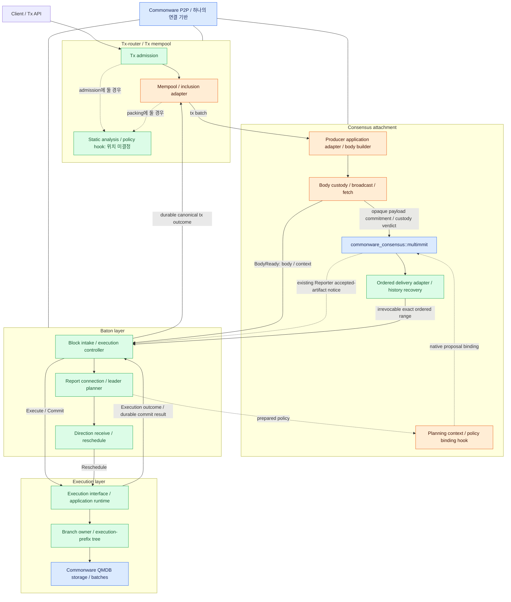
```mermaid
flowchart TB
    C[Client / Tx API] --> T
    subgraph TX[Tx-router / Tx mempool]
        T[Tx admission] --> P[Mempool / inclusion adapter]
        X[Static analysis / policy hook: 위치 미결정]
        T -. admission에 둘 경우 .-> X
        P -. packing에 둘 경우 .-> X
    end
    subgraph CONS[Consensus attachment]
        B[Producer application adapter / body builder]
        D[Body custody / broadcast / fetch]
        N[commonware_consensus::multimmit]
        M[Ordered delivery adapter / history recovery]
        H[Planning context / policy binding hook]
        B --> D
        D -->|opaque payload commitment / custody verdict| N
        N --> M
    end
    P -->|tx batch| B
    subgraph BAT[Baton layer]
        O[Block intake / execution controller]
        R[Report connection / leader planner]
        Q[Direction receive / reschedule]
        O --> R
        R --> Q
    end
    D -->|BodyReady: body / context| O
    N -. existing Reporter accepted-artifact notice .-> O
    M -->|irrevocable exact ordered range| O
    R -. prepared policy .-> H
    H -. native proposal binding .-> N
    subgraph EXEC[Execution layer]
        E[Execution interface / application runtime]
        F[Branch owner / execution-prefix tree]
        S[Commonware QMDB storage / batches]
        E --> F
        F --> S
    end
    O -->|Execute / Commit| E
    Q -->|Reschedule| E
    E -->|Execution outcome / durable commit result| O
    O -->|durable canonical tx outcome| P
    NET[Commonware P2P / 하나의 연결 기반] --- TX
    NET --- CONS
    NET --- BAT
    classDef reuse fill:#dbeafe,stroke:#2563eb,color:#172554;
    classDef adapt fill:#ffedd5,stroke:#ea580c,color:#431407;
    classDef new fill:#dcfce7,stroke:#16a34a,color:#14532d;
    class N,NET,S reuse;
    class P,B,D,H adapt;
    class T,X,M,O,R,Q,E,F new;
```

[그림 크게 보기](assets/diagrams/diagram-01.svg)

파랑은 Commonware 기반을 그대로 활용하는 부분, 주황은 기존 구성요소를 가져와 연결·변경할 부분, 초록은 Baton/application 의미를 새로 구현할 부분이다. QMDB도 batch·commit·root 인터페이스를 연결해야 하며, 파랑이 전체 레이어를 무수정으로 붙일 수 있다는 뜻은 아니다. `Mempool`의 재사용 구현체는 아직 선택하지 않았다. 정적 분석을 별도 router에 둘지 packing 시점 adapter에 둘지도 비어 있다.

Baton intake는 BodyReady와 authenticated native header reference를 대조한 뒤 BlockAvailable을 만든다. Candidate header notice에는 기존 Reporter의 accepted artifact를 활용할 수 있다. Body/notice를 join하는 adapter는 개발하되, native header export hook을 무조건 새로 만들 필요가 있다고 가정하지 않는다.

Ordered delivery와 history recovery는 consensus attachment의 내부 역할이다. 별도 ProofArchive 서버를 필수로 추가하지 않는다. 본문 저장소와 검증된 증거 저장 역할은 기존 Commonware storage/resolver를 공유하도록 설계한다.

### 1.2 레이어 사이의 입력과 출력

| 레이어 | 어디서 무엇을 받는가 | 내부에서 처리하는 것 | 다음 레이어에 무엇을 주는가 |
|---|---|---|---|
| Tx-router / mempool | Client 또는 tx P2P의 tx bytes | 구조 검증·admission·후보 보관, 선택한 위치의 정적 분석 | Producer adapter에 bounded tx batch |
| Consensus | Mempool의 후보 tx, peer의 body/header/proof | 본문 구성·custody, native DA·합의, 검증된 이력에서 dense order 복구 | Baton에 검증된 후보 block과 irrevocable exact ordered range |
| Baton | 후보 block, ordering context, peer reports, leader direction, canonical range | Intended order, report 수집·선택, 실행 예약·재예약, commit 요청 생성 | Execution에 Execute / Reschedule / Commit |
| Execution | Baton의 명령, exact parent state·runtime·ordered input | QMDB branch 생성, tx 실행, 재사용·suffix repair, canonical 적용 | Baton에 branch 결과 또는 durable commit 결과 |

### 1.3 역할과 용어

| 이름 | 이 문서에서의 뜻 |
|---|---|
| Producer | Native producer lane의 block을 만드는 노드 역할 |
| Validator | Native 합의와 실행 결과 검증에 참여하는 identity |
| Leader | 현재 native view의 leader이며 해당 context의 Baton 선택을 수행하는 역할 |
| Non-leader | Direction을 받아 local 실행 계획을 조정하는 노드의 Baton 역할 |
| Baton / direction | Leader가 선택한 예정 실행 순서와 prefix를 전달하는 advisory 메시지 |
| Cut / native finality | Producer tips에 대한 native 인증·finality 사건 |
| Immutable ordering frontier | 해당 ordering context에서 새 direction이 다시 배열할 수 없는 기존 ordered-input prefix의 경계. Local state의 durable 적용 위치인 AppliedCursor와 다름 |
| Canonical ordered range | 인증 이력과 settledness를 검증해 순서가 뒤집히지 않음을 확인한 연속 실행 입력 |
| Branch checkpoint | 특정 입력 state·runtime에서 순서 prefix의 실행을 끝낸 결과와 context를 묶은 재사용 지점. QMDB batch와의 관계는 [§6.3](#63-qmdb-state-관리와-재사용-경계)에서 설명 |
| Commit | 위 ordered range를 실행한 결과를 local QMDB canonical state로 durable 적용하는 요청 |

Producer와 validator는 별개의 역할이며 한 노드가 둘 다 수행할 수 있다. Leader의 direction은 producer들에게 전파하고, 해당 실행을 담당하는 validator의 Baton에도 전달되어야 한다. Producer에게만 보내고 모든 executor가 받았다고 가정하지 않는다.

**Native producer-parent header ID와 application input state root는 다르다.** Producer lane의 parent만으로 여러 lane을 합친 실행 state를 결정하지 않는다. Producer block body digest, producer header ID, leader proposal ID, canonical ordered-input ID도 구분한다.

Producer별 prefix가 고정되었어도 여러 lane을 합친 exact 실행 순서는 별도로 확인해야 한다. 그 확인을 마친 연속 입력 구간이 `OrderedRange`이며, 이력의 빈 구간과 순서 settledness를 처리하는 과정은 [§2.7](#27-cut-commit--ordered-range--실행-commit)에 설명한다.

Tx를 담는 것은 [producer payload/body](#23-block-lifecycle-mempool--propose--body-전파)다. 여러 lane의 순서 근거를 모으는 native leader proposal 자체는 transaction-free이며, Baton policy를 actual proposal context에 연결하는 경합은 [proposal freeze 흐름](#211-planner-completion과-proposal-freeze의-경합)에서 다룬다.

### 1.4 Data path, control path, canonical path

| 경로 | 흐름 | 각 단계에서 만들어지는 사실 |
|---|---|---|
| Tx / body data path | Tx API → pool → builder → body store / P2P → peer custody | Admission, body bytes와 digest, local durable custody |
| Native consensus path | Authenticated native network → batcher → voter / Core owner → signed protocol artifacts | Producer ancestry·DA·view votes·native finality·extension evidence |
| Baton control path | Known input / intended order → reports → leader snapshot / planner → direction → local reschedule | Advisory execution order와 completed prepared candidate |
| Canonical input path | Exact native evidence / policy history → ordered delivery → Baton Commit | 뒤집히지 않는 연속 exact ordered input |
| State application path | Commit → execution branch matching / repair → QMDB apply → durability → output / cursor | Local durable canonical state와 recoverable commit identity |

Body를 이미 받은 것, 높은 report support를 가진 것, native ordering에 인증된 것, state에 적용한 것은 서로 다른 상태다. 한 경로의 완료를 다른 경로의 증거로 바꾸지 않는다.

### 1.5 작업자와 authority

| Logical owner | 변경할 수 있는 상태 | 결과를 받는 다음 owner |
|---|---|---|
| Native Core | Native signing reservations, producer/DA/view/finality state | Voter의 typed capability executor / native publication |
| Body custody adapter | 본문 저장·fetch·구조 검증 결과 | Native `propose` / `verify` 요청자와 Baton intake |
| Ordered delivery / history owner | 검증·보관한 증거, terminal slots, emitted / acknowledged delivery cursors | Baton에 contiguous OrderedRange, gap에는 history fetch |
| Baton window / planner owner | 해당 window의 reports와 completed candidate | Advisory direction 수신자, actual proposal owner |
| Baton ExecutionController | Intended order, local job generation, execution scheduling | Execution branch owner / canonical apply owner |
| Execution BranchOwner | Speculative prefix checkpoints와 worker references | Controller에 exact-context outcome |
| CanonicalApplyOwner | 증명된 ordered range에 대한 QMDB canonical state | Durable completion 후 Controller / delivery / outcome feed |

Planner·runtime worker는 결과를 계산한다. 결과를 현재 context에 채택할 권한은 각각 native owner·execution owner에 있다. Wire direction의 freshness와 local cancellation generation은 다른 식별 규칙이다. Direction을 보낸 leader가 runtime worker의 local generation을 직접 소유하지 않는다.

### 1.6 P2P 연결과 message planes

| Plane | 누구 사이인가 | 운반하는 것 | Channel ID |
|---|---|---|---|
| Native data | Native peers | `DataMessage::Block / DaVote / DaCertificate` | 기존 example `0` |
| Native consensus | Native peers | `ConsensusMessage::Proposal / Vote / NoVote / Nullify` | 기존 example `1` |
| Native certificates | Native peers | `CertificateMessage::Nullification / Vqc / Lqc` | 기존 example `2` |
| Native resolver | Native peers | Native view proofs와 recovery 자료 | 기존 example `3` |
| Application tx | Tx peer / admission adapter / producer pool | Tx bytes / inventory의 구체 format은 미결정 | |
| Application body | Body store / resolver peers | Body bytes와 exact reference에 대한 fetch / response | |
| Baton report | Validator Baton ↔ leader Baton | Window 안내 / signed intended-order report | |
| Baton direction | Leader Baton → producer / executor Baton | Advisory direction | |
| Execution result | Direct signers / collector / consumers | Exact statement signatures / result certificate | |

추가 plane은 같은 Commonware network의 logical channels로 연결할 수 있다. Plane마다 새 물리 connection 또는 별도 P2P stack을 만들기로 정한 것은 아니다. 인증 transport와 message-level context 검증도 다른 책임이다. Tx / body / report의 CPU·queue·bandwidth 경쟁은 존재하므로, 논리적 no-wait를 물리적인 resource isolation 보장으로 설명하지 않는다. Runtime thread / pool 배치와 quotas는 미결정이다.

## 2. E2E lifecycle과 sequence diagram

| 확인할 케이스 | Sequence |
|---|---|
| Client admission부터 durable canonical 적용까지 | [전체 E2E](#21-전체-e2e-tx-입력부터-canonical-state까지) |
| 신규·중복·구조적 invalid tx | [Tx lifecycle](#22-tx-lifecycle-신규중복잘못된-tx) |
| Producer DA부터 leader proposal·vote·local finality까지 | [Native 합의 정상 경로](#214-native-합의-정상-경로-producer-da--leader-proposal--finality) |
| Body build / peer custody / 누락·invalid body | [Propose](#23-block-lifecycle-mempool--propose--body-전파), [Verify](#24-block-lifecycle-verify본문-누락검증-실패) |
| Leader 선택·전파와 non-leader 재예약 | [Leader](#25-baton-lifecycle-leader-report-수집과-direction-전파), [Non-leader](#26-baton-lifecycle-non-leader의-direction재실행-요청) |
| Cut 해석·gap / matching branch / flush 실패 | [Ordered range](#27-cut-commit--ordered-range--실행-commit), [QMDB commit](#28-execution-lifecycle-qmdb-분기-생성과-canonical-승격) |
| 이미 적용한 range 재전달과 native startup | [Restart delivery](#29-재시작과-backfill), [Startup custody](#212-startup-custody를-준비한-뒤-native-recovery) |
| Optional certificate + state material catch-up | [미채택 import 후보](#213-미채택-catch-up-후보-certificate--state-material) |
| f+1 결과 인증과 late planner completion | [Result endpoint](#210-결과-endpoint-direct-execution과-f1-인증), [Proposal freeze](#211-planner-completion과-proposal-freeze의-경합) |

### 2.1 전체 E2E: tx 입력부터 canonical state까지

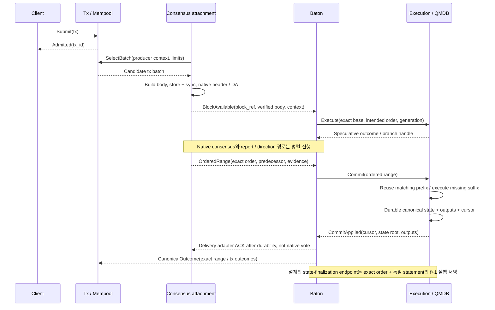
```mermaid
sequenceDiagram
    participant C as Client
    participant T as Tx / Mempool
    participant N as Consensus attachment
    participant B as Baton
    participant E as Execution / QMDB
    C->>T: Submit(tx)
    T-->>C: Admitted(tx_id)
    N->>T: SelectBatch(producer context, limits)
    T-->>N: Candidate tx batch
    N->>N: Build body, store + sync, native header / DA
    N-->>B: BlockAvailable(block_ref, verified body, context)
    B->>E: Execute(exact base, intended order, generation)
    E-->>B: Speculative outcome / branch handle
    Note over N,B: Native consensus와 report / direction 경로는 병렬 진행
    N-->>B: OrderedRange(exact order, predecessor, evidence)
    B->>E: Commit(ordered range)
    E->>E: Reuse matching prefix / execute missing suffix
    E->>E: Durable canonical state + outputs + cursor
    E-->>B: CommitApplied(cursor, state root, outputs)
    B-->>N: Delivery adapter ACK after durability, not native vote
    B-->>T: CanonicalOutcome(exact range / tx outcomes)
    Note over B,E: 설계의 state-finalization endpoint는 exact order + 동일 statement의 f+1 실행 서명
```

[그림 크게 보기](assets/diagrams/diagram-02.svg)

이 그림은 speculative work가 먼저 완료된 도착 순서의 한 예다. Cut/OrderedRange가 먼저 도착하면 [canonical 실행/repair 경로](#27-cut-commit--ordered-range--실행-commit)를 따른다. Tx admission은 block 포함이나 성공을 뜻하지 않는다. Local durable commit과 `f+1` 결과 인증도 서로 다른 사건이다. 결과 인증의 완료를 다음 native cut이나 speculative execution의 선행조건으로 추가하지 않는다.

### 2.2 Tx lifecycle: 신규·중복·잘못된 tx

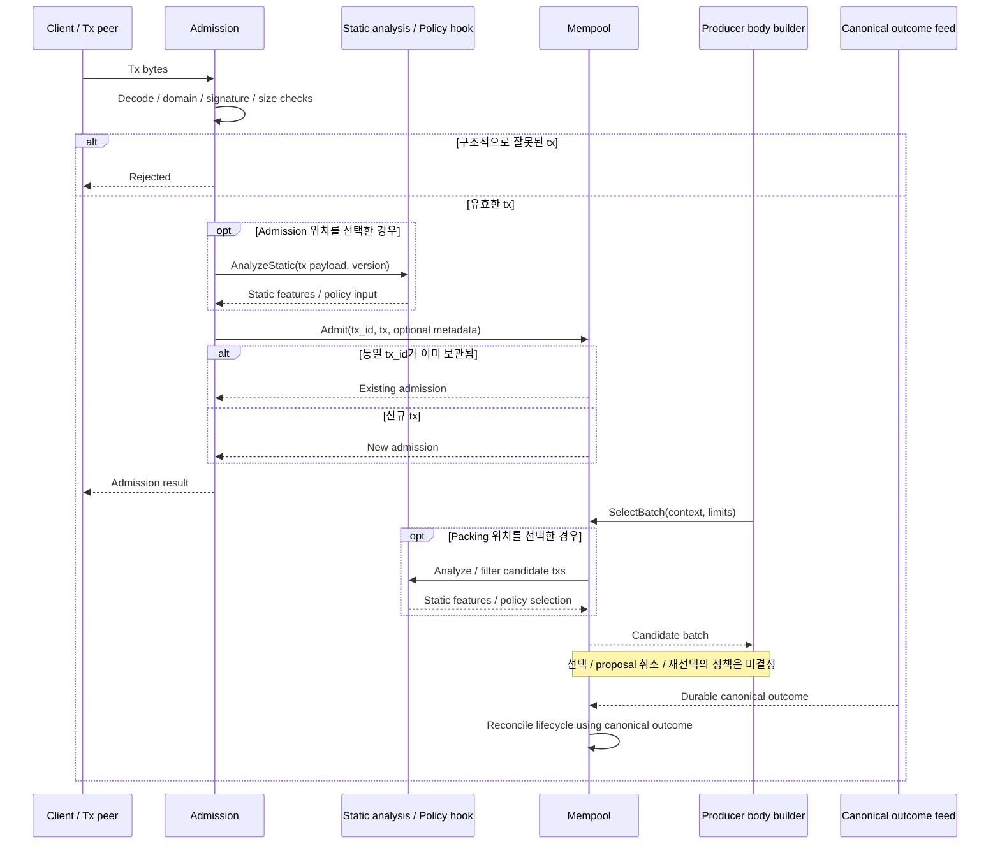
```mermaid
sequenceDiagram
    participant C as Client / Tx peer
    participant A as Admission
    participant S as Static analysis / Policy hook
    participant P as Mempool
    participant B as Producer body builder
    participant O as Canonical outcome feed
    C->>A: Tx bytes
    A->>A: Decode / domain / signature / size checks
    alt 구조적으로 잘못된 tx
        A-->>C: Rejected
    else 유효한 tx
        opt Admission 위치를 선택한 경우
            A->>S: AnalyzeStatic(tx payload, version)
            S-->>A: Static features / policy input
        end
        A->>P: Admit(tx_id, tx, optional metadata)
        alt 동일 tx_id가 이미 보관됨
            P-->>A: Existing admission
        else 신규 tx
            P-->>A: New admission
        end
        A-->>C: Admission result
        B->>P: SelectBatch(context, limits)
        opt Packing 위치를 선택한 경우
            P->>S: Analyze / filter candidate txs
            S-->>P: Static features / policy selection
        end
        P-->>B: Candidate batch
        Note over P,B: 선택 / proposal 취소 / 재선택의 정책은 미결정
        O-->>P: Durable canonical outcome
        P->>P: Reconcile lifecycle using canonical outcome
    end
```

[그림 크게 보기](assets/diagrams/diagram-03.svg)

그림의 두 `opt`는 미결정인 분석 위치의 선택지를 표시한다. Admission과 packing 양쪽에서 반드시 분석하라는 계약이 아니다. 정적 분석 기반 정책을 별도 router에 둘지 pool 위 inclusion adapter에 둘지도 아직 선택하지 않았다.

여러 producer의 body에 같은 tx가 들어갈 수 있다. Pool의 local 중복 인지와 canonical 실행의 중복 처리는 별개의 계약이며, admission dedup만으로 전역 exactly-once를 주장하지 않는다. 미합의 body에 넣었다는 이유만으로 tx를 영구 삭제하지 않는다. 구체 tx 의미와 cleanup 정책은 §3의 빈칸에서 정한다.

### 2.3 Block lifecycle: mempool → propose → body 전파

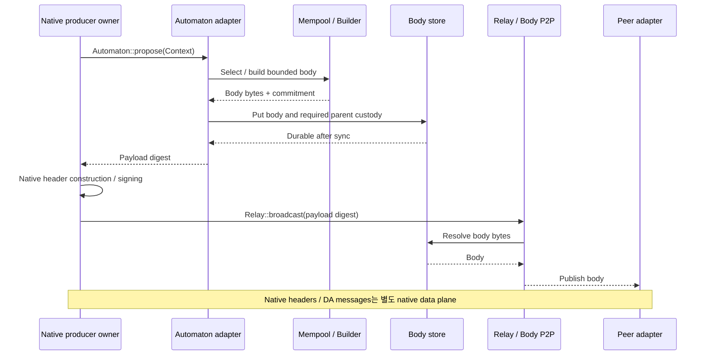
```mermaid
sequenceDiagram
    participant N as Native producer owner
    participant A as Automaton adapter
    participant P as Mempool / Builder
    participant S as Body store
    participant R as Relay / Body P2P
    participant V as Peer adapter
    N->>A: Automaton::propose(Context)
    A->>P: Select / build bounded body
    P-->>A: Body bytes + commitment
    A->>S: Put body and required parent custody
    S-->>A: Durable after sync
    A-->>N: Payload digest
    N->>N: Native header construction / signing
    N->>R: Relay::broadcast(payload digest)
    R->>S: Resolve body bytes
    S-->>R: Body
    R-->>V: Publish body
    Note over N,V: Native headers / DA messages는 별도 native data plane
```

[그림 크게 보기](assets/diagrams/diagram-04.svg)

Native core가 producer header의 signing authority를 소유한다. Builder는 body를 만들고 digest를 돌려준다. Application이 native header signer를 대신 호출하지 않는다.

### 2.4 Block lifecycle: verify·본문 누락·검증 실패

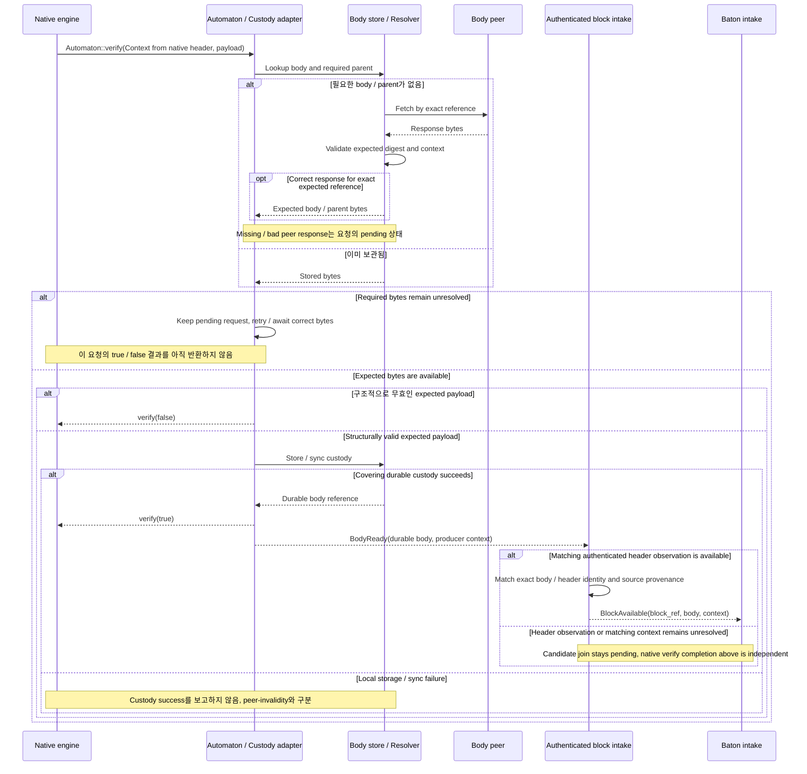
```mermaid
sequenceDiagram
    participant N as Native engine
    participant A as Automaton / Custody adapter
    participant S as Body store / Resolver
    participant P as Body peer
    participant I as Authenticated block intake
    participant B as Baton intake
    N->>A: Automaton::verify(Context from native header, payload)
    A->>S: Lookup body and required parent
    alt 필요한 body / parent가 없음
        S->>P: Fetch by exact reference
        P-->>S: Response bytes
        S->>S: Validate expected digest and context
        opt Correct response for exact expected reference
            S-->>A: Expected body / parent bytes
        end
        Note over A,S: Missing / bad peer response는 요청의 pending 상태
    else 이미 보관됨
        S-->>A: Stored bytes
    end
    alt Required bytes remain unresolved
        A->>A: Keep pending request, retry / await correct bytes
        Note over N,A: 이 요청의 true / false 결과를 아직 반환하지 않음
    else Expected bytes are available
        alt 구조적으로 무효인 expected payload
            A-->>N: verify(false)
        else Structurally valid expected payload
            A->>S: Store / sync custody
            alt Covering durable custody succeeds
                S-->>A: Durable body reference
                A-->>N: verify(true)
                A-->>I: BodyReady(durable body, producer context)
                alt Matching authenticated header observation is available
                    I->>I: Match exact body / header identity and source provenance
                    I-->>B: BlockAvailable(block_ref, body, context)
                else Header observation or matching context remains unresolved
                    Note over I,B: Candidate join stays pending, native verify completion above is independent
                end
            else Local storage / sync failure
                Note over N,S: Custody success를 보고하지 않음, peer-invalidity와 구분
            end
        end
    end
```

[그림 크게 보기](assets/diagrams/diagram-05.svg)

Bad peer가 다른 digest의 bytes를 보내는 것과 expected payload 자체의 permanent invalidity는 구분한다. 임시 미가용·본문 fetch 지연을 invalid 판정이나 empty slot 판정으로 바꾸지 않는다. Native DA 검증은 speculative execution 완료를 기다리는 계약으로 만들지 않는다. `BodyReady`는 application validity / custody 사건이다. Intake adapter는 Reporter의 accepted-artifact 알림에서 인증된 header를 찾는다. 보관한 body와 producer context가 이 header에 정확히 대응하면 `BlockAvailable` 후보를 만든다. 이 그림은 body 준비 흐름만 보여주며, Reporter 알림은 BodyReady보다 먼저 또는 나중에 올 수 있다. 둘 다 ordering inclusion / finality 증거는 아니다.

### 2.5 Baton lifecycle: leader report 수집과 direction 전파

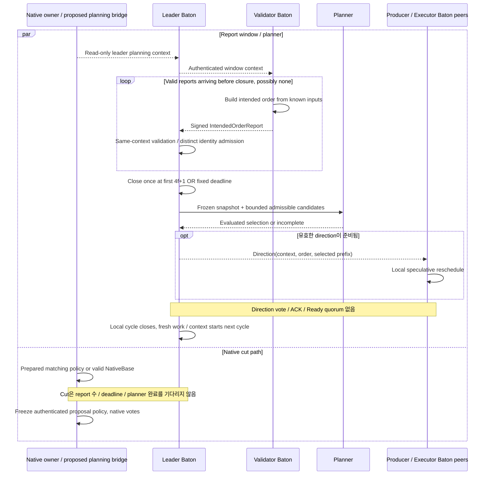
```mermaid
sequenceDiagram
    participant N as Native owner / proposed planning bridge
    participant L as Leader Baton
    participant V as Validator Baton
    participant P as Planner
    participant X as Producer / Executor Baton peers
    par Report window / planner
        N-->>L: Read-only leader planning context
        L-->>V: Authenticated window context
        loop Valid reports arriving before closure, possibly none
            V->>V: Build intended order from known inputs
            V-->>L: Signed IntendedOrderReport
            L->>L: Same-context validation / distinct identity admission
        end
        L->>L: Close once at first 4f+1 OR fixed deadline
        L->>P: Frozen snapshot + bounded admissible candidates
        P-->>L: Evaluated selection or incomplete
        opt 유효한 direction이 준비됨
            L-->>X: Direction(context, order, selected prefix)
            X->>X: Local speculative reschedule
        end
        Note over L,X: Direction vote / ACK / Ready quorum 없음
        L->>L: Local cycle closes, fresh work / context starts next cycle
    and Native cut path
        N->>N: Prepared matching policy or valid NativeBase
        Note over N,L: Cut은 report 수 / deadline / planner 완료를 기다리지 않음
        N->>N: Freeze authenticated proposal policy, native votes
    end
```

[그림 크게 보기](assets/diagrams/diagram-06.svg)

Window 안내와 prepared policy를 실제 proposal에 결속하는 hook은 구현할 adapter다. 그림이 그 API가 이미 존재하거나 prefix-adoption 증명이 완료되었음을 뜻하지 않는다. Local cycle 종료는 모든 노드의 실행 완료나 native cut branch 종료를 기다리는 barrier가 아니다.

### 2.6 Baton lifecycle: non-leader의 direction·재실행 요청

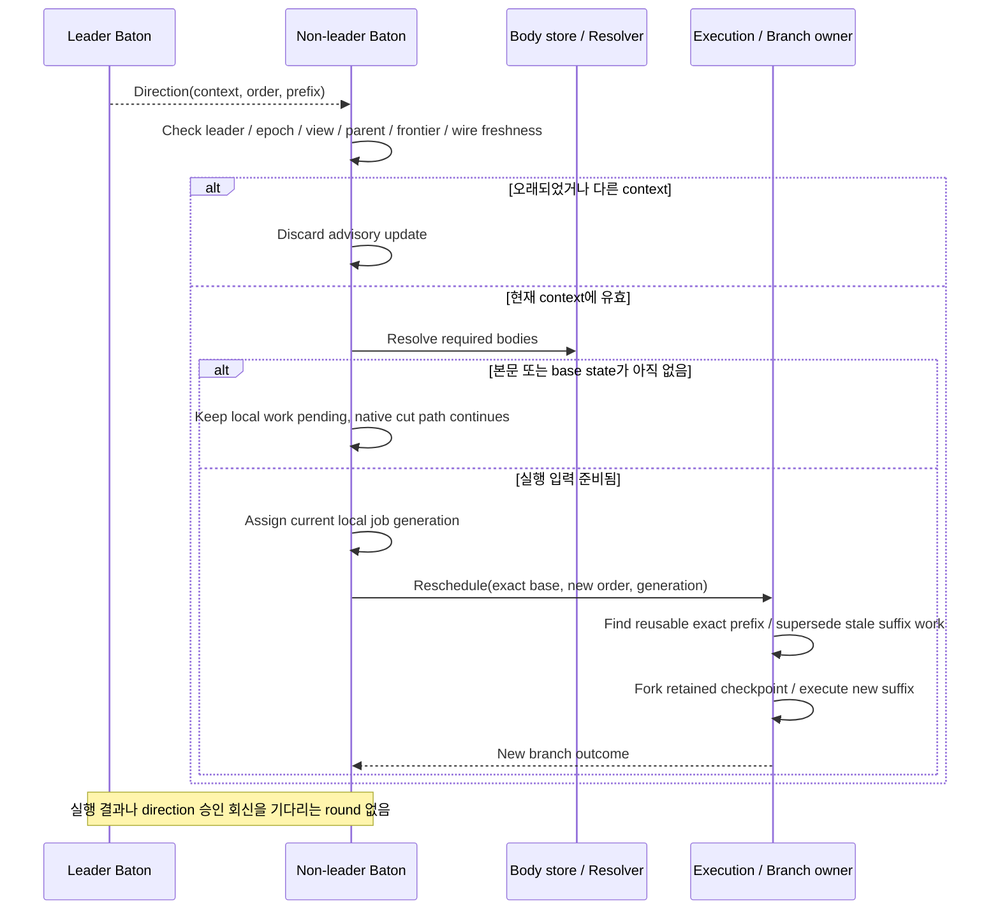
```mermaid
sequenceDiagram
    participant L as Leader Baton
    participant B as Non-leader Baton
    participant S as Body store / Resolver
    participant E as Execution / Branch owner
    L-->>B: Direction(context, order, prefix)
    B->>B: Check leader / epoch / view / parent / frontier / wire freshness
    alt 오래되었거나 다른 context
        B->>B: Discard advisory update
    else 현재 context에 유효
        B->>S: Resolve required bodies
        alt 본문 또는 base state가 아직 없음
            B->>B: Keep local work pending, native cut path continues
        else 실행 입력 준비됨
            B->>B: Assign current local job generation
            B->>E: Reschedule(exact base, new order, generation)
            E->>E: Find reusable exact prefix / supersede stale suffix work
            E->>E: Fork retained checkpoint / execute new suffix
            E-->>B: New branch outcome
        end
    end
    Note over L,B: 실행 결과나 direction 승인 회신을 기다리는 round 없음
```

[그림 크게 보기](assets/diagrams/diagram-07.svg)

Direction이 바뀌었다고 모든 block을 재실행하지 않는다. BranchOwner는 같은 입력 state와 runtime에서 같은 순서로 실행을 끝낸 prefix checkpoint만 재사용한다. 이미 canonical에 적용한 state는 advisory 요청으로 되돌리지 않는다.

### 2.7 Cut commit → ordered range → 실행 commit

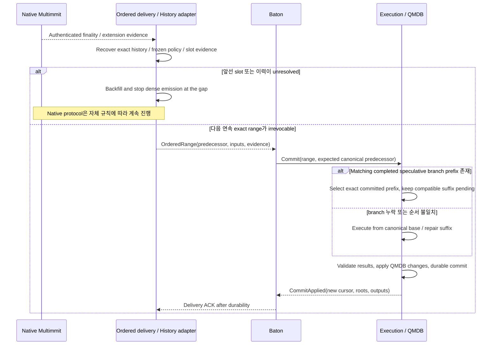
```mermaid
sequenceDiagram
    participant N as Native Multimmit
    participant M as Ordered delivery / History adapter
    participant B as Baton
    participant E as Execution / QMDB
    N-->>M: Authenticated finality / extension evidence
    M->>M: Recover exact history / frozen policy / slot evidence
    alt 앞선 slot 또는 이력이 unresolved
        M->>M: Backfill and stop dense emission at the gap
        Note over N,M: Native protocol은 자체 규칙에 따라 계속 진행
    else 다음 연속 exact range가 irrevocable
        M-->>B: OrderedRange(predecessor, inputs, evidence)
        B->>E: Commit(range, expected canonical predecessor)
        alt Matching completed speculative branch prefix 존재
            E->>E: Select exact committed prefix, keep compatible suffix pending
        else branch 누락 또는 순서 불일치
            E->>E: Execute from canonical base / repair suffix
        end
        E->>E: Validate results, apply QMDB changes, durable commit
        E-->>B: CommitApplied(new cursor, roots, outputs)
        B-->>M: Delivery ACK after durability
    end
```

[그림 크게 보기](assets/diagrams/diagram-08.svg)

첫 native leader-finality 알림을 곧바로 모든 body의 확정 순서로 해석하지 않는다. Native extensions와 history를 포함해 **실행할 exact range**를 먼저 확인한다. Included slot은 emit, 인증된 irrevocably-empty slot은 skip, unresolved slot은 stop이다. 본문 누락은 empty가 아니다. 순서가 irrevocable이어도 필요한 body / predecessor state가 없으면 해당 execution commit은 fetch·recovery를 기다린다. 이 local input 대기는 native cut을 direction 회신으로 막는 새로운 round와 다르다.

### 2.8 Execution lifecycle: QMDB 분기 생성과 canonical 승격

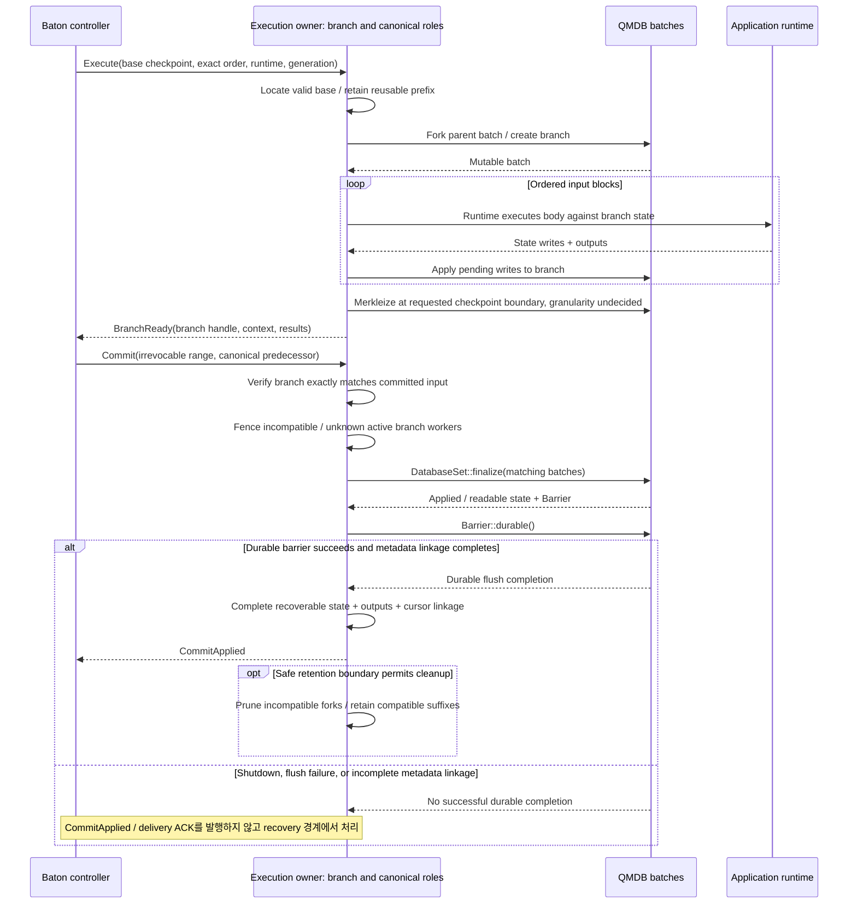
```mermaid
sequenceDiagram
    participant B as Baton controller
    participant O as Execution owner: branch and canonical roles
    participant Q as QMDB batches
    participant A as Application runtime
    B->>O: Execute(base checkpoint, exact order, runtime, generation)
    O->>O: Locate valid base / retain reusable prefix
    O->>Q: Fork parent batch / create branch
    Q-->>O: Mutable batch
    loop Ordered input blocks
        O->>A: Runtime executes body against branch state
        A-->>O: State writes + outputs
        O->>Q: Apply pending writes to branch
    end
    O->>Q: Merkleize at requested checkpoint boundary, granularity undecided
    O-->>B: BranchReady(branch handle, context, results)
    B->>O: Commit(irrevocable range, canonical predecessor)
    O->>O: Verify branch exactly matches committed input
    O->>O: Fence incompatible / unknown active branch workers
    O->>Q: DatabaseSet::finalize(matching batches)
    Q-->>O: Applied / readable state + Barrier
    O->>Q: Barrier::durable()
    alt Durable barrier succeeds and metadata linkage completes
        Q-->>O: Durable flush completion
        O->>O: Complete recoverable state + outputs + cursor linkage
        O-->>B: CommitApplied
        opt Safe retention boundary permits cleanup
            O->>O: Prune incompatible forks / retain compatible suffixes
        end
    else Shutdown, flush failure, or incomplete metadata linkage
        Q-->>O: No successful durable completion
        Note over B,O: CommitApplied / delivery ACK를 발행하지 않고 recovery 경계에서 처리
    end
```

[그림 크게 보기](assets/diagrams/diagram-09.svg)

이 그림은 completed branch가 exact canonical range와 일치하는 경로다. Work가 없거나 다르면 [cut commit 흐름](#27-cut-commit--ordered-range--실행-commit)의 canonical 실행/repair를 따른다. Branch 생성·pruning은 제안하는 owner 동작이고 cleanup은 optional이며 구체 GC scheduling은 미결정이다. `DatabaseSet::finalize`와 `Barrier::durable`은 upstream API지만 applied/readable 상태는 durable 완료가 아니다. State/output/cursor linkage와 실패 처리·ACK 경계는 [canonical apply](#65-commit-요청을-받으면-branch를-canonical로-만들기)에서 설명한다. [Durability barrier](https://github.com/commonwarexyz/monorepo/blob/534af0ede48affd35b2111522527547b4cc9bf72/glue/src/stateful/db/mod.rs#L469).

### 2.9 재시작과 backfill

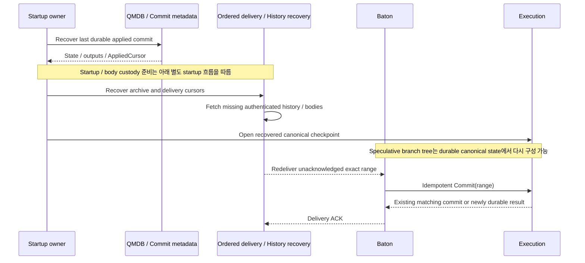
```mermaid
sequenceDiagram
    participant S as Startup owner
    participant Q as QMDB / Commit metadata
    participant M as Ordered delivery / History recovery
    participant B as Baton
    participant E as Execution
    S->>Q: Recover last durable applied commit
    Q-->>S: State / outputs / AppliedCursor
    Note over S,M: Startup / body custody 준비는 아래 별도 startup 흐름을 따름
    S->>M: Recover archive and delivery cursors
    M->>M: Fetch missing authenticated history / bodies
    S->>E: Open recovered canonical checkpoint
    Note over B,E: Speculative branch tree는 durable canonical state에서 다시 구성 가능
    M-->>B: Redeliver unacknowledged exact range
    B->>E: Idempotent Commit(range)
    E-->>B: Existing matching commit or newly durable result
    B-->>M: Delivery ACK
```

[그림 크게 보기](assets/diagrams/diagram-10.svg)

| 진행 좌표 | 소유자와 진행 근거 | 다음 단계와의 연결 |
|---|---|---|
| Native journal cursor | Native owner가 durable domain-event prefix ACK로 진행 | Application evidence 보관이나 state 적용 완료를 뜻하지 않음 |
| ArchiveCursor 후보 | Evidence/history owner가 exact source witness와 interpretation을 recoverable하게 보관 | 방출할 range의 evidence·policy/history를 복구할 수 있어야 함 |
| OrderedCursor 후보 | Delivery owner가 terminal slots에서 exact 연속 입력을 append | Range identity·predecessor·interpretation을 applied commit과 연결 |
| AppliedCursor 후보 | Canonical owner가 state·outputs·commit metadata의 durable 적용으로 진행 | 동일 range의 lost ACK를 idempotent하게 복구 |

이들은 서로 다른 좌표계이므로 숫자 크기로 비교하지 않는다. Witness coverage와 exact identity로 archive → ordered input → applied commit을 연결한다. Delivery ACK만으로 source 삭제나 영구 serve availability가 정당화되지 않는다. Retention handoff·export lag·bounded buffering의 구체 정책은 미결정이며, 별도 archive quorum을 native cut의 대기 조건으로 추가하지 않는다.

이 그림의 recovered state·outputs·cursor는 선택할 application recovery adapter의 계약이며 QMDB 단독의 자동 atomicity 보장이 아니다. Recovered execution state와 history에서 lost ACK / unacknowledged range를 다시 처리하는 흐름이다. Native startup 자체의 body custody·readiness fence는 [별도 startup 그림](#212-startup-custody를-준비한-뒤-native-recovery)을 따른다. Idempotent 처리도 단순히 state root가 같다는 검사 대신 exact commit identity와 recoverable outputs/cursor를 확인한다.

### 2.10 결과 endpoint: direct execution과 f+1 인증

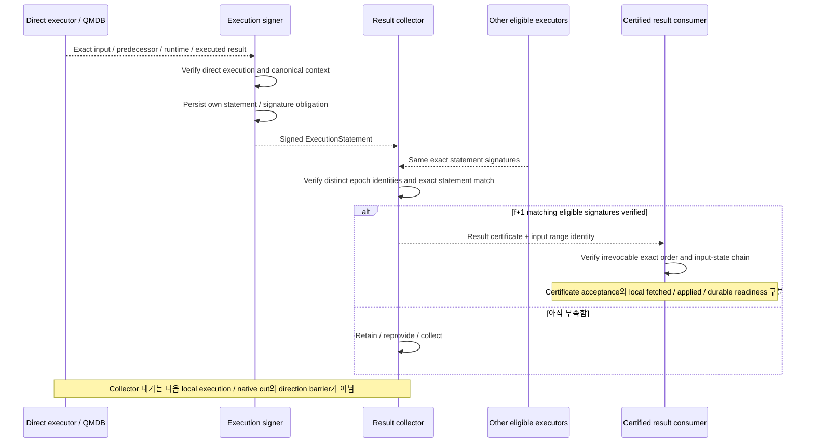
```mermaid
sequenceDiagram
    participant E as Direct executor / QMDB
    participant S as Execution signer
    participant C as Result collector
    participant V as Other eligible executors
    participant R as Certified result consumer
    E-->>S: Exact input / predecessor / runtime / executed result
    S->>S: Verify direct execution and canonical context
    S->>S: Persist own statement / signature obligation
    S-->>C: Signed ExecutionStatement
    V-->>C: Same exact statement signatures
    C->>C: Verify distinct epoch identities and exact statement match
    alt f+1 matching eligible signatures verified
        C-->>R: Result certificate + input range identity
        R->>R: Verify irrevocable exact order and input-state chain
        Note over R: Certificate acceptance와 local fetched / applied / durable readiness 구분
    else 아직 부족함
        C->>C: Retain / reprovide / collect
    end
    Note over E,C: Collector 대기는 다음 local execution / native cut의 direction barrier가 아님
```

[그림 크게 보기](assets/diagrams/diagram-11.svg)

State root 값 하나만 같은 서명을 합치지 않는다. Exact input range·canonical predecessor·runtime·전체 결과가 같은 statement여야 한다. Imported certificate / state sync 결과를 자신이 직접 실행한 signature로 바꾸지 않는다. Common signing boundary와 wire schema는 미결정이다. [§6.3의 root kind/version·operation/batch-boundary 계약](#63-qmdb-state-관리와-재사용-경계)과 같은 결과 해석에 결속된 full statement를 비교한다.

서명·검증 계산은 Commonware cryptography primitive를 재사용하는 방향으로 연결한다. 공통 단일 서명 API의 진입점은 [`Signer::sign(namespace, msg)`](https://github.com/commonwarexyz/monorepo/blob/534af0ede48affd35b2111522527547b4cc9bf72/cryptography/src/lib.rs#L93)와 [`Verifier::verify(namespace, msg, sig)`](https://github.com/commonwarexyz/monorepo/blob/534af0ede48affd35b2111522527547b4cc9bf72/cryptography/src/lib.rs#L130)다.

`ExecutionStatement` 구성과 실행에 참여할 수 있는 epoch identity 확인, 서로 다른 identity가 같은 전체 statement에 서명했는지 확인하는 책임은 새 `ExecutionSigner` / `ResultCollector` adapter에 둔다. Native scheme의 [message signing](https://github.com/commonwarexyz/monorepo/blob/534af0ede48affd35b2111522527547b4cc9bf72/consensus/src/multimmit/scheme/bls12381_threshold.rs#L1143)과 [verification](https://github.com/commonwarexyz/monorepo/blob/534af0ede48affd35b2111522527547b4cc9bf72/consensus/src/multimmit/scheme/bls12381_threshold.rs#L1189)은 primitive 호출의 참고 예다. 결과 서명의 scheme·key·domain·codec·aggregation 선택은 미결정이며, 이 예의 BLS scheme을 기본값으로 채택하지 않는다.

### 2.11 Planner completion과 proposal freeze의 경합

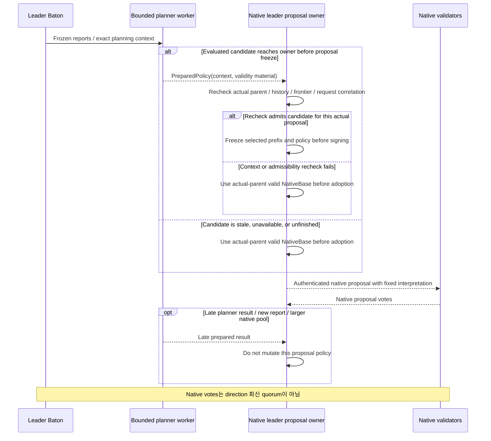
```mermaid
sequenceDiagram
    participant L as Leader Baton
    participant P as Bounded planner worker
    participant N as Native leader proposal owner
    participant V as Native validators
    L->>P: Frozen reports / exact planning context
    alt Evaluated candidate reaches owner before proposal freeze
        P-->>N: PreparedPolicy(context, validity material)
        N->>N: Recheck actual parent / history / frontier / request correlation
        alt Recheck admits candidate for this actual proposal
            N->>N: Freeze selected prefix and policy before signing
        else Context or admissibility recheck fails
            N->>N: Use actual-parent valid NativeBase before adoption
        end
    else Candidate is stale, unavailable, or unfinished
        N->>N: Use actual-parent valid NativeBase before adoption
    end
    N-->>V: Authenticated native proposal with fixed interpretation
    V-->>N: Native proposal votes
    opt Late planner result / new report / larger native pool
        P-->>N: Late prepared result
        N->>N: Do not mutate this proposal policy
    end
    Note over L,V: Native votes는 direction 회신 quorum이 아님
```

[그림 크게 보기](assets/diagrams/diagram-12.svg)

Planner job 자체가 없는 경우에도 native proposal은 유효한 actual-parent base 경로로 진행한다. 이 그림은 job이 시작된 경우의 completion 경합을 설명한다.

Prepared result를 채택할 availability와 exact-prefix 보존 조건은 아직 닫히지 않았다. 이 그림은 구현할 freeze 경계를 설명하며 특정 ready-only policy variant를 채택하지 않는다. View가 바뀌면 old reports·advisory work는 새 context에 넣지 않고, 이미 인증·방출·적용된 history는 원래 해석을 보존한다.

### 2.12 Startup: custody를 준비한 뒤 native recovery

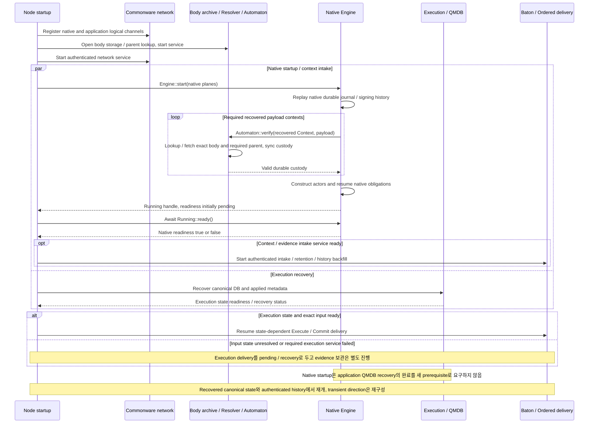
```mermaid
sequenceDiagram
    participant S as Node startup
    participant W as Commonware network
    participant A as Body archive / Resolver / Automaton
    participant N as Native Engine
    participant E as Execution / QMDB
    participant B as Baton / Ordered delivery
    S->>W: Register native and application logical channels
    S->>A: Open body storage / parent lookup, start service
    S->>W: Start authenticated network service
    par Native startup / context intake
        S->>N: Engine::start(native planes)
        N->>N: Replay native durable journal / signing history
        loop Required recovered payload contexts
            N->>A: Automaton::verify(recovered Context, payload)
            A->>A: Lookup / fetch exact body and required parent, sync custody
            A-->>N: Valid durable custody
        end
        N->>N: Construct actors and resume native obligations
        N-->>S: Running handle, readiness initially pending
        S->>N: Await Running::ready()
        N-->>S: Native readiness true or false
        opt Context / evidence intake service ready
            S->>B: Start authenticated intake / retention / history backfill
        end
    and Execution recovery
        S->>E: Recover canonical DB and applied metadata
        E-->>S: Execution state readiness / recovery status
    end
    alt Execution state and exact input ready
        S->>B: Resume state-dependent Execute / Commit delivery
    else Input state unresolved or required execution service failed
        Note over S,B: Execution delivery를 pending / recovery로 두고 evidence 보관은 별도 진행
    end
    Note over N,E: Native startup은 application QMDB recovery의 완료를 새 prerequisite로 요구하지 않음
    Note over S,B: Recovered canonical state와 authenticated history에서 재개, transient direction은 재구성
```

[그림 크게 보기](assets/diagrams/diagram-13.svg)

이 그림은 recovered payload verify가 성공한 startup 경로다. Verify가 false이거나 receiver가 닫히면 `Engine::start` 자체가 `OpenError::RecoveredPayloadUnverified`로 실패하며 Running 생성 이후의 `ready=false`와 구분한다. [Pre-running custody fence](https://github.com/commonwarexyz/monorepo/blob/534af0ede48affd35b2111522527547b4cc9bf72/consensus/src/multimmit/engine.rs#L272).

`Engine::start`는 readiness가 pending인 `Running` handle을 반환한다. `Running::ready().await`의 `true`는 startup / recovery의 durable 처리와 initial producer wake 제출을 확인한 native 경계이며, readiness 전에 engine이 실패하면 `false`다. [Running readiness](https://github.com/commonwarexyz/monorepo/blob/534af0ede48affd35b2111522527547b4cc9bf72/consensus/src/multimmit/engine.rs#L549).

Engine이 반환하는 running handle 자체를 모든 서비스의 readiness 증명으로 쓰지 않는다. Body service readiness, native engine readiness, ordered delivery readiness, execution state readiness를 하나의 ready flag로 합치지 않는다. Recovery에 필요한 verify가 true로 해소되기 전 native 시작을 성공으로 보고하지 않는다. Startup dependency 때문에 새 report나 direction 승인 round를 기다리는 구조를 만들지 않는다.

### 2.13 미채택 catch-up 후보: certificate + state material

이 그림은 §6.7의 optional import 후보를 설명하며 [canonical apply](#65-commit-요청을-받으면-branch를-canonical로-만들기)의 single owner·access fence·durability 계약 안에서 처리한다. Message / coordinator 이름은 제안 계약이며 기본 `Commit`을 대체하는 채택 구현이 아니다.

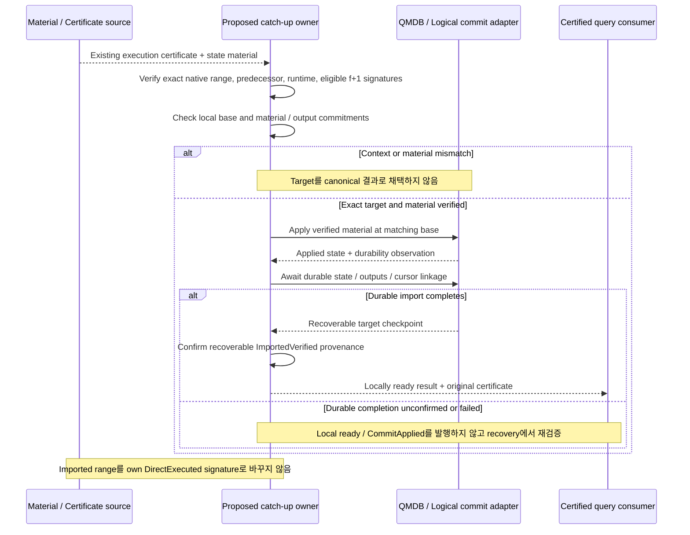
```mermaid
sequenceDiagram
    participant P as Material / Certificate source
    participant C as Proposed catch-up owner
    participant Q as QMDB / Logical commit adapter
    participant V as Certified query consumer
    P-->>C: Existing execution certificate + state material
    C->>C: Verify exact native range, predecessor, runtime, eligible f+1 signatures
    C->>C: Check local base and material / output commitments
    alt Context or material mismatch
        Note over C,Q: Target를 canonical 결과로 채택하지 않음
    else Exact target and material verified
        C->>Q: Apply verified material at matching base
        Q-->>C: Applied state + durability observation
        C->>Q: Await durable state / outputs / cursor linkage
        alt Durable import completes
            Q-->>C: Recoverable target checkpoint
            C->>C: Confirm recoverable ImportedVerified provenance
            C-->>V: Locally ready result + original certificate
        else Durable completion unconfirmed or failed
            Note over C,V: Local ready / CommitApplied를 발행하지 않고 recovery에서 재검증
        end
    end
    Note over P,C: Imported range를 own DirectExecuted signature로 바꾸지 않음
```

[그림 크게 보기](assets/diagrams/diagram-14.svg)

원래 certificate의 전달과 local state의 durable readiness는 다른 사건이다. Material format·root 검증·import commit 방식은 미결정이고, 올바른 canonical base에서 다음 range를 직접 실행하는 경로는 기존 execution interface를 사용한다.

### 2.14 Native 합의 정상 경로: producer DA → leader proposal → finality

앞선 body lifecycle을 native 합의와 이어 읽는 정상 경로다. Producer lane 하나를 대표로 나타내며, 다른 lane의 진행은 독립적이다. Lifeline은 node 역할과 같은 Core 내부 기능을 나눠 보여준다.

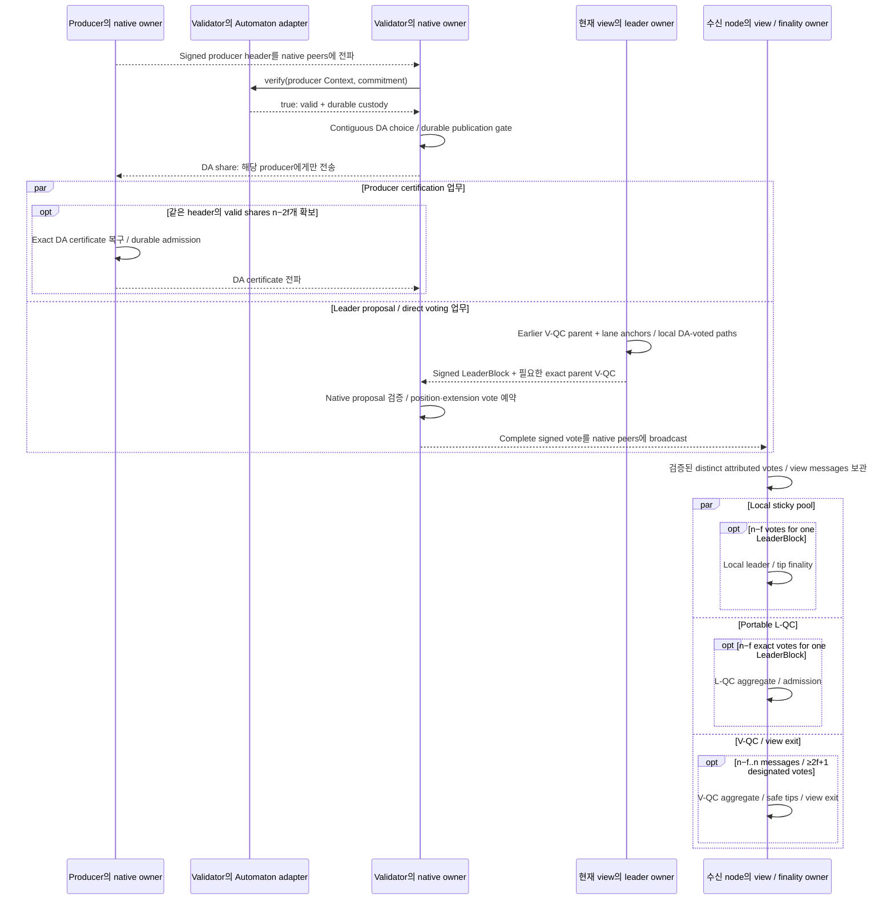
```mermaid
sequenceDiagram
    participant P as Producer의 native owner
    participant A as Validator의 Automaton adapter
    participant V as Validator의 native owner
    participant L as 현재 view의 leader owner
    participant F as 수신 node의 view / finality owner
    P-->>V: Signed producer header를 native peers에 전파
    V->>A: verify(producer Context, commitment)
    A-->>V: true: valid + durable custody
    V->>V: Contiguous DA choice / durable publication gate
    V-->>P: DA share: 해당 producer에게만 전송
    par Producer certification 업무
        opt 같은 header의 valid shares n−2f개 확보
            P->>P: Exact DA certificate 복구 / durable admission
            P-->>V: DA certificate 전파
        end
    and Leader proposal / direct voting 업무
        L->>L: Earlier V-QC parent + lane anchors / local DA-voted paths
        L-->>V: Signed LeaderBlock + 필요한 exact parent V-QC
        V->>V: Native proposal 검증 / position·extension vote 예약
        V-->>F: Complete signed vote를 native peers에 broadcast
    end
    F->>F: 검증된 distinct attributed votes / view messages 보관
    par Local sticky pool
        opt n−f votes for one LeaderBlock
            F->>F: Local leader / tip finality
        end
    and Portable L-QC
        opt n−f exact votes for one LeaderBlock
            F->>F: L-QC aggregate / admission
        end
    and V-QC / view exit
        opt n−f..n messages / ≥2f+1 designated votes
            F->>F: V-QC aggregate / safe tips / view exit
        end
    end
```

[그림 크게 보기](assets/diagrams/diagram-15.svg)

DA certificate를 얻는 업무와 leader proposal은 서로의 완료 barrier가 아니다. Leader는 native 조건을 만족하는 uncertified DA-voted suffix도 제안할 수 있다. Complete vote는 native peers에 broadcast하며 수신 node마다 local pool을 관리한다. Local finality는 L-QC 생성이나 V-QC 완료를 기다리지 않는다. `par`는 독립적인 업무를 보여주며 새 합류 대기를 뜻하지 않는다. [DA / proposal / direct vote](https://github.com/commonwarexyz/monorepo/blob/534af0ede48affd35b2111522527547b4cc9bf72/consensus/src/multimmit/docs/STATE_MACHINE.md#L290), [DA share와 vote의 전송 대상](https://github.com/commonwarexyz/monorepo/blob/534af0ede48affd35b2111522527547b4cc9bf72/consensus/src/multimmit/machine/durability.rs#L616), [Certificate와 local finality](https://github.com/commonwarexyz/monorepo/blob/534af0ede48affd35b2111522527547b4cc9bf72/consensus/src/multimmit/mod.rs#L149).

그림의 finality는 sparse native facts다. Exact ordered range를 만들려면 [§2.7의 delivery/history 연결](#27-cut-commit--ordered-range--실행-commit)이 필요하다. Timeout·rescue·view recovery는 [§4.6](#46-실제-native-actor와-파일-구조), V-QC / L-QC의 서로 다른 조건은 [§4.5](#45-합의와-baton-연결)에서 읽는다. 이 그림은 기존 native 동작의 설명이며 실행 trace나 Baton policy 통합 완료를 뜻하지 않는다.

## 3. Tx-router / tx mempool 레이어

### 3.1 역할과 책임

Client·peer의 tx를 받아 producer가 body를 만들 때 사용할 후보를 보관한다. 정적 분석은 tx payload에서 얻을 수 있는 특징을 추출한다. Routing이나 packing 정책은 이 특징을 입력으로 삼을 수 있으며, live balance·nonce·현재 부하를 정적 분석 결과라고 부르지 않는다.

재사용 후보로 별도 Constantinople의 `TransactionSource`와 pool 구현이 있다. TransactionSource는 parent `Header`·consensus `Round`·이미 선택한 signed tx byte count를 받아 `Vec<VerifiedTransaction>`을 반환하며 marshal의 finalized-block Update를 요구한다. Native producer Context와 digest callback는 이 타입을 제공하지 않으므로 selection과 canonical outcome adapter가 필요하다.

Commonware dependency rev도 native pin과 달라 direct Rust type compatibility는 미확인이다. 기존 crate 의존 또는 부분 구현 재사용, queue·cleanup 정책은 아래 빈칸에서 정한다. [TransactionSource](https://github.com/commonwarexyz/constantinople/blob/3b6c92e76bf582855615844a4175b8304808f6a9/crates/mempool/src/lib.rs#L9), [Dependency pin](https://github.com/commonwarexyz/constantinople/blob/3b6c92e76bf582855615844a4175b8304808f6a9/Cargo.toml#L50).

Body builder가 `SelectBatch`를 요청하면 context와 limits에 맞는 후보를 반환한다. Proposal 생성과 취소는 mempool admission을 canonical outcome으로 바꾸지 않는다. Canonical 실행 결과가 도착한 뒤 해당 tx lifecycle을 정리한다.

### 3.2 인터페이스 개요

| 제안 인터페이스 | 호출자 → 수신자 | 입력 | 출력 / 다음 처리 |
|---|---|---|---|
| `AdmitTx` | Tx API / peer → tx layer | Canonical tx bytes, tx ID, source | Admission result와 후보 보관 |
| `AnalyzeStatic` | Admission / packing adapter → analyzer | Tx payload, analysis version | Static features |
| `SelectBatch` | Producer adapter → pool | Native producer context, bounded limits | Candidate tx batch |
| `ProposalOutcome` | Producer adapter → pool | Attachment의 local request correlation, cancellation / local outcome | 후보 lifecycle 갱신; permanent deletion 여부는 canonical 근거와 구분 |
| `CanonicalOutcome` | Baton → pool | Durable ordered range의 tx 결과 | Canonical lifecycle 반영 |

Tx ID는 tx, external body commitment는 외부 body, native header ID는 epoch/chain/height/parent/commitment를 포함한 전체 producer header를 식별한다. 선택한 tx bytes와 body, authenticated header, canonical tx outcome의 대응은 adapter가 유지한다. Local request correlation도 native private build ID가 Context로 전달된다는 뜻은 아니다. API codec·ID 규칙·중복 의미는 아래 빈칸에서 정한다. [Producer header identity](https://github.com/commonwarexyz/monorepo/blob/534af0ede48affd35b2111522527547b4cc9bf72/consensus/src/multimmit/types/block.rs#L113).

### 3.3 Tx P2P connection

기존 Commonware authenticated P2P 연결을 사용하고 tx 메시지는 native consensus 메시지와 구분된 logical channel로 연결한다. 물리 connection을 tx 전용으로 새로 만든다고 가정하지 않는다. Tx flood에 따른 report·body·native 처리의 자원 경쟁은 설계에서 다루며, quota·queue·runtime 배치의 구체 방식은 [§1.6](#16-p2p-연결과-message-planes)처럼 미결정이다.

Tx 전달 wire protocol, inventory/body 방식, producer 대상 선정, 재전송·중복 억제 방법은 비워 둔다. 실제 tx peer 수신이 `AdmitTx`로 들어오는 연결만 인터페이스에 표시한다.

### 3.4 미결정 사항

| 항목 | 결정 |
|---|---|
| Tx format / ID / signature domain | |
| Mempool 재사용 구현체 | |
| 정적 분석 위치와 결과 schema | |
| Router / packing 정책과 교체 인터페이스 | |
| Tx P2P wire protocol / logical channel ID | |
| 후보 선택 순서 / byte·count limits | |
| 중복 tx의 application 의미 | |
| Admission 응답의 durability | |
| Proposal 취소 / 재선택 / 재전송 | |
| Canonical cleanup / retention / GC | |

## 4. Consensus 레이어: Commonware Multimmit

### 4.1 역할과 책임

기반은 `commonware_consensus::multimmit`, `n=5f+1`이다. Native producer lanes, header signing, DA, view votes, finality·tip extraction·extensions와 recovery를 최대한 재사용한다. Tx selection·body 생성은 engine 내부의 내장 mempool 기능이 아니라 **engine이 호출하는 application adapter의 책임**이다.

Pinned `log-multimmit`은 body-free·delivery-free example이다. `Application::propose`는 deterministic commitment를 생성하고 `verify`는 true를 반환하며 `Relay`는 no-op이다. 실제 tx/body와 dense delivery를 붙이기 위해 이 application attachment를 확장한다. [Example README](https://github.com/commonwarexyz/monorepo/blob/534af0ede48affd35b2111522527547b4cc9bf72/examples/log-multimmit/README.md), [Application](https://github.com/commonwarexyz/monorepo/blob/534af0ede48affd35b2111522527547b4cc9bf72/examples/log-multimmit/src/application/actor.rs).

전체 native 흐름은 [actor / owner map](#46-실제-native-actor와-파일-구조)에서 먼저 볼 수 있다. 다음 인터페이스는 그 흐름에 붙이는 application과 Baton 연결부다.

### 4.2 인터페이스 개요

| 경계 | 기존 API / 제안 연결 | 입력 → 처리 → 출력 |
|---|---|---|
| Producer payload 요청 | 기존 `Automaton::propose(Context)` | Native producer parent/context → pool batch와 body custody → payload digest |
| Payload 검증 | 기존 `Automaton::verify(Context, payload)` | Payload reference → body·parent lookup / 구조 검증 / durable custody → validity result |
| Body 전파 | 기존 `Relay::broadcast` + adapter | Digest → adapter owner의 body publication 요청 → Commonware broadcast / body P2P |
| Body 준비 | 제안 `BodyReady` | Exact context의 body·parent custody 완료 → local attachment readiness |
| Candidate header 관측 | 기존 `Reporter::report(Activity)` + adapter | Accepted native `TransactionBlock` artifact → exact header reference와 body join 입력 |
| 후보 실행 전달 | 제안 `BlockAvailable` | Authenticated native header와 exact body 대응 확인 → Baton block intake |
| Planning context | 신규 native owner hook | Leader view / V-QC parent / history / frontier → Baton planner read-only context |
| Policy adoption | 신규 native policy hook | Prepared matching candidate → proposal-bound frozen policy |
| Canonical 입력 전달 | 신규 evidence export + ordered delivery adapter | Exact authenticated native evidence / policy history → Baton ordered range |

`BlockAvailable`에는 body digest뿐 아니라 producer header와의 인증된 대응이 필요하다. Local build 직후 아직 header가 서명되지 않았다면 그 body는 local speculative candidate로 구분한다. Authenticated header를 아는 것과 final cut 포함도 별개다. 순서를 바꿀 수 있는 global frontier는 노드의 AppliedCursor로 대신하지 않는다.

기존 `Activity::ProtocolAccepted`는 contextually ready set에 들어간 exact authenticated artifact의 `Arc`를 제공한다. 여기서 Ready는 native artifact의 crypto/context admission이며 body 검증 완료나 native Retained completion이 아니다. Native `TransactionBlock` artifact에서 header를 얻어 BodyReady와 join하는 shared attachment를 재사용 경로로 검토한다. 두 사건의 도착 순서를 가정하지 않고 exact context·commitment·header identity로 대조한다. [Accepted activity](https://github.com/commonwarexyz/monorepo/blob/534af0ede48affd35b2111522527547b4cc9bf72/consensus/src/multimmit/types/activity.rs#L1).

`ArtifactId`는 artifact 종류와 exact canonical artifact encoding 전체를 domain-separated hash로 식별한다. Native `TransactionBlock` artifact에는 `SignedTransactionBlock`의 encoding이 들어가므로 producer `header.block_ref`와 구분한다. [Artifact identity 계산](https://github.com/commonwarexyz/monorepo/blob/534af0ede48affd35b2111522527547b4cc9bf72/consensus/src/multimmit/machine/admission.rs#L145).

Reporter는 synchronous callback이고 native가 Feedback을 무시한다. Callback 안에서 느린 저장·본문 fetch·무제한 retry를 기다리지 않고 adapter owner에게 작업을 전달해야 한다. 구체 queue/budget은 미결정이며 알림의 acknowledged retention이나 lossless delivery를 가정하지 않는다. 관측 누락은 opportunistic candidate intake의 pending/retry 문제이지 native 진행을 멈추는 새 ACK 조건이 아니다. Canonical 순서에 필요한 exact witness export·retention 계약은 [§4.5](#45-합의와-baton-연결)의 별도 연결이다. [Reporter dispatch](https://github.com/commonwarexyz/monorepo/blob/534af0ede48affd35b2111522527547b4cc9bf72/consensus/src/multimmit/actors/voter/actor.rs#L1655).

`Automaton` callback는 future를 거쳐 `oneshot::Receiver<Digest>` 또는 `oneshot::Receiver<bool>`를 반환한다. 미가용 dependency는 그 receiver를 pending으로 유지하고, receiver 해소 뒤 native owner가 요청 correlation과 completion을 대조한다.

Live propose의 receiver가 닫히면 native executor는 commitment 없는 build completion을 전달한다. 현재 요청과 일치하는 build는 새 header를 만들지 않는 build decline으로 처리한다. Live verify의 receiver closure는 현재 유효한 task completion에서 `Fatal::Automaton`이며, `verify(false)`의 무효 payload 판정과 다르다. [Build completion 소비](https://github.com/commonwarexyz/monorepo/blob/534af0ede48affd35b2111522527547b4cc9bf72/consensus/src/multimmit/actors/voter/executor.rs#L811), [현재 build의 decline](https://github.com/commonwarexyz/monorepo/blob/534af0ede48affd35b2111522527547b4cc9bf72/consensus/src/multimmit/machine/chain.rs#L1187), [Live validation completion](https://github.com/commonwarexyz/monorepo/blob/534af0ede48affd35b2111522527547b4cc9bf72/consensus/src/multimmit/actors/voter/executor.rs#L848).

`Automaton`의 producer Context는 epoch·chain·height·producer parent header ID를 제공하며 leader V-QC / policy history를 제공하는 API가 아니다. Context와 commitment로 public header constructor/digest를 통해 exact reference를 재구성할 수 있다. 다만 propose·live verify·recovery에 같은 Context 타입이 쓰이고 callback에 mode tag가 없으므로, metadata 재구성만으로 signed artifact의 accepted/current 상태를 인정하지 않는다. [Header reconstruction](https://github.com/commonwarexyz/monorepo/blob/534af0ede48affd35b2111522527547b4cc9bf72/consensus/src/multimmit/types/block.rs#L126).

### 4.3 Mempool에서 가져와 블록 생성

`propose(Context)`를 받으면 native가 지정한 producer-chain parent를 보존하고 pool에서 tx batch를 가져온다. Body codec·commitment·limits를 적용한 뒤 body와 필요한 parent custody를 durable 확보하고 digest를 반환한다. Native executor가 build job의 ID·generation·parent를 보존하고 completion을 원래 요청과 대조한다. Automaton Context에는 이 token이 포함되지 않으므로 attachment가 별도 job token API를 이미 받는다고 가정하지 않는다. [Build correlation](https://github.com/commonwarexyz/monorepo/blob/534af0ede48affd35b2111522527547b4cc9bf72/consensus/src/multimmit/actors/voter/executor.rs#L683).

Producer lane의 parent-state filtering을 global canonical state로 취급하지 않는다. Stateful tx 성공·실패는 실제 ordered execution에서 판정한다.

Tx byte budget과 full encoded body size는 다르다. Tx 목록뿐 아니라 codec framing·metadata를 포함한 최종 본문을 bounded하게 구성해야 한다.

Commonware codec의 [`EncodeSize::encode_size`](https://github.com/commonwarexyz/monorepo/blob/534af0ede48affd35b2111522527547b4cc9bf72/codec/src/codec.rs#L26)는 선택한 body 타입의 전체 encoded size를 계산하는 연결 지점이다. 읽는 쪽에는 [`Read::Cfg`](https://github.com/commonwarexyz/monorepo/blob/534af0ede48affd35b2111522527547b4cc9bf72/codec/src/codec.rs#L197)로 타입별 decoding 제약을 전달할 수 있다. Body 필드·version·크기 제한과 구체 codec 구현은 미결정이며 application adapter에서 연결한다.

### 4.4 블록 전파·조회·custody

Commonware storage/archive, `broadcast::buffered`, `resolver::p2p`를 우선 활용한다. Broadcast의 bounded cache는 durable custody 저장소를 대신하지 않는다. Archive 저장 뒤 sync 완료, expected digest 검증, parent 복구와 startup 순서를 attachment에서 연결한다. [Broadcast](https://github.com/commonwarexyz/monorepo/blob/534af0ede48affd35b2111522527547b4cc9bf72/broadcast/src/buffered/mod.rs), [Resolver](https://github.com/commonwarexyz/monorepo/blob/534af0ede48affd35b2111522527547b4cc9bf72/resolver/src/p2p/mod.rs).

| 기존 primitive / API | 실제로 제공하는 것 | 새 body adapter가 책임질 것 |
|---|---|---|
| Archive `put`, `get`, `sync` / `start_sync` | Buffered write, key/index lookup, covering durable completion | Header ID→body commitment/context 대응, body/parent custody와 sync 완료 확인 |
| `broadcast::buffered` cache lookup | 최근 digest에 대한 bytes가 있으면 반환 | Expected body 검증, durable archive lookup / promotion |
| Buffered broadcast subscription | Cache hit 또는 앞으로 들어올 body를 기다리는 local waiter | Subscription과 active peer fetch를 구분 |
| Generic resolver `fetch` / shared subscribers | Key request·peer retry·subscriber sharing | Exact-key Consumer 검증, context correlation, pending wants / bytes / validation capacity |
| 기존 `resolver::p2p::Producer` trait | Key 요청을 application의 async bytes lookup으로 전달 | Archive-backed 구현 연결, body retention·request limits·storage error 처리 |

Archive `put` 성공만으로 custody를 인정하지 않는다. `sync` 또는 returned sync handle의 완료가 covering accepted writes의 durability 경계다. Existing `marshal::store::Blocks`는 finalized block을 global height와 digest로 저장하는 계약이므로, producer lane의 height만을 그대로 global archive index로 사용하면 lane·fork가 충돌할 수 있다. Native header ID와 body digest의 mapping 및 store layout은 선택할 adapter 책임이다. [Blocks storage contract](https://github.com/commonwarexyz/monorepo/blob/534af0ede48affd35b2111522527547b4cc9bf72/consensus/src/marshal/store.rs#L118), [Archive uniqueness](https://github.com/commonwarexyz/monorepo/blob/534af0ede48affd35b2111522527547b4cc9bf72/storage/src/archive/immutable/mod.rs#L6).

Generic resolver의 `Consumer`가 returned bytes의 key validity를 판단한다. Wrong digest / invalid peer response, 올바른 bytes를 기다리던 subscriber의 취소, local archive sync failure는 다른 사건이다. Local storage failure나 stale generation을 peer-invalid 응답으로 처벌하지 않는다. Missing body는 fetch / dependency pending이며 expected payload의 permanent invalidity나 empty canonical slot의 증거가 아니다. [Resolver delivery contract](https://github.com/commonwarexyz/monorepo/blob/534af0ede48affd35b2111522527547b4cc9bf72/resolver/src/lib.rs#L149).

Fetch 취소로 validation 결과를 버릴 수 있어도 application의 custody writes가 rollback되었다는 뜻은 아니다. 선택할 storage의 mutation/completion lifetime을 subscriber 취소와 따로 연결한다. 예를 들어 `marshal::store::Blocks`의 mutating calls는 store를 소비하므로 dropped future/error가 handle을 잃게 하고 failed sync handle 뒤에는 store를 계속 사용할 수 없다. 이 store를 그대로 채택한 것은 아니며 [cancellation/storage 계약](https://github.com/commonwarexyz/monorepo/blob/534af0ede48affd35b2111522527547b4cc9bf72/consensus/src/marshal/store.rs#L115)을 확인해 adapter를 연결한다.

Targeted fetch는 지정한 targets 밖으로 자동 fallback하지 않는다. Outbound 요청은 `latest.primary` 안에서만 peers를 고르고 targets도 이 filter를 우회하지 않으므로, peer set 변경 후 serving 가능 여부를 adapter에서 연결해야 한다. [Resolver peer selection](https://github.com/commonwarexyz/monorepo/blob/534af0ede48affd35b2111522527547b4cc9bf72/resolver/src/p2p/mod.rs#L64). Generic resolver가 여러 concurrent fetch를 허용한다는 사실만으로 application의 pending key·subscriber·bytes·validation work가 bounded라고 주장하지 않는다. Native custody obligation과 취소 가능한 speculative subscriber를 owner가 따로 관리하고, 구체 admission bounds·retry/target policy는 빈칸에 남긴다.

`Relay::broadcast`는 synchronous callback이다. 느린 archive lookup·fetch·sync는 callback에서 기다리지 않고 body publication owner에게 전달한다. Native는 `Feedback::Closed`이면 해당 sender attempt를 미루고 그 외에는 전송을 시도한다. Remote body receipt나 custody quorum의 ACK를 받은 것은 아니다.

Native 송신기는 local sender가 전송 요청을 받아들인 뒤에도 같은 effect와 encoded bytes로 재시도한다. Core가 영속화된 후속 상태에 따라 Retire를 발급하면 해당 publication을 제거한다. 이 native retry를 report/direction 승인 대기로 바꾸지 않는다. [Relay dispatch](https://github.com/commonwarexyz/monorepo/blob/534af0ede48affd35b2111522527547b4cc9bf72/consensus/src/multimmit/actors/voter/actor.rs#L2286), [Native retry ownership](https://github.com/commonwarexyz/monorepo/blob/534af0ede48affd35b2111522527547b4cc9bf72/consensus/src/multimmit/actors/voter/egress.rs#L1).

Resolver `retain`은 pending fetch subscribers를 정한다. Fetch Complete/cancel, native publication Retire, body archive의 보관 해제는 서로 다른 lifecycle이다. Speculative subscriber를 취소하거나 cache에서 bytes를 지워도 live native custody·recovery·serving 의무가 끝났다고 가정하지 않는다. Body/history references와 durable handoff에 맞춘 retention·release 조건은 아래 빈칸에 남긴다. [Fetch subscriber retention](https://github.com/commonwarexyz/monorepo/blob/534af0ede48affd35b2111522527547b4cc9bf72/resolver/src/lib.rs#L216).

Native/application planes와 example 채널 번호는 [P2P message-plane 표](#16-p2p-연결과-message-planes)에 정리했다. Native data plane은 application body 전파 자체가 아니며, tx/body/report/direction의 실제 channel IDs는 미결정이다. [Channel wiring](https://github.com/commonwarexyz/monorepo/blob/534af0ede48affd35b2111522527547b4cc9bf72/examples/log-multimmit/src/main.rs#L358).

### 4.5 합의와 Baton 연결

정상 native 메시지 흐름은 [§2.14 sequence](#214-native-합의-정상-경로-producer-da--leader-proposal--finality)에서 함께 볼 수 있다.

Native votes와 finality는 기존 core가 담당한다. 각 producer는 독립 lane의 application commitment를 담은 signed header를 전파하고, 여러 producer chains의 순서 근거는 별도 leader chain에 모인다. 각 view의 leader는 earlier V-QC parent와 lane별 anchored path를 transaction-free `LeaderBlock`에 넣는다. 모든 descendant의 DA certificate를 기다리는 구조는 아니며, native 조건을 만족하는 locally DA-voted 연속 suffix도 proposal에 포함할 수 있다. [Producer / leader chain 구조](https://github.com/commonwarexyz/monorepo/blob/534af0ede48affd35b2111522527547b4cc9bf72/consensus/src/multimmit/mod.rs#L9), [Proposal / direct vote](https://github.com/commonwarexyz/monorepo/blob/534af0ede48affd35b2111522527547b4cc9bf72/consensus/src/multimmit/docs/STATE_MACHINE.md#L309).

Native owner가 구성한 `LeaderBlock`의 canonical digest가 leader proposal 식별자이며, `VoteBody`는 이 digest를 round·position·extension과 함께 참조한다. [LeaderBlock digest](https://github.com/commonwarexyz/monorepo/blob/534af0ede48affd35b2111522527547b4cc9bf72/consensus/src/multimmit/types/block.rs#L643), [VoteBody 구성](https://github.com/commonwarexyz/monorepo/blob/534af0ede48affd35b2111522527547b4cc9bf72/consensus/src/multimmit/types/vote.rs#L119).

Producer별 anchor는 해당 lane의 제안 경로가 시작하는 기준 block reference다. Parent V-QC에서 물려받은 safe-tip reference 또는 proposal에 함께 실은 더 높은 DA certificate로 표현하며, leader proposal이 참조하는 parent V-QC와 별도의 좌표다. [Anchor 표현](https://github.com/commonwarexyz/monorepo/blob/534af0ede48affd35b2111522527547b4cc9bf72/consensus/src/multimmit/types/block.rs#L399).

Validator는 producer별 제안의 anchor 다음에서 자신이 DA vote한 경로와 연속으로 일치하는 블록 수를 position에 기록한다. 일치한 prefix의 끝(0이면 anchor)에서 이어지는 DA-voted 경로의 body commitments를 길이 제한 안에서 extension에 담고, 모든 producer의 position과 extension을 묶은 complete vote에 서명한다. [Position / extension 구성](https://github.com/commonwarexyz/monorepo/blob/534af0ede48affd35b2111522527547b4cc9bf72/consensus/src/multimmit/machine/chain.rs#L1978).

| 주요 native 증거 | 묶는 자료 | 제공하는 근거 |
|---|---|---|
| DA certificate | 같은 producer header의 distinct valid DA shares `n−2f`개 | 해당 producer position의 availability / uniqueness와 certified anchor |
| V-QC | Distinct identities의 attributed votes / novotes `n−f..n`개, 그중 designated leader proposal에 대한 votes 최소 `2f+1`개 | 다음 leader가 이어갈 safe tips와 view exit |
| L-QC | 같은 leader proposal에 대한 complete votes `n−f`개 | Leader와 producer별 tips의 portable finality 증거 |

DA certificate는 threshold certificate이고 V-QC / L-QC는 complete attributed transcript의 ordinary signatures를 묶는다. Local sticky vote pool은 `n−f`에서 L-QC 생성과 독립적으로 finality에 도달한다. Producer별 prefix가 고정된 길이보다 cross-lane exact 실행 순서가 더 짧을 수 있으므로, sparse finality 뒤에 [§2.7의 ordered delivery](#27-cut-commit--ordered-range--실행-commit)를 연결한다. [DA / certificates](https://github.com/commonwarexyz/monorepo/blob/534af0ede48affd35b2111522527547b4cc9bf72/consensus/src/multimmit/mod.rs#L147), [View / local finality](https://github.com/commonwarexyz/monorepo/blob/534af0ede48affd35b2111522527547b4cc9bf72/consensus/src/multimmit/docs/STATE_MACHINE.md#L350), [Chain-local finality와 exact placement](https://github.com/commonwarexyz/monorepo/blob/534af0ede48affd35b2111522527547b4cc9bf72/consensus/src/multimmit/mod.rs#L210).

이 native DA/view votes는 [Baton intended-order reports](#54-leader-report로-baton-생성), [direct execution 결과 서명](#210-결과-endpoint-direct-execution과-f1-인증)과 구분한다. Baton direction의 별도 승인 quorum은 추가하지 않는다. 실제 proposal을 인증할 때 selected prefix·policy를 actual parent/history/frontier에 결속하고 고정하는 연결은 개발·검증해야 한다. 선택 prefix의 membership뿐 아니라 정확한 leading order가 유지되어야 한다.

Ordered delivery adapter는 native owner가 선택한 exact witness와 original policy/history를 검증·보관하고 연속 입력을 계산한다. 이를 넘기는 resumable owner export는 신규 연결이다. Native sparse tip certificate는 body stream·past policy·dense cursor를 제공하지 않는다. Simplex marshal의 Multimmit 호환성도 별도 검토한다. [Native application boundary](https://github.com/commonwarexyz/monorepo/blob/534af0ede48affd35b2111522527547b4cc9bf72/consensus/src/multimmit/docs/STATE_MACHINE.md).

| Existing attachment / query | 제공하는 자료 | 새 adapter가 보완할 책임 |
|---|---|---|
| Native `Reporter::report(Activity)` | Accepted artifact 등 activity 알림 | Durable witness handoff·cursor·retention 계약. Baton intended-order report와 별도 domain |
| `Running::inspect` / `Inspection::finality` | 현재 normalized finality projection | Same-tip evidence·settledness revision까지 필요한 원자료의 보존 |
| `Running::serve(view)` | Retained useful native ViewProof | Exact historical interpretation. Higher covering L-QC가 반환될 수 있고 old proof는 prune될 수 있음 |
| Proposed exact owner export | Selected source와 immutable context를 넘기는 신규 연결 | Original witness 검증·보관 → terminal slot 해석 → contiguous OrderedRange 방출 |

이 단계는 한 consensus application attachment의 논리적 책임으로 구현할 수 있다. 별도 ProofArchive 서버나 네 개 actor를 만들기로 결정한 것은 아니다. [Reporter trait](https://github.com/commonwarexyz/monorepo/blob/534af0ede48affd35b2111522527547b4cc9bf72/consensus/src/lib.rs#L246), [Inspection / serving](https://github.com/commonwarexyz/monorepo/blob/534af0ede48affd35b2111522527547b4cc9bf72/consensus/src/multimmit/engine.rs#L530), [Retained proof selection](https://github.com/commonwarexyz/monorepo/blob/534af0ede48affd35b2111522527547b4cc9bf72/consensus/src/multimmit/actors/resolver/actor.rs#L245).

`FinalityFact`는 leader/tips/positions/settledness와 evidence identity의 normalized projection이며 actual witness archive가 아니다.

Evidence hash는 witness의 식별 commitment이며 서명 검증 자료 자체가 아니다. Aggregate V-QC에서 재구성한 selected row에는 standalone raw vote artifact가 없을 수 있다. Ordered delivery adapter는 selected row와 함께 이를 인증하는 signed vote 또는 source certificate, extraction/opening을 재현할 자료를 보존해야 한다. Native가 선택한 identity별 exact body를 다른 conflicting body나 임의 quorum subset으로 바꾸지 않는다.

Tips가 같아도 source/evidence·settledness가 달라질 수 있어, 필요한 immutable export는 owner의 exact source-selection 전환에 연결해야 한다. [Evidence commitment](https://github.com/commonwarexyz/monorepo/blob/534af0ede48affd35b2111522527547b4cc9bf72/consensus/src/multimmit/machine/finality.rs#L2082), [Aggregate row provenance](https://github.com/commonwarexyz/monorepo/blob/534af0ede48affd35b2111522527547b4cc9bf72/consensus/src/multimmit/machine/finality.rs#L1681), [Pool revision](https://github.com/commonwarexyz/monorepo/blob/534af0ede48affd35b2111522527547b4cc9bf72/consensus/src/multimmit/machine/finality.rs#L1865).

Ordered delivery는 같은 epoch/committee와 actual parent·history·frozen policy, selected pool source, producer header/ancestry, native tips·positions·extensions·settledness를 함께 검증한다. 그 근거에서 included / irrevocably-empty / unresolved slots를 구분하고 첫 unresolved slot에서 방출을 멈춘다. Included body를 못 받았다는 사실은 empty의 증거가 아니다. Native extraction의 private `pub(crate)` API를 application이 이미 호출할 수 있다고 가정하지 않으며, 제한된 facade 또는 검증된 동등 연결은 개발 선택으로 남긴다. [Native extraction](https://github.com/commonwarexyz/monorepo/blob/534af0ede48affd35b2111522527547b4cc9bf72/consensus/src/multimmit/machine/algebra/tips.rs#L336), [History opening](https://github.com/commonwarexyz/monorepo/blob/534af0ede48affd35b2111522527547b4cc9bf72/consensus/src/multimmit/types/history.rs#L10).

### 4.6 실제 native actor와 파일 구조

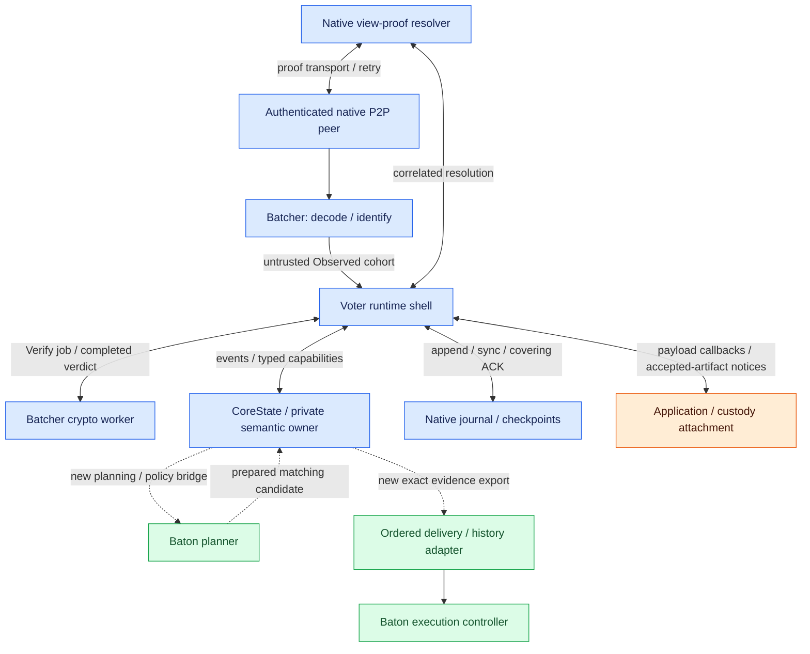
```mermaid
flowchart TB
    W[Authenticated native P2P peer] --> B[Batcher: decode / identify]
    B -->|untrusted Observed cohort| V[Voter runtime shell]
    V <-->|Verify job / completed verdict| K[Batcher crypto worker]
    R[Native view-proof resolver] <-->|proof transport / retry| W
    R <-->|correlated resolution| V
    V <-->|events / typed capabilities| C[CoreState / private semantic owner]
    V <-->|append / sync / covering ACK| J[Native journal / checkpoints]
    V <-->|payload callbacks / accepted-artifact notices| A[Application / custody attachment]
    C -. new planning / policy bridge .-> P[Baton planner]
    P -. prepared matching candidate .-> C
    C -. new exact evidence export .-> D[Ordered delivery / history adapter]
    D --> E[Baton execution controller]
    classDef reuse fill:#dbeafe,stroke:#2563eb,color:#172554;
    classDef adapt fill:#ffedd5,stroke:#ea580c,color:#431407;
    classDef fresh fill:#dcfce7,stroke:#16a34a,color:#14532d;
    class W,B,K,V,R,C,J reuse;
    class A adapt;
    class P,D,E fresh;
```

[그림 크게 보기](assets/diagrams/diagram-16.svg)

그림의 두 Batcher 박스는 같은 actor의 ingress와 verification 경로다. Native runtime actor는 Batcher, Resolver, Voter 세 개다. Native core 색은 owner 구조와 기본 알고리즘의 재사용이다. 점선 bridge에는 실제 fork hook·schema·validity/recovery 수정이 필요하다. Producer는 별도의 native Producer actor가 아니라 이 owner 내부의 producer state와 capability로 진행된다. [Owner / capability model](https://github.com/commonwarexyz/monorepo/blob/534af0ede48affd35b2111522527547b4cc9bf72/consensus/src/multimmit/machine/mod.rs).

| 실제 위치 / 컴포넌트 | 무엇을 받는가 | 소유하는 처리 | 무엇을 내보내는가 |
|---|---|---|---|
| `examples/log-multimmit/src/main.rs` | Node args·committee·runtime / network config | Network 등록, application와 Engine 구성·시작 | Native planes, running handle |
| `consensus/src/multimmit/engine.rs` | Config, plane sender/receiver, retained journal | Store replay, recovered-payload custody fence, actor supervisor | Running handle와 inspector / retained proof serving |
| `actors/batcher` | Hostile native bytes·peer attribution | Bounded decode·artifact identity, owner가 발급한 crypto job 실행 | Untrusted observations와 별도 verification completions |
| `actors/resolver` | Missing native view-proof references | Decode·requested-view 분류·transport retry, verdict는 Core 소유 | Correlated completion / owner의 resolve·reject 처리 |
| `actors/voter` | Untrusted observations, verification completions, runtime jobs, journal ACK | Event를 semantic owner로 전달하고 typed capability 실행 | App callback 요청, network publication, journal append / sync |
| `machine/controller.rs: CoreState`, `machine/reducer.rs: Input / Capability / transition` | Correlated native events와 durable acknowledgements | Producer / DA / view / finality / signing / retention semantic state | Bounded typed capabilities와 verified native facts |
| `machine/view.rs` | Actual V-QC parent와 chain proposal inputs | Leader proposal / view vote validity·recovery | Transaction-free leader block·view transition |
| `machine/chain.rs` | Producer headers·DA facts·anchors | Producer ancestry / payload position / extension inputs | Native chain proposal와 position evidence |
| `machine/finality.rs` | Exact attributed vote pool와 source evidence | Final tips·settledness·evidence identity | Normalized FinalityFact; full application archive와는 다름 |

Voter의 `handle_runtime_event`가 observation·crypto/application completion·journal ACK를 owner에 전달한다. `CoreState::next_action`은 `CoreTurn::Input / Work / Idle / YieldRequired`를 반환하고, `drive_core_cycle`이 transition 또는 work를 dispatch한다.

Core가 발급한 `Capability`는 executor가 수행하고 async completion은 원래 job correlation을 가진 event로 돌아온다. Producer build의 digest completion은 header signing·DA·leader finality와 별개다. [Runtime events](https://github.com/commonwarexyz/monorepo/blob/534af0ede48affd35b2111522527547b4cc9bf72/consensus/src/multimmit/actors/voter/actor.rs#L1436), [Core cycle](https://github.com/commonwarexyz/monorepo/blob/534af0ede48affd35b2111522527547b4cc9bf72/consensus/src/multimmit/actors/voter/actor.rs#L1580), [Owner next action](https://github.com/commonwarexyz/monorepo/blob/534af0ede48affd35b2111522527547b4cc9bf72/consensus/src/multimmit/machine/controller.rs#L666), [Capability executor](https://github.com/commonwarexyz/monorepo/blob/534af0ede48affd35b2111522527547b4cc9bf72/consensus/src/multimmit/actors/voter/executor.rs#L74).

Batcher `Observed`는 artifact 서명 검증 전의 cohort다. Owner가 발급한 `Verify`의 verdict는 별도 completion으로 돌아오므로 observation admission과 authentication을 합치지 않는다. [Observation flush](https://github.com/commonwarexyz/monorepo/blob/534af0ede48affd35b2111522527547b4cc9bf72/consensus/src/multimmit/actors/batcher/actor.rs#L761).

Native data plane은 DA certificates도 포함한다. Channel 2의 certificate plane에는 nullification / V-QC / L-QC가 들어가므로 이름만 보고 DA certificate를 옮기지 않는다. Native resolver의 decode·requested-view 분류 역시 proof authenticity의 승인이 아니다. Correlated response의 cryptographic validity·admission·reject는 consensus owner가 결정한다. [Wire enum](https://github.com/commonwarexyz/monorepo/blob/534af0ede48affd35b2111522527547b4cc9bf72/consensus/src/multimmit/actors/wire.rs#L125), [Resolver contract](https://github.com/commonwarexyz/monorepo/blob/534af0ede48affd35b2111522527547b4cc9bf72/consensus/src/multimmit/actors/resolver/mod.rs#L1).

Producer의 `Automaton::propose` path와 여러 lane을 모으는 leader proposal path를 구분한다. Leader planning/policy hook은 public Automaton에 이미 들어 있는 callback가 아니며 private Core owner의 actual-context 경로에 별도 bridge가 필요하다. Source map의 native 컴포넌트를 외부에서 복제·drive하는 actor mirror를 만들지 않는다. [Native ownership](https://github.com/commonwarexyz/monorepo/blob/534af0ede48affd35b2111522527547b4cc9bf72/consensus/src/multimmit/machine/mod.rs), [Producer Context](https://github.com/commonwarexyz/monorepo/blob/534af0ede48affd35b2111522527547b4cc9bf72/consensus/src/multimmit/types/block.rs#L47).

Native private signing 계산은 durability 처리와 겹칠 수 있다. 보존할 safety 경계는 fresh local signature가 외부 publication으로 노출되기 전에 해당 signing reservation / domain change를 covering하는 durable acknowledgement를 확보하는 것이다. 문서의 build·sign 흐름을 signature 계산 자체가 반드시 모든 fsync 이후에 시작하는 것으로 읽지 않는다. Baton prepared completion은 signing authority가 아니며 native durability/publication gate를 건너뛰지 않는다.

Direct proposal validation과 V-QC 기반 rescue / view recovery 경로는 같은 callback를 그대로 반복하는 구조가 아니다. Baton policy를 direct proposal hook에서만 검사하는 것으로 인증 상속까지 완료했다고 볼 수 없다. 어떤 predicate를 direct vote 전에 검증하고 어떤 authenticated policy/evidence를 rescue와 ordered delivery가 상속할지 별도 연결 과제로 둔다. [View recovery](https://github.com/commonwarexyz/monorepo/blob/534af0ede48affd35b2111522527547b4cc9bf72/consensus/src/multimmit/machine/view.rs#L1380).

### 4.7 미결정 사항

| 항목 | 결정 |
|---|---|
| Body format / size limit / archive layout | |
| Body transport adapter / fetch protocol | |
| Targeted retry / fallback / pending want·subscriber·byte budgets | |
| Evidence export schema / retention handoff | |
| Ordering policy codec / availability | |
| Protected-prefix adoption 조건 | |
| Exact continuation / extension / view recovery 연결 | |
| Backfill / checkpoint / GC | |

## 5. Baton 레이어

### 5.1 역할과 책임

Consensus에서 받은 후보 block을 execution에 넘겨 사전 실행을 예약한다. Local known inputs에서 intended order를 만들고 peer report를 교환한다. Leader는 이를 받아 direction을 선택·전파하며, non-leader는 direction을 받아 실행 계획을 바꾼다. Canonical ordered range가 오면 execution에 commit 요청을 넘긴다.

Baton의 **ExecutionController**가 scheduling과 재실행 요청을 소유한다. Execution layer는 명령을 수행하며, Application runtime은 tx 계산을, BranchOwner·CanonicalApplyOwner는 branch/state 관리를 맡는다. Native signing·vote·finality authority는 consensus에 남는다.

### 5.2 인터페이스 개요

| 제안 인터페이스 | 어디서 받는가 | 처리와 다음 출력 |
|---|---|---|
| `OnBlockAvailable` | Consensus body attachment | Reference/context 검증 → local intended order → Execute |
| `OnPlanningContext` | Native owner hook | Exact context / immutable frontier 관리 → window / planner 입력 |
| `OnReport` | Report connection | 서명·context·identity·limits 검증 → leader snapshot admission |
| `OnDirection` | 현재 leader | Auth/context 확인 → local Reschedule |
| `PreparedPolicy` | Planner → native adapter | 완료한 admissible 선택만 실제 proposal context에 재검증해 전달 |
| `OnOrderedRange` | Ordered delivery adapter | Contiguous irrevocable range 확인 → Commit |
| `OnExecutionOutcome` | Execution | BranchReady / speculative outcome의 generation·context 확인 → branch handle와 local 준비 상태 관리 |
| `OnCommitApplied` | Execution | Durable cursor/결과 확인 → delivery ACK / pool outcome. Own result statement는 direct execution provenance를 별도 확인 |

`On…`은 해당 event를 받는 local handler 이름이며 별도 wire message를 추가한다는 뜻은 아니다. BranchReady·speculative outcome은 같은 execution outcome 계열의 표현이며, codec·필드 선택은 미결정이다.

### 5.3 Report connection

Commonware P2P 위에서 authenticated window context, intended-order reports, advisory directions를 전달한다. 각 메시지는 epoch/view/history/actual parent/rule/window/frontier를 식별한다. Leader-local timer만으로 remote node가 window를 안다고 가정하지 않는다.

Report는 **실행 의도**이며 execution progress·state root·완료 증명이나 direction vote가 아니다. 같은 window에서 identity당 유효 원본 report 하나만 계수한다. Worker의 검증 완료와 leader owner의 snapshot admission은 다른 사건이다. 닫힌 snapshot에 늦은 report를 삽입하지 않는다.

### 5.4 Leader: report로 Baton 생성

| 단계 | 입력 | 처리 | 출력 |
|---|---|---|---|
| Window 시작 | 새 작업과 actual planning context | Context를 고정하고 deadline 설정 | Window context |
| Admission | Signed reports | Same-context·distinct identity 검증 | Original report snapshot |
| Snapshot 종료 | 첫 `4f+1` admission 또는 fixed deadline | 한 번만 닫기, arrivals로 deadline 연장 금지 | `m≤4f+1` frozen reports |
| 후보 평가 | Bounded admissible full candidates | Ancestry / predecessor closure / actual context 검증 후 LCP 계산 | 완료된 평가 또는 incomplete |
| 일차 선택 | Same-context original reports | `2f+1`이 전체를 공유하는 최장 유효 nonempty prefix 길이 최대화 | Selected prefix를 포함한 full candidate |
| Fallback | 해당 prefix 없음 | 유효 후보의 raw sum-LCP 최대화 | 유효한 direction candidate |
| NativeBase | Reports / 준비된 유효 후보 없음 | Actual-parent 유효 기본 policy 사용 | Native cut 진행 |
| 전파 | 준비된 direction | Producer와 executor validator의 Baton에 전송 | Advisory reschedule |

`ℓᵢ(P)=|LCP(P,Rᵢ)|`, fallback score는 `Σᵢℓᵢ(P)`다. 원본 report를 filtering·completion으로 바꾸어 support를 만들지 않는다. 후보 집합의 평가가 끝나지 않았으면 최장 선택을 완료했다고 선언하지 않는다. `2f+1`은 최소 `f+1` 정상 **intention**을 남기며 실제 완료·재사용이나 native inclusion을 보증하지 않는다.

`2f+1` 지지는 **후보의 처음 k개가 각 원본 report의 처음 k개와 모두 같은 report가 2f+1개 이상**이라는 뜻이다. 각 block을 지지하는 사람 수를 따로 더하거나, full candidate 전체가 일치해야 한다고 해석하지 않는다.

계산 예로 `f=1,n=6`에서 같은 context의 distinct identities 다섯 개가 다음 원본 orders를 냈다고 하자. `R1=[A,B,C,D]`, `R2=R3=[A,B,D,C]`, `R4=R5=[A,C,B,D]`다. 완료된 bounded admissible 후보 집합이 아래 두 후보라고 가정한다. 두 후보와 검토 prefix가 모두 유효하다는 조건의 분석 예이며 실제 native trace가 아니다.

| Full candidate | 원본 report별 LCP 길이 | 3개 이상이 전체를 지지하는 최장 prefix | Raw sum-LCP |
|---|---|---|---|
| `P1=[A,B,C,D]` | `(4,2,2,1,1)` | `[A,B]`, 길이 2 | 10 |
| `P2=[A,C,B,D]` | `(1,1,1,4,4)` | `[A]`, 길이 1 | 11 |

일차 선택은 **P1**이다. P2의 sum이 더 커도 supported prefix 길이가 먼저다. 다른 deadline snapshot에 `R1=[A,B,C,D]`, `R2=[A,C,D,B]` 두 개만 있다면 3-report 지지가 불가능하므로 fallback이다. 같은 두 후보의 raw sum은 P1이 `4+1=5`, P2가 `1+2=3`이어서 P1을 고른다. 큰 f개의 LCP를 빼지 않는다. 이 계산은 후보 집합 밖의 global optimum·native inclusion·완료된 execution work를 증명하지 않는다.

같은 최장 supported prefix 이후 tail의 선택과 그 선택에 사용할 보조 점수 정책은 미결정이다. Cut은 report·timer·planner를 기다리지 않는다. 준비 전 valid base fallback과, 이미 인증된 protected prefix를 보존할 의무를 구분한다. Prefix-adoption / exact continuation의 native 통합 증명은 아직 없다.

예를 들어 같은 immutable frontier 이후 유효 prefix `p=[A1,B1]`을 선택했다면 아래처럼 구분한다. 동일 canonical input state/runtime과 predecessor closure가 성립한다는 전제의 설명이며 실행 trace나 완성된 보존 증명이 아니다.

| 방출 순서 O | p의 모든 입력 포함 | p가 정확한 leading prefix |
|---|---|---|
| `[A1,B1,A2]` | 예 | 예 |
| `[A1,X,B1]` | 예 | 아니오 |
| `[B1,A1]` | 예 | 아니오 |

X가 B1의 필수 predecessor라면 애초에 `[A1,B1]`은 이 context의 유효 후보가 될 수 없다. 후보 validity와 채택 후 leading order 보존을 모두 확인해야 한다.

### 5.5 Leader: producer들에게 Baton 전파

전파 대상은 producer의 Baton endpoint와 실제 실행을 하는 validator의 Baton endpoint다. Same-node 역할이 겹치면 한 번 처리하도록 연결할 수 있으나, committee 전체가 producer라는 가정은 하지 않는다. Direction 전파로 이미 만든 body나 signed producer ancestry를 임의로 바꾸지 않는다.

Direction 수신 vote·ACK·Ready quorum은 없다. Leader-local 수집·선택·전파 cycle이 닫히면 새 작업/context에서 다음 cycle을 시작한다. 이전 direction을 모든 node가 끝냈는지 확인하는 barrier를 두지 않는다.

### 5.6 Non-leader: 실행·재실행 요청

현재 leader와 context에 맞는 direction만 수용한다. Required bodies와 input state를 확인한 뒤 ExecutionController가 `Reschedule`을 만든다. 이전 order와 새 order의 exact prefix를 비교하되, 실제 완료 checkpoint·input state·runtime이 같은 부분만 재사용한다.

이전 generation의 실행 job을 취소하거나 결과를 무효화하고, 유효한 checkpoint에서 새 suffix를 실행한다. Late completion을 최신 branch 또는 canonical state로 잘못 채택하지 않는다. Missing body나 base state로 local speculation이 pending이어도 native cut의 direction 회신 대기는 추가하지 않는다.

### 5.7 Cut commit 요청 전달

Consensus attachment의 ordered delivery에서 받은 `OrderedRange`를 기준으로 실행 commit을 요청한다. Native cut notification 자체와 그 cut/extension에서 안전하게 emit할 exact range를 구분한다. Local branch가 더 길어도 확정된 range 끝까지만 commit한다.

Execution의 durable `CommitApplied` 뒤에 delivery ACK와 mempool canonical outcome을 보낸다. [`f+1` 결과 endpoint](#210-결과-endpoint-direct-execution과-f1-인증)는 동일 input/range/predecessor/runtime/result의 direct execution signatures를 모으며 direction 회신과 혼동하지 않는다. 서명 범위와 공통 boundary는 빈칸으로 둔다.

### 5.8 미결정 사항

| 항목 | 결정 |
|---|---|
| Window 안내 / report / direction message codec | |
| Report / direction logical channels와 quotas | |
| Intended order 생성 규칙 | |
| Candidate set / horizon / finite work budget | |
| 같은 window의 conflicting reports 처리 | |
| 같은 supported prefix의 tail 선택 / hysteresis | |
| Deadline와 cycle 재개 조건의 구체 설정 | |
| Wire direction version / freshness / update ordering | |
| Producer / validator 전파 대상 선정 | |
| Native proposal adoption과 policy binding 구현 | |
| Execution 결과 서명 범위 / common boundary | |

## 6. 실행 레이어와 QMDB

### 6.1 역할과 책임

Baton에서 받은 Execute·Reschedule·Commit을 수행한다. Application runtime으로 body의 tx를 실행하고 QMDB branch state와 outputs를 관리한다. Bank 잔액·nonce 모델은 이 문서에 넣지 않는다.

Speculative state와 canonical state를 분리한다. Execute는 branch 결과를 만들며 canonical commit authority를 가지지 않는다. Commit은 증명된 exact ordered input과 올바른 canonical predecessor에 결속된 결과만 적용한다.

### 6.2 인터페이스 개요

| 제안 인터페이스 | 입력 | 내부 처리 | 결과 |
|---|---|---|---|
| `Execute` | Base checkpoint, exact intended input order, runtime, generation | Parent branch에서 fork → runtime 실행 → batch / outputs 생성 | Branch handle와 exact-context outcome |
| `Reschedule` | 새 order와 context, superseded generation | 재사용 prefix 확인 → old suffix 취소 → 새 suffix 실행 | New branch outcome |
| `Commit` | Irrevocable ordered range, canonical predecessor, evidence | Matching completed work 확인 / 필요 시 실행 → QMDB canonical 적용 | Durable CommitApplied |
| `Recover` | Durable state / outputs / applied cursor | Canonical checkpoint 복원, transient branches 재구성 | Recovered execution base |
| `ReadAt` | Canonical cursor / root / query | 해당 commit의 실제 보관 state 조회 | State / output와 readiness |

Recover는 startup/recovery 연결부가, ReadAt은 query caller가 요청한다. Branch handle은 context의 검증을 대신하지 않는다. 최소한 base state identity, runtime/version, exact input prefix, branch generation과 canonical cursor 연결을 확인한다.

BranchOwner는 exact ordered input의 tx/body·runtime identity와 유효한 branch-scoped state access를 Application runtime에 전달한다. Runtime은 pending mutations·outputs·실행 결과를 돌려주며, checkpoint의 context 결속과 canonical 적용 권한은 execution owner가 관리한다. 이는 새 runtime 연결의 책임을 설명하는 계약이며 기존 `stateful::Application` trait와 바로 호환된다는 뜻은 아니다.

Runtime이 계산한 tx 결과와 worker가 요청 범위의 실행 시도를 끝내지 못한 사건은 구분한다. Execution owner는 해당 미완료 범위를 completed branch outcome으로 채택하지 않는다. Tx 실패의 state/output 의미와 미완료 시도를 BranchOwner에서 Controller로 알리는 계약·재시도 방식은 미결정이다.

ReadAt의 local 조회 readiness와 `f+1` 결과 인증은 별도다. Signer·collector·consumer의 연결은 [§2.10](#210-결과-endpoint-direct-execution과-f1-인증), optional certified import는 [§6.7](#67-미채택-후보-certificate--state-material로-catch-up)에서 설명한다.

### 6.3 QMDB state 관리와 재사용 경계

**이 문서의 QMDB는 Commonware `storage::qmdb`에 구현된 authenticated database 계열이다.** Database state는 state-changing operations의 append-only log에서 도출한다. Runtime이 tx/body를 해석해 필요한 state reads와 mutations를 만든다. QMDB는 그 mutations를 batch에 모으고 storage operations와 root를 계산하며, execution owner가 넘긴 valid batch를 DB에 적용·저장한다. QMDB가 tx execution engine이나 native consensus engine 자체는 아니다. [QMDB terminology/lifecycle](https://github.com/commonwarexyz/monorepo/blob/534af0ede48affd35b2111522527547b4cc9bf72/storage/src/qmdb/mod.rs#L1).

Mutable keyed `Any`를 예로 보면 **operations journal**, **key→latest operation location index**, **active-operation bitmap**, **operations root**가 DB 내부에 있다. 읽기는 index에서 후보 locations를 찾아 journal의 실제 operation과 key를 확인한 뒤 value를 반환한다. `snapshot`이라는 field 이름은 이 current-key index를 뜻하며 Baton의 immutable historical state snapshot을 뜻하지 않는다. [Any DB fields](https://github.com/commonwarexyz/monorepo/blob/534af0ede48affd35b2111522527547b4cc9bf72/storage/src/qmdb/any/db.rs#L57), [Actual lookup](https://github.com/commonwarexyz/monorepo/blob/534af0ede48affd35b2111522527547b4cc9bf72/storage/src/qmdb/any/db.rs#L203).

Operations journal은 contiguous item journal과 Merkle-family structure를 함께 관리한다. Journal의 operation location은 같은 location의 Merkle leaf에 대응하여 해당 operation의 inclusion proof를 만들 수 있다. 이것은 body archive나 consensus vote journal을 대체하는 로그가 아니다. Runtime outputs·receipts가 여기에 저장되는지는 application state encoding/commit adapter가 결정할 사항이다. [Authenticated journal](https://github.com/commonwarexyz/monorepo/blob/534af0ede48affd35b2111522527547b4cc9bf72/storage/src/journal/authenticated.rs#L1).

`Current`는 Any의 operation history 위에 operation이 아직 active인지 인증하는 bitmap/grafted Merkle layer를 더한다. Current canonical root는 해당 storage view의 commitment이고 ops-only root와 구분된다. 이 root가 과거 operations를 잊고 오직 logical state map만 인증하는 별도 application root라고 가정하지 않는다. Runtime output certificate가 어떤 root를 사용할지는 정해야 한다. [Current structure](https://github.com/commonwarexyz/monorepo/blob/534af0ede48affd35b2111522527547b4cc9bf72/storage/src/qmdb/current/mod.rs#L32), [Current DB fields](https://github.com/commonwarexyz/monorepo/blob/534af0ede48affd35b2111522527547b4cc9bf72/storage/src/qmdb/current/db.rs#L122), [Current DB wrapper](https://github.com/commonwarexyz/monorepo/blob/534af0ede48affd35b2111522527547b4cc9bf72/glue/src/stateful/db/current.rs).

Unmerkleized batch는 적용 전 pending writes와 parent branch를 보관한다. Runtime 실행 뒤 merkleize하면 resolved operations·computed root·ancestor metadata를 가진 sealed QMDB batch가 된다. Merkleization 자체는 canonical DB의 commit이 아니다. Child batches의 prefix tree와 branch access 유효성은 [§6.4](#64-실행-요청을-받으면-분기-tree-정리)에서 설명한다.

`glue::stateful::db`는 concrete QMDB types를 `Unmerkleized`, `Merkleized`, `ManagedDb`, `DatabaseSet`의 lifecycle로 묶는다. `DatabaseSet`은 하나 이상의 DB를 lifecycle API로 묶고, `finalize` 결과의 DB별 flush handles를 `Barrier`에 모은다. 여러 DB를 묶는 것과 state/output/cursor의 crash-atomic commit은 별개이며, durable 완료 연결은 [§6.5](#65-commit-요청을-받으면-branch를-canonical로-만들기)에서 다룬다.

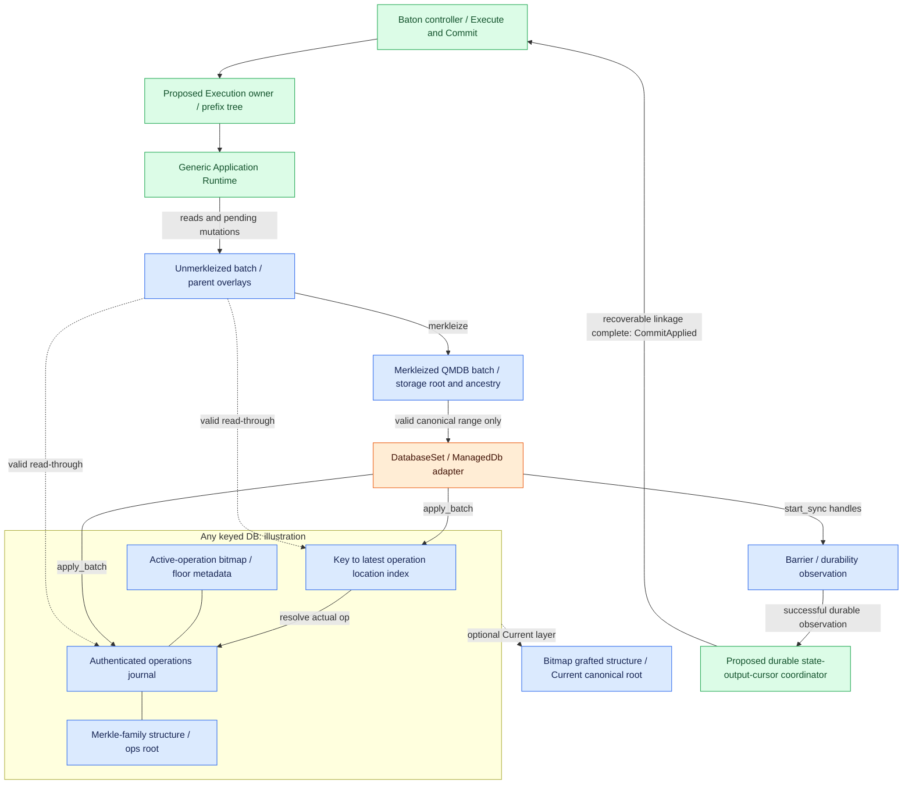
```mermaid
flowchart TB
    B[Baton controller / Execute and Commit] --> O[Proposed Execution owner / prefix tree]
    O --> R[Generic Application Runtime]
    R -->|reads and pending mutations| U[Unmerkleized batch / parent overlays]
    U -->|merkleize| K[Merkleized QMDB batch / storage root and ancestry]
    K -->|valid canonical range only| D[DatabaseSet / ManagedDb adapter]
    subgraph Q[Any keyed DB: illustration]
        I[Key to latest operation location index]
        L[Authenticated operations journal]
        M[Merkle-family structure / ops root]
        A[Active-operation bitmap / floor metadata]
        I -->|resolve actual op| L
        L --- M
        A --- L
    end
    D -->|apply_batch| I
    D -->|apply_batch| L
    U -. valid read-through .-> I
    U -. valid read-through .-> L
    Q -. optional Current layer .-> C[Bitmap grafted structure / Current canonical root]
    D -->|start_sync handles| F[Barrier / durability observation]
    F -->|successful durable observation| J[Proposed durable state-output-cursor coordinator]
    J -->|recoverable linkage complete: CommitApplied| B
    classDef reuse fill:#dbeafe,stroke:#2563eb,color:#172554;
    classDef adapt fill:#ffedd5,stroke:#ea580c,color:#431407;
    classDef fresh fill:#dcfce7,stroke:#16a34a,color:#14532d;
    class U,K,I,L,M,A,C,F reuse;
    class D adapt;
    class B,O,R,J fresh;
```

[그림 크게 보기](assets/diagrams/diagram-17.svg)

Merkleized QMDB batch가 제공하는 것은 sealed storage work와 root/ancestry다. Exact runtime·input prefix·completed execution·outputs를 연결한 application checkpoint는 execution owner가 만든다.

주황 `DatabaseSet / ManagedDb adapter`는 기존 APIs를 proposed execution owner에 연결하는 경계다. 기존 traits 자체를 반드시 수정한다는 뜻은 아니다. 그림의 QMDB 내부는 Any/Current 설명 예이며 variant 채택이 아니다. Keyless·Immutable·compact에서는 state access와 보관 구조가 다르므로 variant별 concrete API를 확인해 재사용 범위를 정한다. 어느 variant를 사용할지는 아직 선택하지 않았다. `Generic Runtime`과 `Execution owner`는 새 application/Baton 책임이고 QMDB index·journal·Merkle 알고리즘은 existing Commonware 책임이다.

QMDB database, unmerkleized/merkleized batches와 commit lifecycle을 활용한다. `commonware_glue::stateful`은 parent state fork, pending-tip 보관, finalization 적용·pruning·lazy replay의 참고 구현이다. 다만 기존 block-DAG / marshal 계약이 Multimmit의 cross-producer dense execution order와 같지는 않다. **Batch/storage 계층을 우선 재사용하고, Stateful actor 전체의 호환 여부는 별도 연결 과제**로 남긴다. [Stateful source](https://github.com/commonwarexyz/monorepo/blob/534af0ede48affd35b2111522527547b4cc9bf72/glue/src/stateful/mod.rs).

| 실행의 논리적 동작 | 실제 upstream API | Baton adapter가 추가로 확인할 것 |
|---|---|---|
| Canonical base에서 batch 만들기 | `DatabaseSet::new_batches` | Exact base / runtime / cursor와 해당 DB의 현재 identity |
| Pending parent에서 분기 | `DatabaseSet::fork_batches`, `Merkleized::new_batch` | 실제 valid ancestor batch와 exact execution prefix |
| 실행 후 checkpoint 계산 | `Unmerkleized::merkleize`, `Merkleized::root` | 완료된 work, deterministic root construction, root kind/version |
| Canonical DB에 적용 | `DatabaseSet::finalize`, concrete `ManagedDb::finalize` | Proof-validated exact range만 single writer가 적용 |
| Disk durability 관찰 | `Barrier::durable` | Flush 실패 확인과 state/output/cursor recoverable linkage |
| Readable state hook | `Application::finalized`, `DatabaseSet::readers` | Readable notification은 durable ACK가 아님 |
| QMDB operations 정리 / DB recovery alignment | `DatabaseSet::prune`, `rewind_to_targets` | Active branch refs, query / sync / replay retention과 chosen recovery 계약 |

각 DB의 batch를 `merkleize`하고 root를 계산한다. `DatabaseSet`이 단일 `root()` / `merkleize()`를 제공하는 것은 아니며, 복수 DB roots와 outputs를 어떻게 result에 결속할지는 adapter의 미결정 계약이다. [Database lifecycle traits](https://github.com/commonwarexyz/monorepo/blob/534af0ede48affd35b2111522527547b4cc9bf72/glue/src/stateful/db/mod.rs#L508)의 이름을 사용했으며, generic execution command와 upstream method를 구분한다.

Generic `Unmerkleized` trait가 모든 variant에 동일한 state `get/write/delete` API를 제공하는 것은 아니다. Application runtime의 state access는 선택할 database의 concrete methods에 맞춘 adapter를 거쳐야 한다. `ReadAt(cursor/root)` 역시 제안한 query 계약이며 `DatabaseSet::readers`가 임의 과거 cursor의 immutable snapshot을 제공한다는 뜻은 아니다. 실제 retained checkpoint/version에서 읽을 수 있는 범위를 query와 pruning 계약으로 정한다.

같은 tx order와 최종 logical values라도 checkpoint batching이나 repeated-key write normalization이 달라지면 operations history/root가 같다고 자동으로 보장할 수 없다.

예를 들어 Any의 한 batch 안에서 `k=1` 다음 `k=2`를 write하면 마지막 mutation만 남지만, 두 writes 사이에 batch를 seal하면 각 seal이 CommitFloor를 추가하므로 storage operation sequence가 달라진다. 최종 값이 모두 `k=2`여도 actual ancestor commitment 일치를 보장하지 못하며, [§6.5의 새 AB와 old ABC 재사용](#65-commit-요청을-받으면-branch를-canonical로-만들기)은 최종 값 대신 실제 ancestry/context를 확인한다. 이는 storage 계약을 설명하는 예시이며 root를 계산한 실행 결과가 아니다. [Write normalization](https://github.com/commonwarexyz/monorepo/blob/534af0ede48affd35b2111522527547b4cc9bf72/storage/src/qmdb/any/batch.rs#L1306), [Commit boundary operation](https://github.com/commonwarexyz/monorepo/blob/534af0ede48affd35b2111522527547b4cc9bf72/storage/src/qmdb/any/batch.rs#L1228).

Canonical operations / batch boundary를 결정적으로 유도할지, logical root와 storage root를 분리할지는 미결정이다. 이 경계를 해결하지 않고 node별 speculative batching의 storage root를 그대로 `f+1` matching result로 사용하지 않는다.

### 6.4 실행 요청을 받으면 분기 tree 정리

Execution branch tree는 **실행 순서의 prefix tree**다. Producer lane의 header ancestry DAG와 별도로 관리한다. 아래 예시는 모두 같은 canonical state `S0`에서 시작한다.

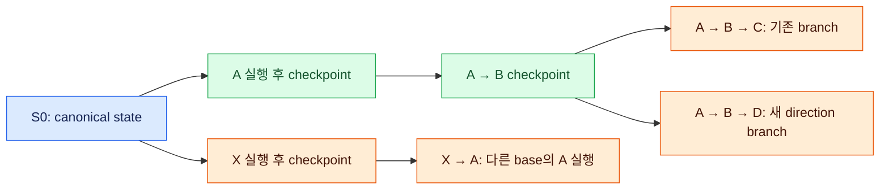
```mermaid
flowchart LR
    S[S0: canonical state] --> A[A 실행 후 checkpoint]
    A --> AB[A → B checkpoint]
    AB --> ABC[A → B → C: 기존 branch]
    AB --> ABD[A → B → D: 새 direction branch]
    S --> X[X 실행 후 checkpoint]
    X --> XA[X → A: 다른 base의 A 실행]
    classDef canonical fill:#dbeafe,stroke:#2563eb,color:#172554;
    classDef reuse fill:#dcfce7,stroke:#16a34a,color:#14532d;
    classDef pending fill:#ffedd5,stroke:#ea580c,color:#431407;
    class S canonical;
    class A,AB reuse;
    class ABC,ABD,X,XA pending;
```

[그림 크게 보기](assets/diagrams/diagram-18.svg)

`A→B→C`에서 `A→B→D`로 바뀌면 같은 `S0`·runtime에서 완료된 `A→B` checkpoint를 유지하고 `D` suffix를 실행한다. `X→A`의 `A` 결과는 input state가 다르므로 `A`라는 block 이름만으로 재사용하지 않는다.

Branch owner가 base/context를 확인하고 reusable prefix를 찾는다. Stale jobs의 generation을 무효화하며, 새 branch에 필요한 parent/checkpoint를 보존한다. Reusable checkpoint는 현재 canonical frontier와 compatible해야 한다. 이미 `AB`가 canonical이면 direction으로 `A→D`에 되돌아갈 수 없다. Pruning은 작업자가 참조 중인 state와 향후 commit·recovery에 필요한 checkpoint를 지우지 않는 규칙으로 연결한다. Budget·GC의 수치는 빈칸이다.

Any/Current mutable keyed batch의 read-through는 독립적인 immutable snapshot이 아니라 **ancestor overlay와 applied DB를 함께 읽는 branch-scoped view**다. Compact처럼 keyed `get`을 제공하지 않는 variant에 이 access 설명을 적용하지 않는다.

Canonical DB가 그 batch의 실제 ancestor commitment로 전진하는 경우는 유효할 수 있지만 다른 sibling으로 전진하면 기존 branch의 read·child 생성·apply를 계속할 수 없다. Canonical apply 전에 incompatible 또는 ancestry가 확인되지 않은 작업의 invalid state 접근을 quiesce/fence해야 한다. [Batch applicability](https://github.com/commonwarexyz/monorepo/blob/534af0ede48affd35b2111522527547b4cc9bf72/storage/src/qmdb/batch_chain.rs#L188), [Stateful quiescence](https://github.com/commonwarexyz/monorepo/blob/534af0ede48affd35b2111522527547b4cc9bf72/glue/src/stateful/actor/core/verifications.rs#L158).

Generation을 무효화하면 **결과 채택 권한**을 취소한다. Worker access를 fence하면 **유효하지 않은 부모 state의 read / fork / apply 권한**을 차단한다. Owner가 base를 확인한 뒤 DB 접근 권한을 기다리는 사이 canonical 적용이 DB를 바꿀 수 있다. 따라서 실제 DB 접근 권한을 확보한 상태에서 검사와 사용을 이어가야 한다. 구체 protocol은 [§6.6의 미결정 항목](#66-미결정-사항)이다.

이미 immutable Merkle snapshot만 갖고 수행하는 CPU hashing은 caller future 취소 뒤에도 끝까지 실행되고 결과가 버려질 수 있다. Canonical apply의 safety fence를 모든 background CPU 작업이 반드시 종료될 때까지 기다리는 조건과 동일시하지 않는다. Invalid live-DB access와 stale result admission을 막는 경계, snapshot reference·resource lifetime을 관리하는 경계를 나눈다. [Snapshot hashing cancellation](https://github.com/commonwarexyz/monorepo/blob/534af0ede48affd35b2111522527547b4cc9bf72/storage/src/journal/authenticated.rs#L325).

### 6.5 Commit 요청을 받으면 branch를 canonical로 만들기

| 순서 | 처리 | 유지할 경계 |
|---|---|---|
| 1 | Ordered range의 evidence·predecessor·runtime 확인 | Local advisory order를 canonical 근거로 쓰지 않음 |
| 2 | Exact range와 일치하는 completed branch prefix 찾기 | Branch 전체가 더 길어도 확정된 prefix만 대상으로 삼음 |
| 3 | 없는 work / mismatch suffix를 canonical base에서 실행 | State root가 우연히 같다는 이유로 다른 input을 대체하지 않음 |
| 4 | Incompatible / unknown active workers를 fence한 뒤 해당 batch 적용 | Single canonical writer, branch-scoped read validity |
| 5 | Durable CommitApplied 발급 | State / output / cursor가 함께 복구 가능할 때 완료 |
| 6 | Incompatible forks 정리, compatible suffix 보존 / 재연결 | 확정 canonical 입력/해석은 되돌리지 않음; physical recovery alignment는 선택한 계약을 따름 |

예를 들어 `A→B→C`를 사전 실행했고 canonical range가 `A→B`이면 `A→B`만 QMDB canonical에 적용한다. `C`는 다음 pending 입력이며 기존 C work의 보존은 actual ancestry/context 조건부다. 아직 `AB`가 speculative인 같은 base에서 canonical range가 `A→D`라면 `A` 뒤의 `B→C` 결과는 해당 commit에 사용할 수 없다.

“Canonical로 만든다”는 branch pointer만 바꾸는 동작이 아니다. QMDB에 writes를 적용·sync하고 outputs·commit metadata·AppliedCursor를 crash 후에도 일관되게 복구할 수 있어야 한다. Branch cleanup의 GC scheduling은 미결정이며 state/output/cursor의 durable 완료와 별도로 정한다. Active access fencing과 required retention은 항상 유지해야 한다.

`ABC`만 하나의 sealed batch로 있고 `AB` checkpoint가 없다면 `ABC`를 apply한 뒤 `C`를 숨기는 방식으로 partial-prefix commit을 처리할 수 없다. Canonical owner는 요청의 정확한 predecessor와 일치하는 유효한 base에서 `AB` 끝의 별도 batch 경계를 만들거나, `AB`까지 재실행해 그 경계를 준비해야 한다. `new_batches`는 현재 applied DB에서 시작하며 이미 전진한 DB의 과거 prefix를 자동 복원하지 않는다. [Actual base capture](https://github.com/commonwarexyz/monorepo/blob/534af0ede48affd35b2111522527547b4cc9bf72/storage/src/qmdb/any/batch.rs#L2704).

새 `AB`의 실제 commitment가 old `ABC` ancestry와 다르면 old sealed `ABC` batch를 자동 재사용할 수 없다. 기존 `ABC` batch의 실제 조상에 `AB`가 있다면, owner는 현재 canonical DB의 operation 수와 authenticated ops root가 그 조상의 commitment와 일치하는지 확인한다. Batch가 유효하고 정확한 입력·runtime·완료 결과의 context도 맞을 때만 기존 `ABC` batch를 계속 사용할 수 있다. Storage applicability는 floors도 검사하며 application input/runtime/outputs binding은 owner가 확인한다. [Storage bounds validation](https://github.com/commonwarexyz/monorepo/blob/534af0ede48affd35b2111522527547b4cc9bf72/storage/src/qmdb/batch_chain.rs#L98).

같은 logical state처럼 보이는 sibling batch는 이 조건을 대신하지 않는다. Descendant access는 [§6.4의 branch validity](#64-실행-요청을-받으면-분기-tree-정리)를 따르며, durable 완료는 아래 finalized/barrier 경계와 구분한다.

Existing `Application::finalized` hook은 DB readable 시점에 호출될 수 있고 flush는 진행 중일 수 있다. [Finalized callback contract](https://github.com/commonwarexyz/monorepo/blob/534af0ede48affd35b2111522527547b4cc9bf72/glue/src/stateful/mod.rs#L308). 이를 durable 완료 callback처럼 직접 연결하지 않는다. `DatabaseSet::finalize`가 반환한 `Barrier::durable` 결과를 확인하고 선택한 state/output/cursor commit 계약을 만족한 뒤 완료를 발급한다. [DatabaseSet / Barrier](https://github.com/commonwarexyz/monorepo/blob/534af0ede48affd35b2111522527547b4cc9bf72/glue/src/stateful/db/mod.rs#L558), [Stateful delivery ACK](https://github.com/commonwarexyz/monorepo/blob/534af0ede48affd35b2111522527547b4cc9bf72/glue/src/stateful/actor/core/processing.rs#L307).

| 실행 / 저장 단계 | 취소·실패의 의미 | Adapter가 유지할 경계 |
|---|---|---|
| Branch work / Shared lock 대기 | 아직 canonical DB를 by-value로 꺼낸 mutation은 아님 | Stale 결과를 버리고 invalid state 접근을 정리 |
| `Shared::write`의 DB take→`WriteSlot::put` 사이 | Future drop / 실패 시 DB를 cell에 돌려주지 못할 수 있음 | Canonical mutation lifecycle을 advisory generation 취소와 분리, lost handle을 ordinary retry로 재사용하지 않음 |
| Applied DB + flush pending | 읽을 수 있지만 durable completion은 미확인 | Barrier와 state/output/cursor linkage가 끝나기 전 ACK 미발급 |
| Barrier handle `Closed` / `Aborted` | Upstream은 shutdown 경계로 문서화한 handle 종료에 `false` | Completion 증거 없음, 실제 disk writes가 0이라고 가정하지 않고 recovery에서 재검증 |
| 다른 deferred flush error | 이미 applied DB가 전진한 뒤 fatal / panic 경계 | 실패를 성공 ACK로 바꾸거나 DB set 전체의 자동 rollback을 주장하지 않음 |

`Shared`는 writer를 우선하는 lock이다. Outer read guard를 잡은 채 같은 Shared cell을 다시 acquire하는 `batch.get` 등을 await하면 queued writer와 deadlock할 수 있다. Multi-DB member의 lock 순서도 `DatabaseSet`의 기존 ownership discipline에 맞춰 연결한다. 이 lock safety와 state/output/cursor의 crash atomicity는 다른 요구다. [Shared ownership / locks](https://github.com/commonwarexyz/monorepo/blob/534af0ede48affd35b2111522527547b4cc9bf72/glue/src/stateful/db/mod.rs#L139).

Flush completion handle의 abort가 underlying disk work를 전부 취소한다는 뜻은 아니다. Task handle과 completion handle의 중단 의미를 구분하며, completion을 잃었다면 authoritative durable state와 cursor를 복구 때 다시 확인한다. [Runtime handle kinds](https://github.com/commonwarexyz/monorepo/blob/534af0ede48affd35b2111522527547b4cc9bf72/runtime/src/utils/handle.rs#L26).

### 6.6 미결정 사항

| 항목 | 결정 |
|---|---|
| Application runtime / tx semantics | |
| QMDB database variant / state encoding / root 종류 | |
| Canonical operation / batch-boundary derivation / logical root 연결 | |
| Stateful actor 재사용 범위 | |
| Branch key / checkpoint granularity | |
| Execution scheduling / cancellation / worker fencing contract | |
| State / outputs / cursor atomic commit 방식 | |
| Branch pruning / memory / disk budget | |
| Replay / checkpoint / state sync | |
| Query interface / certified result 연결 | |

### 6.7 미채택 후보: certificate + state material로 catch-up

이전 논의의 “합의된 state root와 change set을 받아 따라오기”는 **optional certified state sync** 후보로 다룬다. 기본 `Commit` 경로를 이 방식으로 바꾸기로 결정한 것은 아니다. Import의 적용·복구도 [§6.5의 canonical owner와 durability 계약](#65-commit-요청을-받으면-branch를-canonical로-만들기)을 따른다. Certificate와 material의 별도 검증은 아래 표에 정리한다. QMDB sync target 검증은 native order와 execution certificate의 출처까지 자동 검증하는 API가 아니다.

| 단계 | 검증할 연결 | 다음 단계에 주는 것 |
|---|---|---|
| Certificate 확인 | Distinct eligible epoch validators의 동일 statement `f+1`, exact native range / input state / runtime / result | 검증한 target statement |
| Material 검증 | Exact local base와 delta / checkpoint / outputs가 target commitment에 대응 | Import 가능한 state material |
| 적용·복구 연결 | State / outputs / cursor의 선택한 durable commit 계약 | Imported verified canonical checkpoint |
| 이후 실행 | Imported checkpoint에서 다음 exact range를 직접 실행 / 검증 | 다음 range의 direct execution 결과와 서명 후보 |

ImportedVerified provenance와 canonical checkpoint의 recovery 연결도 import commit 계약에 포함한다. Recovery 때 direct execution 근거를 복원하지 못하면 해당 range에 own signature를 만들지 않는다. Imported material을 검증·적용한 행위를 해당 range의 own `DirectExecuted` signature로 바꾸지 않는다. Receiver는 원래 signers의 certificate를 전파하거나 인증 조회에 쓸 수 있고, 채택한 canonical base에서 **다음 range**를 직접 실행한 경우 그 다음 statement에 서명할 수 있다. Correctness certificate는 material의 보관·전파·조회 availability를 보장하지 않으므로 serve / retention 조건은 따로 정해야 한다. Delta / checkpoint format, root 종류, signer boundary, import codec과 crash recovery 방식은 §6.6의 빈칸에 남긴다.

## 7. 실제 example에 연결할 지점과 개발 순서

### 7.1 Commonware integration anchors

모든 native 링크는 commit `534af0ede48affd35b2111522527547b4cc9bf72`에 고정한다. 이 표의 신규 bridge는 개발할 계약이며 구현 완료 상태가 아니다.

조립 진입점은 `log-multimmit/main.rs`다. 기존 example은 `commonware_runtime::tokio::Runner`를 만들고, 그 context에서 `commonware_p2p::authenticated::discovery::Network`와 native logical channels를 등록한다. Application을 Automaton·Relay로 넘기고 `commonware_parallel::Rayon` native crypto strategy·profile·committee를 EngineConfig에 연결한 뒤 `network.start()` → `engine.start(...)` → `running.ready()`로 시작한다. Baton attachment에서는 [startup 흐름](#212-startup-custody를-준비한-뒤-native-recovery)에 따라 body service를 먼저 준비하고 application planes·execution을 연결한다. [Runtime / network assembly](https://github.com/commonwarexyz/monorepo/blob/534af0ede48affd35b2111522527547b4cc9bf72/examples/log-multimmit/src/main.rs#L293).

이 example의 committee는 ordinary BLS roster와 DA/nullification용 독립 threshold sharing을 mock seed에서 만든다. 이것은 source example의 key setup이며 Baton의 production setup 정책을 확정한 것이 아니다. Transport identity, native signing domain, application tx/result signature domain을 하나의 키·namespace로 가정하지 않는다. [Example key material](https://github.com/commonwarexyz/monorepo/blob/534af0ede48affd35b2111522527547b4cc9bf72/examples/log-multimmit/src/main.rs#L17).

| 연결 지점 | 가져올 것 | 변경 / 신규 연결 |
|---|---|---|
| [Example main](https://github.com/commonwarexyz/monorepo/blob/534af0ede48affd35b2111522527547b4cc9bf72/examples/log-multimmit/src/main.rs#L358) | Runtime, committee, authenticated discovery network, native channel / Engine wiring | Tx / body / report / direction channel과 Baton / execution actor 시작 |
| [Example Application](https://github.com/commonwarexyz/monorepo/blob/534af0ede48affd35b2111522527547b4cc9bf72/examples/log-multimmit/src/application/actor.rs#L40) | Automaton / Relay trait 경계와 main의 Reporter wiring | Mock body callbacks를 pool·body·custody adapter로 교체, accepted-artifact candidate intake에 existing Reporter 활용 |
| [Native view owner](https://github.com/commonwarexyz/monorepo/blob/534af0ede48affd35b2111522527547b4cc9bf72/consensus/src/multimmit/machine/view.rs#L1269) | Actual leader proposal context와 native owner authority | Read-only planning context export / prepared result correlation |
| [Leader block](https://github.com/commonwarexyz/monorepo/blob/534af0ede48affd35b2111522527547b4cc9bf72/consensus/src/multimmit/types/block.rs#L563) | LeaderBlock 구조 / canonical codec | Frozen policy binding와 proposal validity / recovery 연결 |
| [Finality owner](https://github.com/commonwarexyz/monorepo/blob/534af0ede48affd35b2111522527547b4cc9bf72/consensus/src/multimmit/machine/finality.rs) | Exact native facts와 인증 근거의 provenance | Resumable evidence export / retention handoff / history backfill |
| [Native tip algebra](https://github.com/commonwarexyz/monorepo/blob/534af0ede48affd35b2111522527547b4cc9bf72/consensus/src/multimmit/machine/algebra/tips.rs#L143) | Native extraction / settledness 규칙 | Verified shared extraction facade와 dense ordered delivery; private algebra 접근 문제 해결 |
| [QMDB Stateful](https://github.com/commonwarexyz/monorepo/blob/534af0ede48affd35b2111522527547b4cc9bf72/glue/src/stateful/mod.rs) | Batch fork / merkleize / apply, pending-state 관리 | Multimmit exact execution order에 맞는 branch / canonical adapter |
| [Cryptography interfaces](https://github.com/commonwarexyz/monorepo/blob/534af0ede48affd35b2111522527547b4cc9bf72/cryptography/src/lib.rs) | Namespace와 message를 받는 서명·검증 primitive | ExecutionStatement encoding·epoch key 연결과 signer / result collector 구성 |
| [Codec interfaces](https://github.com/commonwarexyz/monorepo/blob/534af0ede48affd35b2111522527547b4cc9bf72/codec/src/lib.rs) | Write / Read / EncodeSize와 encoding·decoding 기본 API | Tx / body / report / direction / result의 schema·version·limits 연결 |

#### 실제 소스를 따라 읽는 순서

소스 탐색과 아래 개발 단계는 다르다. 먼저 upstream이 소유하는 흐름을 확인한 뒤 application / Baton 연결부를 개발한다.

Tx 저장·선택은 [§3.1의 pool 재사용 후보](#31-역할과-책임), body 보관·전파·fetch는 [§4.4의 primitive 표](#44-블록-전파조회custody)를 먼저 읽고, 아래 순서에서 native callback과 연결한다.

같은 pin의 [reshare validator 조립](https://github.com/commonwarexyz/monorepo/blob/534af0ede48affd35b2111522527547b4cc9bf72/examples/reshare/src/validator.rs#L122)은 resolver·buffer·archives·Marshal·Stateful·application wrapper에 어떤 handles를 넘기는지 한 파일에서 읽는 참고다. 이 Simplex example의 [Deferred wrapper](https://github.com/commonwarexyz/monorepo/blob/534af0ede48affd35b2111522527547b4cc9bf72/consensus/src/marshal/standard/deferred.rs#L488)는 digest를 durability 전에 반환하고 별도 certify gate에서 기다린다. Native Multimmit의 producer Context·custody/signing·recovery 계약을 그대로 제공하는 adapter로 취급하지 않는다.

| 순서 | 소스 진입점 | 읽을 때 확인할 질문 |
|---|---|---|
| 1. Node 조립 | [log-multimmit main.rs](https://github.com/commonwarexyz/monorepo/blob/534af0ede48affd35b2111522527547b4cc9bf72/examples/log-multimmit/src/main.rs) | Network channel, application, Engine config는 어디서 연결되는가? |
| 2. Native 시작·복구 | [Engine::start](https://github.com/commonwarexyz/monorepo/blob/534af0ede48affd35b2111522527547b4cc9bf72/consensus/src/multimmit/engine.rs) | Journal replay와 recovered-payload verify가 actor 시작보다 앞서는 이유는 무엇인가? |
| 3. Wire→observation→verification | [Wire types](https://github.com/commonwarexyz/monorepo/blob/534af0ede48affd35b2111522527547b4cc9bf72/consensus/src/multimmit/actors/wire.rs), [Batcher](https://github.com/commonwarexyz/monorepo/blob/534af0ede48affd35b2111522527547b4cc9bf72/consensus/src/multimmit/actors/batcher/mod.rs) | Untrusted observation와 owner가 발급한 verification completion은 어떻게 구분되는가? |
| 4. Native 상태 소유자 | [Machine ownership](https://github.com/commonwarexyz/monorepo/blob/534af0ede48affd35b2111522527547b4cc9bf72/consensus/src/multimmit/machine/mod.rs), [Voter executor](https://github.com/commonwarexyz/monorepo/blob/534af0ede48affd35b2111522527547b4cc9bf72/consensus/src/multimmit/actors/voter/executor.rs) | Semantic state와 async job 실행은 누가 각각 소유하는가? |
| 5. Producer와 leader | [Chain](https://github.com/commonwarexyz/monorepo/blob/534af0ede48affd35b2111522527547b4cc9bf72/consensus/src/multimmit/machine/chain.rs), [View](https://github.com/commonwarexyz/monorepo/blob/534af0ede48affd35b2111522527547b4cc9bf72/consensus/src/multimmit/machine/view.rs) | Payload build callback와 leader의 여러 lane cut 구성은 어떻게 다른가? |
| 6. Native 출력 경계 | [Finality](https://github.com/commonwarexyz/monorepo/blob/534af0ede48affd35b2111522527547b4cc9bf72/consensus/src/multimmit/machine/finality.rs), [State-machine contract](https://github.com/commonwarexyz/monorepo/blob/534af0ede48affd35b2111522527547b4cc9bf72/consensus/src/multimmit/docs/STATE_MACHINE.md) | 어떤 evidence를 export·보관해야 application이 dense order를 복구할 수 있는가? |
| 7. QMDB 내부 | [QMDB lifecycle](https://github.com/commonwarexyz/monorepo/blob/534af0ede48affd35b2111522527547b4cc9bf72/storage/src/qmdb/mod.rs), [Batch chain](https://github.com/commonwarexyz/monorepo/blob/534af0ede48affd35b2111522527547b4cc9bf72/storage/src/qmdb/batch_chain.rs) | Pending checkpoint, actual DB ancestor, operations commitment의 관계는 무엇인가? |
| 8. Apply와 durable 완료 | [DatabaseSet / Barrier](https://github.com/commonwarexyz/monorepo/blob/534af0ede48affd35b2111522527547b4cc9bf72/glue/src/stateful/db/mod.rs), [Stateful processor](https://github.com/commonwarexyz/monorepo/blob/534af0ede48affd35b2111522527547b4cc9bf72/glue/src/stateful/actor/processor/mod.rs) | Readable callback과 flush ACK는 어느 지점에서 갈라지고 Baton owner가 무엇을 추가해야 하는가? |

### 7.2 개발 단계와 확인할 흐름

| 단계 | 개발할 연결 | 확인할 lifecycle |
|---|---|---|
| 1 | 기존 Multimmit example 구조와 버전 고정 | 기존 native producer / DA / consensus 흐름 |
| 2 | Tx admission / pool / body builder / custody | §2.2–2.4, 업무 runtime 없이도 tx body 전달 확인 |
| 3 | Evidence / history / ordered delivery adapter | Native sparse finality → contiguous exact inputs, gap backfill |
| 4 | Generic execution interface / QMDB branches / canonical apply | §2.7–2.9, canonical range와 durable state 연결 |
| 5 | Baton block intake / ExecutionController / reschedule | §2.1·2.6·2.8, 동일 prefix 재사용과 suffix 재실행 |
| 6 | Report connection / leader planner / direction broadcast | §2.5, no-report·late-report·leader 교체·cut preemption |
| 7 | Native proposal policy / continuation / recovery 연결 | Selected prefix inclusion + exact leading order + no-wait 검증 |

단계 7의 native adoption·continuation 증명이 없으면 advisory scheduling 연결과 protected-prefix Baton 통합을 같은 완료 상태로 부르지 않는다. 테스트 workload는 application semantics 결정 후 정하며 Bank를 먼저 개발하는 단계는 두지 않는다.

단계 4에서는 [§5.2의 `OnOrderedRange`→`Commit` 연결](#52-인터페이스-개요)로 단계 3의 canonical 입력을 execution에 먼저 전달하고, 단계 5에서 candidate intake·speculation·reschedule을 더한다. [§2.10의 direct-result signer / collector / query 연결](#210-결과-endpoint-direct-execution과-f1-인증)도 이 execution 경로에 붙일 개발 항목이다. 구체 signature boundary·root construction·codec·key 연결은 빈 결정 칸을 정한 뒤 구현한다.

### 7.3 컴포넌트별 검증 케이스

| 컴포넌트 | 설계에서 확인할 케이스 | 실행 상태 |
|---|---|---|
| Tx / pool | 신규·중복·구조 invalid, proposal 취소, canonical outcome 전 cleanup 금지 | 미실행 |
| Builder / custody | Expected digest mismatch, body / parent 누락, durable storage 실패, late build completion | 미실행 |
| Native / delivery | Unresolved gap, authenticated empty, extension, history 누락, recovery 후 emitted prefix 보존 | 미실행 |
| Leader Baton | Threshold / deadline 경합, distinct report 중복, stale context, planner incomplete, cut 먼저 ready | 미실행 |
| Non-leader Baton | Missed / late direction, missing body, order 변경, producer와 executor 역할 분리 | 미실행 |
| Execution | Prefix reuse / input-state mismatch / runtime mismatch, cancel된 job 완료, partial-prefix commit | 미실행 |
| QMDB recovery | Commit 중 crash, ACK 유실, 같은 range 재전달, pruning 후 필요한 checkpoint 복구 | 미실행 |

Leader/view/context 교체는 [proposal freeze](#211-planner-completion과-proposal-freeze의-경합)와 [native recovery owner](#46-실제-native-actor와-파일-구조)에서 읽는다. Old reports/advisory를 새 context에 재사용하지 않고, 이미 인증된 해석과 emitted canonical prefix를 보존해야 한다. Native adoption·continuation·recovery bridge는 여전히 개발·증명할 부분이다.

Missed direction은 [non-leader 경로](#26-baton-lifecycle-non-leader의-direction재실행-요청)로 돌아가 local intended work와 canonical Commit을 진행한다. Late build는 [native 요청 correlation](#43-mempool에서-가져와-블록-생성), late execution은 [generation과 access fencing](#64-실행-요청을-받으면-분기-tree-정리)으로 구분한다. Direction 수신이나 취소된 worker의 완료를 새 cut barrier로 두지 않는다.

## 8. 참고자료와 문서 상태

[Tempo Technical Overview](https://app.notion.com/p/2dfc1352439b801db5b6cf6fe21fc315?pvs=204)의 **전체 구조 → 컴포넌트별 책임·인터페이스 → propose / verify / finalize sequence** 전개를 참고했다. [Tempo DeepWiki architecture overview](https://deepwiki.com/tempoxyz/tempo/2-architecture-overview)에서는 레이어 구성, 실제 파일 mapping, actor system, P2P channels, inter-layer communication을 설명하는 구성을 확인했다. 이 자료들은 설명 방식의 참고이며, 기술 사실과 재사용 가능 여부는 아래 pinned Commonware 소스로 검증한다. Tempo의 Simplex + Reth/REVM / Engine API 구현을 Baton의 채택 기술로 옮기지는 않는다. 이번 설계는 Native Multimmit + Baton + generic execution / QMDB다.

연구 알고리즘과 조건부 논증의 출처는 [Baton 연구 초안](https://docs.google.com/document/d/1PtUpMGMNMkyo1UEY2bNciJD3oIiGLRf407PW_T3Er5I/edit)이다. 예전 [Google 구현 스펙](https://docs.google.com/document/d/10x4RvqG8e07Tai0s20e-wpCfz8COgH0JGR5daKE1xO8/edit)은 상세 계약의 이전 참고자료이며 이번 개요와 자동 동기화하지 않는다.

문서의 diagram과 인터페이스는 계획이다. Pin의 source와 현재 연결 경계를 확인한 것으로 native correctness·성능·QMDB crash recovery 테스트가 완료되었다고 주장하지 않는다. 미결정 사항은 위 각 레이어 표의 빈 결정 칸에 채운다.
