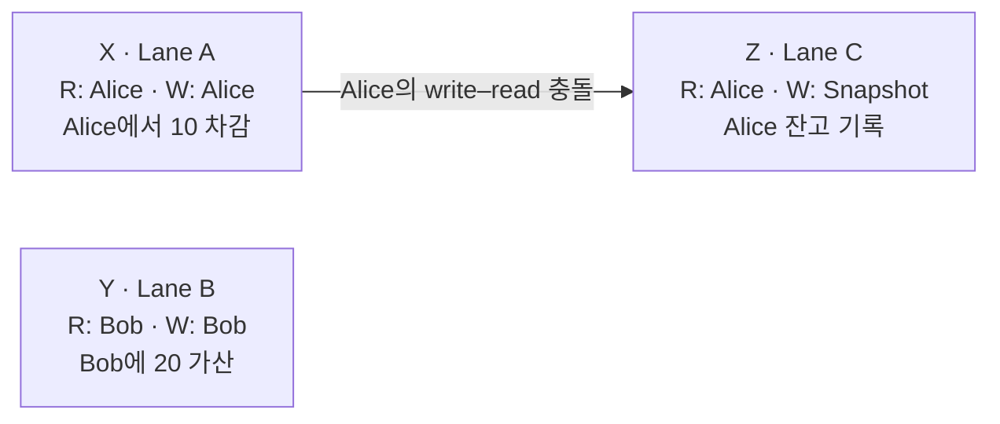
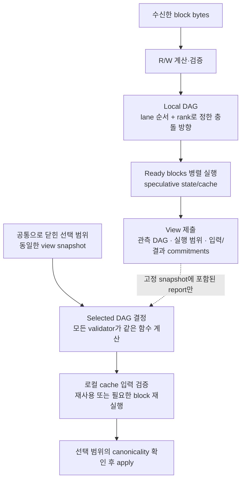
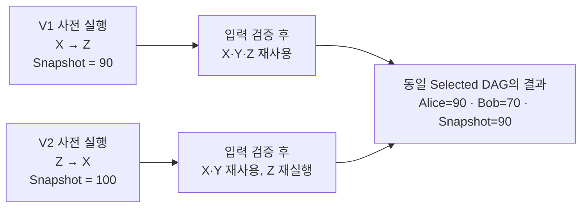

# Block-level LocalDAGView → SelectedView

> 2026-09-19 후속 결정: 최신 논문 탐색안은 [회전형 라운드로빈 DAG](./rotating-round-robin-dag.md)다. 아래는 adaptive view synthesis와 기존 executable model의 기록이다. 새로운 cut별 회전/f+1 실행 인증이 이미 이 문서의 코드에 구현되었다고 해석하지 않는다.

> 2026-09-18 · exploratory design and executable reference model
>
> 이 문서는 state ownership을 나누지 않는 최신 탐색안을 구체화한다. 기존
> [active protocol](./proof-aware-multimmit-paper.md)이나 Commonware fork를 교체하지 않는다.
> [이전 알고리즘 메모](./local-dag-selection-algorithm.md)의 block-level 선택,
> Byzantine 처리, recovery 규칙은 이 문서를 우선해서 읽는다.

## 1. 목표와 정확한 범위

목표는 graph에서 cycle만 제거하는 것이 아니라 다음 시간을 줄이는 것이다.

\[
\Delta_v=T_{\text{canonical state applied},v}-T_{\text{ordering finalized},v}.
\]

이를 위해 block 수신 단계부터 실행을 시작하고, 공통 규칙으로 서로 다른
local views의 불일치를 줄이며, 선택된 view와 일치하는 계산은 재사용한다.
실행 결과를 인증하는 시간과 각 read-serving node의 durable apply 시간은 별도로 측정한다.

권장 흐름을 짧게 쓰면 다음과 같다.

1. 검증된 block read/write sets로 충돌을 찾고 공통 rank로 pre-cut 충돌 방향을 맞춘다. 독립 blocks는 병렬 실행한다.
2. Candidate의 입력이 닫히면, lane 순서를 지키는 후보 중 남은 실행 경로가 짧은 DAG를 고른다.
3. DAG가 달라져도 읽은 값이 같은 결과는 재사용하고, 실제 stale inputs만 재실행한다.
4. 위 준비를 ordering과 겹치고, finalized된 exact candidate만 canonical state로 반영한다.

핵심은 **충돌을 없앤다는 주장보다 ordering 후에 남기는 실행량과 지연을 줄이는 것**이다.
현재 실험은 이 방향의 일부 효과와 실패 사례를 함께 확인한 것이며, 전체 latency 우위를
증명하거나 생산 환경에서 측정한 것은 아니다.

- DAG의 node와 ordering 단위는 **transaction이 아닌 block**이다.
- Block 내부 transaction 순서는 producer가 정한 순서로 고정한다.
- 모든 validator가 여러 producer lane의 block을 받아 같은 shared state에 대해 실행할 수 있다.
- Read/write sets는 signed input과 application schema로 보수적으로 확정 가능해야 한다.
- 같은 state를 쓰는 두 block의 본질적인 의존성을 없앨 수는 없다. 목표는 서로 다른
  순서로 미리 실행해서 생기는 낭비와, 변화하지 않은 결과까지 다시 계산하는 낭비를 줄이는 것이다.
- 별도 PAC, ZK proof, state-owner handshake는 이 탐색안에 없다. 정상 DA 경로가
  exact view bytes를 포함해야 하고, 최종 결과는 해당 실행을 검증한 validator들의 서명으로 확인한다.

본 모델은 validator 사이의 계산을 분할하는 execution sharding이 아니다.
여러 validator의 speculative execution과 각 validator 내부의 병렬 실행을 활용하는 설계다.

## 2. Ordering과 application 순서를 구별해야 한다

[Autobahn §5.2.2](https://www.cs.cornell.edu/lorenzo/papers/Suri24Autobahn.pdf)의
cut 확정 이후 deterministic merge와 달리, 본 탐색안은 공통으로 확정된 입력에서
views를 이용해 conflicting blocks의 merge order를 도출한다.
따라서 **BFT agreement mechanism을 유지하더라도 application serialization rule은 확장한다.**
기존 total order를 그대로 보존하는 단순 병렬 scheduler라고 설명하면 안 된다.

비교할 두 모드는 다음과 같다.

1. Fixed-order baseline: native/fixed block order의 conflict 방향을 그대로 유지한다.
2. View-selected extension: 같은 선택 대상 안에서 lane 순서를 지키며 conflict 방향을 선택한다.

두 모드에서 동일한 transaction이 서로 다른 성공/실패 결과를 낼 수 있다.
각 모드 내부의 모든 honest validator는 같은 결과에 도달해야 한다.

### 2.1 반드시 필요한 공통 입력

하나의 선택 대상에는 다음이 불변으로 묶여야 한다.

```text
epoch, selection position, canonical parent state identity/root
exact selected block occurrences and authenticated lane boundaries
exact view-reference snapshot and any additional DA-backed evidence blocks
application version, execution environment, algorithm version and search bounds
committee and deterministic lane permutation
```

`내가 현재 받은 views`로 계산하면 안 된다. 같은 candidate를 보는 두 validator가
서로 다른 views를 사용하면 deterministic algorithm이어도 결과가 달라진다.
Leader의 로컬 수신 순서, 로컬 시계, 현재 cache contents는 합성 입력에 넣지 않는다.

View root만 payload에 적었다고 그 bytes가 available한 것은 아니다.
해당 bytes나 복구 가능한 encoding이 기존 DA가 보장하는 범위에 들어 있어야 한다.
Report는 자신보다 앞선 관측 snapshot을 설명한다. 자신을 담은 block까지 자신이
이미 실행했다는 식의 circular commitment를 요구하지 않는다.

### 2.2 Multimmit 연결에서 아직 필요한 작업

[Multimmit](https://arxiv.org/abs/2607.21021)의 서로 다른 L-QCs로부터
호환되지만 길이가 다른 emitted prefixes를 얻을 수 있다. 임의의 로컬 L-QC마다
adaptive synthesis를 돌리면 더 긴 prefix에서 이미 정한 conflict 방향을 바꿀 위험이 있다.
Adaptive selection은 일반적으로 prefix-stable하지 않다.

그러므로 구현에는 **각 selection position의 입력을 유일하게 닫는 규칙**이 필요하다.
실현 가능한 한 adapter는 native emitted block stream을 공통 크기의 닫힌 구간으로
나누고, 각 구간의 exact blocks와 view snapshot에 대해서만 합성하는 것이다.
낮은 부하에서는 ordered close marker 같은 명시적인 구간 종료 규칙도 필요하다.
부분 구간이 닫히기를 기다린 시간을 latency 측정에서 빼서는 안 된다.

다른 선택은 consensus-visible candidate descriptor를 추가하는 것이다.
이 경우 proposal validity, locking, view change와 prefix compatibility의 증명까지 수정해야 한다.
단순히 기존 L-QC 옆에 `PlanRoot`를 붙이면 해결되는 문제가 아니다.

현재 executable model은 위 공통 입력이 이미 정당하게 닫혔다고 가정한다.
Native Multimmit에서 이 adapter를 구현하거나 end-to-end로 검증한 상태는 아니다.

### 2.3 Multimmit에서 가져올 경계: proposed tip, final tip, emitted prefix

[Multimmit §4.2](https://arxiv.org/html/2607.21021v4)는 leader가 제안한 tip을
그대로 확정하지 않는다. Voter는 chain마다 자신이 DA-vote한 연속 prefix까지의
position을 보고하며, 그 position에서 시작하는 extensions도 실을 수 있다.
따라서 leader가 최신 tip을 모르거나 잘못된 suffix를 제안해도 voter는 더 낮은
position과 실제 branch의 extension을 보고할 수 있다. 없는 data를 fetch할 때까지
ordering vote를 기다리게 하는 규칙은 아니다.

구분해야 할 세 단계는 다음과 같다.

1. **제안/관측:** proposer와 각 voter가 아는 tips. 서로 달라도 된다.
2. **Native extraction:** 동일 authenticated transcript에 기존 tip extraction을
   적용한다. `n >= 5f+1` 모델에서 final position은 votes의 `(3f+1)`번째 큰
   position이며, extension/settledness에는 별도 규칙이 있다. 임의 height의 중간값이나
   가장 높은 tip을 고르는 것으로 대체하지 않는다.
3. **배치:** membership이 확정된 tip이라도 즉시 global ordering에 배치되는 것은
   아니다. Native `Emit`은 horizontal sweep 중 unsettled chain의 첫 빈 slot에서
   멈춘다. Settled chain의 빈 slot은 건너뛸 수 있다. 여기의 빈 slot은 tip 너머의
   ordering position이지, 로컬 저장소에서 body를 못 찾았다는 뜻이 아니다.

우리 DAG의 node membership은 세 번째 단계로부터 **유일하게 닫힌 선택 구간**으로
도출한다. 첫 번째의 local tips나 두 번째의 membership-final tips만으로 확정하지 않는다.
Native threshold를 DAG edge마다 적용하는 것은 안전하지 않다. Chain prefix와 달리
여러 edge의 독립적인 선택은 cycle이나 기존 실행 순서의 변경을 만들 수 있다.

### 2.4 누락된 tip과 data의 처리

닫힌 선택 구간은 모든 lane에 대해 `(height, block identity)`를 하나씩 명시한다.
새 block이 없는 lane도 이전 anchor를 반복하며, field 누락을 `변화 없음`으로 해석하지
않는다. `height`만 같고 hash가 다른 branch도 동일 tip이 아니다.

| 상황 | 처리 |
|---|---|
| LocalDAGView에 selected tip 또는 block이 없음 | Report가 부분적일 뿐이다. 공통 selected nodes에 보충하고, 그 reporter는 해당 block을 미실행한 것으로 계산한다. |
| Selected tip/body 또는 그 ancestor가 로컬에 없음 | Exact identity로 복구하고 `NeedData`를 반환한다. 이전 tip으로 내려가거나 lane을 삭제해서 다른 DAG를 만들지 않는다. |
| Selected tip은 있으나 이전 anchor까지 parent path가 불연속 | 누락된 bytes는 복구한다. 확보한 authenticated path가 틀린 branch/height라면 descriptor를 거절한다. |
| Local view의 tip이 selected boundary보다 높음 | 이번 DAG에는 boundary까지만 넣는다. 나머지는 이후 선택 가능성이 있는 speculative data로 유지하며 영구 폐기로 간주하지 않는다. |
| Lane이 이번 구간에서 전진하지 않음 | Selected tip을 exact previous anchor로 명시한다. 그 lane의 새 nodes는 0개다. |
| Native final tip은 있으나 아직 global position이 unsettled | Current closed selection에 넣지 않는다. Ordering 배치를 기다리며 speculation만 허용한다. |
| 이미 닫혀 적용한 구간 뒤에 더 높은 tip/data가 도착 | 새 구간의 후보로만 처리한다. 과거 구간에 끼워 넣거나 과거 DAG를 재선택하지 않는다. |

Body/검증된 footprint를 모르는 block은 어떤 key와 충돌할지도 모른다. 그러므로
그 block을 제외하고 나머지가 canonical하게 독립이라고 단정할 수 없다. Ordering과
speculative execution은 계속할 수 있지만, 이 reference model은 해당 선택 구간의
최종 DAG/apply를 필요한 data가 올 때까지 보류한다. Selective partial apply는 별도
soundness 조건이 필요하며 이 모델의 보장에 포함하지 않는다.

예를 들어 이전 anchor와 이번 **닫힌 구간의** boundary가 다음과 같다고 하자.

```text
                 이전 anchor       선택 boundary      이번 DAG nodes
lane A               A1                 A3                A2, A3
lane B               B1                 B2                B2
lane C               C0                 C0                없음

V1 local view: A2, B2       -> A3를 보충; V1의 A3는 미실행
V2 local view: A2, A3, B2   -> 그대로 projection
V3 local view: A2, A3, B3   -> B2까지 ancestry 복원; B3는 이번 선택 밖
```

최종 node set은 모든 validator에서 `{A2, A3, B2}`다. A3 bytes를 아직 받지 못한
validator는 `{A2, B2}`로 확정하는 대신 A3를 가져온 뒤 **같은 함수**를 계산한다.
Selected nodes를 모든 LocalDAGViews의 교집합으로 정하지 않는다.

### 2.5 입력을 닫는 규칙도 알고리즘의 일부다

Native Multimmit을 그대로 사용하는 reference integration에서는 §2.2의
**canonical emitted stream을 고정 크기 구간으로 나누는 방법**을 우선 검증한다.
Protocol constant `M`개 block occurrences마다 구간을 닫고, 각 구간의 report snapshot은
그 구간의 authenticated block payload에 실린 bounded view references로만 구성한다.
Leader나 validator가 추가로 받은 reports, 또는 사용한 L-QC의 signer subset은 입력을
바꾸지 않는다. 동일 구간의 nodes와 reports는 한번 닫히면 고정된다.

낮은 부하에서 `M`개 미만을 처리하려면 canonical stream에 포함되는 명시적인
close record와 그 admission/bounds 규칙이 추가로 필요하다. Local timer가 만료됐다는
이유만으로 서로 다른 부분 구간을 닫을 수 없다. Close record 구현과 native `Emit`
adapter는 아직 미구현이며, 이 선택은 일부 block의 state latency에 구간 종료 대기를
추가한다. 이 비용도 `ordering → state apply`에 포함한다.

즉, **현재 tip이 일부 안 보이는 문제는 처리할 수 있지만, 임의의 L-QC가 도착할 때마다
다른 크기의 DAG를 새로 골라 즉시 확정해도 된다는 의미는 아니다.** 구간 대기까지 없애고
leader의 현재 proposal에서 exact selection을 닫으려면 consensus-visible descriptor와
view-change/locking 규칙을 별도로 증명해야 한다. 이는 native ordering을 그대로 쓰는
reference integration과 구분하는 후속 연구 항목이다.

## 3. Pre-cut view를 덜 다르게 만드는 규칙

### 3.1 동일 anchor에 대한 block rank

```text
rank(block) = (
  block.lane_height - anchor.lane_tip_height,
  lane_position_in_fixed_epoch_permutation
)
```

Absolute lane height 대신 공통 anchor 이후의 상대 높이를 쓴다.
Lane permutation은 해당 실행 구간 전에 고정한다. Payload hash, block 수신 시간,
producer가 주장한 gas/time은 rank에 사용하지 않는다.
동점 처리 단계에서도 payload hash를 되살리지 않는다.

같은 lane의 authenticated order는 필수 제약이다. 서로 다른 lane의 conflict는
기본적으로 작은 rank에서 큰 rank로 향하게 하고, read/read 및 disjoint blocks에는
state-conflict edge를 추가하지 않는다. Rank가 있다고 전체를 직렬 실행하는 것은 아니다.

같은 anchor와 같은 두 blocks를 본 honest validators는 같은 conflict 방향을 정한다.
하지만 각자가 본 node set은 다를 수 있으므로 실행 결과까지 같다는 보장은 없다.

예를 들어 anchor가 `(A100, B20, C7)`이고 고정 lane 순번이 `A,B,C`라면
`A101=(1,A)`, `B21=(1,B)`, `C8=(1,C)`, `A102=(2,A)`다. 이 비교 순서는
기본 conflict orientation과 deterministic tie-break에 쓰이며, 모든 인접 rank 사이에
execution edge를 만드는 total-order queue가 아니다. 같은 선택 구간의 anchor와 lane
순번을 로컬 최신 tip이나 수신 상황에 따라 바꾸지 않는다.

### 3.2 Read/write로 의존성을 찾고, rank로 기본 방향을 정한다

Block의 statically conservative read/write sets는 내부 transactions의 접근 범위를
합쳐 얻는다. Transaction 실행 순서는 block 안에서 고정되지만 DAG node는 block이다.

```text
R(B) = union of conservative reads of every transaction in B
W(B) = union of conservative writes of every transaction in B

Conflict(A, B) iff
    W(A) intersects R(B)
    OR R(A) intersects W(B)
    OR W(A) intersects W(B)
```

| 관계 | State-conflict edge |
|---|---|
| Read–Read만 겹침 | 불필요 |
| Write–Read / Read–Write가 겹침 | 필요 |
| Write–Write가 겹침 | 필요; 별도의 commutative-operation 최적화는 하지 않음 |
| 위 교집합이 모두 비어 있음 | 직접적인 state-conflict edge는 불필요 |

Graph 구성의 역할을 구분한다.

- **검증된 R/W sets:** 어느 block pair에 serialization이 필요한지 결정한다.
- **Rank:** pre-cut local DAG의 cross-lane conflict에 기본 방향을 부여한다.
- **Lane ancestry:** 같은 lane의 block 순서를 hard edge로 유지한다. 현재 모델에서는
  disjoint state를 건드린다는 이유만으로 이 제약을 제거하지 않는다.
- **Selected DAG:** 같은 공통 입력에서 lane constraints를 보존하고, 정해진 후보와
  score로 충돌 방향을 재선택한다. 기본 rank 방향과 다를 수 있으나 모든 validator가
  같은 결과를 계산해야 한다. 이미 canonical하게 적용한 구간은 재선택하지 않는다.

두 block에 직접 충돌이 없더라도 다른 block을 경유하는 dependency path가 있으면
동시 실행할 수 없다. Worker는 모든 필수 predecessors가 처리된 ready blocks를 실행한다.
Rank는 scheduling tie-break일 수 있지만 독립 blocks 사이의 추가 대기 조건은 아니다.

R/W는 producer의 self-reported list나 state root에서 추정하지 않는다. 모든 validator가
authenticated block bytes와 동일한 application schema/version으로 계산·검증한다.
실패/성공 분기에 걸친 가능한 접근을 모두 포함하며, nonce, fee account, shared counter,
권한 검사와 range/absence read도 표현할 수 있어야 한다. 범위를 과소 선언한 summary는
채택하지 않는다. Runtime-dependent arbitrary EVM access는 현재 범위 밖이다.
과대 선언은 안전성을 유지하지만 false conflicts와 긴 critical path를 만든다.

Effects/events는 worker 완료 순서대로 전역 append하지 않고 occurrence별로 기록한 뒤
공통 규칙으로 조합해야 한다. 전역 counter나 output 순서가 실행 결과 자체에 영향을
준다면 그것 역시 dependency에 포함한다. 이렇게 전체 관측 가능한 의존성을 반영해야
유효한 parallel schedules가 같은 state와 결과 commitment를 만든다.

### 3.3 Rank가 해결하지 못하는 경우

`B: y ← x`를 실행한 뒤, 앞서야 할 `A: x ← 20`이 도착할 수 있다.
공통 rank가 있어도 B의 입력은 stale해진다. Byzantine/지연 lane을 기다리지 않으면서
unknown conflicting predecessors가 절대 없다고 보장할 수는 없다.

따라서 기본 정책은 다음과 같다.

- Independent ready blocks는 바로 실행한다.
- Block body를 확보하면 verified static access summary를 신속히 전파한다.
- Late predecessor가 오면 관련 cache의 입력을 다시 검증한다.
- 많은 late insertions가 반복되는 hot state는 로컬에서 replay를 합쳐 처리할 수 있다.
  이는 실행 자원 정책일 뿐 ordering vote/production을 기다리게 하는 규칙이 아니다.
- Block을 만들 때 unrelated state domains를 한 block에 과도하게 섞지 않는 batching을
  별도 ablation으로 평가한다. Application state ownership 분할을 요구하는 것은 아니다.

하나의 block에 hotspot transaction과 수백 개의 unrelated transactions를 섞으면
block-level recovery 단위가 커진다. Rank만으로는 이 granularity 비용을 해결하지 못한다.

### 3.4 그림: 필요한 순서만 남기는 세 블록

초기 값은 `Alice=100`, `Bob=50`, `Snapshot=0`으로 둔다. 공유 fee/nonce 등 다른
접근은 없는 작은 application 예시이며, X/Y/Z는 서로 다른 lane의 block이다.



`rank(X) < rank(Y) < rank(Z)`여도 edge는 `X → Z` 하나다. X와 Y는 병렬 실행할
수 있고, Z는 X만 기다린다. Y의 완료는 Z의 선행조건이 아니다.



View 제출은 root 하나가 아니라 **어떤 base/blocks/DAG/실행 범위에서 나온 결과인지**에
바인딩한다. R/W sets는 block bytes로 복원 가능한 정보이며 별도 전송은 encoding
최적화다. Root 자체는 실행의 정당성 증명이 아니다. Ordering은 실행 완료를 기다리지
않고, selected block bytes가 없으면 §2.4에 따라 복구한다.

다음 그림은 선택 결과가 `X → Z`인 경우다. 한 validator는 X가 늦게 도착하여 먼저 Z를
실행했고, 해당 report 시점에는 아직 입력 검증·복구를 끝내지 못했다고 가정한다.



다른 snapshot에서는 `Z → X`가 선택될 수도 있다. 위 그림은 rank가 항상 최종
충돌 방향을 강제한다는 뜻이 아니다. 핵심은 동일한 canonical 선택에 대한 결과로
수렴하면서 **실제 입력이 달라진 block만** 재실행하는 것이다. 실측 latency를 나타내는
그림이 아니며, canonical state를 먼저 바꾼 뒤 rollback하는 구조도 아니다.

## 4. Algorithm 1 — Byzantine-resistant input and result handling

`LocalDAGView`는 exact context, observed blocks, dependency edges, executed region,
local read/effect/result commitments, sequence와 signer에 묶인다. Block별 conservative
R/W sets는 그 observed blocks의 authenticated bytes와 application version에 묶이며,
root만 제출해서 생략하거나 producer가 임의로 주장하는 값으로 대체할 수 없다.
Root가 포함되어 있다는 사실은 그 실행이 맞다는 증명이 아니다.

1. Ordering descriptor가 정한 block/evidence/view bytes를 확보한다.
2. Block occurrence, producer authentication, selected branch와 static access sets를 검증한다.
3. 각 signer의 snapshot 안 최신 report 하나만 고려한다. 동일 sequence의 서로 다른
   reports가 snapshot에 있으면 그 signer의 preference는 제외한다.
4. Wrong context, cycle, 누락된 conflict 방향, 실행되지 않은 predecessor를 건너뛴
   execution claim, 고정된 evidence universe 밖의 참조는 invalid preference로 제외한다.
5. **확정된 참조의 bytes가 없는 경우**는 invalid와 다르다. `NeedData`로 복구한다.
   반대로 report가 임의의 미확정 block ID를 적었다고 그 ID를 끝없이 fetch하지 않는다.
6. Report가 없거나 invalid인 signer는 실행을 미리 해두지 않은 것으로 보수적으로 점수화한다.
   어떤 signer의 report나 실행 완료도 ordering의 선행조건으로 만들지 않는다.
7. 한 identity에는 한 표/한 비용 벡터만 부여한다. Claim한 execution speed는 가중치로 쓰지 않는다.
8. 선택 후에는 자기 실행/cache 검증으로 결과를 구한다. 다른 signer의 `state_root`를
   실제 state나 trusted cache로 가져다 쓰지 않는다.

```text
Resolve(descriptor):
    check fixed input limits before fetching/decoding unbounded content
    fetch exactly the DA-backed input selected by descriptor
    check membership, occurrences, ancestry suffix and access declarations
    reports = at most one unambiguous valid report per committee identity
    return exact blocks, normalized reports, canonical input digest

ValidateLeaderPlan(descriptor, proposed_plan):
    expected = Select(Resolve(descriptor), protocol_fixed_parameters)
    accept only exact expected nodes, edges, input digest and plan digest
```

Model의 공개 진입점은 `input_from_tips`, `select`, `verify_proposal`, `execute`, `certified`다.
`input_from_tips`는 이미 인증되고 닫힌 per-lane boundaries를 exact nodes로 확장한다.
Anchor identities는 `context.base_id`의 공통 기록과 일치해야 하며, tip부터 anchor까지
모든 parent/height/lane을 확인한다. 이 helper가 native L-QC를 추출하거나 selection
input의 유일성, signatures, settledness를 자체 검증하는 것은 아니다.
인증된 입력과 cryptographic signatures의 검증은 실제 consensus adapter의 책임이다.
Python model은 signature verifier나 DA network를 구현하지 않는다.

### 4.1 결과에 대한 서명

Result subject에는 selection position, parent state, exact input digest,
SelectedView digest, application/environment version을 함께 bind한다.
실제 서명은 DA/ordering signatures와 구분되는 protocol/application domain을 사용해야 한다.
결과에는 state root뿐 아니라 occurrence별 success/failure, effects와 events도 묶는다.
다른 view의 local state roots가 다르다는 것만으로 Byzantine이라고 판단하지 않는다.

이 설계는 동일 subject에 대해 다음 충분조건을 만족하는 result quorum을 사용한다.

\[
q=\lfloor(n+f)/2\rfloor+1,\qquad 2q>n+f,\qquad q\le n-f.
\]

- `n=3f+1`이면 `q=2f+1`.
- `n=6, f=1`이면 `q=4`; 단순히 `2f+1=3`을 대입하지 않는다.
- 서명은 identity별로 중복 제거하고 exact subject/result가 같은 것만 센다.
- Honest validator는 같은 subject에 서로 다른 결과를 서명하지 않는다.
- 서로 다른 결과의 두 q-quorums는 f보다 많은 공통 signer를 가져야 하므로 동시에 성립할 수 없다.

이는 **같은 subject 내부**의 uniqueness다. 두 서로 다른 candidate의 certificates가
각각 생겨도 둘 다 canonical한 것은 아니다. Canonical apply에는 유일한 ordered descriptor가 필요하다.
`f+1` DA signatures에 f개의 다른 종류 서명을 더해 실행 합의로 바꿀 수는 없다.

### 4.2 로컬 state readiness와 결과 인증을 혼동하지 않는다

유일한 canonical input이 이미 확정되어 있고 honest node가 그것을 올바르게 deterministic
execution했다면, 그 node가 자기 canonical state를 알기 위해 다른 노드의 실행 서명까지
기다려야 하는 것은 아니다. Result quorum은 외부 소비자가 결과를 인증하거나 shared
state checkpoint를 확인하는 별도 인터페이스가 될 수 있다.

따라서 평가에서는 `cut → local verified/applicable state`, `cut → result quorum`,
`cut → durable/read-ready state`를 분리한다. Result certificate를 서비스의 필수 finality
조건으로 정한다면 그 signature/network latency도 포함해야 한다. Baseline의 local apply와
제안의 quorum availability를 같은 이름으로 비교하거나, 반대로 제안의 quorum 비용을
측정에서 숨기지 않는다. 본 모델의 quorum completion rounds는 세 지표 중 두 번째의
**실행 부분만** 모델링한 값이다.

## 5. Algorithm 2 — cycle을 만들지 않는 deterministic synthesis

### 5.1 Edge 다수결을 하지 않는 이유

`A→B`, `B→C`, `C→A`가 각각 지지를 얻어도 모두 채택할 수 없다.
State-key별로 독립 처리하는 것도 충분하지 않다.

```text
lane A: A1(x) → A2(y)
lane B: B1(y) → B2(x)

x에서 B2 → A1, y에서 A2 → B1을 각각 선택하면:
B2 → A1 → A2 → B1 → B2
```

그러므로 **전체 lane constraints를 지키는 순서를 먼저 만들고**, 그 순서에서 필요한
conflict edges만 남긴다. 독립 작업의 우연한 실행 순서는 dependency로 만들지 않는다.

### 5.2 후보 생성과 선택

필수 lane predecessors가 이미 배치된 ready block만 다음 위치에 넣는다.
이렇게 만든 순서는 항상 lane order를 지킨다.

- 항상 공통 rank fallback을 후보에 포함한다.
- 이미 닫힌 snapshot에서 selected blocks를 실행했다는 valid report가 `f+1`개보다
  적으면 탐색 없이 fallback을 사용한다. f개의 악성 claims만으로 탐색을 강제하지 못하게
  하는 최적화 조건이며, 추가 votes를 모으거나 그 개수가 될 때까지 기다리는 handshake가 아니다.
- Valid reports를 selected blocks로 projection한 후보도 포함한다.
- 작은 구간은 모든 lane-respecting orders를 탐색한다. Model의 기본 exact limit은 6 blocks다.
- 큰 구간은 고정 폭 beam search를 사용한다. 기본 폭은 16이다.
- 시간 제한이나 CPU 속도로 탐색을 중단하지 않는다. 동일 input에는 동일한 search budget을 쓴다.
- 탐색에서 버리는 것은 후보 순서이지 selected block이 아니다.

```text
Select(blocks, reports):
    candidates = {canonical rank fallback}
    if snapshot has at most f valid identities claiming any selected execution:
        return canonical rank DAG
    add valid projected report candidates
    prefixes = {empty}
    repeat once per block:
        extend each prefix with every lane-ready block
        score and sort by the fixed integer comparison rule
        retain all prefixes for small inputs, otherwise the fixed beam width
    candidates += complete prefixes
    winner = minimum-score complete order, with rank-based tie-break
    DAG = lane edges + every RW/WW conflict oriented as in winner
    return exact nodes, DAG, commitment to input/parameters/output
```

모든 edge가 complete order의 앞에서 뒤로 향하므로 cycle은 없다.
모든 conflicting block pair는 방향이 정해진다. 선택되지 않은 conflict를 삭제해서
cycle을 없애거나, leader가 transaction을 임의로 no-op 처리하지 않는다.

### 5.3 점수는 재사용 개수보다 남은 실행 경로를 우선한다

Report별로 같은 base/block/dependency history에서 실행된 block을 추정한다.
History가 다르거나 실행되지 않은 block은 우선 residual work로 센다.
여기서 history는 모든 ordering ancestors가 아니라 **읽는 key별로 앞에 있는 potential
writers의 순서와 그 writer들의 read history**다. Blind write는 앞선 writer가 달라졌다는
이유만으로 손실로 세지 않는다. Conditional write가 실제로 no-op일 수도 있으므로 마지막
declared writer 하나만 참조하지 않고 그 key의 앞선 potential writers를 모두 포함한다.
각 block의 비용을 1로 둔 reference model에서:

```text
cost_v = (
  max(residual dependency-path length, ceil(residual work / worker count)),
  residual work
)

score = (
  (q+f)-th smallest cost_v,
  q-th smallest cost_v,
  sum residual latency estimates,
  sum residual work,
  reversed reported conflict links,
  rank sequence of the candidate
)
```

`q+f`번째 report까지 보아야, 최대 f개의 거짓 저비용 claims를 제외하고도
q개의 honest reporters가 그 이하의 추정 비용을 갖는다고 말할 수 있다.
이는 **report 추정치**에 대한 보수성이지 실제 시간이나 최적 성능 보장이 아니다.

Dependency path/work 식은 실제 makespan의 lower bound다. Network, verification,
I/O, CPU contention, proof generation은 모델링하지 않는다. History 기반 추정은
다음 절의 read validation보다 보수적이고, Byzantine claims도 점수를 왜곡할 수 있다.
Exact search도 이 proxy의 최적화일 뿐 real latency의 최적화는 아니다.
Beam search는 proxy의 전역 최적해도 보장하지 않는다.

### 5.4 전체 execution-DAG 추출 규칙

Native tip extraction처럼, execution DAG도 명시적인 입력과 단일 출력을 갖는
함수로 정의한다. Leader는 이 함수의 결과를 제안할 수 있지만 output을 임의로 고르지
못한다. 검증자가 같은 입력을 복구해 다시 계산하면 같은 DAG가 나와야 한다.

```text
ExecutionDAG(closed_selection, local_view_snapshot):
    validate canonical parent and unique closed selection identity
    require one explicit selected tip for every lane
    nodes = all selected-tip ancestors strictly after each previous anchor
    if referenced block/report bytes are missing:
        return NeedData(exact identities)          // not a smaller graph
    validate exact parent links and conservative read/write footprints

    reports = validate and deduplicate the fixed view snapshot
    preserve original read histories for reuse estimation
    project only scheduling preferences to selected nodes
    insert selected nodes absent from a report as unexecuted there
    candidates = bounded lane-respecting orders from §5.2
    chosen = minimum fixed residual-work score from §5.3
    edges = lane-order edges + RW/WW conflicts directed along chosen
    return all nodes, edges, input digest, DAG digest
```

Incomplete reports는 candidates의 생성을 막지 않는다. 예를 들어 `A2 → A3`는 lane
order로 반드시 남고, B2가 disjoint이면 A열과 병렬로 실행한다. B2가 A2와 충돌하면
그 방향을 포함한 lane-respecting candidates를 같은 고정 score로 비교한다.
많은 reports에 있다는 이유만으로 edges를 단순 합집합하지 않는다.

Report에서 제외된 writer의 영향까지 지우고 남은 block을 재사용 가능하다고 간주하면
안 된다. Scheduling preferences의 projection과 cache validity는 별개다. 후자는
원래 read histories와 실제 read 값을 검사한다. Data 복구 순서와 report 열거 순서가
달라도 같은 닫힌 입력의 최종 DAG는 같아야 한다.

## 6. Recovery를 최소화하는 실제 cache 적용 규칙

**Dependency graph가 달라졌다는 이유만으로 전체 descendant cache를 폐기하지 않는다.**
Graph history는 빠른 재사용 예측에 이용하고, 최종 재사용 여부는 입력 검증으로 결정한다.

1. SelectedView의 topological order를 따라 새 overlay를 canonical parent state 위에 만든다.
2. Block program/context가 같고, 기존 실행에서 읽었던 모든 값이 현재 입력과 같으면
   검증된 로컬 cache의 write delta/status를 재사용한다.
3. 실제 읽은 값이 달라졌으면 그 block을 재실행한다.
4. 그 결과를 반영하고 다음 dependent block의 read observations를 검사한다.
5. 최종 전체 결과가 확인되기 전까지 canonical state를 수정하지 않는다.

```text
for block in a topological schedule of SelectedView:
    inputs = read declared input keys from the new overlay
    if local_cache.matches(program, environment, inputs):
        apply cached writes/status at this position
    else:
        execute the block and record fresh writes/status
    validate dependent blocks against the values now produced
```

예시:

- `A: x←20`, `B: y←x`, `C: z←y`: B와 C가 x=10에서 실행됐다면 A 삽입 후 둘 다 재실행한다.
- `A: x←10`이고 기존 x도 10: graph는 바뀌어도 B/C의 입력은 그대로이므로 결과를 재사용할 수 있다.
- `B: x←20`처럼 입력을 읽지 않는 순수 write: 앞에 다른 writer가 추가되어도
  동일한 delta를 B의 선택된 위치에 재사용할 수 있다.
- 미리 성공했던 transfer가 선택된 순서에서는 잔액 부족이면 다시 실패로 계산한다.
  새 overlay에 실패 결과를 적용하므로 이전 성공의 credit이 남아서는 안 된다.

이 안전성은 모든 state/environment read가 포함된다는 가정에 의존한다.
Nonce, authorization, balances, gas-dependent behavior, range-read absence와 application
configuration도 포함해야 한다. 이 모델의 간단한 static key operations를 arbitrary EVM으로 일반화하지 않는다.

Optimistic execution과 read validation 자체는 새 발명이 아니다.
[Block-STM](https://arxiv.org/abs/2203.06871)과 구별할 연구 지점은
**여러 validators의 block-level pre-cut views를 어떤 공통 입력과 비용 기준으로 선택해
ordering-to-state tail을 줄이는가**다. 새로운 기법이라는 주장은 관련 연구와 실험이 더 필요하다.

## 7. Cut 이후에만 합성을 시작하지 않는다

낮은 cut-to-state latency를 위해서는 canonical input이 확정된 시점만 볼 것이 아니라
candidate가 알려진 시점부터의 준비 시간도 활용해야 한다.

1. Block 수신 중에는 공통 rank로 local execution을 준비한다.
2. Candidate의 exact block/view snapshot이 알려지면 candidate SelectedView 계산과
   필요한 입력 검증·재실행을 background에서 시작한다.
3. 그 candidate가 finalized되면 이미 준비한 exact result를 사용한다.
4. Candidate가 바뀌면 canonical state를 rollback하지 않고 새 후보에 cache를 재검증한다.
5. 필요한 경우 candidate subject에 bind된 result signatures도 미리 수집할 수 있다.
   이것만으로 state를 final로 만들지 않고 ordering evidence와 정확히 일치할 때만 채택한다.

Ordering vote는 application execution/result signatures를 기다리지 않는다.
Leader가 보낸 DAG를 검증 전 trusted schedule로 쓰지 않는다. Candidate가 input descriptor를
commit하고 DAG는 derived hint로 취급하는 방식과, DAG validity를 ordering proposal 검증에
넣는 방식은 다르다. 후자는 synthesis 검증 비용이 ordering critical path에 들어간다.
어느 연결 방식을 구현했는지 평가에서 구분해야 한다.

이 overlap은 설계 제안이며 현재 Python 실험에는 구현되어 있지 않다.
Block production이 계속될 수 있다는 말은 hot-state execution과 apply도 항상
아무것도 기다리지 않는다는 뜻이 아니다. 이전 state가 필요한 작업에는 실제 의존성이 남는다.

## 8. Safety와 liveness의 조건부 논증

- **Determinism:** 같은 닫힌 입력, 고정 parameters와 정수 tie-break이면 같은 reports,
  후보 탐색, DAG digest를 얻는다. Input 순서나 로컬 extra data는 결과를 바꾸지 않는다.
- **Acyclicity/completeness:** 각 후보가 모든 block을 한 번씩 포함하는 lane-respecting
  complete order이므로, 그 순서로 향한 conflict graph는 acyclic이고 모든 conflict를 포함한다.
- **Serial equivalence:** disjoint/read-only 작업은 commute한다. Complete conflict ordering
  아래 어느 유효 topological worker schedule도 같은 state/status/effects를 만든다.
- **Cache safety:** 동일 deterministic program이 동일한 전체 입력을 읽으면 같은 출력을
  만든다. Cached writes를 현재 선택 위치에만 적용하면 fresh execution과 동등하다.
- **Byzantine safety:** reports는 preference일 뿐 결과 공급원이 아니다. 잘못된 leader
  DAG는 recomputation으로 거절한다. Canonical input uniqueness와 동일 subject에 대한
  quorum intersection을 함께 만족해야 서로 다른 state가 final로 채택되지 않는다.
- **Conditional liveness:** ordering progress, DA retention/recovery, finite input bounds,
  terminating deterministic execution, 충분한 honest execution capacity가 필요하다.
  Misleading reports가 있어도 rank candidate와 finite search가 있다. 그러나 available하지 않은
  committed bytes를 로컬 timeout으로 없애는 방식은 사용하지 않는다.

같은 mutable key가 대부분의 blocks에 걸치면 serialization과 긴 recovery path는 남는다.
하나의 Byzantine이 ordering safety를 깨지는 못하더라도 선택 품질을 낮추거나 비용을 늘릴 수 있다.
Selection capacity보다 backlog가 빨리 쌓이는 상황의 bounded state-finality latency는 보장하지 않는다.

**Determinism은 fairness가 아니다.** 실행 완료를 거짓으로 주장하거나 payload/view 전파를
전략적으로 지연해 유리한 conflict 방향이 선택되도록 유도할 수 있다. 그 방향이 protocol상
허용된 serialization이면 honest validators도 그 결과를 올바르게 실행하고 인증한다.
Result quorum은 이러한 scheduling bias/MEV를 잘못된 실행으로 판별해 주지 않는다.
공정한 순서가 별도 요구사항이라면 관련 conflict 방향을 hard constraints로 고정해야 하며,
그만큼 view synthesis의 최적화 자유도는 줄어든다. 본 설계는 fairness 보장을 주장하지 않는다.

프로덕션 adapter는 application-invalid transaction을 occurrence가 보존되는 deterministic
failure로 처리해야 한다. Unknown opcode나 invalid access declaration 때문에 이미 선택된
전체 block을 몰래 삭제해서는 안 된다. Reference interpreter의 입력은 사전에 검증된
작은 static operation language로 제한되어 있어, native opaque payload 전체의 rejection
semantics까지 구현한 것은 아니다.

### 8.1 전파 비용과 scope

LocalDAGView를 매번 거대한 graph와 full state로 전파할 필요는 없다. 같은 node set과
static access summaries를 확보했다면 기본 rank 방향을 계산할 수 있으므로, known/executed
block 표시와 기본 방향에서 달라진 conflict 방향, 필요한 commitments만 보내는 encoding을
평가할 수 있다. 다만 이것은 encoding 최적화 제안이며 모델에 network codec은 없다.
차이만 보내더라도 복원된 전체 DAG의 conflict coverage와 acyclicity를 검증해야 한다.

여기에는 application state-owner shards가 없기 때문에 하나의 transaction이 여러 account를
건드려도 해당 block의 정상 실행에 포함된다. 별도 cross-shard atomic-commit protocol로
포장하지 않는다. 반대로 모든 validators가 필요한 shared state에 접근할 수 있어야 하며,
이 조건의 storage/replication 비용은 이 모델로 해결하지 않는다.

## 9. 구현 상태와 재현 방법

Reference model: [research/block_views/selection.py](./research/block_views/selection.py)

```sh
python3 -B -m unittest discover -s research/block_views -v
python3 -B research/block_views/experiment.py --trials 30
```

검증 범위:

- Cycle preferences, 누락된 conflicts, equivocation, duplicate identities, stale contexts.
- Extra local data와 input 순서를 바꿔도 같은 SelectedView.
- Selected membership와 무관한 악성 참조가 fetch 의무를 만들지 않음.
- Explicit tip vector의 ancestor expansion, partial view의 missing tip 보충,
  unselected local tip 배제, tip/ancestor body 복구 전 `NeedData`.
- Missing/duplicate lane slot, anchor regression/replacement, wrong parent/lane/height,
  identity mismatch와 fetch 전 fixed window bound 검사.
- Block-hash tie-break grinding 방지, bounded input/search, selected block 누락 방지.
- Late writer, excluded writer, cascading changed reads, unchanged-value reuse, failed transfer.
- 40개 seeded 6-block 사례에서 lane-respecting worker schedules를 열거하고 독립 serial
  interpreter 및 각 validator cache 복구 결과와 비교.
- Quorum 서명의 exact subject/result binding과 duplicate/outsider 배제.
- 3-block Byzantine observed-order/executed-prefix claim 49가지를 열거해 honest 결과 수렴 확인.

이것은 bounded model testing이다. Commonware E2E, cryptography, distributed recovery,
durable storage, production benchmarks나 기계 검증된 formal proof는 아니다.

실험 결과와 후속 실험은 [block-view-experiment-results.md](./block-view-experiment-results.md)에 기록한다.

### 9.1 현재 Commonware 코드와의 연결 지점 — 읽기만 수행

현재 worktree의 기반 commit은 `534af0ede`이며 이 작업에서 fork는 수정하지 않았다.

- [`Automaton::propose/verify`](./commonware/consensus/src/lib.rs)는 payload commitment와
  context를 다룬다. `verify`에서 static payload validity와 custody를 확인하되,
  speculative execution 완료나 state-result quorum을 기다리게 하면 DA/production을
  막게 되므로 background execution과 분리해야 한다.
- [`FinalityFact`](./commonware/consensus/src/multimmit/machine/finality.rs)는 chain별
  blocks, positions, settled flags를 제공하는 chain-local finality projection이다.
  Local `n-f` vote finality와 비동기 L-QC aggregation도 구분되어 있다.
- [`PROPERTIES.md`의 External ordering 절](./commonware/consensus/src/multimmit/docs/PROPERTIES.md)은
  recursive `Ord`/`Emit`, history/body acquisition, duplicate removal과 durable delivery cursor를
  미래 marshal의 책임으로 명시한다. 현재 telemetry callback을 global ordered cut으로
  간주해서 이 알고리즘을 붙이면 안 된다.
- [`Activity::ProtocolAccepted`](./commonware/consensus/src/multimmit/types/activity.rs)는
  non-authoritative telemetry다. 실행할 block의 canonical admission 신호가 아니다.
- [`log-multimmit` application](./commonware/examples/log-multimmit/src/application/actor.rs)은
  body 없는 mock commitment를 만들고 `verify(true)`를 반환하는 예시다. 이것을 실행했다고
  실제 bank execution/DA/state-finality E2E가 완성되는 것은 아니다.

실제 artifact의 선행 작업은 authentic finality facts에서 공통 global ordered prefix를
복원하는 경로와, 그 위의 유일한 selection-input closure를 만드는 것이다.
측정에서도 leader membership finality, global ordering-known 시점, state-applied 시점을
각각 기록해야 한다. Result quorum q는 native Multimmit ordering quorum을 바꾸는 수치가 아니다.
