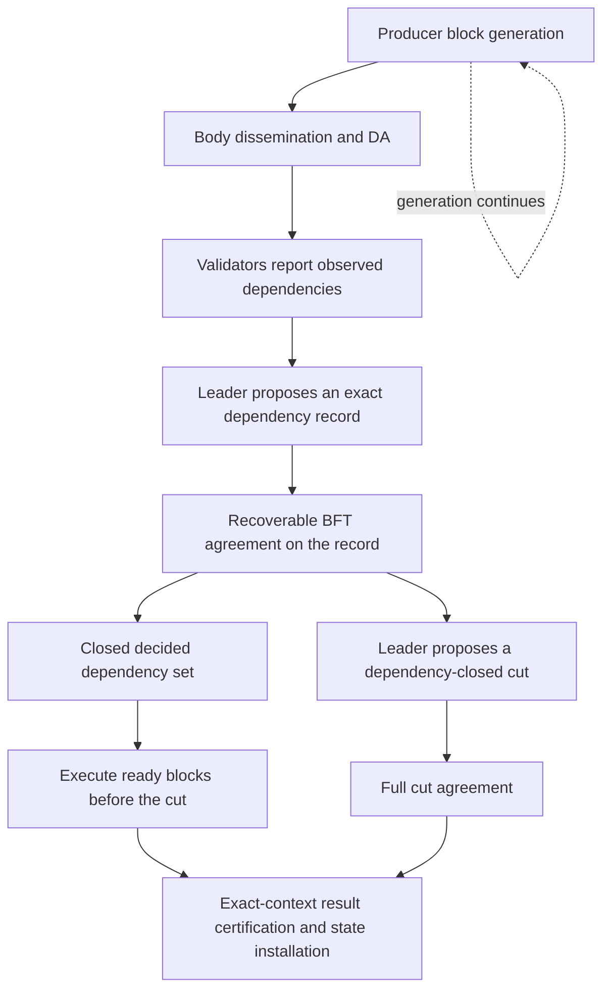

# Overpass research candidate: agreeing on dependencies before the cut

> **Later clarification on 2026-09-29:** the user requires continuous speculative
> execution, not waiting for closed dependency agreement before starting execution.
> Follow [the progressive-ordering exploration](overpass-progressive-ordering.md)
> for the latest candidate. This note retains the earlier alternative and its tests;
> its execution-gating recommendation is not the current proposal.

> 2026-09-29 · Exploratory protocol candidate, not an implemented or proven BFT protocol.
>
> This develops the user's proposal to vote on execution ordering before a cut.
> It does **not** replace [the 2026-09-28 implementation plan](overpass-fixed-cut-implementation-plan.md),
> edit the manuscript, or restore the old proof/PAC or state-owner design.
> The objective is ingress-to-state-finalization latency, not merely a smaller interval
> measured from a later, renamed ordering event.

## 1. Main proposal and the necessary change in meaning

**Agree on each block's dependencies before the global cut. Execute only a closed,
decided dependency set. Let the cut leader select a compatible, dependency-closed
set rather than reorder already executable blocks.**

Producers continue generating and disseminating blocks independently. Validators,
not abstract lanes, report the conflicts they observed and participate in agreement.
The cut leader assembles these reports; it is not entitled to override a decided
dependency record to maximize its preferred ordering or execution reuse.

This is a change to consensus semantics, not another producer-placement heuristic.
Some ordering decisions become irreversible before the global cut. Calling them
"hints" does not eliminate the need for agreement, recovery, and durable evidence.

Two earlier statements need qualification:

- Matching votes on `A before B` do not prohibit a later `C before A before B`.
- Quorum agreement on separate pairs does not ensure an acyclic global order.

The candidate therefore votes on **complete, evidence-backed dependency records**,
not independent majority decisions on pairwise edges or unverifiable execution histories.

## 2. Definitions and assumptions

- Fixed epoch with `n=5f+1` validators, at most `f` Byzantine; authenticated identities,
  eventual synchrony for progress, deterministic runtime, durable honest voting state.
- Nodes in the ordering graph are **whole producer blocks**, with transaction order
  inside each block unchanged. Producers are not state owners.
- Block identity includes epoch, producer, sequence, parent hash, and body digest.
- A body authenticates conservative declared accesses. Runtime enforces containment.
  Fee accounts, nonce/sequence state, duplicate suppression, ranges/absence reads,
  and other implicit accesses are included; unknown scope is conservatively conflicting.
- Start with ordinary read/write conflicts. Conditional aggregators are conflicting
  until their full semantic compatibility, including observable results, is justified.
- `Conflict(A,B)` holds when either block writes a key that the other reads or writes.
  Read/read alone is not conflicting. Block-level unions can exaggerate contention.
- Execution cannot read an as-yet-unknown cut number, leader-chosen timestamp, global
  position, or future runtime/placement decision and still claim unconditional reuse.
  Such context must already be fixed, deferred without changing execution semantics,
  or excluded from this first profile.

For the mathematical model, `D(B)` denotes dependencies of B: an edge **B -> A**
means A belongs to D(B). Diagrams showing execution order use **A -> B** instead.
Before resolving cycles, a dependency is an ordering constraint to reconcile, not a
promise that every directed edge inside a cycle will be respected as a strict order.

## 3. Proposed end-to-end flow



The two agreement responsibilities are explicit. Their messages might be pipelined
or batched, but they are not automatically a single communication round.
Neither DA acknowledgement nor ordering votes wait for application execution.

### 3.1 Report collection

For an eligible block B, each validator atomically records its first report:

```text
Report_v(B) = {
  protocol/epoch, block identity, access-schema version,
  authenticated history/checkpoint context,
  known conflicting block references,
  mandatory producer predecessors
}
```

An honest node serializes this operation with its seen-block index: if it reports
both conflicting A and B, the later report includes the earlier block, directly
or through a proved lossless representation. The report is durably stored before
acknowledgement. Resending it after a coordinator change must not silently recompute
it from an empty or different local history.

The conservative research profile requires DA-eligible, uniquely identified blocks
and recoverable access metadata before their reports become binding. Raw-body
preparation can overlap DA, but an uncertified fork must not become a permanent
dependency. Exact rules for provisional reports are not specified here.

Reports reference existing authenticated blocks, not arbitrary nonexistent hashes.
Claimed access conflicts can be checked against authenticated declarations. This
limits fabricated dependencies but does not eliminate over-declaration or hot-key DoS.

### 3.2 One immutable record per block

For the initial `5f+1` profile, collect reports from `q_report=4f+1` distinct validators.
The recommended candidate retains each dependency reported by **at least f+1** of
those reporters, plus mandatory producer ancestry. Section 4 derives why this still
covers every conflicting pair while excluding edges invented solely by f Byzantine
reporters. A full-union version is retained as a conservative comparison.
The complete signed report transcript, or an available authenticated representation,
accompanies the proposal so every validator can recompute the supported set.

Different collectors may initially have different valid report transcripts. A
separate recoverable BFT agreement instance chooses **one exact record** for B.
"The first valid record I received" is not agreement. A hash does not make different
records equivalent. The leader cannot remove a qualifying dependency to shorten execution.

`AgreeDependencies(B, transcript, D)` requires uniform agreement, valid-input selection,
durable recovery, and eventual termination. Section 10 now gives a source-backed
reference for its accept/recovery rules and a limited executable recovery model.
The complete network protocol and its composition are still not implemented or
proved. A numeric threshold or a same-view vote collector is insufficient.

### 3.3 Execution readiness

After D(B) is decided, obtain decided records for its transitive dependencies.
If any required block/record is absent or undecided, wait on that dependency while
unrelated closed groups can proceed. Never treat an absent record as an empty set.

Mutual dependencies are resolved as a strongly connected component (SCC). Once its
entire dependency closure is decided, execute prior SCCs first and use one common
deterministic block order inside the SCC. The production rule must preserve mandatory
same-producer sequence order, e.g. a common `(producer_id, numeric_height, digest)`
tie-break inside an SCC. Ordinary dependency edges within an SCC are reconciled by
this order; mandatory producer ancestry must never be contradicted.

An SCC is not a new execution lane. It is a finite scheduling group. The important
event is **closed and decided**, not merely "enough replicas liked this ordering".
Scheduler execution of a ready group can be conservative/sequential first; STM retries
inside a group are a separate backend concern, not removed by this consensus property.

### 3.4 Cut selection and reuse

The cut leader selects certified blocks while enforcing:

1. The previous canonical input is retained.
2. Each selected block has an immutable decided dependency record and valid DA evidence.
3. All required dependencies are selected or already canonical.
4. Producer ancestry is prefix-closed; an SCC is not cut in half.
5. Deterministic linearization preserves the decided SCC ordering.

The existing deterministic zip **cannot override** these constraints. This is a new
ordering semantics, not just attaching dependency metadata to an unchanged zip.
Dependency closure may force additional tips; if closure exceeds the cut budget,
defer the entire affected group, not an arbitrary subset of it.

A pre-executed block omitted from this cut is not automatically invalidated: retain
its result for a later compatible cut. To compute the current cut's state, materialize
only selected effects from the authenticated parent using versioned state/deltas;
do not publish an aggregate root containing excluded blocks. Even independent
execution reuse still incurs commitment construction, delta application, and storage.

Only the exact full cut, parent, runtime and selected output can receive the existing
`f+1` direct-execution result certification. Dependency votes are **not** those result
signatures. Irreversible external effects remain gated by state-finalization policy.

## 4. Why late blocks need not invalidate completed execution

This is a **conditional argument**, not a proof of the unimplemented consensus layer.

Assume:

1. Each decided block has one immutable dependency set, across all views and recovery.
2. Every conflicting pair of decided blocks has a dependency in at least one direction.
3. Execution starts only on a decided, transitive dependency-closed set E, with a
   common SCC ordering and complete enforced access semantics.
4. Cut selection preserves closure, that ordering, and the authenticated application context.

For a later block C conflicting with already executed B in E:

- If C were in B's dependency closure, B could not already have been ready without C.
- Since B's decided record cannot gain a new dependency, a genuinely new C cannot
  become a new prerequisite of B.
- Conflict coverage therefore requires the later block to follow the old closed
  execution through its dependency relation. It cannot create a new SCC containing
  E, because such an SCC would require a path from E to the new block.

Thus late arrivals do not change the conflicting input history of E. Independent
blocks can appear elsewhere in a canonical linearization without requiring application
re-execution, provided full observable semantics commute. This does not imply the
same whole-state root for different selected sets or the same physical schedule.

### Where conflict coverage comes from

Let R_A and R_B be report sets of size q. If `2q-n>f`, their intersection includes an
honest reporter. That reporter observed one block first and included it in the other
block's report. Preserving the full union preserves at least one dependency direction.

For `n=5f+1`:

- `q=3f+1`: intersection at least `f+1`, with at least one honest reporter.
- `q=4f+1`: intersection at least `3f+1`, with at least `2f+1` honest reporters.

With q=4f+1, at least 2f+1 honest reporters belong to both sets. Each contributes
one of the two possible dependency directions, so by the pigeonhole principle at
least f+1 of them contribute the same direction. Therefore filtering at **f+1**
preserves at least one direction. Conversely, f Byzantine reporters alone cannot
create an edge meeting this threshold. Both directions may remain; resolve their
SCC before execution rather than arbitrarily discarding an edge.

More generally, for this *particular report-count filter*, let
`H=2q-n-f` be the guaranteed number of honest overlapping reporters and t the support
threshold. Coverage follows if `2(t-1)<H`; excluding Byzantine-only edges needs `t>f`.
For n=5f+1 and t=f+1, these sufficient conditions require q>=4f+1. This is a bound
for this counting argument, **not a universal lower bound for BFT consensus**.

These facts do not prove uniform agreement, recovery, unbounded liveness, or an
early-execution certificate. DA, the selected report transcript's agreement proof,
per-edge support, and f+1 execution-result signatures have distinct subjects.

## 5. Examples and attacks

### A. Late conflicting block

Blocks A and B on different producers access x; B depends on A. Their records and
closure decide, so execute A then B. A later C touching x picks up a dependency on
the old closed execution. It cannot be inserted before A by choosing a smaller rank.
No late-insertion application retry is needed for A or B under Section 4's conditions.

### B. Missing predecessor

B has a decided dependency on A but A's body or dependency record is missing.
B waits; independent C may execute. DA holders supply bytes, and the dependency
agreement's recovery path must finish A even if its original proposer has stopped.
This is selective waiting, not globally wait-free execution.

### C. Opposite local orders

Some reports imply A depends on B and others B depends on A. If both pass the support
predicate, keep both rather than selecting an arbitrary winner. Decide both records,
close their SCC, then use the common internal order. No execution has to be undone
if it had not started early.

### D. Pairwise majority cycle

Local orders `ABC`, `BCA`, `CAB` produce majority preferences `A<B`, `B<C`, `C<A`.
Increasing the committee alone does not make independently voted edges acyclic.
This example is about majority synthesis, not a claim that it already meets a BFT
certificate threshold. Graph-wide closure/SCC semantics are needed.

### E. Filtering edges by number of supporters loses safety

For n=6,f=1, node 0 is Byzantine and reports no conflicts. Honest 1,2,3 observe A
before B; honest 4,5 observe B before A. Choose report sets:

```text
R_A = {0,1,2,3,4}: one report says A depends on B
R_B = {0,2,3,4,5}: two reports say B depends on A
```

Both sets have 4f+1 reports. A naive rule requiring 2f+1=3 supporters per dependency
drops **both** edges. The union rule keeps both; the proposed f+1=2 filter retains
the B-depends-on-A direction. With only 3f+1 reports, the same f+1 filter is unsafe:
R_A={0,1,2,3}, R_B={0,3,4,5} yield support counts 0 and 1 in this example.
This is not a criticism of ISOS's different fast-path predicate, which has proposal
binding and reconciliation rules.

### F. Leader equivocation, incomplete votes, recovery

Permanent first-vote locks alone can deadlock: with n=6,f=1, split the five honest
voters 3/2 between incompatible proposals while the Byzantine voter stays silent.
Neither reaches 4 or 5 votes. Conversely, blindly discarding old votes on timeout
can conflict with an old certificate assembled or delivered late.

The dependency agreement must specify locks, prepared/committed evidence, new-view
selection, and what happens to unresolved records. A decided record cannot be replaced
with an empty dependency set or no-op. Old certificates can be reconstructed from
durable votes; trusting only a new leader's statement is insufficient.

### G. Hidden state and cut-context dependencies

Omitted fee/nonce/dedup keys or runtime access outside declarations defeat the graph.
Unconditional containment checks are required. A transaction-level rejection caused
by an application predicate is not automatically a consensus retry. Conditional
operations must preserve success/failure results, not only a final numeric sum.

### H. Dependency-chain denial of service

An adversary can connect hot blocks into a large SCC or an indefinitely extending
chain. "Each block eventually decides" alone does not imply its closure eventually
becomes finite and executable. Bounded windows/checkpoint barriers and progress rules
are an essential unresolved part, not an optional performance enhancement.

Do not delete a decided edge on a local timeout or local queue limit. Any bounding
rule must be common, recoverable, preserve prior executions, and include a liveness
argument. Its cost may reintroduce a barrier. The current finite model does not solve it.

## 6. Literature and what is actually new here

- **Generalized Consensus / Paxos** provides the distinction between total ordering
  and agreement modulo commuting commands. It is a conceptual foundation, not a BFT
  implementation for our block/cut composition. [Lamport, Microsoft Research](https://www.microsoft.com/en-us/research/publication/generalized-consensus-and-paxos/)
- **ISOS, Egalitarian Byzantine Fault Tolerance, PRDC 2021** is the closest reference:
  it agrees on conflicting-request dependencies in a Byzantine setting, reconciles
  disagreements, executes closed SCCs, and explicitly treats dependency-chain progress
  and checkpoints. Its original configuration is 3f+1; its full recovery rules cannot
  be replaced by a threshold substitution. [Author paper, §§IV-B–G](https://www4.cs.fau.de/Publications/2021/eischer_21_prdc.pdf)
- **CAESAR, DSN 2017** illustrates timestamp agreement plus waiting/retry rules rather
  than requiring all replicas to initially report identical dependencies. It is a
  crash-fault reference, not our Byzantine safety argument. [Author paper](https://www.ssrg.ece.vt.edu/papers/2017_dsn.pdf)
- **Autobahn, SOSP 2024** supplies the independently disseminated producer-chain and
  cut architecture being changed, not a theorem for the new dependency layer.
  [Author paper](https://www.cs.cornell.edu/lorenzo/papers/Suri24Autobahn.pdf)

The research opportunity is **block-granularity dependency agreement integrated with
parallel dissemination and compatible cut selection**, including reuse, recovery,
bounded metadata, and measured end-to-end latency. Voting on dependencies, SCC
execution, or starting execution before a checkpoint is not by itself new.

If dependency agreement already provides irrevocable membership, execution order,
and availability for a block, much of its ordering finality has moved before the cut.
The paper must explain what the later global cut still decides: a common snapshot,
exported input boundary, or application admission policy. If it merely repeats an
already-decided total sequence, the extra global agreement may be redundant.

## 7. Pseudocode and implementation research gates

This is a protocol-level interface sketch, **not Commonware implementation**.

```text
on eligible_block(B):
    validate identity, DA eligibility, authenticated declared accesses
    atomically persist first dependency report and update seen-block index
    send report; do not await application execution

on enough_valid_reports(B):
    require n=5f+1 and at least 4f+1 distinct valid reports
    D = dependencies_with_at_least_f_plus_one_support(reports)
        + mandatory_producer_ancestry
    AgreeDependencies.propose(B, exact_report_transcript, D)
    # Full recoverable BFT agreement is required, not just counting these reports.

on dependency_record_decided(B, D, evidence):
    durably install immutable decision; fetch missing referenced records/bodies
    groups = closed_decided_SCCs_with_dependencies_ready()
    execute groups in common dependency order; retain per-cut-reusable effects
    # Infinite/oversized closure: needs a proved common bounding/recovery rule.

on leader_builds_cut(previous):
    select decided blocks under cut budget
    close selection over dependencies, producer ancestry, and whole SCCs
    propose exact selection + deterministic compatible order + prior cut

on cut_finalized(C):
    verify full finality and compatible closed selection
    materialize selected cached effects against authenticated parent
    certify exact selected result; publish only after all finalization conditions
```

Concrete gates before a protocol implementation claim:

1. Specify the dependency-agreement fast path, fallback and new-view rules, with
   cross-view invariants and durable restart behavior; no threshold-only shortcut.
2. Define a bounded dependency-admission/execution policy that cannot invalidate
   completed work and prove progress with one stopped/Byzantine producer.
3. Specify cross-cut checkpoint retention, consumed IDs, state projection and
   application context so reused computations match canonical outputs.
4. Implement fault-scheduled network/model checking for equivocation, delayed old
   certificates, crashes, withholding and concurrent cycles. The current graph model
   does not count as that verification.
5. Only then connect the candidate to the Commonware fork and measure the extra
   agreement traffic against execution work saved.

## 8. Executed finite checks and their scope

[Model](research/precut_order/model.py) and [tests](research/precut_order/test_model.py):

```sh
python3 -m unittest discover -s research/precut_order -v
```

Initial graph checks: **13 test methods passed**. Readiness/cut and support-filter rules were first
tested against empty stubs and failed, then implemented and rerun.

- 4,096 finite graph/commit-set/late-node cases: 64 directed three-node graphs,
  eight committed subsets, eight dependency choices for a new fourth node. Old
  dependency records stay immutable. The scheduler executes exactly the closed
  eligible portion and never reschedules its executed nodes.
- 8,352 report-union cases for n=6,f=1: all 32 honest pair-arrival patterns and all
  pairs of size-4/size-5 report sets. A silent Byzantine reporter cannot erase both
  directions when full unions are preserved.
- 1,549,952 support-count cases across n=6,f=1 and n=11,f=2: every honest pair-arrival
  pattern and every pair of n-f report sets retains a direction at support f+1.
  Byzantine omissions are modeled; adding Byzantine reports cannot reduce support.
  This enumerates the arithmetic lemma, not the network protocol.
- The actual support-filter function retains supported edges and mandatory ancestry,
  excludes a Byzantine-only singleton, and rejects insufficient/nonmember reports.
- Explicit negative examples: relative-order-only insertion, majority cycle,
  excessive per-edge filtering, and split permanent locks without recovery.
- Missing/undecided dependencies, independent progress, closed cycles, split-SCC
  cut rejection, prior-cut preservation, and executed-set consistency.

These tests assume decided records are authentic, unique and immutable. They do
not implement BFT decisions, producer-chain validation, state deltas, real signatures,
network recovery, E2E execution latency, or infinite-history liveness. Alphabetical
node labels stand in for a shared SCC tie-break; no production ranking is implemented.

The subsequent recovery/liveness audit adds eight methods, for **21 passing tests**
in the combined suite: six accept/recovery scenarios in
[test_recovery.py](research/precut_order/test_recovery.py), plus two graph counterexamples.
The latter exhibit an extending undecided dependency chain and an SCC larger than
the maximum cut size. The recovery model assumes message authenticity, an authorized
leader/view, validated record values, and preserved replica state. It does not simulate
elections, disks, retransmission or all asynchronous executions.

## 9. How to evaluate whether this is worth doing

Keep placement disabled in the initial comparison. Compare:

1. Fixed-cut consensus + post-cut execution.
2. Fixed-cut consensus + arrival-based speculative execution/revalidation.
3. Proposed pre-cut dependency agreement + closed-group execution + compatible cuts.
4. If feasible, fine-grained ordinary ordered batching before a periodic checkpoint,
   to test whether benefits come merely from deciding smaller batches earlier.

Use identical workloads, declared accesses, committee, execution backend, hardware,
bandwidth and final user-visible completion criteria. Include DA and both agreement
paths in the cost. Record:

- Ingress-to-certified-state and ingress-to-read-ready p50/p95/p99, throughput,
  uncompleted backlog and inclusion fairness.
- Time of the **earliest irreversible ordering decision**, dependency-ready time,
  global cut time, execution finish, result certification and state publication.
- Application work invalidated by late blocks, validation overhead, dependency wait,
  SCC size, missing-data wait, vote/signature bytes and cut-closure expansion.
- Low/high conflict, heterogeneous block sizes, delayed predecessors, RTT, one slow
  producer, and Byzantine dependency inflation/withholding.

The candidate wins only if saved execution/revalidation work and useful overlap
outweigh dependency agreement, closure waiting, and extra metadata. A smaller
cut-to-state gap obtained solely by moving ordering work before the named cut is
not an end-to-end latency improvement. Zero late-insertion retries is a conditional
property, not a claim of zero application failures, zero STM retries, or wait freedom.

## 10. Recovery refinement: an existing agreement core, not permanent locks

A reference is the **unparameterized FaB Paxos** accept/recovery mechanism, with the
whole dependency record as its value. This is not the parameterized fast/slow-path
variant. Its normal path accepts one value per view; `4f+1` matching accepts identify
a decision. Recovery collects exactly `4f+1` state replies bound to the new view.
If `2f+1` replies report the same previously accepted value, preserve it; otherwise
the leader may propose a valid value. Replicas fence older views and do not accept
two different values in one view. These rules are a reference, not our novelty.
[Martin and Alvisi, Fast Byzantine Consensus, §IV-C](https://www.cs.utexas.edu/~lorenzo/papers/Martin06Fast.pdf)

The selected certificate must carry complete, retrievable record bytes and reports.
Replica state and first dependency reports must survive restart. Authentication,
leader election, external record validity, epoch changes and fair retransmission
remain composition obligations. A local timer requests recovery, not permission to
forget a vote or rewrite a decided record.

[recovery.py](research/precut_order/recovery.py) exercises the accept/recovery gates
under those assumptions. Distinct tests cover a hidden old five-vote decision,
every size-five recovery set in that fixture, split first-view votes, two successive
recoveries, same-view equivocation, stale-view votes, certificate replay across views
or instances, duplicate/nonmember senders, and a Byzantine-only invalid value.
This is evidence for the gate implementation, not a proof of the complete protocol.

### Why hidden decisions constrain the next leader

If an old exact record obtained 4f+1 accepts, at least 3f+1 honest acceptors accepted it.
A new set of 4f+1 replies excludes at most f identities, so at least 2f+1 of these
honest acceptors must be represented. Their remembered value prevents a new leader
from discarding the old decision just because its assembled certificate is hidden.
Across multiple views, this argument requires the recovery invariant to be preserved
inductively; unrelated raw votes from different views are not a decision certificate.

The evidence thresholds have different purposes:

| Evidence | Reference threshold | Meaning |
|---|---:|---|
| Dependency reports for one block | 4f+1 | Input transcript for a candidate record |
| Support for one relation inside that transcript | f+1 | Keep conflict coverage; filter Byzantine-only relations |
| Matching accepts for the exact record in one view | 4f+1 | Dependency agreement's normal decision evidence |
| Recovery replies / forced-value count | 4f+1 / 2f+1 | Preserve possible prior decisions across a leader change |

These are separate messages/subjects even if implementations piggyback them.
Neither the report quorum nor per-edge support alone permits no-retry execution.

## 11. Remaining decisive issue: finite execution closure

The new counterexamples sharpen the remaining research task:

1. Every block in an increasing chain may eventually decide while the oldest block
   always depends on one more undecided successor. Decision liveness alone is not
   execution liveness. The finite model reproduces the blocked prefixes, not an
   infinite network execution.
2. A three-block SCC cannot fit in a cut capped at two blocks if cuts must include
   whole SCCs. Repeated empty cuts do not solve state-finalization liveness.
3. A local depth limit that ignores edges violates the current closure contract.
   ISOS's bounded-window machinery depends on its compact dependency and checkpoint
   semantics; importing only the "ignore outside the window" step is unsafe here.
4. A global sealed input window would bound the graph, but introduces coordination
   and possible head-of-line waiting. It is a comparison/fallback direction, not a
   silent substitute for the user's continuously progressing producer design.

The next protocol decision must therefore specify how to bound dependency growth
**before binding records**, or replace raw closure with a proved execution/checkpoint
rule that remains compatible with cuts. Until then, the candidate has a meaningful
conditional no-late-insertion argument and a recovery reference, but not a complete
non-blocking consensus design. Do not implement it as a drop-in Multimmit replacement.

### A blocked chain realizable through actual reports

This is not only an arbitrary graph counterexample. For n=6, f=1, collect five
reports: one Byzantine report and four honest reports. All example blocks conflict.
The honest first-observation orders are:

```text
honest 1: 1, 0, 3, 2, 5, 4, ...
honest 2: 0, 2, 1, 4, 3, 6, 5, ...
honest 3: 0, 1, 2, 3, 4, 5, ...
honest 4: 0, 1, 2, 3, 4, 5, ...
```

For block i, the Byzantine reporter names the existing block i+1. Honest reporter
1 supplies the same dependency for even i; honest reporter 2 does so for odd i.
Every i therefore retains dependency i+1 at support f+1=2. Other retained edges
do not remove this chain. These observation orders can preserve two producer chains:
one contains the even blocks and the other the odd blocks, each increasing locally.

The executable test constructs these reports for increasing finite lengths and
passes them through the actual support filter. Already decided records remain
unchanged. Each prefix waits for a further undecided record, so block 0 cannot execute
under the raw transitive-closure rule. This establishes arbitrarily long finite
blocked prefixes, not a full infinite execution under a specified network scheduler.
The f+1 filter prevents Byzantine-only edges, but not this amplification of differing
honest arrival orders.

## 12. Bounded ordering batches: a simpler comparison candidate

An explicit alternative is to agree on **finite append-only batches of whole blocks
before a global cut**. This replaces, rather than silently patches, the unbounded
per-block dependency-record design. It keeps producer generation/dissemination
continuous, but introduces an earlier ordering barrier for execution.

For each batch, the leader proposes the exact block list, execution order, previous
batch digest, and execution-context version. Reports are scheduling inputs; a
complete recoverable BFT instance, not a pairwise vote count, fixes the batch.
Validation requires DA-eligible unique block identities, producer-prefix continuity,
resource limits, and compatibility with all earlier batches. It does not require
waiting for every producer to generate a new block. Missing producer predecessors
exclude that producer's later block until recovered.

The order within a batch is a deterministic topological order of a finite DAG, or
simply a proposed total block order validated against producer ancestry. Conflicting
blocks in a later batch follow conflicting blocks in earlier batches. Independent
blocks can execute concurrently; the declared-access/runtime assumptions of section
2 still apply. Raw conflicting arrival reports are not immutable prerequisite edges
in this alternative: disagreement is resolved by the batch decision before execution.

```text
receive and disseminate blocks continuously
leader selects a finite eligible set, extending the agreed batch chain
validators check the exact proposal and run full BFT agreement/recovery
on a decided batch:
    fetch missing bodies
    execute blocks whose conflicting earlier work has finished
    retain versioned outputs for the agreed context
late blocks remain eligible for a later batch; never insert them in a decided batch
global cut selects a monotone prefix of whole decided batches
certify/apply only outputs matching that cut, parent, and runtime
```

The cut must not independently re-zip this order or omit a batch while retaining
its descendants. This changes the original independent lane-tip selection semantics.
Whether periodic cut consensus is still useful, rather than a checkpoint/reporting
mechanism over an already finalized batch chain, is an explicit architectural question.

### What this alternative does and does not establish

- **Late-insertion protection:** if an executed block is in a decided batch, later
  batches cannot introduce an earlier conflicting block. This follows from immutable
  batch order, not from a claim that all voters already executed the block.
- **Finite scheduling input:** a batch cannot acquire an unlimited sequence of new
  dependencies after agreement. All internal edges follow an acyclic agreed order.
- **Remaining waits:** prior conflicting work, missing data, an ongoing BFT recovery,
  and the canonical parent may still delay execution. This is not wait freedom.
- **Remaining costs:** batch agreement may replace saved retries with coordination
  latency; whole-batch cuts may delay independent ready blocks. Generation continues,
  but it is incorrect to say no protocol stage can block.
- **Conditional progress:** requires fair inclusion, recoverable DA, a live BFT core,
  bounded terminating execution, and an eventual checkpoint policy. Oversize blocks
  must be rejected or accommodated by an explicit rule, not deferred forever.

This supplies a simpler baseline and a defensible no-late-insertion property, not
a new optimality result. Compare it experimentally with the dependency-voting
candidate before selecting the research direction. Generalized consensus motivates
preserving only noncommuting order constraints, while ISOS is the closer Byzantine
dependency-agreement reference; neither alone proves this composition.
[Generalized Consensus and Paxos](https://www.microsoft.com/en-us/research/publication/generalized-consensus-and-paxos/)
[ISOS](https://www4.cs.fau.de/Publications/2021/eischer_21_prdc.pdf)

The 21 existing tests cover the per-block candidate and its recovery/closure checks.
They do **not** implement or validate this batch alternative.
