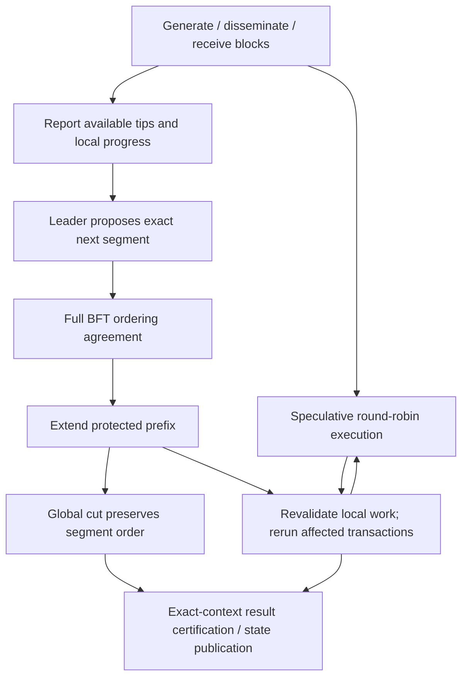

# Overpass research candidate: continuous execution and progressive ordering

> **Earlier exploration — 2026-09-29:** See the [current research outline](overpass-plan-ordering-outline.md). The current direction uses advisory execution-aware planning with Hermes, not the binding-plan/closure protocol below. Toy results do not establish Hermes integration, safety or performance.

> 2026-09-29. Research design, not an implemented or fully proved BFT protocol.
> This incorporates the user's clarification: **execution never waits for pre-cut
> ordering agreement; mismatching work is validated and, where necessary, rerun.**
> It supersedes the execution-gating recommendation in
> [the earlier dependency-agreement exploration](overpass-precut-order-research.md),
> not the current Commonware fork or manuscript. No production code is changed.

## 1. Goal and contribution hypothesis

Continue executing blocks as they arrive. Use small, successive ordering agreements
to protect more of that work from future late insertion. Preserve relative-height
round-robin **within each newly agreed segment** and same-producer sequence order.
The global cut cannot subsequently re-zip or reorder protected segments.

This is not a promise of zero retries. A replica that speculated on a different
order must reconcile when an agreement arrives. The expected benefit is a smaller
remaining region in which late arrivals can invalidate already performed work.
The target remains ingress-to-certified-state/read-ready latency, with cut-to-state
latency as a component metric, not a result improved by merely renaming ordering events.

The research claim to test is:

> Progressive, round-robin-preserving ordering agreement can reduce repeated
> speculative-work invalidation in multi-producer dissemination, without making
> application execution a prerequisite for block production or ordering votes.

An earlier irreversible ordering step is itself consensus. It cannot be described
as free scheduling metadata, nor claimed novel merely because it precedes a cut.

## 2. What HotStuff-related evidence actually establishes

| Primary source | Relevant mechanism | Use here |
|---|---|---|
| [HotStuff, §§4–5](https://arxiv.org/pdf/1803.05069) | Timeout-driven view change preserves safe proposals through QC/lock rules. | A local timeout is not proof of block nonexistence or permission to rewrite history. |
| [MonadBFT v4, §§2.3, 3.4](https://arxiv.org/html/2502.20692v4) | NEC uses `2f+1` non-endorsements in `n=3f+1`, with recovery/view advancement. | Evidence concerns prior voting, not universal non-receipt. Remark 1 explicitly permits recovering a block while an NEC exists. |
| [No-Commit Proofs / Wendy, §IV](https://nacrooks.github.io/bibliography/publications/2021-nocommit.pdf) | Compact evidence that a particular locked command did not commit. | A reference for safe recovery, not a generic proof that a producer never broadcast a block. |

Version caution: [MonadBFT v1, §5.2](https://arxiv.org/html/2502.20692v1)
uses `f+1` NEC signatures after a different chunk-recovery procedure. Do not combine
that threshold with v4's simpler non-endorsement rule. These are source-versioned
mechanisms, not interchangeable thresholds for our `n=5f+1` profile.

For this candidate, distinguish three statements:

1. **Observation:** "I have not received this block as of my report." It can become
   stale immediately and is only a local, signed assertion.
2. **Voting/recovery fact:** "I did not vote for this exact proposal in the specified
   view, and have advanced so I cannot vote in that old view later." This may help
   rule out a certificate under a proved intersection and recovery rule.
3. **Ordering decision:** "This segment contains these blocks; later blocks cannot
   be inserted ahead of it." Full ordering agreement establishes this fact.

Only (3) directly gives the desired protection. Neither (1) nor an unrelated DA
certificate substitutes for it. An already decided segment is never erased by (1)
or by a timeout. NEC-style recovery is potentially useful for abandoned *ordering
proposals*, but it is not required as a per-producer negative proof on every segment.

## 3. Precise ordering rule

Let `P_j` be the exact protected block sequence after segment j. Let `b_i` be the
last producer-i height included in `P_j`, and `t_i >= b_i` its proposed next boundary.
Each selected producer range must be an authenticated contiguous extension of its
previous boundary, with the required DA evidence. If nothing from i is selected,
`t_i = b_i`: this is deferral, not consumption of a missing producer height.

For the next segment, sort newly selected blocks by:

```text
(height(block) - b_producer(block), fixed_lane_priority(producer(block)))
```

Then:

```text
P_(j+1) = P_j || RoundRobin(selected producer ranges relative to b)
```

This resets relative height at the preceding **agreed segment**, not only at the
last global cut. Priority is fixed in the first profile; future rotations must be
bound by already agreed configuration, not chosen by a node's local clock.

Example:

```text
Last protected boundaries: A0 B0 C0
Available proposal:       A0 B1 C1
Agreed segment 1:          [B1 C1]

A1 arrives, B2/C2 are available:
New boundaries:           A1 B2 C2
Agreed segment 2:          [A1 B2 C2]

Protected order:          [B1 C1] [A1 B2 C2]
NOT a fresh global zip:   [A1 B1 C1 B2 C2]
```

Block identities retain producer height and digest. Deferring A1 neither deletes
it nor permits A2 before A1. B1's DA certification does not, by itself, allocate
an immutable global position; only the ordering agreement does.

## 4. Two concurrent activities, not execution gated by agreement



There is deliberately no edge from A to the *start* of E.

### Local execution

Each replica maintains an immutable agreed prefix and a replaceable speculative
suffix. Bodies may be fetched and executed before or during ordering agreement.
When new data changes the unprotected suffix, the runtime validates cached inputs
and re-executes only invalidated work and its dependent consequences.

Use conservative, runtime-enforced access declarations. Include implicit state such
as fees, nonce/dedup, range/absence reads and environment inputs. Independent reorder
can reuse computation only when all relevant observable semantics permit it.
Same final aggregate balances alone do not prove that per-transaction results match.

Speculative results are not canonical writes or irreversible external effects.
Keep versioned effects so a global cut can select the correct prefix even when
local speculative execution has progressed beyond it.

### Ordering reports and leader choice

Reports bind epoch, segment parent, sender, available authenticated producer tips
and optionally a bounded execution-progress summary. They are scheduling inputs,
not immutable promises to enforce every local order and not execution certificates.
The first profile does not require or expose full local DAGs on the wire.

The leader chooses a finite set of eligible producer prefixes, derives the order by
the common rule, and proposes the **exact** boundaries, parent digest, ordering-rule
version and ordered-block commitment. Voters validate this fixed proposal. Different
valid reports may lead to different candidate sets; full BFT agreement selects one.
This is not native Multimmit's extraction of a final tip vector from differing votes.

Do not require execution completion, a state root, a body-missing report from every
producer, or every producer's newest block before casting an ordering vote. The voter
must still have the authenticated metadata needed to validate the proposed segment
and its DA/ancestry evidence. A bare unauthenticated hash is insufficient.

A leader may prefer a set that reuses more reported work, but dishonest progress
claims can bias that optimization. They cannot authorize an invalid segment. For a
first experiment, use a simple bounded fair selection policy before introducing a
Byzantine-sensitive execution-reuse scoring function.

### Exact agreement and recovery

Keep the proposed `n=5f+1` committee and the intended `4f+1` voting profile, but require
the **complete** commit and leader-change mechanism of the chosen BFT core. One
collection of 4f+1 arbitrary votes is not defined here as unconditional finality.
Neither a timeout nor non-endorsement resets a committed parent or safe recovery lock.

All segment decisions must extend a common recoverable ordering history. A separate
best-effort sidecar must not independently "finalize" ordering that the cut engine
can ignore. For a minimal reference, use one BFT metadata log for segment decisions
and cut/checkpoint references. Proposals may pipeline, but only fully decided ancestry
is called protected. Alternative integration requires a composition proof.

### Global cut

The initial design permits a cut to publish a monotone prefix of complete agreed
segments. The cut carries their authenticated ordering history and cannot re-sort it.
Execution-result certification still binds the exact input sequence, canonical parent,
runtime and output. An f+1 direct-execution certificate remains a separate conditional
mechanism after ordering finality, not a replacement for ordering phases.

This exposes an architectural consequence: block ordering has already finalized
at segment decisions. The later cut is a checkpoint/publication boundary, not the
first irreversible ordering event. If it performs no independent task, an extra
cut-consensus instance may be redundant. Report this explicitly in experiments.

## 5. Missing-block handling and NEC applicability

| Situation | Action | What must not happen |
|---|---|---|
| A1 is not selected in the next segment | Leave A's boundary unchanged; select eligible B/C ranges. | Claim A1 does not exist or discard A1 permanently. |
| A1 arrives during voting | Execute/revalidate speculatively; leave the exact proposal unchanged, or replace it only through the consensus protocol. | Voters sign different interpretations of one proposal digest. |
| A1 arrives after `[B1 C1]` is decided | Put A1 in a later segment. | Insert it ahead of B1 and call the old decision preserved. |
| A1 was already selected and ordered, but its body is locally absent | Recover from authenticated DA holders; continue unrelated work where possible. | Use timeout to remove A1 from the decided order. |
| An earlier ordering proposal may have acquired a hidden certificate | Carry out the BFT core's recovery procedure. | Treat "I did not see its QC" as proof that no QC exists. |
| A producer never makes its next block | Other eligible producers remain selectable. | Require proof of universal nonexistence before letting them advance. |

The recommended first design **does not add a negative-certificate round for every
missing producer**. Deferring a not-yet-ordered block is a placement-in-time decision,
not a claim that its DA certificate could never exist. Existing prior ordering locks
must be preserved by recovery, independently of which blocks are locally available.

Optional signed missing-data reports can help holders trigger retransmission. They
must not become an admission gate or an absence oracle. Recovery traffic is bounded
and runs concurrently with execution; ordering recovery can still require waiting.

## 6. Why f+1 plain negative reports cannot simply be imported

This is our counting argument, not a theorem imported from HotStuff.
Suppose a positive certificate requires q identities and a negative one r identities
among n, with at most f Byzantine. For mutually exclusive statements bound to the
**same proposal, epoch, view and signing rule**, a sufficient intersection condition is:

```text
q + r - n > f
```

Otherwise the two certificates may intersect only in Byzantine signers. In n=6,f=1:

```text
positive voters: 0 1 2 3 4     (4f+1 = 5)
negative voters: 0         5   ( f+1 = 2)
Byzantine:       0
```

Both sets can exist without an honest contradiction. Therefore f+1 direct
non-endorsements do not rule out a 4f+1 certificate.

| Committee / positive threshold | Minimum negative count from this argument |
|---|---:|
| n=3f+1, q=2f+1 | 2f+1 |
| n=5f+1, q=4f+1 | 2f+1 |
| n=5f+1, q=3f+1 (e.g. a distinct DA subject) | 3f+1 |

These counts alone are not complete certificate designs. Honest signers must report
prior votes truthfully, persist them, and be fenced from later issuing contradictory
old-view votes. Non-receipt at time t and receipt/voting at time t+1 are not mutually
exclusive. Comparing those statements does not establish the premise of this lemma.
DA custody, proposal endorsement and application execution are different subjects.

## 7. Safety and progress obligations

1. **Prefix persistence:** full BFT agreement plus parent binding ensures that later
   decisions cannot replace an agreed segment, including after leader changes.
2. **Producer continuity:** every segment includes contiguous ranges and no duplicate
   block identity; a deferred producer resumes at its actual next height.
3. **Deterministic ordering:** exact boundaries, rule version and priority determine
   the same sequence for every replica; arrival time is not a canonical comparator.
4. **Safe reuse:** align execution to the protected prefix and validate exact inputs.
   Later appended segments then cannot create earlier conflicting predecessors.
5. **No implied readiness:** agreeing on a segment neither means every signer has its
   body nor that every signer has executed it. State publication still requires the
   correct parent, data, execution outputs and verification.
6. **Progress assumptions:** a live BFT core after eventual synchrony, retrievable DA,
   terminating bounded application work, fair inclusion and adequate processing
   capacity. These assumptions are not established by the scheduling model.

Non-blocking means production/dissemination and speculative execution do not wait
for segment agreement or global cuts as a protocol prerequisite. It does **not**
mean wait-free finalization, infinite memory, or immunity to missing dependencies.
If speculation outruns resources, discard/cap speculative caches before interfering
with consensus. An explicit resource policy is needed for an implementation.

The leader-selection policy also needs starvation resistance. A starting policy is
to consider each eligible producer's oldest unselected block before allocating more
capacity to one producer, with a deterministic rotating tie-break under tight limits.
Omission is not proof of unavailability; exclusion reports do not themselves prove
fairness. Quantitative inclusion bounds require a separate argument under load.

## 8. Pseudocode

```text
on valid block body arrival:
    store body and trigger independent DA/metadata processing
    rebuild only the unprotected candidate suffix using relative-height round-robin
    validate cached inputs and schedule affected execution immediately
    send bounded tip/progress report without waiting for execution completion

leader on a segment proposal opportunity:
    recover the safe parent according to the full BFT core
    select bounded, authenticated contiguous producer ranges
    derive relative-height round-robin from that parent's producer boundaries
    propose exact segment; do not wait for every producer or for application execution

on segment proposal:
    validate parent, epoch, context, DA/ancestry and exact ordering commitment
    let the BFT core decide whether voting is safe
    fetch/execute in parallel; a local execution preference is not a veto

on full segment decision:
    extend protected prefix durably
    reconcile local speculative execution with the decision
    reuse valid cached work and rerun invalidated work
    continue execution of the open suffix; no wait for global cut

on ordering timeout or leader failure:
    invoke safe view change; preserve prior votes/locks and decided segments
    keep speculative work running within resource limits
    do not convert missing-data observations into ordering cancellation

on global cut/checkpoint:
    validate monotone selection of whole agreed segments
    obtain/reconcile outputs for the exact selected prefix and canonical parent
    certify/apply matching outputs; retain later speculative work separately
```

## 9. Verification completed and what it does not show

The executable model is [progressive.py](research/precut_order/progressive.py), with
[tests](research/precut_order/test_progressive.py). It uses an external agreed-prefix
assumption, unique block labels and a fixed one-increment-per-block application.

The new tests were run against stubs, failed, then passed after implementation:

- Relative-height round-robin, unequal producer heights and delayed-producer deferral.
- Protection against rewind, duplicate blocks, producer gaps and malformed boundaries.
- Speculation before any agreement; missing A1 does not prevent executing B1/C1.
- Late conflicting insertion reruns B1 when unprotected, but not after `[B1 C1]`
  is agreed. An early-A replica still has to reconcile to that decision.
- If B2/C2 were already speculatively executed beyond `[B1 C1]`, late A1 can still
  invalidate conflicting B2 in the open suffix, while independent C2 remains reusable.
- Independent reorder reuses cached counter execution after read-input validation.
- All 720 permutations of six arrivals preserve an externally agreed prefix while
  withholding a producer's out-of-order successor until its predecessor is available.
- Positive/negative quorum counting cases and an explicit f+1 counterexample.

Combined with the earlier candidate's tests: **30 test methods pass**.

```sh
python3 -m unittest discover -s research/precut_order -v
```

This is not a BFT/network simulator, real STM implementation, signature verifier,
performance benchmark or proof of eventual inclusion. The counter application is
deliberately small. It validates the scheduling distinction, not general application
reuse. No NEC or segment-consensus protocol has been implemented in Commonware.

## 10. Evaluation and novelty audit before choosing this direction

Use the same workload, committee, DA, execution backend and resource limits:

1. Original global-cut round-robin followed by execution.
2. Speculative round-robin with reconciliation only at the original global cut.
3. Progressive segment ordering plus continuous speculation and selective re-execution.
4. Ordinary fixed-cut consensus with a shorter cut interval / smaller batches.

Control (4) is essential: the new design could otherwise be merely "cut more often".
Report the earliest irreversible ordering time as well as the named global-cut time.
Measure ingress-to-state/read-ready p50/p95/p99, throughput, unfinished backlog,
re-executed application work, validation cost, protected/open executed-work volume,
agreement traffic, signature work, data recovery and per-producer inclusion delay.

Vary segment size/cadence, RTT, arrival skew, contention, block size, execution cost,
one producer's withholding, changing leaders and hidden prior certificates. Bound
resource use and count uncompleted requests; do not report only successful fast cases.

Any novelty claim must distinguish this from small-batch consensus, speculative BFT,
and generalized/dependency consensus. MonadBFT is a mechanism reference, not evidence
that the combined Autobahn-family design improves latency. Demonstrating that extra
agreement reduces more wasted execution than it adds coordination is the next
experimental task. Full BFT composition and quantitative fairness remain proof tasks.
