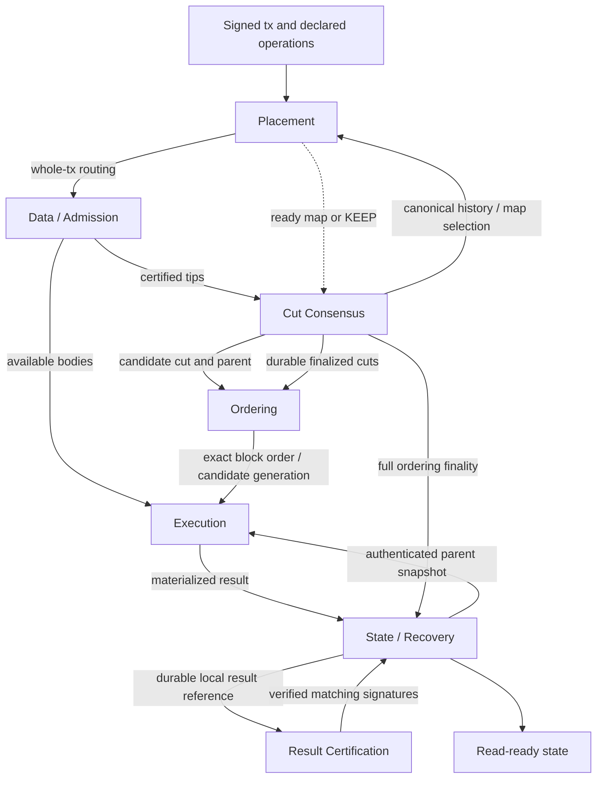

# Overpass: Fixed Certified Cuts, Pipelined Execution, and Producer Placement

> 2026-09-28 · 설계 결정 및 구현 계획 · 코드/증명/성능 검증 완료가 아님
>
> 최신 결정: Commonware Multimmit fork의 n=5f+1 구성을 유지하되 proposal-relative tip 추출과 extension voting을 제거하고, 고정된 certified cut 자체를 합의한다. 실행 제어와 operation-aware producer placement를 독립된 module로 연결한다.
>
> 이 기록은 v13.20의 **native Multimmit extraction/extensions 유지** 결정을 대체한다. 영문 LaTeX/PDF와 Google Docs는 아직 v13.20이며 이번 결정으로 갱신되지 않았다. 이전 proof/PAC SDK와 legacy EC reducer를 부활시키지 않는다.

## 1. 결정의 reasoning

목표는 **tx ingress부터 certified state finalization까지의 E2E latency 감소**다. Ordering-to-state interval은 세부 지표이고 durable apply/read readiness는 별도 종료점이다. Ordering을 늦춰 interval만 줄인 결과는 개선이 아니다.

Native Multimmit은 인증 전 proposal, proposal-relative voting과 extension voting으로 ordering latency를 줄인다. 그러나 lane별 final tip과 즉시 방출 가능한 global order가 다를 수 있고, speculative execution이 최종 입력과 달라지면 재검증·재실행이 남는다. 이것이 Autobahn보다 실제로 더 많은 재실행을 만든다는 것은 아직 **가설**이다.

Fixed certified cut은 leader proposal이 선택될 경우 실행할 입력을 일찍 특정한다. 누락된 body를 sync하면서 실행과 합의를 겹치고, 가능한 결과를 미리 준비한다. Proposal 이전부터 수행한 실행, proposal/parent 변경, late predecessor에 의한 재실행까지 제거하지는 않는다. 같은 cut 투표는 같은 body 보유·같은 local DAG·실행 완료를 뜻하지 않는다.

인증 대기 및 extension 제거로 잃는 ordering 이득은 그 자체로 최종 성능 결론이 아니다. 인증 대기 중에도 block 수신 기반 실행을 진행할 수 있다. 반대로 가벼운 실행이나 낮은 충돌에서는 인증 대기가 지배해 손해일 수 있다.

정확한 관찰 노드별 join 관계는 다음과 같다. 시간은 모두 같은 기준점에서 측정한다.

```text
T_state_final = max(T_valid_ordering_evidence,
                    T_authenticated_parent,
                    T_matching_result_certificate)
T_read_ready >= T_state_final
```

Result certificate 도착 시간에는 실행·재검증·materialization·결과 보관·서명 및 전파 비용이 반영된다. 이 식은 실행 시간과 consensus 시간이 독립이라는 가정이나 latency 상한이 아니다.

Extension의 leader-independent inclusion은 별도의 가치다. 이를 제거하면 같은 보장을 주장하지 않는다. 정직한 leader의 certified-tip 포함 정책, fair admission, 정상 producer/relay 및 eventual synchrony 아래의 eventual inclusion을 별도로 검증한다. Hard placement의 faulty-producer failover는 여전히 별도 의무다.

## 2. Protocol profile: 유지와 교체

| 요소 | 새 profile |
|---|---|
| 위원회 | n=5f+1, 최대 f Byzantine, 고정 epoch |
| Producer chains | 병렬 생성·전파 유지; state ownership shards가 아님 |
| Data availability | 기존 n-2f=3f+1 DA 인증 및 unique certified ancestry 규칙 재사용 대상 |
| 블록 생성 pipeline | 기존 bounded producer pipeline은 유지 대상; extension vote 제거와 다름 |
| Leader proposal | lane별 certified tip 또는 이미 검증된 parent boundary를 명시한 exact cut |
| Ordering vote | 전체 proposal digest에 대한 승인; position vector/extension payload 없음 |
| Ordering finality | 동일 proposal에 n-f=4f+1 matching votes; 실제 규칙은 아래 safety gate 필요 |
| Tip 추출 | vote pool에서 3f+1번째 위치를 고르는 규칙 제거 |
| Cross-chain order | parent cut과 exact selected cut 사이의 고정 deterministic zip |
| 실행 | admission 외부의 speculative execution 및 필요한 재실행 |
| State 인증 | full ordering finality + authenticated parent + exact-context f+1 direct-execution signatures |
| Placement | whole-tx routing; state/fragment migration이나 별도 ingress coordinator 없음 |

**5f+1과 4f+1이라는 숫자만 유지하면 안전해지는 것이 아니다.** Fixed-value agreement에 맞는 parent certificate, view progression, nullification, durable signing/recovery를 함께 재구성해야 한다. 설계 근거는 Minimmit 계열의 fixed-value one-voting-round 합의이며, 순수 Autobahn의 Prepare/Confirm을 그대로 쓰는 모델도 native Multimmit도 아니다. Fork에서 두 기능의 옵션만 끄는 작업으로 설명하지 않는다.

새 proposal은 epoch, protocol version, view, parent proposal/certificate, cut index, lane boundaries와 DA evidence, ordering-rule version, placement decision/KEEP와 activation metadata를 인증한다. Application state root를 ordering vote의 필수 입력으로 두지 않는다.

Parent는 현재 노드가 마지막으로 관찰한 finalized cut이 아니라 **합의 프로토콜이 인증한 parent**다. 그 parent가 아직 application state-final이 아니어도 ordering은 진행할 수 있다. Parent chain이 확정되면 미처리 ancestors를 순서대로 전달한다. Cut index는 이 canonical chain의 깊이이며 view number나 로컬 QC 수신 횟수가 아니다.

Certified cut validity는 lane 누락/중복, branch·높이·parent-boundary 불일치, 잘못된 epoch, DA signature와 metadata binding을 검사한다. 필요한 authenticated headers/proofs가 없으면 의존 evidence를 복구한다. **전체 transaction body나 실행 완료를 cut vote 조건으로 넣지 않는다.** 느린 lane은 검증된 이전 boundary를 유지할 수 있다. 모든 lane의 새 블록을 기다리는 barrier는 없다.

## 3. 구현 구조 결정: 기존 Voter + 별도 실행·배치 작업

사용자는 특정 패턴 도입이 아니라 원하는 기능에 필요한 구현 구조 결정을 요청했다. **기존 Commonware Actor + bounded Mailbox 구조를 사용한다.** 새로운 Anchor framework나 사용자가 선택해야 할 패턴을 추가하지 않는다. Voter는 투표를 보내는 모든 validator를 뜻하는 일반 용어이기도 하지만, 여기서는 한 노드 내부에서 consensus mutable state를 소유하는 기존 Actor의 이름이다. 각 validator가 자신의 Voter를 실행하며 단일 중앙 서버가 아니다.

별도 task는 외부 입력/CPU 작업을 비동기로 처리하고, 완료된 메시지만 상태 owner에게 보낸다. 긴 실행을 Voter의 event loop에서 수행하지 않는다. 아래 anchor들은 새 framework가 아니라 stale input과 잘못된 parent를 구분하기 위해 필요한 데이터 문맥이다.

- **Consensus anchor:** 다음 proposal이 따라야 하는 인증된 parent proposal/cut. Cut Consensus module만 변경 권한을 가진다.
- **Execution anchor:** exact parent cut 식별자, authenticated state root, consumed-tx metadata commitment, runtime/order version. Execution과 State module이 검증한다.
- **Placement history anchor:** optimizer가 읽을 canonical history window와 incumbent map digest. 노드별 최신 mempool이나 wall-clock이 아니다.

세 anchor는 같은 객체가 아니다. Ordering은 execution anchor가 아직 준비되지 않았어도 진행한다. Application 실행에 필요한 parent state는 기다리거나 명시적으로 speculative parent를 사용하되, 인증·설치 전에 canonical parent와 일치시켜야 한다.

Commonware의 `types::Anchor`는 chain proposal의 certified base를 나타내는 타입이지 Actor 설계 패턴이 아니다. 현재 `actors/voter`는 consensus mutable state의 단일 owner다. 이 소유권은 유지하고 실행·배치의 CPU-heavy work를 외부 workers로 보낸다.

## 4. 필요한 modules와 작은 interfaces

아래 명칭과 interfaces는 **신규 설계 제안**이며 현재 공개 SDK가 아니다. Module마다 crate나 actor를 하나씩 만들 필요는 없다. 순수 계산인 Ordering은 actor가 아니고, storage는 해당 owner가 독점한다.

| Module | 소유하는 상태와 기능 | Interface의 핵심 |
|---|---|---|
| Placement | authorized maps, common history, background Multilevel 계산·검증·보관, whole-tx route, activation 일정 | `route(tx, map_context)`, `check_assignment(block_context, tx)`, ready candidate/KEEP 제공 |
| Data / Admission | tx queue, immutable bodies, producer 생성·전파, body 복구, bounded stateless/admission 검사, DA custody | 기존 `Automaton::propose/verify`, `Relay`; `BlockAvailable`, `CertifiedTipAvailable`, `fetch(digest)` |
| Cut Consensus | leader/view, exact cut proposal, fixed-value votes/certificates, parent/nullification, journal과 canonical cut chain | authenticated proposal/finality events와 durable replayable cut log |
| Ordering | parent→candidate block order, canonical tx occurrence 선택, input digest | 순수 `derive(parent_cut, selected_cut, rule)`; 별도 합의 없음 |
| Execution | speculative generations, task priorities, cache, read validation·재실행, final-context materialization | `observe_block`, `target(candidate)`, `finalized(cut)`; application backend의 `evaluate(context, inputs, cache)` |
| Result Certification | exact subject의 direct-execution signatures, distinct signer 집계, certificate 검증·전파 | `submit_local_result`, `observe_signature`, `get_certificate(context)` |
| State / Recovery | durable canonical state, consumed IDs, outputs/deltas, result serving, staging apply와 checkpoint 복구 | `stage_result`, `fetch_result`, `install(certified_update)`, `read_at(cut)` |

### 각 module에서 지켜야 할 경계

**Placement:** Multilevel은 common declared state/operation history를 기반으로 grouping하고 tx 전체를 한 producer로 보낸다. Read/read와 무조건 호환인 operation은 dependency 점수 0, 조건부 try operation은 보수적으로 순서 민감으로 분류한다. Coarsening → 배치 후보 평가 → uncoarsening/refinement를 사용한다. 고정 seed뿐 아니라 입력 정렬, integer arithmetic, tie-break와 work budget도 결정적이어야 한다. 현재 LaTeX의 history-tx-count/load/churn 목적함수를 연결 대상으로 삼고, 별도 gas 기반 Google Docs 안과의 차이는 이번 기록에서 임의 변경하지 않는다. 최우선 연구 목표는 cross-producer order-sensitive 관계 감소이며 proxy 개선은 미래 latency 증명이 아니다.

**Data / Admission:** 서명·encoding·declared-access 형식·producer 배치·body custody를 검사한다. Balance/nonce의 실행 성공이나 state transition 계산을 여기서 기다리지 않는다. Application상 실패할 tx도 statelessly valid하면 실행 입력이 될 수 있다. `BlockAvailable`은 안전한 ingress 검사를 거친 bytes이며 admission verdict와 execution result는 서로 다르다. DA `verify`는 일시적 body/map 누락이면 pending, 영구 invalid일 때만 false다.

**Cut Consensus:** speculative execution이나 optimizer completion이 투표·view change를 gating하지 않는다. Candidate map이 없으면 KEEP한다. Execution이 느려도 cut은 계속 확정할 수 있다. 결과적으로 unbounded state backlog가 생기지 않는다는 보장은 별개다.

**Ordering:** 가장 작은 reference profile은 epoch에 고정한 lane 순서를 사용한다. Parent cut 이후 relative height 우선, 같은 relative height에서는 lane 순서, block 내부는 tx index 순서다. Leader는 포함 경계를 선택하되 임의 순열을 선택하지 않는다. Cut별 lane rotation은 이번 변경에 자동 추가하지 않는다. Body가 없어도 block 순서는 산출할 수 있지만 tx dependency와 input digest 완성은 body가 필요하다.

**Execution:** proposal 전에는 수신 블록 기반 tentative input을 실행하고, 유효 proposal 후에는 exact candidate cut을 우선한다. 누락된 앞 블록을 없는 것으로 확정하지 않는다. 독립성이 검증되거나 speculative budget 안에서 실행하되, late predecessor·candidate/parent 변경 시 reads, predicates, deferred values, outputs를 재검증한다. 재사용 불확실 시 final input을 다시 실행한다. Block-STM은 고정 순서 실행 backend 후보이지 dynamic insertion을 자동 지원하는 adapter가 아니다. 첫 adapter는 sequential oracle, 다음은 실제 STM backend로 삼아 같은 결과를 확인한다.

**Result Certification:** reference signer policy는 같은 epoch 전체 validator 중 exact context를 직접 실행·검증한 노드다. Ordering-voter subset으로 제한하지 않고 f+1개 서로 다른 matching signatures를 모은다. 이는 기존 대화의 all-validator 방향을 구현 계획에서 명시한 것이며 현재 LaTeX M2는 아직 갱신되지 않았다. 서명 subject는 domain/epoch, proposal 및 parent-cut digest, ordered deduplicated input, parent state/metadata, runtime/order version, materialized post-root·delta·status/events/fees commitments를 묶는다. f+1은 유일한 확정 입력의 정상 직접 실행자 존재를 보이는 조건이지 ordering threshold가 아니다. 미확정 proposal의 서명은 conditional evidence일 뿐이다.

**State / Recovery:** signer는 서명 전에 자신이 계산한 full apply material을 durable하게 보관한다. Peer result를 받아 설치한 것만으로 새 direct-execution signature를 만들지 않는다. 수신자는 full ordering proof, authenticated parent와 result certificate를 확인하고 delta를 staging apply하여 root를 검사한 뒤 state/outputs/consumed IDs/cursor를 atomic publish한다. Root가 같아도 처리 cut/metadata가 다르면 동일 parent가 아니다. 결과 데이터 은닉 시 다른 signer에게 재요청하고 필요하면 authenticated input의 직접 실행으로 복구한다.

### 전체 연결 그림



`R`은 단일 외부 collector가 아니라 각 validator에 있는 module이다. 서명·certificate는 gossip/pull로 복구할 수 있어야 한다. `C`도 모든 replica에서 동작하고 현재 view의 leader만 제안 역할을 맡는다.

### 같은 cut의 pipeline 그림

```mermaid
sequenceDiagram
  participant D as Data / DA
  participant C as Cut Consensus
  participant E as Execution
  participant R as Result Certification
  participant S as State / Recovery
  D-->>E: BlockAvailable (before DA certificate is allowed)
  E->>E: Tentative execution under common rule
  D-->>C: Certified tips
  C-->>E: Valid exact candidate cut + parent
  par Ordering continues without execution waits
    C->>C: 4f+1 matching votes + durable finality
  and Execution follows the candidate
    E->>D: Fetch missing bodies if needed
    D-->>E: Authenticated bodies
    E->>E: Validate reuse / re-execute / materialize
    E->>S: Durably retain result and apply material
    S-->>R: Local result ready to sign
    R->>R: Collect f+1 matching direct-execution signatures
  end
  C-->>S: Full ordering-finality evidence
  R-->>S: Exact result certificate (may arrive first or later)
  S->>S: Join with authenticated parent; atomic install
```

이 그림은 의존 관계를 나타내는 schematic이며 길이가 측정 시간을 나타내지는 않는다. 실행·ordering·결과 인증 중 어느 쪽이 먼저 끝날지는 상황에 따라 다르다.

## 5. 공통 context, delivery, backpressure

Candidate를 식별하는 immutable context에는 `epoch, protocol_version, proposal_digest, parent_cut_digest, cut_index, cut_tips, rule_version`을 넣는다. Execution job은 추가로 `input_digest, parent_state_and_metadata, runtime_version, generation`을 가진다. Worker completion의 generation/context가 현재 대상과 다르면 자동 publish하지 않고 재사용 가능성을 다시 검증한다.

Canonical cut log는 consensus journal에 근거한 재독 가능한 순서 있는 기록이며 consumer cursor로 복구한다. Speculative notification은 drop/coalesce할 수 있지만 finalized cut은 누락해서는 안 된다. 현재 `Reporter::Activity::ProtocolAccepted`는 telemetry이며 **exactly-once delivery/retention의 근거가 아니다**. 새 durable delivery interface가 필요하지만 추가 consensus round는 아니다. 중복 전달은 허용하고 소비·설치를 idempotent하게 만들어 once-only effect를 보장한다.

Slow consumer가 consensus mailbox를 채우지 않도록 알림은 cursor hint로 보내고 실제 정보는 durable log에서 pull한다. Consumer apply ACK를 cut 확정 조건으로 두지 않는다. Log/checkpoint retention과 disk 용량을 명시하고 무한 backlog·무제한 non-blocking을 주장하지 않는다. Future input에 상한을 두고 execution overflow에서는 speculation을 줄여 finalized input을 우선한다. Storage corruption/write failure는 fail-closed 처리한다.

Commonware runtime / `commonware_actor::mailbox`를 사용하며 각 actor가 자기 mutable state를 소유한다. Execution과 partitioning의 CPU work에는 별도의 bounded permits를 할당한다. Consensus와 공유하는 거대한 mutable lock, 새 외부 async runtime, 모든 module을 통과하는 만능 event bus는 도입하지 않는다.

## 6. Placement 선택과 전환

기존 c→c+1 방침을 유지한다.

1. 공통 finalized history를 anchor로 background 계산·검증한다.
2. 준비된 map, 인증된 이전 map과의 연결, activation 규칙을 cut c의 서명 대상에 넣는다. 준비되지 않았으면 KEEP한다.
3. Canonical cut c+1의 확정을 확인하고 map을 확보한 producer가 새 block 생성에 사용한다.
4. Old/new-map blocks는 같은 후속 cut에 존재할 수 있고 cross-block duplicate tx도 허용한다.
5. Stable signed-tx ID의 canonical first occurrence만 실행 입력으로 남긴다. 실패한 first attempt도 ID를 소비하며 뒤의 copy는 fee/event/retry를 추가하지 않는다.

Map readiness threshold의 구체값은 아직 미정이며 `q_map > f`로 표기한다. 이는 checked computation/custody 조건이지 activation 합의가 아니다. 초기 구현은 fixed-map으로 시작한다. `2f+1`이나 `4f+1`을 역할이 다른 certificate에서 기계적으로 가져오지 않는다.

**미해결:** c+1만으로 old-map block의 정당한 권한·retirement·failed-producer reassignment는 정해지지 않는다. 인증된 전환 context와 producer-chain 경계 처리를 정의하기 전에는 dynamic-map E2E를 완료로 보지 않는다. 로컬 시각이나 map tag만으로 거부 여부를 결정해서는 안 된다.

## 7. Pseudocode

구현 명칭은 제안이다. 합의의 view-change 내부를 짧은 의사코드로 대체하지 않고 검증할 fixed-value BFT의 책임으로 남긴다.

```text
on block_received(context, body):                       # Data / Admission
    if permanently_invalid_encoding_signature_or_assignment(context, body): reject
    if required_body_or_authorized_map_missing: keep_pending_and_fetch; return
    durable_store(body)
    notify_execution_if_budget_allows(BlockAvailable(context, digest(body)))
    complete_automaton_verify(true)                    # no application execution wait
    # consensus DA rules separately decide whether to sign a DA share

on leader_can_propose(parent_evidence):                 # Cut Consensus
    parent = validate_fixed_value_parent(parent_evidence)
    tips = latest_certified_descendants_or_parent_boundaries(parent)
    map_decision = ready_candidate_or_KEEP()            # never await optimizer
    proposal = bind(epoch, view, parent, tips, rule, map_decision)
    fixed_value_consensus.propose(proposal)

on valid_proposal(proposal):
    validate_certificates_cut_extension_and_map_metadata(proposal)
    # missing required small evidence is recovered; body sync is not a voting gate
    fixed_value_consensus.process_proposal(proposal)    # persist signing state before send
    enqueue_execution_target(proposal)                 # coalescible hint, no execution wait

on candidate_or_body_change(proposal):                  # Execution
    plan = Ordering.derive(proposal.parent_cut, proposal.cut, proposal.rule)
    new_generation = advance_generation()
    fetch_missing_bodies_in_background(plan)
    backend.evaluate(context(plan, new_generation), available_inputs, prior_cache)

on execution_completion(job, result):
    if job.context_or_generation_is_stale:
        keep_only_cache_entries_that_can_be_revalidated; return
    if not complete_and_valid_for_exact_input_and_parent(result): schedule_remaining_work; return
    materialize_deferred_values_and_outputs(result)
    stored = State.stage_result(result)                # durable, not canonical publication
    ResultCertification.sign_and_gossip(stored.subject) # conditional before full finality

on fixed_value_consensus_finality(proposal, evidence):
    persist_canonical_cut_and_any_newly_committed_ancestors(proposal, evidence)
    notify_consumers_of_durable_cursor()               # no consumer-completion barrier

on finalized_cut_pulled(cut):
    canonical_inputs = deduplicate_in_canonical_order(cut, authenticated_parent_consumed_ids)
    Execution.prioritize_and_reconcile(cut, canonical_inputs)
    Placement.record_selection_and_activation(cut)
    State.try_join(cut)

on matching_result_certificate(cert):
    verify_distinct_epoch_signers_and_exact_subject(cert)
    State.try_join(cert.cut)

State.try_join(cut):
    if ordering_finality_or_authenticated_parent_or_exact_result_cert_missing: return Pending
    bytes = fetch_committed_result_from_signers_or_peers()
    if unavailable: retry_or_schedule_direct_execution; return Pending
    if commitments_or_parent_mismatch: reject_without_mutating_canonical_state
    staged = apply_to_staging(bytes)
    if staged.root_or_outputs_mismatch: reject_without_publication
    atomic_publish(state, outputs, consumed_ids, cut_cursor)
    signal_ReadReady(cut)
```

## 8. 현재 code에서 바꿀 위치

현재 fork는 `534af0ed` 기반이다. 아래는 확인한 파일과 앞으로 바꿀 책임이며 코드 변경 완료 목록이 아니다.

| 현재 경로 (`commonware/` 기준) | 현재 역할 → 계획 |
|---|---|
| `consensus/src/multimmit/types/block.rs` | `Anchor`, `ChainProposal`, `LeaderBlock` → exact certified cut와 placement/parent metadata binding |
| `consensus/src/multimmit/types/vote.rs`, `types/certificate.rs`, `types/tally.rs` | position/extension-bearing vote와 인증 → fixed-proposal vote 및 맞는 certificate/view-transition 타입 |
| `consensus/src/multimmit/machine/algebra/tips.rs` | final/safe tip 추출 → 새 profile에서 제거; parent-proof 의미는 fixed-value 합의에서 재정의 |
| `consensus/src/multimmit/machine/view.rs`, `machine/finality.rs`, `machine/admission.rs` | view/cut 검증·pool 처리 → fixed-value parent, finality, progress 및 certified-cut validity |
| `consensus/src/multimmit/config.rs`, `machine/config.rs`, `scheme/` | extension bounds·protocol domain·검증 조건·profile 식별 수정; DA pipeline depth는 별도 유지 |
| `consensus/src/multimmit/actors/voter/`, `engine.rs`, `storage/` | 단일 consensus owner·journal 구조 재사용; durable canonical cut delivery와 restart 연결 |
| `consensus/src/lib.rs` | 기존 `Automaton`/`Relay`의 admission 역할 유지; execution을 여기에 끼워 넣지 않음 |
| `consensus/src/multimmit/types/activity.rs` | 기존 telemetry는 유지할 수 있지만 canonical application delivery 근거로 사용하지 않음 |
| `glue/src/overpass/` (신규 제안) | ordering, execution, placement, result, state 연결; 하나의 module 아래 시작하고 과도한 public traits/crates 금지 |
| `examples/overpass-bank/` (신규 제안) | 실제 body·shared account·접근 선언·nonce/fee가 있는 E2E harness |

`machine/emission.rs`라는 이름만 보고 global ordered output이 구현되어 있다고 가정하지 않는다. 현재 모듈 문서상 consensus core는 durable global delivery cursor를 제공하지 않는다. `examples/log-multimmit`은 body-free mock이고 `glue/src/multimmit.rs`는 legacy EC PoC이므로 새 state-finalization 구현의 완료 근거가 아니다.

Wire/signing domains·checkpoint encoding이 바뀌므로 native peers/journals와 호환된다고 주장하지 않는다. 별도 protocol profile/namespace와 storage partition을 사용하고, 첫 실험은 새 genesis로 시작한다. Upstream/native benchmark는 pinned commit/build로 보존한다. 제거한 extension code의 compatibility wrappers를 새 profile에 남기지 않는다. 실제 production migration은 범위 밖이다.

## 9. 구현 순서와 acceptance gates

1. **Fixed-cut consensus model 먼저:** explicit parent/certificate/nullification 규칙을 정하고 conflicting leaders, timeout-after-vote, late QC, restart에 대해 safety/liveness를 검증한다. 숫자·타입만 변경한 구현을 benchmark에 넣지 않는다. 이 gate가 끝나기 전 새 safety proof를 주장하지 않는다.
2. **Fork cut path + durable delivery:** tip 추출/extension을 교체하고 exact certified cut, canonical ancestor 처리, 재시작 cursor를 구현한다. n=6/f=1, n=11/f=2 deterministic-runtime tests에서 honest canonical logs가 prefix-compatible인지 확인한다. 실행을 끈 상태로 ordering이 진행해야 한다.
3. **실제 Bank bodies + post-cut reference:** 기존 `Automaton` admission과 data recovery를 연결한다. Declaration/runtime containment, nonce/fee, stable ID를 구현하고 순차 oracle과 전체 state/outputs를 비교한다. Mock root나 임의 finality callback을 E2E로 부르지 않는다.
4. **Execution pipeline + result/state path:** proposal 전후 실행, generation cancellation, final-context 재검증, f+1 서명, delta recovery·atomic apply를 연결한다. Backend를 지연/중단해도 DA·cut vote가 execution 완료에 의존하지 않는지 확인한다. Parent가 늦으면 state만 대기한다.
5. **Fixed-map placement → background Multilevel:** 동일 입력·seed에서 같은 map과 whole-tx routing을 확인한다. Misplacement는 DA 전 검사하고, false declaration은 runtime에서 처리한다. 동일 backend/budget에서 placement만 바꾸는 비교가 가능해야 한다.
6. **Online scheduling은 마지막:** old-map authority/retirement·faulty producer 재배정 규칙을 먼저 정한 뒤 c→c+1과 duplicate handoff를 검증한다. 해결 전에는 fixed-map 결과와 dynamic-map 결과를 혼용하지 않는다.

최소 regression은 invalid certificate/cut, equivocation, absent body, stopped producer, stale worker completion, changed parent/input, false result/replayed signatures, duplicate fee/effect, corrupted/withheld delta, install/restart를 다룬다. Test suite는 protocol 검증용이며 모든 조합을 paper 성능 benchmark로 요구하지 않는다. State root뿐 아니라 tx status/events/fee와 consumed IDs를 oracle과 비교한다.

## 10. 평가: 합의 변경과 pipeline 효과를 분리

| 구성 | 역할 |
|---|---|
| Native Multimmit + post-order execution | 원래 consensus 기준선; application/backend를 붙였음을 명시 |
| Fixed-cut 5f+1 + post-cut execution | 합의 변경만의 비용/이득 통제 |
| Fixed-cut 5f+1 + pipeline | 실행 overlap 효과 |
| Fixed-cut 5f+1 + pipeline + placement | 배치의 추가 효과 |

자원이 허용되면 native Multimmit + pipeline도 추가해 “native 위에 실행을 붙이기만 하면 안 되는가?”를 직접 검증한다. 최소한 이 비교가 없으면 native와의 차이를 tip 정책만의 인과 효과로 단정하지 않는다.

동일 RTT, offered load, workers, memory/bandwidth, application/runtime, 결과 인증 종료 조건을 사용한다. Same-order replay 실험으로 speculation/reuse를 별도 검증한다. 최초 ingress timestamp는 rerouting으로 초기화하지 않는다. 최종 E2E p50/p95/p99와 미완료 backlog를 주 지표로, DA/proposal 대기·ordering·retry CPU·queueing·certification·read readiness를 원인 설명용으로 기록한다. Cut-to-state만 좋아지고 E2E가 나빠진 경우 실패 조건으로 보고한다.

## 11. 근거와 아직 해야 할 일

- [Autobahn §5.1–5.2](https://www.cs.cornell.edu/lorenzo/papers/Suri24Autobahn.pdf): certified-tip cut, body sync와 consensus의 분리. 새 5f+1 profile의 safety를 직접 증명하는 자료는 아니다.
- [Multimmit §3.1–3.5](https://arxiv.org/html/2607.21021v5): Minimmit 기반 fixed-value agreement와 native proposal-relative/extension 규칙의 구분. 두 규칙 제거 시 native theorem을 그대로 인용하지 않는다.
- [기존 배치 본문](research/paper/sections/04-placement.tex): deterministic Multilevel, whole-tx routing, objective와 한계. 이번 설계는 optimizer를 새로 교체하지 않는다.
- [Commonware actor](commonware/actor/src/lib.rs), [Automaton/Relay/Reporter](commonware/consensus/src/lib.rs), [voter](commonware/consensus/src/multimmit/actors/voter/actor.rs), [Activity](commonware/consensus/src/multimmit/types/activity.rs): 코드에서 확인한 runtime/interface 출발점.

남은 주요 결정은 fixed-value safety의 구체적 이식, authenticated cut/header evidence 형식, dynamic map authority/retirement, producer failover, map readiness threshold와 storage retention이다. Runtime 구조는 기존 Actor/Voter를 재사용하는 것으로 정했다. 이번 변경은 이 의무를 숨기지 않고 **reasoning과 module 구현 방향을 기록**한 것이다.
