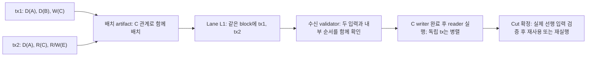

# State 기반 transaction 배치 — v1 보관본

> 갱신일: 2026-09-21  
> 상태: 보관된 batch-local v1; 현재 정책은 [선언 기반 결정적 routing v2](./state-affinity-placement.md)를 따른다.  
> 기준: [R/W/Defer 실행 모델](./blockstm-execution-model.md), [공통 block ordering](./rotating-round-robin-dag.md), [논문 개요](./paper-outline.md)  
> 예시 artifact: [example-plan.json](./research/placement/example-plan.json) — 실제 서명된 network message가 아닌 설명용 fixture

## 1. 결정: state를 옮기지 않고 관련 tx를 함께 배치한다

**같은 state에서 순서에 민감한 tx를 같은 producer lane에, 가능하면 같은 block에 모은다.** 전파받는 validator가 관련 입력과 그 상대 순서를 일찍 함께 알게 하여, 늦은 predecessor 때문에 버리는 speculative work를 줄이려는 설계다. 충돌 자체를 제거하거나 재실행 0회를 보장하는 것은 아니다.

- Producer lane은 state의 독점 owner가 아니다. 모든 validator의 shared-state 실행 모델을 유지한다.
- Tx를 fragments로 나누지 않는다. 여러 key를 읽고 쓰는 tx도 하나의 tx로 실행·실패 처리한다.
- 배치는 기존 tx 전파 계층의 router/planner에서 수행한다. Lane마다 별도 mempool을 추가하거나 consensus leader를 유일한 배치자로 만들지 않는다.
- 각 planner는 이미 가진 bounded tx 목록으로 계산한다. 전체 mempool 일치나 다른 planner의 동의를 기다리지 않는다.
- 배치 artifact는 **선택적인 routing·packing 제안과 그 입력 기록**이다. 새로운 certificate, quorum, DA 조건, state lock이 아니다.
- Cut 선택, 공통 block rank, block 내부 실제 tx 순서, Block-STM 검증 및 결과 인증 경계는 그대로다. 이번 설계는 합의 정족수를 선택하거나 변경하지 않는다.

V1의 정확한 범위는 **작은 배치 안의 conflict-aware lane 배치와 block packing**이다. 장기간 `state C → 항상 lane L0`를 유지하는 state-home map은 이번 결정에 포함하지 않는다. 서로 다른 배치 사이의 affinity까지 보장하려면 별도 정책이 필요하다.

## 2. 사용자의 예시: A 공유보다 C의 관계가 중요하다

```text
tx1: A defer, B defer, C write
tx2: A defer, C read, E read + write
```

| State | tx1 | tx2 | 배치 판단 |
|---|---|---|---|
| A | defer | defer | 합성 가능성·범위·관측을 확인한다. 단순 공유만으로 강하게 묶지 않는다. |
| B | defer | — | 두 tx 사이의 배치 근거가 아니다. |
| C | write | read | 높은 affinity. 같은 block에 모으면 writer/reader의 순서를 함께 알 수 있다. |
| E | — | read + write | 이 두 tx 사이에는 충돌이 없다. E를 건드리는 다른 tx가 생기면 추가 판단한다. |

`defer`는 공짜 실행도, 무조건 독립도 아니다. 두 tx의 A 연산이 `try_sub`이고 잔액 경계에 닿거나 정확한 snapshot 값을 사용하면 순서가 중요해진다. [AIP-47](https://github.com/aptos-foundation/AIPs/blob/main/aips/aip-47.md)의 조건 관측·지연 값 검증을 유지한다.

### 왜 같은 block까지 묶는가

아래 화살표는 **실제로 선택된 순서가 tx1 → tx2인 경우**다. `write/read` 선언만으로 tx1이 반드시 먼저 와야 한다는 application 의미가 생기지는 않는다.



**흩어졌을 때:** `C=0, E=0`; tx1은 `C=10`, tx2는 `E=E+C`라고 하자. Validator가 tx2만 먼저 받으면 E=0을 계산할 수 있다. 이후 canonical order에서 앞서는 tx1이 도착하면 tx2는 E=10으로 재실행한다.

**같은 block일 때:** body에 `[tx1, tx2]`가 함께 있으므로 실행기는 tx1의 C 출력을 unresolved/ESTIMATE로 표시하고 reader의 낭비를 줄일 수 있다. tx1이 끝난 뒤 tx2를 실행하면 위의 **writer 누락에 의한 한 번의 재실행**을 피할 수 있다. 모든 speculative schedule에서 자동으로 그러하다는 주장은 아니다.

Block 내부 순서는 연속된 reference transaction 구간이다. 다른 block의 tx가 tx1과 tx2 사이에 끼지는 않는다. 그러나 앞선 다른 block이 tx1의 입력을 바꾸면 tx1과 tx2 모두 재검증해야 한다. 단순한 `C=10` blind-write 예시는 그 영향이 가려지는 특수 사례다.

같은 lane의 **서로 다른 blocks**는 더 약하다. 실제 선택된 canonical producer-chain prefix에서 descendant가 포함되면 ancestor는 함께 포함되거나 이미 처리되었어야 한다. 반대로 ancestor만 포함되고 descendant가 제외될 수 있고, ancestor body가 늦거나 다른 lane의 block이 중간 rank에 올 수도 있다. 이 성질은 adapter가 인증한 exact prefix에만 적용한다. 서로 다른 Byzantine branches를 lane 이름만 보고 연결하지 않는다.

## 3. 배치 artifact의 내용과 검증

문서에서는 한 가지 이름만 사용한다: `PlacementPlan`, 즉 **배치 기록**이다. Planner가 목록을 고정하고 계산한 뒤 전달하거나 로컬에 저장한다.

| 항목 | 내용과 경계 |
|---|---|
| Domain·chain·format | 다른 chain/메시지 종류로 재사용하지 못하도록 구분 |
| Policy version | 가중치, 정수 비용, 정렬·tie-break, 크기 한도와 canonical encoding 버전 |
| Config anchor | 이미 확인한 finalized 설정의 식별자, producer epoch와 eligible lane 목록 |
| Input transactions | 정확한 signed tx identity/bytes 참조와 정규화한 conservative 접근 범위; 동일 tx 중복 제거 |
| Resource inputs | 각 tx의 결정적 비용과 lane별 **이 배치 안의** 용량 한도 |
| Output | 각 tx의 권장 lane, lane 안의 권장 tx 순서, 배치하지 못한 tx 목록 |
| Freshness | 어느 producer epoch와 cut 범위에서 참고할 제안인지 |
| Digest·선택적 작성자 서명 | 정규화한 전체 입력·출력의 content commitment 및 작성자 식별 |

V1은 state 값이나 producer의 실시간 부하 보고를 읽지 않는다. 따라서 새 state root를 기다릴 필요도 없다. 설정 anchor는 실행 결과의 parent가 아니다. 추후 과거 workload/state 통계를 쓸 때만 정확한 snapshot과 출처를 추가한다.

Canonical encoding은 구현 시 한 버전으로 고정한다. 순서 없는 필드·접근 key는 정규화하고 tx identity는 byte order로 정렬하며, 출력 lane별 순서는 보존한다. 부동소수점, 중복 key, overflow 가능한 산술, 작성자 선택 난수는 허용하지 않는다. Digest만 있고 필요한 입력 bytes가 없으면 재계산한 것으로 인정하지 않는다. JSON fixture의 문자열은 실제 tx hash·서명을 대체하지 않는다.

검증자는 크기·설정·입력 identity·지원 access schema·비용을 검사하고 같은 알고리즘으로 output을 재계산한다. 이것으로 보장되는 것은 **같은 입력에서 같은 배치**뿐이다. 작성자가 거래를 빠뜨리지 않았는지, 공정한지, 실제 mempool 전체를 담았는지, 실행이 정확한지는 보장하지 않는다.

기존 admission 검증과 runtime의 접근 범위 containment는 별도다. 서명된 과대 선언도 배치 품질을 해칠 수 있고, 거짓 접근 힌트는 실행 권한이 되지 않는다. 잘못되거나 누락된 plan은 hint로 쓰지 않고 일반 경로로 처리한다. Plan 하나 때문에 유효한 block의 DA/ordering을 거부하지 않는다.

## 4. 결정적인 최소 배치 알고리즘

### 4.1 Affinity는 안전성 규칙이 아니라 비용 추정이다

공유 key마다 아래 점수를 사용한다. 한 key에서 여러 모드가 겹치면 최대 점수 하나만 더한다. 초기 숫자는 설명·ablation을 위한 **휴리스틱**이며 최적값으로 주장하지 않는다.

| 두 tx의 key 접근 | 점수 |
|---|---:|
| R–R만 공유 | 0 |
| W–R, R–W, W–W | 4 |
| D–R, D–W 및 반대 관계 | 4 |
| D–D: 조건 관측·범위 민감성 등 의존 가능성이 명시되거나 profile이 불명확 | 1 |
| D–D: 위 조건에 해당하지 않고 policy가 명시적으로 허용한 unobserved composable profile | 0 |

분류 우선순위는 4점 관계, 조건부/불명확 D–D 1점, 명시적 순수 profile 0점 순이다. Profile을 추론할 수 없으면 0점으로 낮추지 않는다. 0점 D–D도 최종 각 prefix의 overflow/underflow와 실제 관측을 검증한다. 0점은 **같이 묶는 이득을 낮게 추정한다**는 뜻이지 graph에서 안전하게 의존성을 지웠다는 뜻이 아니다. Snapshot의 수치가 실행 흐름에 쓰이면 R로도 기록한다. Ordinary fee payer·nonce 접근도 빠뜨리지 않으며 D 작업도 자원 비용에는 포함한다.

`affinity(t, lane)`은 그 lane에 이미 배치한 tx들과의 점수 합이다. Connected component 전체를 강제로 한 lane으로 합치지 않는다. 여러 state 그룹을 연결하는 tx도 한 lane에만 보내고 다른 lane의 state 접근은 기존 Block-STM으로 처리한다.

### 4.2 Pseudocode

```text
build_plan(bounded_input, finalized_config, policy):
    validate_input_sizes_identities_and_supported_access_schema()
    txs = unique_transactions_sorted_by_id_bytes(bounded_input)
    lanes = eligible_lanes_sorted_by_id(finalized_config)
    load[lane] = 0; assigned[lane] = []; overflow = []

    for tx in txs:
        cost = deterministic_positive_cost(tx, policy)
        feasible = lanes with load[lane] + cost <= batch_capacity[lane]
        if feasible is empty:
            overflow.append(tx)
            continue
        choose lane by, in order:
            largest sum of per-key affinity with assigned[lane]
            smallest resulting normalized load (load[lane]+cost)/capacity[lane]
            smallest H(domain, chain, producer_epoch, tx_id, lane_id)
            smallest lane_id if hash ties
        assigned[lane].append(tx)
        load[lane] += cost

    return canonical_plan(inputs, assigned, overflow)

use_plan(plan):
    if missing, stale, unavailable or not reproducible:
        use_ordinary_transaction_routing()
        return
    route_original_signed_transactions(plan.assignments)
    preserve_overflow_in_ordinary_pending_routing(plan.overflow)
    producer applies its ordinary admission/nonce and block resource rules
    prefer placing high-affinity assigned txs in the same block, in suggested order
    never wait for all plan inputs, another producer or a plan quorum
    broadcast actual immutable block through the existing DA path
    validators schedule/execute from actual block bytes, not plan assertions

on_finalized_cut(cut):
    use_existing_exact_cut_Block_STM_validation_and_result_certification()
```

Normalized load는 정수 교차곱과 checked arithmetic으로 비교한다. Hash의 domain/encoding/algorithm은 policy에 고정한다. 동점일 때 항상 lane 0부터 시작하지 않기 위한 hash이며, 공정성이나 MEV 내성을 증명하는 것은 아니다.

초기 cost의 구체적인 예는 `1 + ceil(tx_encoded_bytes/256) + declared_unique_key_count`다. Planner의 부하 근사 단위이며 새로운 gas 요금·Computing Gas·CPU 시간 보장이 아니다. 실행 예산과 block bytes 등 기존 상한은 별도로 필요하다. 두 tx가 각각 128 bytes·3 keys라면 각 cost=5이고 lane 용량10에서 함께 배치할 수 있다.

단순한 전체 pair 비교도 `batch_tx_count`와 `max_keys_per_tx`를 고정하면 작업량을 제한할 수 있다. V1은 단일 pass의 greedy이며 완전한 graph partition이나 반복 최적화를 필수로 하지 않는다. 큰 graph, 거대한 footprint, artifact 홍수는 로컬 상한에서 중단하고 일반 routing으로 되돌린다.

예를 들어 `t1:W(C)`와 `t2:W(E)`가 다른 lane에 먼저 배치된 후 `t3:R(C),R(E)`가 오면 t3는 양쪽에 동시에 붙을 수 없다. 하나를 택하며 남는 cross-lane 의존성은 기존 실행기가 검증한다. Overflow는 tx 삭제나 실패가 아니라 **이번 배치 제안에서 제외**이며 기존 pending/routing으로 돌린다.

**Nonce·application 순서를 우선한다.** ID 순서는 routing 후보를 정하는 순서이며 application이 요구하는 nonce 순서를 대체하지 않는다. Producer가 안전하게 pack할 수 없으면 기존 admission에 따라 순서를 조정·보류하고 hint와의 차이를 기록한다. 알려진 선행 nonce를 남겨두고 후속만 다른 lane에 보내도 선행 포함은 보장되지 않는다. 성공 가능한 순서를 보장할 수 없는 후속 tx는 기존 pending/retransmission 경로를 사용한다. 별도 batch/lane 사이의 nonce 순서를 해결했다고 주장하지 않는다.

### 4.3 같은 입력에서의 재현성과 다른 입력에서의 한계

입력 집합·설정·policy가 같으면 같은 output을 얻는다. Mempool이 다른 planner끼리는 같은 tx에 다른 lane을 제안할 수 있다. 이를 맞추기 위한 추가 합의는 하지 않는다.

Capacity도 **하나의 plan 안에서만** 적용되는 상한이다. 동시에 만든 plan 전체에 대한 lane 예약이 아니다. 실제 부하는 producer의 기존 admission에서 제한한다. 짧고 제한된 routing/packing 대기를 허용하더라도 기한에 일반 경로로 돌아가며 다른 tx나 block 생성을 멈추지 않는다. 로컬 대기시간을 canonical tx expiry로 바꾸지 않는다.

## 5. Lifecycle과 남는 재실행

```text
tx ingress → bounded plan → routing → actual producer block
                                      ├─ DA / cut consensus
                                      └─ tx-level speculative execution
cut finalized → selected-input validation → repair if needed
              → deferred materialization → existing result certification
```

Block에 담긴 뒤 실행 identity는 기존 `(block_digest, tx_position)`과 generation/context로 관리한다. Plan digest·tx ID 일치만으로 결과를 재사용하지 않는다. Block에 담기 전의 실행 cache도 일반 read/predicate/context 검증을 거쳐야 한다.

| 상황 | 처리 |
|---|---|
| 같은 block에 tx1/tx2 | 두 occurrences의 block 선택이 같고 내부 순서를 함께 안다. Tx별 application 성공 여부는 별도다. |
| 같은 lane·다른 blocks에서 후속이 cut에서 누락 | 후속 overlay를 채택하지 않고 남은 tx의 관측을 검증한다. |
| 다른 lane의 선행 writer/delta가 늦게 도착 | 새로운 exact order에서 관측을 재검증하고 무효한 tx만 재실행한다. |
| Parent/candidate/rules 변경 | 기존 Block-STM adapter의 generation 갱신·cache import 검증을 수행한다. |
| Producer의 hint 무시·중단·plan 은닉 | 일반 routing/DA recovery를 사용한다. 필요하면 같은 signed tx를 제한적으로 재전송한다. |
| 같은 tx가 여러 plan/blocks에 포함 | 로컬 dedup으로 끝내지 않고 canonical nonce/replay/status/fee 규칙으로 모든 selected occurrences를 처리한다. |
| Application abort | 해당 tx의 application effects를 버리고 규정된 fee effects를 유지한다. 인접 tx 전체를 자동 abort하지 않는다. |

재전송은 state ownership 이전도 이미 서명된 block의 취소도 아니다. 이전 block도 선택될 수 있으므로 exactly-once effects는 application의 replay 규칙에 의존한다. 이 규칙이 미정인 application에서는 구현 전제로 명시적으로 정해야 한다.

중요한 불변 조건은 다음과 같다.

```text
same exact finalized cut + canonical parent + runtime/order/fee rules
    ⇒ same serial-oracle state, status, events and fees
       regardless of placement hints or worker schedule
```

**같은 제출 tx 집합이면 어느 lane 배치에서도 같은 state가 된다고 말할 수 없다.** Routing은 block contents와 최종 global order를 바꿀 수 있다. 성공률·MEV·결과도 달라질 수 있다. 확정된 동일 cut에 대한 정당성과 다른 배치 사이의 의미 차이를 구분한다.

## 6. 선행연구와의 관계

| 연구 | 참고하는 점 | 그대로 가져오지 않는 점 |
|---|---|---|
| [TxAllo — ICDE 2023](https://arxiv.org/abs/2212.11584) | 관계가 강한 거래/account를 가까이 배치하고 cross-shard 비용과 부하를 함께 평가 | Account ownership의 shard 분할. V1은 shared-state producer routing이다. |
| [Strife — SIGMOD 2020](https://homes.cs.washington.edu/~suciu/guna-sigmod-2020-pdfa.pdf) | RW 충돌 기반 batch clustering, 전체를 거대한 component로 합치지 않는 접근 | 전체 worker의 batch barrier와 cluster 이후 residual 일괄 실행. 우리의 기존 block 순서를 바꾸지 않는다. |
| [Prophet — INFOCOM 2023](https://arxiv.org/abs/2304.08595) | 세밀한 RW 정보로 실행과 ordering의 간섭을 고려 | 별도 sequence shard가 선택·순서를 조정해 얻는 conflict-free 보장. Routing만으로 얻을 수 없다. |

위는 참고 문헌과의 비교다. 이 연구들이 우리의 Autobahn-family pre-cut pipeline에서 재실행 감소를 입증한 것은 아니다. Novelty 후보는 partitioning 자체가 아니라 **producer block 배치로 불완전한 pre-cut 입력의 불확실성을 줄이고, DA/ordering과 겹친 실행을 얼마나 유효한 계산으로 남길 수 있는지**에 대한 설계·평가다.

## 7. 검증·평가 계획

### 정당성과 예외

1. 입력 나열 순서를 바꿔도 동일 plan 입력이면 같은 assignments. Hash·용량 경계·overflow·빈 batch도 검사한다.
2. 제시한 예는 C 때문에 함께 배치하고, 순수 D–D/R–R만 공유하는 쌍은 강제 집약하지 않는다. Bounded D–D와 D–R/W도 검사한다.
3. 같은 block/다른 blocks, 선행 writer 지연, cut 제외, 다른 canonical 순서, parent 변경을 순차 oracle과 비교한다.
4. 같은 nonce 계열, 여러 plan의 중복, producer 중단 시 재전송을 포함한 모든 selected occurrences의 application/status/fee 결과가 순차 oracle과 일치하고 cached effects를 중복 설치하지 않는다. 서로 다른 occurrences의 실패 수수료를 무조건 한 번만 부과한다는 뜻은 아니다.
5. Plan 누락·변조·오래된 epoch·입력 은닉·과도한 footprint에서도 ordering/정본 실행은 일반 경로로 진행한다.
6. Bounds·predicate true↔false·snapshot·실패 tx의 delta 삭제는 기존 R/W/Defer 테스트를 유지한다.
7. 서로 다른 planner가 같은 tx를 다른 lane으로 보내는 상충 plan을 사용해도, 동일 finalized cut에 대한 전체 outputs는 같아야 한다.

### 비교군과 측정

- Random/hash routing + 현재 pre-cut Block-STM.
- RW/D affinity routing만 적용한 경로.
- Affinity routing + 같은 block packing.
- 위에 알려진 writer의 unresolved-aware scheduling을 더한 경로. 실행기 효과와 배치 효과를 분리한다.
- 순수 R–R/D–D를 구분하지 않는 co-access 배치는 ablation으로 두고 hot counter의 lane 집중을 측정한다.

RTT × application operation 수에 더해 batch size/wait, 관련 tx가 같은 batch에 모이는 비율, lane 수, capacity, hot-key 편중, D 비율, 선행 block 지연을 바꾼다. 낮은 부하·모든 tx가 hot-key를 공유하는 부하·부족한 동시 배치 용량·악의적으로 많은 state를 선언하는 tx도 포함한다.

주요 지표는 cut→certified state와 submit→certified state/read-ready의 p50/p95/p99다. 재실행 원인을 **미수신 predecessor, cut 제외, parent 변화, 알려진 의존성보다 너무 이른 실행, defer 조건 변화**로 나누고 validation/materialization·plan 생성·queue wait·lane 부하·block packing률·goodput을 측정한다. Application failure와 retry를 섞지 않는다.

배치를 바꾸는 E2E 비교에서는 canonical order와 성공률이 달라질 수 있으므로 같은 입력 workload/자원/부하를 사용하고 차이를 보고한다. 별도로 **동일한 확정 block trace**를 replay하여 scheduling/cache 효과를 분리한다. 후자만으로 routing의 이득을 측정했다고 할 수 없다.

Cut을 늦추거나 batch를 오래 기다려 cut-to-state만 줄여도 성공으로 보지 않는다. Planner의 효율·안전성과 pipeline 전체 측정을 마치기 전에는 성능 개선을 확정 사항으로 기록하지 않는다.

## 8. V1에서 만들지 않는 것

- Global placement consensus / placement certificate / 필수 plan header.
- Exclusive state owner, state migration, cross-lane handshake나 atomic-commit protocol.
- 모든 validator가 공유하는 동일 mempool, 모든 batch에 걸친 엄밀한 예약·최적 부하 분배.
- 전역 state-home map, prover/PAC, adaptive reliability score, Computing Gas.
- Artifact만으로 실행 cache를 재사용하거나 read 검증을 생략하는 경로.

다음 구현 범위는 bounded planner와 producer packing, 기존 Block-STM adapter 설계에 대한 계측 연결이면 충분하다. 과거 [별도 routing안](./conflict-affinity-quorum-propagation.md)의 quorum/상태 인증안을 함께 채택하는 결정은 아니다.

### 이번 설계에서 확인한 범위

2026-09-21에 JSON fixture와 임시 reference 계산으로 25개 assertion을 확인했다. C affinity=4, 각 tx cost=5, 두 tx의 L1 배치, 입력 나열 순서 불변, 용량 부족·overflow·빈 입력, R/W/D 점수와 작은 순차 실행·조건 변화 예제를 포함한다. 이는 **산술·설계 예시 점검**이지 network/nonce runtime/Block-STM/consensus E2E 테스트나 성능 실험이 아니다. 위 §7의 구현 acceptance tests는 아직 수행 전이다.
