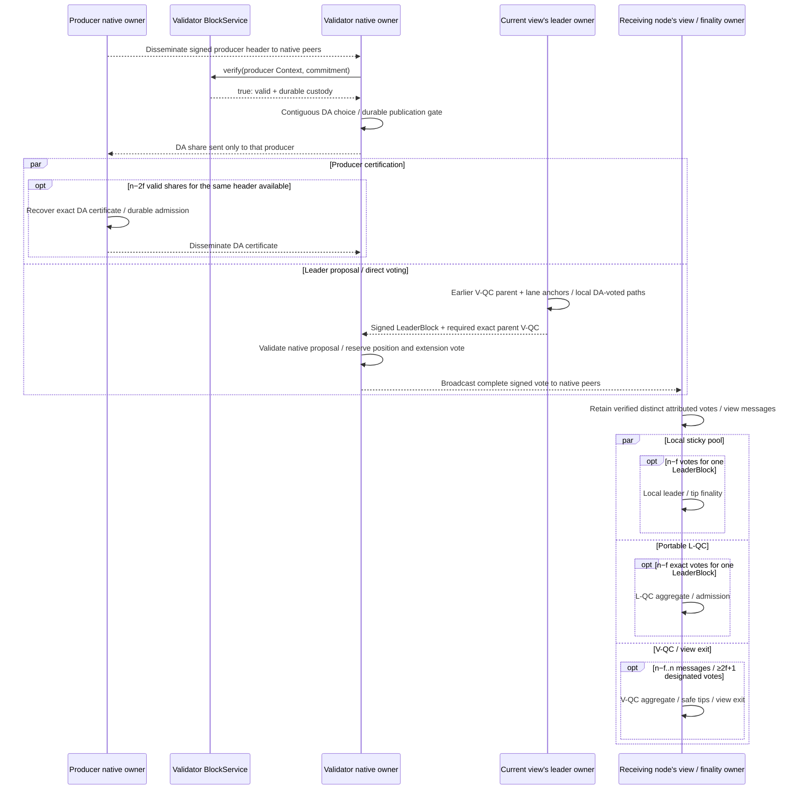

# Block proposal, DA, and cut finality

**Multimmit establishes availability and native ordering evidence.** Follow producer custody through header signing, DA, leader proposal, votes, and finality. Orderer later interprets the exact execution order in the canonical case.

## Normal native consensus: producer DA → leader proposal → finality

This connects body preparation to the normal native consensus path. One producer lane represents independently progressing lanes. Lifelines distinguish node roles and responsibilities inside Core.

[Open full-size diagram](../assets/diagrams/diagram-15.svg)

DA certification and leader proposal do not wait for each other to finish. A leader may also propose an uncertified DA-voted suffix satisfying native conditions. Complete votes are broadcast to native peers, each maintaining its own local pool. Local finality does not wait for L-QC creation or V-QC completion. Parallel branches describe independent work, without adding a join barrier. [DA / proposal / direct vote](https://github.com/commonwarexyz/monorepo/blob/534af0ede48affd35b2111522527547b4cc9bf72/consensus/src/multimmit/docs/STATE_MACHINE.md#L290), [DA-share and vote recipients](https://github.com/commonwarexyz/monorepo/blob/534af0ede48affd35b2111522527547b4cc9bf72/consensus/src/multimmit/machine/durability.rs#L616), [Certificates and local finality](https://github.com/commonwarexyz/monorepo/blob/534af0ede48affd35b2111522527547b4cc9bf72/consensus/src/multimmit/mod.rs#L149).

Finality here consists of sparse native facts. Building an exact ordered range requires [delivery and history interpretation](canonical.md#cut-commit--ordered-range--execution-commit). See the [native actor map](../consensus/README.md#native-actors-and-source-layout) for timeout, rescue, and view recovery, and [ordered-input evidence](../consensus/ordered-input.md#consensus-and-baton-integration) for the distinct V-QC and L-QC conditions. This explains pinned native behavior; it is neither an executed trace nor completed Baton policy integration.
