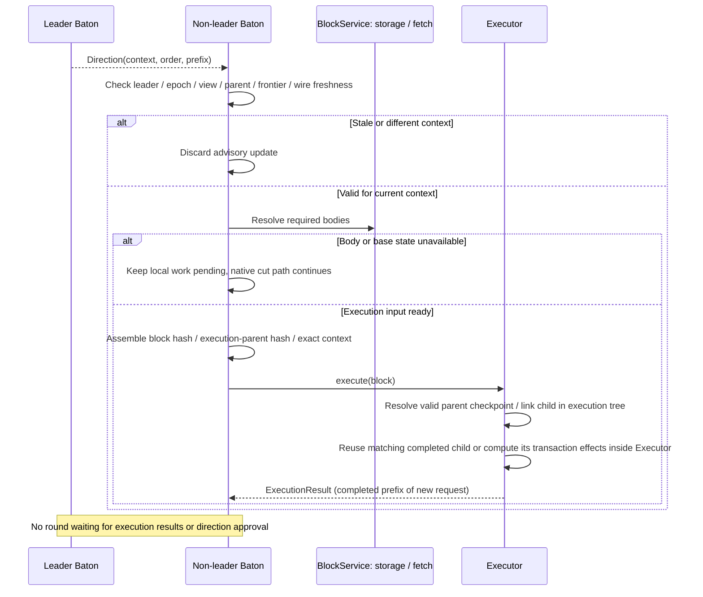

# Receiving direction and executing branches

**Non-leader Baton submits the new path; Executor links and executes its branches.** Baton verifies the leader and context, resolves required inputs, and sends parent-linked blocks through execute(block). Only a completed prefix with the same execution context is reusable.

## Non-leader lifecycle: direction and branch execution

[Open full-size diagram](../assets/diagrams/diagram-07.svg)

A direction change does not require reexecuting every block. Executor reuses only a checkpoint for an exact prefix already completed in the same order from the same input state and runtime. Advisory requests cannot roll back canonically applied state.
