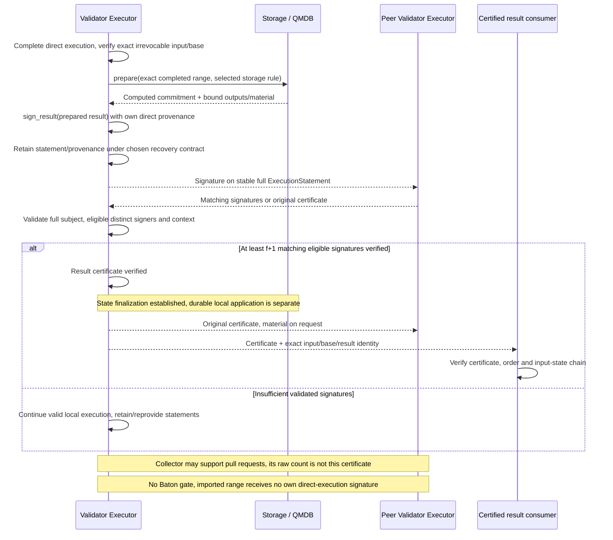

# Executor result certification and queries

**Executor certifies results signed by eligible validators.** It exchanges signatures directly with peer Executors. A verified f+1 certificate establishes a certified result; local durability is a separate milestone.

## Result endpoint: direct execution and f+1 certification

Signing and collection are **Executor responsibilities** using Commonware cryptographic primitives plus execution-context checks. Storage prepares the selected root and complete result/output binding before the signing call; execute does not hash every speculative attempt. The sequence shows direct signature exchange and collection between validator Executors. Certificates and change sets use the same execution-peer boundary without Baton relay. See [result certification interfaces](../execution/interfaces.md#result-certification-inside-executor).

[Open full-size diagram](../assets/diagrams/diagram-11.svg)

Do not aggregate signatures merely because their state root values match. The statement must bind the same exact input range, canonical predecessor, runtime, and full result. An imported certificate or synced result cannot become the receiver's own direct-execution signature. Common signing boundary and wire schema remain undecided. Compare full statements bound to the same [root kind/version and operation/batch-boundary interpretation](../execution/qmdb.md#qmdb-state-and-reuse-boundaries).

Reuse Commonware cryptographic primitives for signing and signature verification. The common single-signature entry points are [`Signer::sign(namespace, msg)`](https://github.com/commonwarexyz/monorepo/blob/534af0ede48affd35b2111522527547b4cc9bf72/cryptography/src/lib.rs#L93) and [`Verifier::verify(namespace, msg, sig)`](https://github.com/commonwarexyz/monorepo/blob/534af0ede48affd35b2111522527547b4cc9bf72/cryptography/src/lib.rs#L130).

Executor constructs ExecutionStatement, checks eligible epoch identities, and verifies that distinct identities signed the same full statement. Native [message signing](https://github.com/commonwarexyz/monorepo/blob/534af0ede48affd35b2111522527547b4cc9bf72/consensus/src/multimmit/scheme/bls12381_threshold.rs#L1143) and [verification](https://github.com/commonwarexyz/monorepo/blob/534af0ede48affd35b2111522527547b4cc9bf72/consensus/src/multimmit/scheme/bls12381_threshold.rs#L1189) are examples of primitive calls. Scheme, keys, domain, codec, and aggregation remain undecided; the example BLS scheme is not adopted as the default.
