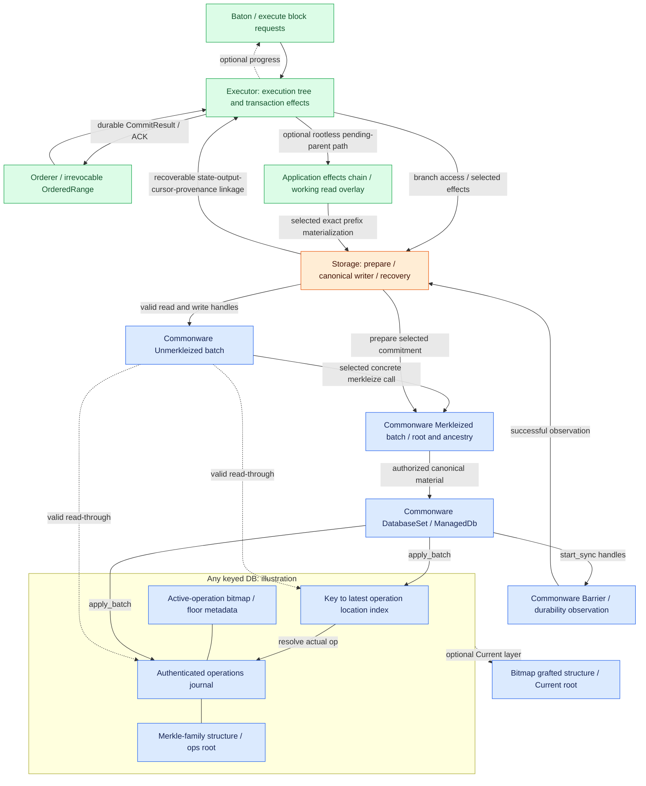
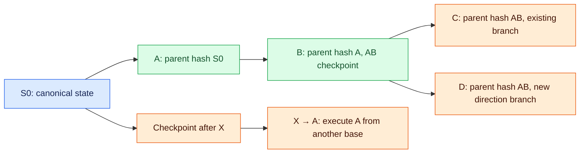

# QMDB branches, reuse, and state application

**Executor produces changes; Storage prepares their roots and applies the selected canonical result through QMDB.** A checkpoint marks reusable completed work and need not imply hashing every abandoned attempt. QMDB supplies batch, authentication and persistence algorithms. Readable state and durable completion are separate milestones.

## QMDB state and reuse boundaries

QMDB here is the authenticated database family implemented in Commonware `storage::qmdb`. Database state is derived from an append-only log of state-changing operations. Executor interprets transactions/bodies and produces state reads and mutations. Storage gathers completed Executor changes into QMDB batches, computes selected commitments and applies/persists valid canonical material. QMDB itself is neither a transaction execution engine nor native consensus. [Terminology and lifecycle](https://github.com/commonwarexyz/monorepo/blob/534af0ede48affd35b2111522527547b4cc9bf72/storage/src/qmdb/mod.rs#L1).

For mutable keyed Any, internal structures include an **operations journal**, **key-to-latest-operation index**, **active-operation bitmap**, and **operations root**. Reads find candidate locations through the index, check the journal operation and key, and return the value. Its snapshot field names the current-key index, not an immutable historical Baton state snapshot. [Any fields](https://github.com/commonwarexyz/monorepo/blob/534af0ede48affd35b2111522527547b4cc9bf72/storage/src/qmdb/any/db.rs#L57), [Lookup](https://github.com/commonwarexyz/monorepo/blob/534af0ede48affd35b2111522527547b4cc9bf72/storage/src/qmdb/any/db.rs#L203).

The operations journal combines a contiguous item journal and a Merkle-family structure. An operation location maps to the Merkle leaf at that location and supports inclusion proofs. This does not replace body archives or consensus vote journals. Storing runtime outputs or receipts there is an application encoding/commit-adapter choice. [Authenticated journal](https://github.com/commonwarexyz/monorepo/blob/534af0ede48affd35b2111522527547b4cc9bf72/storage/src/journal/authenticated.rs#L1).

Current adds a bitmap/grafted Merkle layer authenticating which operations remain active over Any history. Its canonical root commits to that storage view and differs from an ops-only root. Do not assume it forgets historical operations and authenticates only a separate logical application-state map. The root used in execution certificates remains a decision. [Current structure](https://github.com/commonwarexyz/monorepo/blob/534af0ede48affd35b2111522527547b4cc9bf72/storage/src/qmdb/current/mod.rs#L32), [Fields](https://github.com/commonwarexyz/monorepo/blob/534af0ede48affd35b2111522527547b4cc9bf72/storage/src/qmdb/current/db.rs#L122), [Wrapper](https://github.com/commonwarexyz/monorepo/blob/534af0ede48affd35b2111522527547b4cc9bf72/glue/src/stateful/db/current.rs).

An unmerkleized batch retains pending writes and its parent branch before application. Merkleization produces a sealed batch with resolved operations, computed root, and ancestor metadata. Merkleization itself does not commit the canonical database. [Branch management](qmdb.md#manage-the-branch-tree-for-execution-requests) explains child prefix trees and access validity.

`glue::stateful::db` wraps concrete QMDB types in Unmerkleized, Merkleized, ManagedDb, and DatabaseSet lifecycles. DatabaseSet coordinates one or more databases and collects their finalize flush handles in a Barrier. Coordinating databases does not itself establish crash-atomic state/output/cursor commit. See [canonical durability](qmdb.md#commit-a-branch-to-canonical-state).

[Open full-size diagram](../assets/diagrams/diagram-17.svg)

A merkleized QMDB batch supplies sealed storage work, roots and ancestry. Storage creates that storage material; Executor retains the execution checkpoint binding exact runtime, input prefix, completed direct work and outputs. Imported provenance stays distinct. Local access generations and retention metadata are not shared signature fields.

The orange Storage adapter connects existing DatabaseSet / ManagedDb APIs to application commit responsibilities; it does not require changing those upstream traits. The internal Any/Current diagram is illustrative, not a variant selection. Keyless, Immutable, and compact have different access and retention structures. Review concrete APIs before choosing reuse scope; no variant is adopted yet. Executor transaction/tree logic is a new application responsibility, while QMDB indexing, journals, and Merkle algorithms remain Commonware responsibilities.

Reuse QMDB databases, batches and commit lifecycle directly. `commonware_glue::stateful` is a reference for parent forks, pending tips and recovery, but its block-DAG/Marshal contract differs from Multimmit merged execution order. **Do not depend on its Application or full actor.** Our execute result is completed effects; Storage prepares a selected root when needed. [Stateful source](https://github.com/commonwarexyz/monorepo/blob/534af0ede48affd35b2111522527547b4cc9bf72/glue/src/stateful/mod.rs).

| Logical storage action | Actual upstream API at native pin | Application adapter must additionally verify |
|---|---|---|
| Create batch at canonical base | `DatabaseSet::new_batches` | Exact base, runtime, cursor, and current database identity |
| Fork sealed pending parent | `DatabaseSet::fork_batches(&Merkleized)`, `Merkleized::new_batch` | Valid actual ancestor batch and exact execution prefix; not an unsealed-parent fork |
| Compute checkpoint after execution | `Unmerkleized::merkleize`, `Merkleized::root` | Completed work, deterministic root construction, root kind/version |
| Apply to canonical database | `DatabaseSet::finalize`, concrete `ManagedDb::finalize` | Proof-validated exact range applied by a single writer |
| Observe disk durability | `Barrier::durable` | Flush failures and recoverable state/output/cursor linkage |
| Read applied state | `DatabaseSet::readers` | Retained query/access scope; readable state is not a durable ACK |
| Prune operations / align database recovery | `DatabaseSet::prune`, `rewind_to_targets` | Active branch references, query/sync/replay retention, chosen recovery contract |

Merkleize each database's batch and compute its root. DatabaseSet has no single root/merkleize operation. Binding multiple database roots and outputs into one result is an open adapter contract. The names above refer to [database lifecycle traits](https://github.com/commonwarexyz/monorepo/blob/534af0ede48affd35b2111522527547b4cc9bf72/glue/src/stateful/db/mod.rs#L508); distinguish generic execution commands from upstream methods.

Generic Unmerkleized does not expose identical get/write/delete APIs across variants. Storage supplies access to the selected concrete methods; Executor computes transaction changes through that valid view. Storage::read is a proposed query contract; DatabaseSet::readers does not promise arbitrary historical cursor snapshots. Query and pruning policy define which versions remain readable.

**Reuse guarded reads and existing QMDB proof APIs for state queries.** If Current fits the chosen root scheme, ordered/unordered `key_value_proof` authenticates an active value against its canonical root; ordered also supplies `exclusion_proof`. Their verifiers and bounded codecs already exist. Capture value, proof and root under the same valid DB read authority, then bind the retained canonical checkpoint and readiness metadata through Storage. Local `None` and historical operation inclusion do not prove current absence. A DB proof does not supply the full f+1 execution certificate, order/runtime checks or local durability; certificate queries stay in Executor. Reader handles are guarded access, not arbitrary historical snapshots. [Current value verifier](https://github.com/commonwarexyz/monorepo/blob/534af0ede48affd35b2111522527547b4cc9bf72/storage/src/qmdb/current/unordered/db.rs#L58), [Ordered absence verifier](https://github.com/commonwarexyz/monorepo/blob/534af0ede48affd35b2111522527547b4cc9bf72/storage/src/qmdb/current/ordered/db.rs#L144), [Proof generation](https://github.com/commonwarexyz/monorepo/blob/534af0ede48affd35b2111522527547b4cc9bf72/storage/src/qmdb/current/ordered/db.rs#L204), [Reader guard](https://github.com/commonwarexyz/monorepo/blob/534af0ede48affd35b2111522527547b4cc9bf72/glue/src/stateful/db/mod.rs#L205), [Historical operation scope](https://github.com/commonwarexyz/monorepo/blob/534af0ede48affd35b2111522527547b4cc9bf72/storage/src/qmdb/any/db.rs#L477).

## Existing APIs at the native pin and indexed release

The Commonware MCP was queried at explicit `v2026.9.0`. That release's lifecycle differs from Baton's native pin. The columns below are separate recipes; no dependency migration or type compatibility has been established.

| Operation | Adopted native pin `534af0e…` | Indexed release `v2026.9.0` |
|---|---|---|
| Batch at applied base | `dbs.new_batches().await` | Same family |
| Child of retained pending parent | `D::fork_batches(&merkleized_parent)` | Same family; sealed parent required |
| Root preparation | Concrete unmerkleized/staged `merkleize`; sealed `root` | Same family; inspect exact variant signatures |
| Canonical database-set application | `dbs.finalize(sealed).await` returns Barrier after apply/start-sync | `dbs.apply(sealed).await`, then `dbs.finalize().await` returns Barrier |
| Managed DB application | `finalize(self, batch)` returns DB plus flush handle | `apply(self, batch)`, then `finalize(self)` returns DB plus flush handle |
| Durable observation | `barrier.durable().await` | Same call; false/flush failure is not success |
| Recovery/prune | Existing target/rewind/prune APIs with durable retained targets | Mutation methods must not overlap; active barrier resolves before prune |

For the release recipe, a later apply may run while an already-returned durability barrier remains pending, but later changes need covering durability too. Observe the previous barrier before calling finalize again. Allowing later apply does not permit overlapping apply/finalize/prune/rewind method bodies. In the native recipe, finalize applies supplied batches and starts their flushes. Neither coordinates a crash-atomic application state/output/cursor/provenance record by itself. [Native database traits](https://github.com/commonwarexyz/monorepo/blob/534af0ede48affd35b2111522527547b4cc9bf72/glue/src/stateful/db/mod.rs#L344), [release database traits](https://github.com/commonwarexyz/monorepo/blob/v2026.9.0/glue/src/stateful/db/mod.rs#L344).

DatabaseSet has no tuple-wide merkleize or single root. Storage dispatches concrete per-DB operations and binds the chosen root representation/outputs/material under the selected rule. Root construction, signing boundary and deterministic normalization remain open.

## Give Executor concrete branch access

**Storage supplies a valid working batch; Executor uses it to read and compute changes.** At the applied canonical base, use `DatabaseSet::new_batches`. At a sealed pending parent, use `fork_batches` or the sealed batch's `new_batch`. The concrete attachment passes that authorized handle internally to Executor; this does not require another public application trait or Storage method. `Storage::read` remains a canonical query boundary, not a pending-parent reader.

Public `commonware_glue::stateful::db` exports `Shared`, `DatabaseSet`, `ManagedDb`, `Unmerkleized` and `Merkleized`. Its `any` / `current` modules supply the concrete batch wrappers. Reuse these Shared-backed wrappers where the chosen variant fits, without implementing glue's Application or starting its Stateful actor. Importing the DB utilities still uses the commonware-glue crate; its module is labelled ALPHA. [Public database utilities](https://github.com/commonwarexyz/monorepo/blob/534af0ede48affd35b2111522527547b4cc9bf72/glue/src/stateful/db/mod.rs#L106).

AnyUnmerkleized provides inherent `get`, `get_many`, owned `write` and `stage`; Current has corresponding methods. Generic Unmerkleized only provides merkleize, and DatabaseSet's unsealed output is merely Send. The production keyed path therefore uses the chosen concrete wrapper, not an assumed generic get/write trait. `qmdb::any::traits` is test/test-traits gated. `Reader` reads the applied DB and adds no pending-parent overlay. [Any wrapper methods](https://github.com/commonwarexyz/monorepo/blob/534af0ede48affd35b2111522527547b4cc9bf72/glue/src/stateful/db/any.rs#L110).

For one concrete DB, use its `ManagedDb::Unmerkleized` and `ManagedDb::Merkleized` projections. A generic seal helper additionally needs `DB::Unmerkleized: Unmerkleized<Merkleized = DB::Merkleized>`; ManagedDb's bounds do not imply that reverse equality. Tuple database sets require separate component sealing and an application result commitment. There is no tuple-wide upstream merkleize/root call. [ManagedDb bounds](https://github.com/commonwarexyz/monorepo/blob/534af0ede48affd35b2111522527547b4cc9bf72/glue/src/stateful/db/mod.rs#L341), [DatabaseSet bounds](https://github.com/commonwarexyz/monorepo/blob/534af0ede48affd35b2111522527547b4cc9bf72/glue/src/stateful/db/mod.rs#L508).

The inspected Any/Current unsealed and staged wrappers are owned, non-Clone handles; merkleize consumes them and their mutation maps are private. Retain exact application effects separately before consuming the only draft if AB must support multiple rootless children or later selected-prefix preparation. Otherwise retain the sealed AB and use its existing child fork, or reexecute missing effects. A sealed Any wrapper cheaply clones its Arc and matching Shared handle, which can supply PreparedResult's cloneable material. [Sealed clone](https://github.com/commonwarexyz/monorepo/blob/534af0ede48affd35b2111522527547b4cc9bf72/glue/src/stateful/db/any.rs#L174). These options preserve the open checkpoint/root policy.

**Keep existing prepared handles for each still-needed unapplied ancestor.** A child draft retains its immediate sealed parent strongly, while sealed parent links are Weak. Keeping only the leaf does not preserve every ancestor object needed for later reads, forks and merkleization. Reuse the existing handle ownership rather than duplicating QMDB's ancestor diffs; Executor still associates those handles with exact execution context. Release unused handles separately from Storage's durable-history pruning. [Child retention contract](https://github.com/commonwarexyz/monorepo/blob/534af0ede48affd35b2111522527547b4cc9bf72/storage/src/qmdb/any/batch.rs#L2587), [Weak sealed parent](https://github.com/commonwarexyz/monorepo/blob/534af0ede48affd35b2111522527547b4cc9bf72/storage/src/qmdb/any/batch.rs#L338).

Public `bounds()` exposes storage commitments and ancestor bounds, not live parent handles or execution-node identity. Current's bounds carry the ops-only root; its `root()` returns the canonical root. Use concrete DB applicability checks alongside the exact-context association and shared access fence. Public bounds do not replace that validation or determine the application result-root scheme. [Public bounds](https://github.com/commonwarexyz/monorepo/blob/534af0ede48affd35b2111522527547b4cc9bf72/storage/src/qmdb/batch_chain.rs#L65), [Current root distinction](https://github.com/commonwarexyz/monorepo/blob/534af0ede48affd35b2111522527547b4cc9bf72/storage/src/qmdb/current/batch.rs#L1052).

Before taking the canonical DB for by-value mutation, reuse concrete Any/Current `validate_batch` under the same writer/access authority as application. It checks authenticated ancestry/floors, not arbitrary material validity, exact application input or provenance. It does not prevent later I/O, grafted-state or cancellation failures. Preserve the existing fencing and recoverable commit contract. [Any preflight](https://github.com/commonwarexyz/monorepo/blob/534af0ede48affd35b2111522527547b4cc9bf72/storage/src/qmdb/any/batch.rs#L2733), [Current preflight](https://github.com/commonwarexyz/monorepo/blob/534af0ede48affd35b2111522527547b4cc9bf72/storage/src/qmdb/current/db.rs#L776).

## Defer roots without inventing an unsealed-parent fork

There are three distinct paths:

| Path | Existing reuse | Remaining adapter |
|---|---|---|
| Continue one unsealed attempt | Any unmerkleized `write`, `get` and `get_many` read pending writes before sealing | Exact execution/outputs tracking; no root needed for each transaction |
| Fork a sealed checkpoint | QMDB merkleized child batches and ancestor validation | Select useful checkpoint boundaries; do not seal every attempt automatically |
| Branch from a completed unsealed prefix | Independent existing drafts at one valid applied/sealed anchor can receive retained exact-parent keyed mutations | Conditional replay/materialization or an application overlay; reviewed fork API does not supply an unsealed-parent tree |

Any's staged `stage`/`expand` can retain read locations and avoid later re-probes, but values computed by the caller do not appear in subsequent staged reads until supplied at merkleization. The caller needs read-your-writes in its working overlay; stage indices are not automatically deduplicated. Preserve the variant's update/upsert ordering. [Native batch interfaces](https://github.com/commonwarexyz/monorepo/blob/534af0ede48affd35b2111522527547b4cc9bf72/storage/src/qmdb/any/batch.rs), [release staged expansion](https://github.com/commonwarexyz/monorepo/blob/v2026.9.0/storage/src/qmdb/any/batch.rs#L1318).

**A separate generic read-view engine is not required for every rootless branch.** Plain concrete Any/Current drafts already read their own pending `write` values. For rootless AB with children C and D, a conditional alternative is to retain Storage-ready mutations for the exact AB prefix, create independent existing drafts at the same valid applied/sealed anchor, replay those mutations, then execute C or D through each draft's existing `get`/`write`. This is materialization using existing batches, not `fork_batches` on an unsealed parent or cloning private mutations. The path is unavailable without valid retained effects and anchor access. [Concrete reads/writes](https://github.com/commonwarexyz/monorepo/blob/534af0ede48affd35b2111522527547b4cc9bf72/glue/src/stateful/db/any.rs#L93), [sealed-parent fork and applied-base capture](https://github.com/commonwarexyz/monorepo/blob/534af0ede48affd35b2111522527547b4cc9bf72/storage/src/qmdb/any/batch.rs#L2603).

Replay must use base-bound keyed mutations under the chosen deterministic normalization, not arbitrary logical ChangeSet merging. A fresh applied batch cannot rewind an advanced DB to an earlier state. Retain outputs and direct-execution evidence separately, and preserve writer/read fencing during replay and hashing. Flattening several prefixes into one batch need not preserve the operations root of separately sealed intermediate batches. Replay and an application overlay remain alternatives; neither chooses the root or checkpoint policy.

Constantinople demonstrates staged transaction computation followed by Merkleization of state and transaction-history batches. It still seals at its consensus block boundary; it does not implement Baton's deferred-root Multimmit tree. Copy that compute/hash separation where compatible, while keeping our Executor independent of glue Application. Alto's inspected application builds opaque test payloads and supplies body/consensus composition evidence, not a QMDB storage recipe. [Constantinople execution](https://github.com/commonwarexyz/constantinople/blob/3b6c92e76bf582855615844a4175b8304808f6a9/crates/application/src/consensus/execution.rs), [Alto application](https://github.com/commonwarexyz/alto/blob/1d87569348b5560699465a72d691d90f18affb9c/chain/src/application.rs).

Constantinople's concrete `compute` returns the existing staged batch plus computed indexed updates; a separate helper seals them. That supplies an internal Executor→Storage handoff shape without another batch engine. Kora instead returns application ChangeSet/receipts and uses an application overlay; its keyed conversion reads the current account generation, so that conversion must match the retained base. Neither example proves crash-atomic state/output/cursor commit or supplies a native rootless fork. [Staged handoff](https://github.com/commonwarexyz/constantinople/blob/3b6c92e76bf582855615844a4175b8304808f6a9/crates/application/src/consensus/execution.rs#L160), [Kora base-bound conversion](https://github.com/refcell/kora/blob/446b4c7aba80e8358486ddb43a276c5bfa183102/crates/storage/qmdb/src/store.rs#L266).

Deferral is not permission to change authenticated operation history independently at each node. Storage materializes the exact selected prefix under the chosen deterministic boundary/normalization rule. That rule and the complete input/base/result/output binding survive preparation and signing. The result commitment must exist before signatures; abandoned attempts need not be hashed. A rootless overlay may preserve AB effects without sealing AB, but cannot promise that a previously sealed ABC batch remains a child of a newly prepared, different AB commitment.

Identical transaction order and final logical values do not automatically imply identical operations history or roots when checkpoint batching or repeated-key normalization differs.

For example, writing `k=1` then `k=2` in one Any batch retains only the final mutation. Sealing between the writes adds a CommitFloor at each seal and changes the storage operation sequence. Both end with `k=2`, yet actual ancestor commitments need not match. [Reusing old ABC after new AB](qmdb.md#commit-a-branch-to-canonical-state) therefore checks actual ancestry and context, not only values. This illustrates a storage contract without claiming computed root results. [Write normalization](https://github.com/commonwarexyz/monorepo/blob/534af0ede48affd35b2111522527547b4cc9bf72/storage/src/qmdb/any/batch.rs#L1306), [Commit-boundary operation](https://github.com/commonwarexyz/monorepo/blob/534af0ede48affd35b2111522527547b4cc9bf72/storage/src/qmdb/any/batch.rs#L1228).

Deterministic derivation of canonical operations/batch boundaries versus separation of logical and storage roots remains open. Until resolved, do not directly use node-specific speculative-batching storage roots as f+1 matching execution results.

## Manage the branch tree for execution requests

The execution branch tree is a **parent-linked prefix tree of execution orders**, separate from producer-header ancestry. Each execute(block) input identifies its block hash and parent block hash; Executor resolves the parent to a valid execution checkpoint before linking and running the child. Hash identity must bind the exact predecessor state, runtime, and ordered inputs. A producer payload occurring after different execution prefixes needs distinct execution-node identity even when its body/header hash is unchanged. Concrete encoding remains open. All branches in this example start from the same canonical state S0.

[Open full-size diagram](../assets/diagrams/diagram-18.svg)

Changing `A→B→C` to `A→B→D` submits `execute(D)` with `parent_block_hash = hash(AB)`; Executor links D to completed AB and executes only D at the same S0 and runtime. There is no public reschedule operation. The A in `X→A` has a different input state and cannot be reused just because the block has the same name.

Executor validates parent hashes and base/context, and finds reusable checkpoints. It manages internal worker generations and retains parents required by child branches. A reused checkpoint must remain compatible with the current canonical frontier. Once AB is canonical, advisory direction cannot return to A→D. Committing AB retains valid C and D descendants. Committing ABD prunes the competing C branch and the X→A branch; canonical ancestor metadata remains as required for recovery and queries. Pruning must preserve worker-referenced state and checkpoints needed for commit/recovery. Numerical budgets and GC policies remain open.

Mutable keyed Any/Current batch read-through is a **branch-scoped view combining ancestor overlays with the applied database**, not an independent immutable snapshot. This description does not apply to variants such as compact that lack keyed get.

Advancing canonical DB to an actual ancestor commitment of a batch can remain valid. Advancing to a sibling invalidates continued branch reads, child creation, and apply. Before canonical application, quiesce or fence incompatible workers and those with unknown ancestry. [Batch applicability](https://github.com/commonwarexyz/monorepo/blob/534af0ede48affd35b2111522527547b4cc9bf72/storage/src/qmdb/batch_chain.rs#L188), [Stateful quiescence](https://github.com/commonwarexyz/monorepo/blob/534af0ede48affd35b2111522527547b4cc9bf72/glue/src/stateful/actor/core/verifications.rs#L158).

Invalidating a generation revokes **result adoption**. Fencing worker access blocks **reads, forks, and application against an invalid parent state**. Canonical DB may change after an owner checks the base but before it obtains access. Keep validation and use within acquired database-access authority through execution, lazy reads, stage/expand, materialization and merkleize. This fence must cover every shared/cloned database handle, not just one facade instance. The concrete [fencing protocol remains open](README.md#open-decisions).

CPU hashing over an immutable Merkle snapshot may finish after caller cancellation, with its result discarded. Canonical safety fencing need not wait for every background CPU task to terminate. Separate prevention of invalid live-DB access and stale-result admission from snapshot-reference/resource lifetime management. [Hashing cancellation](https://github.com/commonwarexyz/monorepo/blob/534af0ede48affd35b2111522527547b4cc9bf72/storage/src/journal/authenticated.rs#L325).

## Commit a branch to canonical state

| Step | Action | Required boundary |
|---|---|---|
| 1 | Verify ordered-range evidence, predecessor, runtime | Advisory local order is not canonical evidence |
| 2 | Find the completed branch prefix matching the exact range | Commit only the finalized prefix even if the branch is longer |
| 3 | Execute missing/mismatching suffix from canonical base or prepare verified peer material | Equal roots alone cannot substitute different inputs |
| 4 | Fence incompatible/unknown active workers; apply matching batches | Single canonical writer and valid branch-scoped reads |
| 5 | Produce durable CommitResult | State, outputs, and cursor must be recoverable together |
| 6 | Prune incompatible forks from the live execution tree; retain/reconnect compatible suffixes | Never reverse finalized input/interpretation; physical recovery alignment follows the selected contract |

If A→B→C was executed speculatively but the canonical range is A→B, apply only AB. C remains pending; preserving its work depends on actual ancestry and context. If AB is still speculative at the same base and canonical range becomes A→D, the B→C results cannot serve that commit.

Canonical promotion is more than changing a branch pointer. Executor selects and authorizes the canonical path; Storage applies/syncs QMDB writes and makes outputs, metadata, AppliedCursor and direct/imported provenance consistently recoverable after a crash. Logical pruning is part of commit: conflicting branches lose live-tree membership and result-adoption authority. Physical deletion releases batches/checkpoints only after worker references and required retention are clear. GC scheduling remains open and separate from durable state/output/cursor completion. Active-access fencing and required retention always remain necessary.

**Keep the commit connection inside Storage and reuse the existing persistence mechanisms.** A separate generic transaction, WAL or cursor engine is not mandatory.

| Selected data need | Existing mechanism | Application connection |
|---|---|---|
| Matching sealed state | Native `DatabaseSet::finalize` and `Barrier::durable` | Cover the exact prepared state; coordinate retained outputs/cursor/provenance separately |
| Small linked metadata collection | `Metadata::put` then `sync`, or `put_sync` | Atomic update of that store's pending metadata; exact record/recovery binding remains open |
| Deferred metadata persistence | `Metadata::start_sync` returns store plus completion handle | Await covering completion; later sync observes the retained previous completion before writing |
| Retained output/replay records, if selected | Existing variable Journal append/sync/Contiguous replay, or a fitting QMDB history batch | Chosen record encoding, durability and retention; append alone is not commit |

Metadata already implements versioned two-copy/checksum recovery and can commit several pending entries together. `put_sync` commits all pending metadata changes, not only its supplied key. Dropping the `start_sync` completion handle does not cancel the sync or erase its recorded failure. These guarantees apply within Metadata; they do not atomically commit QMDB plus an output journal. Storage connects the selected stores under its existing owner and validates exact recovered identities before issuing CommitResult. No record layout, sync ordering or recovery policy is selected here. [Metadata atomic scope](https://github.com/commonwarexyz/monorepo/blob/534af0ede48affd35b2111522527547b4cc9bf72/storage/src/metadata/mod.rs#L1), [public updates and completion](https://github.com/commonwarexyz/monorepo/blob/534af0ede48affd35b2111522527547b4cc9bf72/storage/src/metadata/storage.rs#L683), [Journal ownership/replay](https://github.com/commonwarexyz/monorepo/blob/534af0ede48affd35b2111522527547b4cc9bf72/storage/src/journal/contiguous/variable.rs#L2160).

If ABC is one sealed batch with no AB checkpoint, applying ABC and hiding C cannot commit only AB. Executor and Storage must prepare a separate boundary at AB from retained exact effects and a valid predecessor, or reexecute through AB when no usable prefix effects remain. new_batches starts at the currently applied database; it cannot automatically restore an earlier prefix after the database advances. [Actual base capture](https://github.com/commonwarexyz/monorepo/blob/534af0ede48affd35b2111522527547b4cc9bf72/storage/src/qmdb/any/batch.rs#L2704).

A new AB commitment differing from old ABC ancestry prevents automatic reuse of that sealed ABC batch. If AB is an actual ancestor, check that canonical DB operation count and authenticated ops root match its commitment. Continue old ABC only when storage applicability and exact input/runtime/completed-result context all hold. Storage checks floors; the owner checks application input, runtime, and output binding. [Storage bounds](https://github.com/commonwarexyz/monorepo/blob/534af0ede48affd35b2111522527547b4cc9bf72/storage/src/qmdb/batch_chain.rs#L98).

A sibling with apparently equal logical state cannot replace these conditions. Descendant access follows [branch validity](qmdb.md#manage-the-branch-tree-for-execution-requests). Durability remains separate from the finalized/barrier boundaries below.

As a reference only, existing glue Application::finalized may run once the database is readable while flush is still pending; our Executor does not depend on that trait. [Finalized callback](https://github.com/commonwarexyz/monorepo/blob/534af0ede48affd35b2111522527547b4cc9bf72/glue/src/stateful/mod.rs#L308). Do not connect it as a durable-completion callback. Check the Barrier::durable result from DatabaseSet::finalize and satisfy the selected state/output/cursor commit contract before reporting completion. [DatabaseSet / Barrier](https://github.com/commonwarexyz/monorepo/blob/534af0ede48affd35b2111522527547b4cc9bf72/glue/src/stateful/db/mod.rs#L558), [Stateful delivery ACK](https://github.com/commonwarexyz/monorepo/blob/534af0ede48affd35b2111522527547b4cc9bf72/glue/src/stateful/actor/core/processing.rs#L307).

| Execution / storage stage | Cancellation or failure means | Adapter must preserve |
|---|---|---|
| Branch work / waiting for Shared lock | No by-value canonical DB mutation yet | Discard stale results; stop invalid state access |
| Between Shared::write DB take and WriteSlot::put | Dropping/failing the future may leave DB outside the cell | Separate canonical mutation from advisory cancellation; a lost handle is not an ordinary retry |
| Applied database with flush pending | Readable, without confirmed durability | No ACK before barrier and state/output/cursor linkage complete |
| Barrier handle Closed / Aborted | Upstream returns false for handle closure documented at shutdown boundaries | No completion evidence; do not assume zero disk writes; recheck in recovery |
| Other deferred flush error | Fatal/panic boundary after applied DB advancement | No successful ACK and no claimed automatic rollback of the entire database set |

Shared is a writer-preferring lock. Holding an outer read guard while awaiting batch.get or another reacquisition of the same cell may deadlock behind a queued writer. Multi-DB lock order must follow DatabaseSet ownership discipline. Lock safety and crash atomicity of state/outputs/cursor are different requirements. [Shared ownership / locks](https://github.com/commonwarexyz/monorepo/blob/534af0ede48affd35b2111522527547b4cc9bf72/glue/src/stateful/db/mod.rs#L139).

Aborting a flush-completion handle does not imply canceling all underlying disk work. Distinguish task handles from completion handles. After lost completion, recover authoritative durable state and cursor and recheck. [Runtime handle kinds](https://github.com/commonwarexyz/monorepo/blob/534af0ede48affd35b2111522527547b4cc9bf72/runtime/src/utils/handle.rs#L26).
