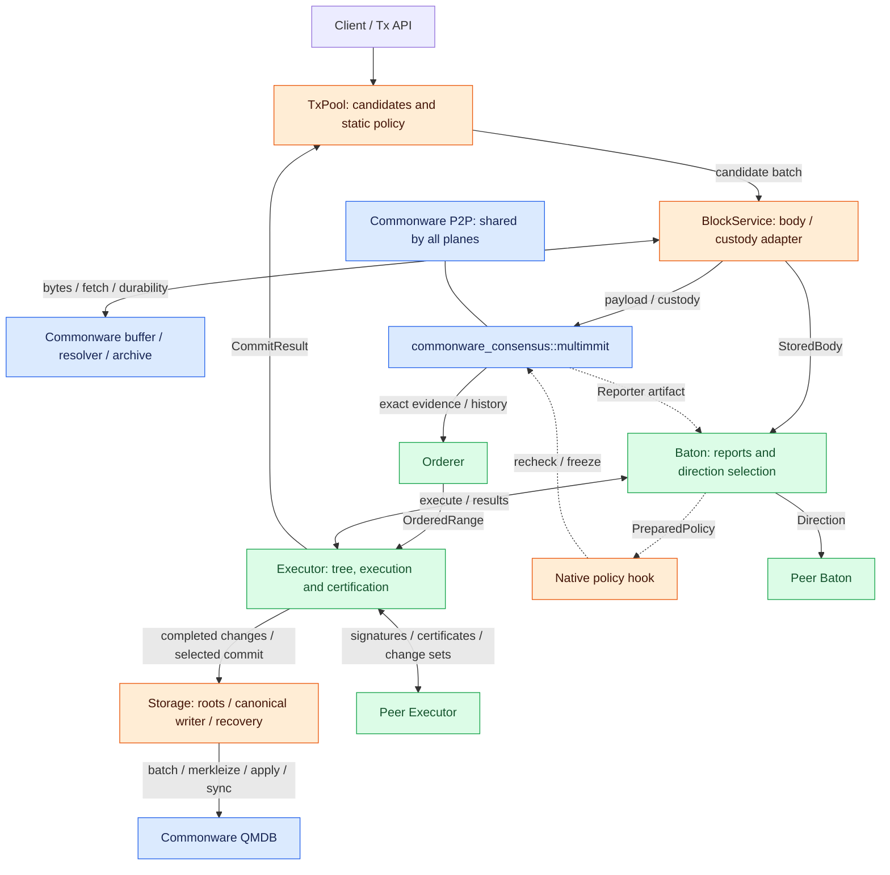

# Architecture

**The system collects transactions, agrees on their order, and applies their results to state.** Four layers share this work. TxPool prepares candidates, consensus fixes the order, Baton schedules work ahead of consensus, and Executor turns agreed inputs into durable state. Read the responsibilities first, then follow the interfaces below.

## Four layers

The Tx layer collects candidate transactions. Consensus commits to producer payloads and produces ordering evidence. Baton evaluates intended-order reports and shares direction for undecided blocks. Executor owns the execution tree and computes transaction changes. Orderer delivers finalized exact input directly to Executor. Storage prepares selected roots and applies canonical changes using QMDB. Receiving a body/direction, finishing computation, fixing order, certifying a result and durably applying local state are distinct milestones.

Here, **custody** means durably retaining the body and required parent material for the requested producer context so they can be recovered after a restart. [Block storage and custody](../consensus/block-body.md#body-dissemination-lookup-and-custody) describes the storage, fetch, and recovery connections.

[Open full-size diagram](../assets/diagrams/diagram-01.svg)

Blue marks existing Commonware engines/algorithms to reuse. Orange marks thin integration around existing components; it does not prescribe changing underlying buffer, resolver, archive or QMDB algorithms. Green marks new Baton or application semantics. BlockService directly implements upstream callbacks. Storage directly uses QMDB batches/roots/durability without adopting glue Application. Pool backend and static-analysis placement remain undecided. [Real-chain assembly recipes](../reference/integration.md#copy-the-assembly-from-real-chains) show where these components connect.

| Role | Reuse underneath it | Write at the application boundary |
|---|---|---|
| TxPool | A fitting ecosystem pool actor; existing Commonware P2P/runtime/codec | Payload hooks, bounded body packing and canonical-outcome connection; [pool choice stays open](../tx/README.md#reuse-an-existing-pool-without-importing-the-wrong-lifecycle) |
| BlockService | Buffered broadcast, generic resolver and Archive | Exact body/header/context binding, custody and retention through [upstream callbacks](../consensus/block-body.md#reuse-the-same-body-components-as-tempo) |
| Orderer | Native cryptographic verification; Archive/Journal/Metadata and resolver where their data fits | Exact witness handoff, merged-order interpretation and durable delivery; [native evidence alone is insufficient](../consensus/ordered-input.md#consensus-and-baton-integration) |
| Baton | Clock, supervised tasks, future pools, optional Strategy and shared P2P | Report admission, direction scoring and context checks; [no second scheduler](../baton/README.md#commonware-primitives-in-the-baton-layer) |
| Executor | Runtime tasks, crypto certificate building blocks and shared P2P | Transaction computation, execution-tree selection, exact result verification and peer sync control; [result contract](../execution/interfaces.md#reuse-certificate-building-blocks) |
| Storage | QMDB batches/Shared/DatabaseSet/Barrier; existing metadata/journal primitives where selected | Root preparation, authorized writer and recoverable state/output/cursor linkage; [storage contract](../execution/qmdb.md#commit-a-branch-to-canonical-state) |

Green roles therefore reuse infrastructure too. The colors identify responsibility boundaries, not a requirement to build a new actor, server or engine for every box.

Baton joins a StoredBody with its authenticated native header reference to produce a CandidateBlock. Existing Reporter notices for accepted artifacts can supply the header reference. The body/notice join adapter needs implementation; a new native header export hook is not automatically required.

Ordered delivery and history recovery belong inside the consensus attachment. Orderer does not require a separate archive server. Its verified evidence store and the body store should reuse Commonware storage and resolver components where their contracts fit.

## Inputs and outputs between layers

| Layer | Receives | Owns | Delivers |
|---|---|---|---|
| Tx: TxPool | Transaction bytes from clients or tx peers | Structural checks, admission, candidate retention, static analysis at the chosen integration point | A bounded candidate batch to BlockService |
| Consensus: BlockService + Multimmit + Orderer | Candidate transactions and peer bodies, headers, and proofs | Body construction and custody, native DA and consensus, reconstruction of continuous order from verified history | CandidateBlock to Baton; OrderedRange to Executor |
| Baton | Candidate blocks, ordering context, peer reports, leader direction | Intended-order reports, report-window admission, direction selection, validation and dissemination | Prepared policy to the native hook; parent-linked execute blocks to Executor |
| Execution: Executor + Storage | Baton execution requests, Orderer finalized input, peer certificates/material | Executor: effects, logical tree, certification and sync control. Storage: selected roots, canonical apply/flush, physical retention and recovery | Completed effects; peer results; durable receipt to Orderer/TxPool; optional progress to Baton |

## Data, control, and canonical paths

| Path | Flow | What completion establishes |
|---|---|---|
| Tx / body data | Tx API → pool → builder → body store / P2P → peer custody | Admission, body bytes and digest, local durable custody |
| Native consensus | Authenticated native network → batcher → voter / Core owner → signed artifacts | Producer ancestry, DA, view votes, native finality, extension evidence |
| Baton control | Known input / intended order → reports → leader snapshot → Baton planning → direction → execute parent-linked branches | Advisory execution order and a completed prepared candidate |
| Canonical input | Exact native evidence / policy history → Orderer → Executor::commit | A continuous, irreversible sequence of exact execution inputs |
| Execution result | Executor ↔ Executor: direct-execution signatures → f+1 result certificate verification | State finalization bound to irrevocable exact order and canonical input state |
| State preparation / application | Executor effects or verified peer material → Storage selected root / QMDB apply → durability and metadata linkage | Prepared commitment before signing; durable state/output/cursor/provenance before delivery ACK |

Receiving a body, collecting report support, authenticating an ordering decision, and applying state establish different facts. Completion on one path cannot stand in for evidence required by another.

## Workers and decision authority

| Module / native owner | State it may change | Next action |
|---|---|---|
| Native Core | Signing reservations, producer, DA, view, and finality state | Voter executes typed capabilities and publishes native artifacts |
| BlockService | Body/header correlation and custody/retention integration around primitive handles | Completes upstream Automaton requests; buffer/resolver/archive own generic work |
| Orderer | Verified retained evidence, terminal slots, emitted and acknowledged cursors | Delivers OrderedRange to Executor; fetches history across gaps |
| Baton | Window reports, candidate evaluation, prepared-policy cache, intended order, authenticated direction context | Broadcasts direction, passes prepared policy, calls Executor |
| Executor | Execution tree, completed effects, logical branch pruning, signatures/certificates and sync switching | Exchanges peer results; selects exact canonical material; returns completed effects or durable receipts |
| Storage | QMDB bases/batches/roots, canonical writer/access fence, durable state and physical retention | Prepares selected commitments; applies authorized material; recovers state/outputs/cursor/provenance |

Baton workers evaluate direction candidates. Executor workers compute transaction effects and verify results. Native Core decides policy adoption in actual native context. Executor selects exact canonical paths and authorizes direct/imported material; Storage checks applicable ancestry/access and serializes database mutation. Logical branch management and the storage writer are separate authorities, even when they share one implementation. Wire-direction freshness, local worker generations and the stable signing subject use different identity rules.

**Executor owns state finalization and state sync, including peer communication.** Baton selects direction and requests parent-linked speculative execution, then receives local execution results. Executor handles branch changes through execute(block), then canonical promotion and conflicting-branch pruning through commit(range). Orderer sends finalized input directly to Executor; Executor reports durable completion to Orderer and TxPool. Receiving, approving, or acknowledging a Baton message is not a condition for finalization, sync, or canonical application. Signatures, certificates, and change sets travel directly between Executors. State sync is an option on the normal validator execution path. See [Execution responsibilities](../execution/README.md#roles-and-responsibilities) and [State sync](../execution/state-sync.md#state-sync-from-certified-execution-results) for verification, switching, and storage requirements.
