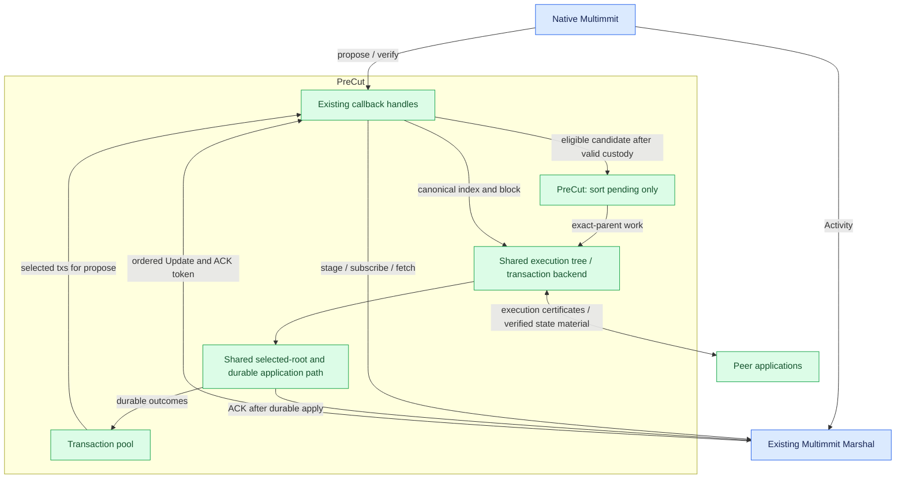

# Pre-cut execution without Baton

**PreCut is an app-owned scheduler that executes eligible blocks before their canonical order arrives from Multimmit Marshal.** The app then reuses matching work or repairs the changed suffix. It shares the transaction pool, body format/custody, execution backend, storage, result protocol and measured endpoints with the Baton app configuration.

PreCut has no Baton instance, report window, direction exchange or report-dependent native policy. It is a separate scheduling mode, not Baton with reporting disabled. Native Multimmit and Marshal supply the same ordinary canonical block order as Original. These are implementation-design documents; no runnable scheduler, E2E result or benchmark is claimed.

## Architecture and responsibilities



[Open full-size diagram](../assets/diagrams/diagram-19.svg)

| Owner | Responsibility |
|---|---|
| App transaction pool | Admit/classify/retain txs, select bounded stable bytes in propose, maintain canonical outcomes |
| Native Multimmit | Producer headers, DA, proposals, votes, finality, tip extraction, extension and native recovery |
| Existing Multimmit Marshal | Durable body custody, relay, native proof/history verification, backfill, ordinary dense order and recoverable delivery cursor |
| App PreCut scheduler | Candidate deduplication, pending-only global ordering and dispatch with exact execution parents |
| Shared app execution/storage code | Transaction effects, branch reuse/repair, selected roots, writer/fencing, durable apply, result certification and peer sync |

No separate BlockService, Orderer, Executor or Storage public trait is required. Existing Marshal already implements the ordinary ordering/custody/delivery machinery that earlier drafts assigned to a new baseline attachment. The app implements transaction semantics and scheduling through concrete internal code.

## Inputs and Rust connection points

| Existing entry | PreCut app behavior |
|---|---|
| `Automaton::propose(context)` | Select from app pool, build/stage the complete block, return body digest through the one-shot response |
| `Automaton::verify(context, digest)` | Validate body/context and durable custody, then admit eligible speculative work without awaiting execution |
| Optional native `Reporter<Activity>` | Consume useful authenticated header/context observations; do not use lossy hints as the canonical stream |
| Marshal `Reporter<Update>` | Retain canonical index/block/ACK, reconcile/apply work asynchronously, ACK matching durable application |

Live verify-based intake applies to validators, including nonproducing validators. `Role::Observer` has no live per-chain validation planes; it executes canonical Updates unless an explicit authenticated early-candidate intake is added. `verify` also runs for local pre-sign custody and startup recovery. A callback is not automatically another-lane packet arrival. Qualify lifecycle, lane, exact authenticated context/reference, duplicate state and applied position before admitting a candidate. Header and body arrival order can differ. Preserve native authentication and body validation; no DA-certificate barrier is added merely for speculation. [Callback contract](../baton/interfaces.md).

```text
app handles successful verification:
    establish valid body and durable custody
    on App owner, refresh exact candidate facts
    if live, eligible and not already applied or claimed:
        admit candidate to PreCut pending work once
    reply true without awaiting speculative execution

PreCut dispatch:
    preserve completed/current path F
    sort only eligible unstarted pending work by G
    with valid exact predecessor and available worker capacity:
        on App owner, claim pending work and record its current attempt before launch
        launch transaction computation from that predecessor

app handles Marshal Update:
    retain Update and return promptly from report
    consume index in canonical order
    if this exact index/block is already durably applied:
        ACK redelivery and return without applying again
    reuse matching work or complete/repair from exact predecessor
    recheck current predecessor and writer authority before mutation
    apply exact result with recoverable app identity and outputs
    on App owner, publish the matching durable canonical advance once
    ACK after durable application
```

These are app-handler steps, not new public methods. The actual Rust signatures and typed callback-handle composition are in [Rust interfaces](../overview/rust-interfaces.md). Temporary body/dependency loss keeps verify pending; speculative capacity cannot make valid content permanently invalid. An unavailable speculative opportunity does not remove later canonical work from the Update path.

## Candidate arrival and speculative execution

Preserve completed/current order `F` on one valid path and use `F ++ sort_G(S_pending)` for local intent. PreCut produces no report, but uses the same eligibility and global pending rule as Baton's ordinary scheduling. With G = A→B→C, C then B admitted while A runs and before C starts yields ABC. Once C has started on A, a late eligible B yields ACB. Do not wait for hypothetical B or reexecute C solely because B arrived.

A producer-header parent is not an execution predecessor across lanes. Dispatch resolves the exact base, runtime and preceding input checkpoint. While that predecessor runs, admission only changes pending order. Incomplete, canceled or stale work cannot serve as a reusable completed result. Check [execution ancestry and QMDB applicability](../execution/qmdb.md#manage-the-branch-tree-for-execution-requests).

## Native ordering and repair on each confirmed update

**Repair is triggered by new canonical input from Marshal.** The ordinary native order is already implemented in the current Marshal; PreCut does not reconstruct it with a second app proof engine. Included missing blocks/history delay delivery/backfill; local absence is never evidence of an empty slot. Marshal presents complete blocks in canonical OutputIndex order.

| Local work / canonical prefix | App action |
|---|---|
| Completed ABC / canonical AB | Apply exact AB; retain compatible C when actual ancestry permits |
| Completed AC / canonical ABC | Reuse matching A; execute B on A, then repair C on AB or explicitly validate retained effects/outputs for AB and prepare C's checkpoint there |
| Completed ABC / canonical AXBC | Reuse matching A; execute X and repair affected B/C |
| No usable speculative result | Execute the exact ordered input from its valid predecessor |
| Duplicate Update after crash | Check exact durable applied identity and ACK without duplicate effects |
| Gap before next native output | Marshal backfills/holds delivery; native consensus continues |

A callback returning from `report` means local intake, not durable apply. The app owns the ACK until that block is durably applied. Matching speculation can reduce remaining work to preparation/persistence; a mismatch or missing work requires completion/repair first. Marshal's application-delivery window can fill while ACKs are outstanding, independently of native voting/finality. Do not signal ACK merely to make the callback nonblocking.

Canonical application and imports share one writer. Recheck descendants after the canonical base moves; stale completions cannot promote another branch. Persist recoverable state, outputs, applied index/block and direct/imported provenance before ACK. Marshal later persists its own cursor, so recovery must handle redelivery. Pool maintenance stays internal and can reconcile from durable outcomes.

Repair in response to an unfinalized cut proposal is still an open additional policy. This page adopts confirmed Update processing, not automatic tentative-proposal repair. Global comparator/tie-break and resource budgets remain open; the existing Marshal base order must not be confused with that speculative global rule.

## Result certification and state sync

Use the same [result verification](../execution/interfaces.md#result-certification-inside-executor) and [certified state-sync path](../execution/state-sync.md) as Baton. State finalization still requires irrevocable exact input/base plus `f+1` distinct eligible signatures on the same runtime/result statement. Durable application/read readiness is a separate endpoint.

App peers exchange results/material directly. A valid applicable certificate and material can replace unfinished local repair through the shared writer/fencing contract. Imported work cannot be signed as own direct execution. Keep this capability/configuration identical across comparisons and measure direct repair versus imported completion separately.

## Benchmark comparisons and measurements

| Configuration | Execution starts | Ordering coordination | Work after canonical input |
|---|---|---|---|
| Original | On ordered Update | Ordinary native Multimmit/Marshal | Execute and apply |
| PreCut | On eligible candidate plus valid execution parent | Same ordinary native order | Reuse/finish/repair and apply |
| Baton | Same ordinary speculative start | Reports/direction plus the still-required authenticated native policy extension | Reuse/finish/repair and apply |

Keep committee, topology, workload, pool/body behavior, native profile/cut cadence, global pending rule, execution/storage backend, root/checkpoint boundaries, worker limits and budgets matched. A Baton advisory-only run does not validate protected-prefix integration. Early proposals and frequent cuts are separate sensitivity experiments.

Measure latency distributions and throughput for ingress→ordering, ordering→verified result, primary state finalization and local durable/read readiness separately. Include computation, reused work, reexecution, canceled/discarded work, imports, hashing, queue/body/history waits and network/storage costs; distinguish required repair from transaction failure. Compare roots/outputs with deterministic execution of the same exact input/base. Lower post-cut work alone does not establish lower total cost.

## Implementation TODO and planned checks

- [ ] Assemble the app pool and real body with existing Automaton, Marshal mailbox/relay and ordered Update callback.
- [ ] Implement the independent PreCut scheduler and shared exact-parent execution/storage code.
- [ ] Connect durable Update application, idempotent crash redelivery and internal pool maintenance.
- [ ] Verify before/after-start A/C/B admission, local pre-sign and startup verify, missing body, duplicate candidate and saturated speculative capacity.
- [ ] Verify partial-prefix application, changed parent, stale completion, canonical writer/import races and direct/imported signature provenance.
- [ ] Verify native extension/view recovery and Marshal body/history gap handling without a second ordered-delivery implementation.
- [ ] Run matched Original/PreCut/Baton endpoint and cost measurements. Runtime checks and benchmarks are **Not run**.

The [shared execution decisions](../execution/README.md#open-decisions) remain open. Designing those choices and Baton's native protected-prefix integration are separate from reusing the already existing ordinary Marshal stream.
