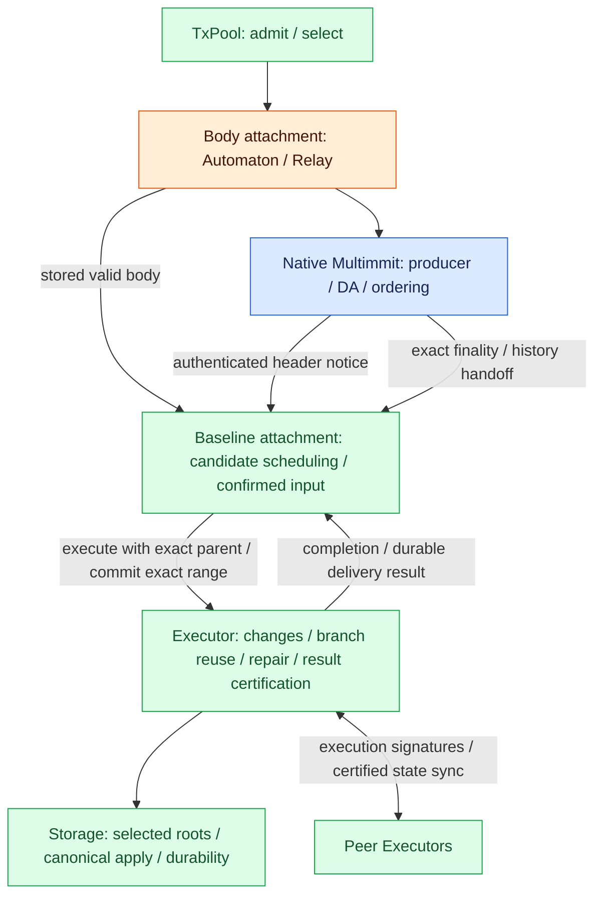

# Pre-cut execution without Baton

**This chain executes available blocks before native ordering is final, then reuses or repairs that work when confirmed order advances.** It is a separate baseline implementation for measuring what speculation alone achieves. Native Multimmit determines ordering facts; a baseline attachment connects candidates and exact confirmed input to the same Executor and Storage used by Baton.

Status: implementation design only. No baseline chain, E2E run or benchmark result is claimed. The working repair trigger is a newly verified continuous irrevocable ordering range. Whether to also repair on unfinalized cut proposals is awaiting user clarification; this page does not adopt that additional trigger.

## Architecture and responsibilities



[Open full-size diagram](../assets/diagrams/diagram-19.svg)

Blue is existing native machinery, orange is its body attachment, and green is application assembly shared with or adapted for this baseline. Executor/Storage are the same application components as the Baton experiment, not a second execution backend.

| Component | Responsibility in this implementation |
|---|---|
| TxPool | Admit RPC/peer txs, keep selected/unselected classes, select bounded batches and perform internal canonical maintenance |
| Body attachment | Implement existing Automaton/Relay/Reporter over broadcast, resolver and archive; build, fetch, validate and retain real bodies |
| Native Multimmit | Existing producer headers, DA, leader proposals, votes, finality, tip extraction, extension and view recovery |
| Baseline attachment | Join authenticated headers with bodies, sort pending candidates, submit execution requests, retain/verify native history, emit continuous confirmed input and track durable delivery |
| Executor | Parent-linked computation, exact-prefix reuse/repair, canonical branch promotion/pruning, result certification and peer state-sync control |
| Storage | Branch state access, selected batch/root preparation, authorized canonical application, durability and physical retention/recovery |

The baseline attachment is a logical application connection, not an upstream primitive or a mandatory separate actor. It uses no Baton instance, intended-order reports, report window, direction selection/broadcast, selected-prefix exception or Baton proposal policy. The ordinary baseline does not move native proposals earlier or alter cut frequency; such changes are separate sensitivity experiments.

## Inputs and Rust connection points

There are two external inputs. Execution completion and durable commit results are consumed by the existing task driver internally.

| Input | Admission and next action |
|---|---|
| `on_block(block)` | Require matching authenticated header and valid retained body; deduplicate; update eligible pending order and submit `Executor::execute` when the valid parent is ready |
| `on_finality(evidence)` | Verify/retain exact native source and history; derive continuous irrevocable input; submit `Executor::commit`; advance the recoverable cursor only after matching durable completion |

The following are proposed local method excerpts for this separate implementation. Names are explanatory placeholders; this is not an existing Commonware trait or an additional public Baton trait. Concrete types, error handling, channels and task placement remain open.

```rust,ignore
// Local baseline attachment methods; declarations only, not a standalone implementation.
/// Admit an authenticated header/body pair; preserve completed/current execution order.
/// Sort only eligible pending blocks and dispatch after the valid predecessor completes.
fn on_block(&mut self, block: CandidateBlock) -> Result<(), Error>;

/// Schedule exact native evidence/history processing independently of speculation.
/// Local admission is not finality verification or durable canonical completion.
fn on_finality(&mut self, evidence: NativeEvidence) -> Result<(), Error>;

// Calls into the existing Executor trait; full declaration is linked below.
/// Execute a block linked to its exact execution parent and context.
fn execute(&mut self, block: Self::Block)
    -> impl Future<Output = Result<Self::ExecutionResult, Self::Error>> + Send;

/// Reconcile and durably apply an exact irrevocable range, reusing valid completed work.
fn commit(&mut self, range: Self::OrderedRange)
    -> impl Future<Output = Result<Self::CommitResult, Self::Error>> + Send;
```

Reuse the [Executor and Storage contracts](../overview/rust-interfaces.md#executor), not Baton handlers with reporting disabled. Shared code for header/body joining, scheduling and native evidence delivery can be factored underneath both implementations without importing Baton report/policy semantics into the baseline. Successful local handler return is not a wire ACK or permission to advance the canonical cursor.

## Candidate arrival and speculative execution

1. Run the [existing producer/body callbacks](../consensus/block-body.md#interface-overview). A producer calls TxPool selection, builds and retains the body, returns its digest and uses Relay to schedule body dissemination.
2. Join the native authenticated header notice with its validated retained body. Either may arrive first. Raw network receipt, Reporter observation alone, or an unrelated body digest hit cannot create an executable candidate. Native DA and candidate intake proceed independently; do not add a DA-certificate barrier before speculation.
3. Preserve completed and currently executing order on the valid local path. Apply the same shared global rule and eligibility used for Baton's ordinary local scheduling only to not-yet-started pending blocks. An arrival while the predecessor executes only sorts pending; it does not restart that predecessor.
4. After its valid checkpoint is ready, dispatch the first eligible pending block with that exact execution parent. Executor computes changes; Storage need not hash every abandoned attempt. Existing checkpoint, context and lazy-read access checks still apply.

For global preference A → B → C, C then B arriving while A runs and before C starts yields ABC. If C already started on A before eligible B arrives, preserve AC and continue ACB. Do not wait for an unknown B or reexecute C merely because B arrived. The baseline constructs no report from this local path.

## Native ordering and repair on each confirmed update

**Reconcile when a new continuous irrevocable range is available, not on every received vote or observation.** Native sparse tip/finality projections do not automatically provide a dense application stream. Retain the exact selected native witnesses, parent/history and a fixed deterministic base ordering interpretation. Included slots emit, authenticated irrevocably-empty slots skip, and an unresolved earlier slot stops emission. New facts may resolve a gap or extend the range; they never reorder input already emitted/applied.

The concrete cross-lane base ordering/continuation rule and native source-export integration remain to be specified and proved. It must derive order from complete native evidence, not simply sort whatever bodies one node currently holds. This implementation omits Baton's report-dependent policy but still needs the body/history and continuous delivery work described in [native ordered-input integration](../consensus/ordered-input.md#consensus-and-baton-integration). That page assigns ownership to Baton for the Baton implementation; here the baseline attachment owns the equivalent base-policy delivery duties. A Reporter event or `Inspection::finality` snapshot alone is insufficient.

On each new exact range, Executor compares requested order, canonical input state and runtime with retained completed work. Reuse only matching validated effects/checkpoints. Finish missing work or repair the changed path from the correct predecessor, then prepare/apply that exact range. Do not relabel a checkpoint from another parent. Reuse beyond the matching prefix requires the same explicit dependency validation as the Baton backend; it is not assumed automatically.

| Local work / new confirmed order | Required action |
|---|---|
| Completed ABC / confirmed AB | Reuse valid AB; commit its exact boundary; retain compatible C pending when storage ancestry allows |
| Completed AC / confirmed ABC | Reuse matching A; execute B on A and C on AB unless the backend proves applicable reuse |
| Local ABC / confirmed AXBC | Reuse matching A; execute X and repair B/C for their new inputs |
| Confirmed included block with missing body | Fetch and remain pending; never treat missing content as an empty slot |
| Same range delivered again after lost completion | Recover/check idempotently; no duplicate canonical effects |
| Unresolved earlier native slot | Backfill evidence and pause continuous emission; native consensus continues |

Newly finalized input may arrive while speculation or another commit is active. Use the existing Executor generations/access fences and Storage single canonical writer. Recheck descendants against the new canonical base; late completion cannot promote stale work. Observe matching durable state/output/cursor/provenance linkage before retiring delivered input or performing pool cleanup. Branch physical reclamation still respects worker, query, history and state-sync retention.

This is incremental ordering plus on-demand repair, not a rule that reexecutes the entire chain after every cut. Selecting a new tentative proposal as an earlier repair trigger remains awaiting clarification; it is not silently mixed into this baseline.

## Result certification and state sync

Use the same [execution certification](../execution/interfaces.md#result-certification-inside-executor) and [certified state-sync path](../execution/state-sync.md) as the Baton experiment. The primary endpoint still requires irrevocable exact input and f+1 distinct eligible matching signatures over the same range, canonical base, runtime and result. Speculative completion alone cannot finalize state.

Executors exchange results/material directly. A verified applicable certificate and material may replace unfinished local repair under the shared switching/writer rules. Imported results cannot supply the node's own direct-execution signature. Keep state-sync configuration identical across comparisons and separately report direct repair versus imported completion. Durable application/read readiness remains a separate measured endpoint.

## Benchmark comparisons and measurements

| Implementation | Execution start | Ordering coordination | Work after confirmed input |
|---|---|---|---|
| Original | After exact irrevocable input | Fixed native base interpretation | Execute the confirmed input |
| Pre-cut execution, this implementation | As authenticated bodies and valid execution parents become available | Same native base interpretation; local pending sorting | Reuse matching work and repair/finish the remainder |
| Baton | Same ordinary speculative start | Intended-order reports, direction and authenticated proposal-policy integration | Reuse/repair under the same Executor/Storage contracts |

Keep committee, producer topology, tx workload/admission/selection, body services, ordinary global pending rule, native profile/cut cadence, execution backend, checkpoint/root boundaries, worker limits and resource budget identical. Record necessary source-export/instrumentation changes explicitly; do not introduce report-dependent native policy into the baseline. An advisory-only Baton run is not evidence that protected-prefix integration works.

Measure tx admission → exact ordering, exact ordering → verified execution result, primary state finalization, and durable/read readiness separately. Report E2E latency distributions, throughput, speculative computation, reused work, actual reexecution, discarded/canceled work, result imports, root-preparation cost, queue/body/history waits and network/storage overhead. Distinguish required repair from application-level transaction failure. Decreasing only post-ordering work does not establish lower total computation. Validate outputs/roots against a deterministic execution of the same exact input and base.

## Implementation TODO and planned checks

- [ ] Assemble native Multimmit with real TxPool and the existing broadcast/resolver/archive body components; keep voting and signing authority native.
- [ ] Implement baseline candidate admission, deduplication, shared pending sorting and exact-parent dispatch without a Baton instance or report/direction channels.
- [ ] Define/validate the fixed base cross-lane ordering and expose/retain exact native witnesses; add recoverable continuous range delivery independently of opportunistic Reporter notices.
- [ ] Connect Executor execute/commit and shared Storage preparation/application, fencing, result certification, state sync and durable delivery/pool maintenance.
- [ ] Instrument common endpoints and computation/network/storage costs under matched configurations; run Original, Pre-cut and Baton as distinct implementations.
- [ ] Run arrival A/C/B before and after C starts, partial-prefix commit, late predecessor, same-parent/root mismatch, included body missing, unresolved/empty slots, extension, native view change, canceled-worker completion and repeated range delivery after restart.
- [ ] Validate state-sync/direct-signing provenance, shared writer races and deterministic output/root agreement. All runtime checks and benchmarks are **Not run**.

Before implementation, resolve the repair trigger clarification, concrete base/global comparator and tie-break, batch boundary, failure/retry handling, speculative depth/budgets and native export/continuation proof. Existing [shared execution decisions](../execution/README.md#open-decisions) remain undecided; this baseline page does not fill them.
