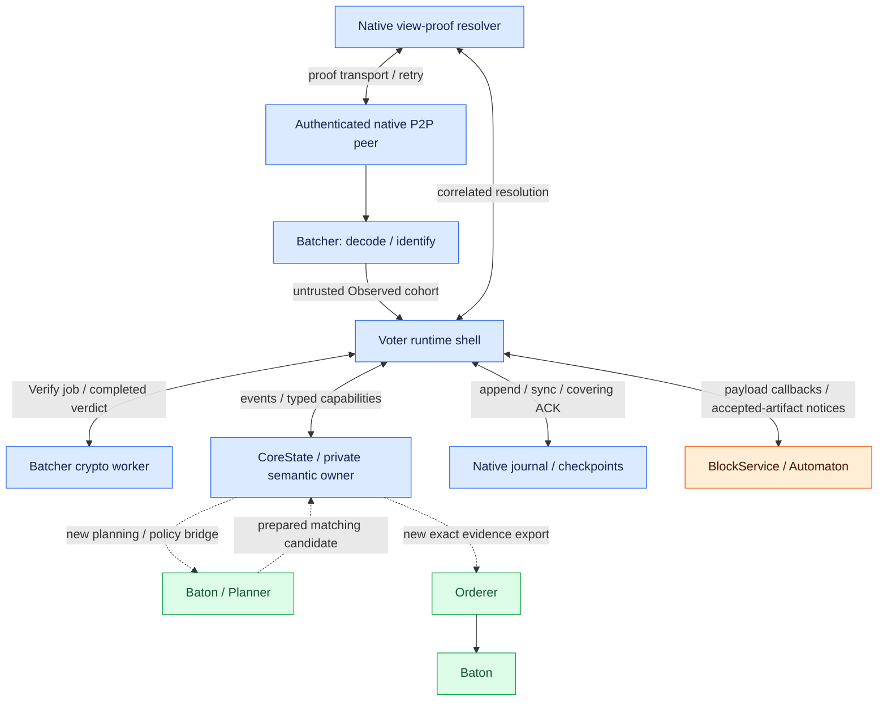

# Consensus: 역할과 native 구조

Native Multimmit이 producer DA·cut 합의·finality·recovery를 담당한다. 기존 actor와 Commonware 파일 구조를 중심으로 읽는다.

## 역할과 책임

기반은 `commonware_consensus::multimmit`이며, `n`은 validator committee의 identity 수, `f`는 가정하는 최대 Byzantine identity 수다. 이 설계는 `n=5f+1`을 기준으로 한다(native 일반 조건은 `n≥5f+1`). [Native fault model](https://github.com/commonwarexyz/monorepo/blob/534af0ede48affd35b2111522527547b4cc9bf72/consensus/src/multimmit/mod.rs#L58).

Native producer lanes, header signing, DA, view votes, finality·tip extraction·extensions와 recovery를 최대한 재사용한다. Tx selection·body 생성은 engine 내부의 내장 mempool 기능이 아니라 **engine이 호출하는 application adapter의 책임**이다.

Pinned `log-multimmit`은 body-free·delivery-free example이다. `Application::propose`는 deterministic commitment를 생성하고 `verify`는 true를 반환하며 `Relay`는 no-op이다. 실제 tx/body와 dense delivery를 붙이기 위해 이 application attachment를 확장한다. [Example README](https://github.com/commonwarexyz/monorepo/blob/534af0ede48affd35b2111522527547b4cc9bf72/examples/log-multimmit/README.md), [Application](https://github.com/commonwarexyz/monorepo/blob/534af0ede48affd35b2111522527547b4cc9bf72/examples/log-multimmit/src/application/actor.rs).

전체 native 흐름은 [actor / owner map](README.md#실제-native-actor와-파일-구조)에서 먼저 볼 수 있다. 다음 인터페이스는 그 흐름에 붙이는 application과 Baton 연결부다.

## 실제 native actor와 파일 구조

[그림 크게 보기](../assets/diagrams/diagram-16.svg)

그림의 두 Batcher 박스는 같은 actor의 ingress와 verification 경로다. Native runtime actor는 Batcher, Resolver, Voter 세 개다. Native core 색은 owner 구조와 기본 알고리즘의 재사용이다. 점선 bridge에는 실제 fork hook·schema·validity/recovery 수정이 필요하다. Producer는 별도의 native Producer actor가 아니라 이 owner 내부의 producer state와 capability로 진행된다. [Owner / capability model](https://github.com/commonwarexyz/monorepo/blob/534af0ede48affd35b2111522527547b4cc9bf72/consensus/src/multimmit/machine/mod.rs).

| 실제 위치 / 컴포넌트 | 무엇을 받는가 | 소유하는 처리 | 무엇을 내보내는가 |
|---|---|---|---|
| `examples/log-multimmit/src/main.rs` | Node args·committee·runtime / network config | Network 등록, application와 Engine 구성·시작 | Native planes, running handle |
| `consensus/src/multimmit/engine.rs` | Config, plane sender/receiver, retained journal | Store replay, recovered-payload custody fence, actor supervisor | Running handle와 inspector / retained proof serving |
| `actors/batcher` | Hostile native bytes·peer attribution | Bounded decode·artifact identity, owner가 발급한 crypto job 실행 | Untrusted observations와 별도 verification completions |
| `actors/resolver` | Missing native view-proof references | Decode·requested-view 분류·transport retry, verdict는 Core 소유 | Correlated completion / owner의 resolve·reject 처리 |
| `actors/voter` | Untrusted observations, verification completions, runtime jobs, journal ACK | Event를 semantic owner로 전달하고 typed capability 실행 | App callback 요청, network publication, journal append / sync |
| `machine/controller.rs: CoreState`, `machine/reducer.rs: Input / Capability / transition` | Correlated native events와 durable acknowledgements | Producer / DA / view / finality / signing / retention semantic state | Bounded typed capabilities와 verified native facts |
| `machine/view.rs` | Actual V-QC parent와 chain proposal inputs | Leader proposal / view vote validity·recovery | Transaction-free leader block·view transition |
| `machine/chain.rs` | Producer headers·DA facts·anchors | Producer ancestry / payload position / extension inputs | Native chain proposal와 position evidence |
| `machine/finality.rs` | Exact attributed vote pool와 source evidence | Final tips·settledness·evidence identity | Normalized FinalityFact; full application archive와는 다름 |

Voter의 `handle_runtime_event`가 observation·crypto/application completion·journal ACK를 owner에 전달한다. `CoreState::next_action`은 `CoreTurn::Input / Work / Idle / YieldRequired`를 반환하고, `drive_core_cycle`이 transition 또는 work를 dispatch한다.

Core가 발급한 `Capability`는 executor가 수행하고 async completion은 원래 job correlation을 가진 event로 돌아온다. Producer build의 digest completion은 header signing·DA·leader finality와 별개다. [Runtime events](https://github.com/commonwarexyz/monorepo/blob/534af0ede48affd35b2111522527547b4cc9bf72/consensus/src/multimmit/actors/voter/actor.rs#L1436), [Core cycle](https://github.com/commonwarexyz/monorepo/blob/534af0ede48affd35b2111522527547b4cc9bf72/consensus/src/multimmit/actors/voter/actor.rs#L1580), [Owner next action](https://github.com/commonwarexyz/monorepo/blob/534af0ede48affd35b2111522527547b4cc9bf72/consensus/src/multimmit/machine/controller.rs#L666), [Capability executor](https://github.com/commonwarexyz/monorepo/blob/534af0ede48affd35b2111522527547b4cc9bf72/consensus/src/multimmit/actors/voter/executor.rs#L74).

Batcher `Observed`는 artifact 서명 검증 전의 cohort다. Owner가 발급한 `Verify`의 verdict는 별도 completion으로 돌아오므로 observation admission과 authentication을 합치지 않는다. [Observation flush](https://github.com/commonwarexyz/monorepo/blob/534af0ede48affd35b2111522527547b4cc9bf72/consensus/src/multimmit/actors/batcher/actor.rs#L761).

Native data plane은 DA certificates도 포함한다. Channel 2의 certificate plane에는 nullification / V-QC / L-QC가 들어가므로 이름만 보고 DA certificate를 옮기지 않는다. Native resolver의 decode·requested-view 분류 역시 proof authenticity의 승인이 아니다. Correlated response의 cryptographic validity·admission·reject는 consensus owner가 결정한다. [Wire enum](https://github.com/commonwarexyz/monorepo/blob/534af0ede48affd35b2111522527547b4cc9bf72/consensus/src/multimmit/actors/wire.rs#L125), [Resolver contract](https://github.com/commonwarexyz/monorepo/blob/534af0ede48affd35b2111522527547b4cc9bf72/consensus/src/multimmit/actors/resolver/mod.rs#L1).

Producer의 `Automaton::propose` path와 여러 lane을 모으는 leader proposal path를 구분한다. Leader planning/policy hook은 public Automaton에 이미 들어 있는 callback가 아니며 private Core owner의 actual-context 경로에 별도 bridge가 필요하다. Source map의 native 컴포넌트를 외부에서 복제·drive하는 actor mirror를 만들지 않는다. [Native ownership](https://github.com/commonwarexyz/monorepo/blob/534af0ede48affd35b2111522527547b4cc9bf72/consensus/src/multimmit/machine/mod.rs), [Producer Context](https://github.com/commonwarexyz/monorepo/blob/534af0ede48affd35b2111522527547b4cc9bf72/consensus/src/multimmit/types/block.rs#L47).

Native private signing 계산은 durability 처리와 겹칠 수 있다. 보존할 safety 경계는 fresh local signature가 외부 publication으로 노출되기 전에 해당 signing reservation / domain change를 covering하는 durable acknowledgement를 확보하는 것이다. 문서의 build·sign 흐름을 signature 계산 자체가 반드시 모든 fsync 이후에 시작하는 것으로 읽지 않는다. Baton prepared completion은 signing authority가 아니며 native durability/publication gate를 건너뛰지 않는다.

Direct proposal validation과 V-QC 기반 rescue / view recovery 경로는 같은 callback를 그대로 반복하는 구조가 아니다. Baton policy를 direct proposal hook에서만 검사하는 것으로 인증 상속까지 완료했다고 볼 수 없다. 어떤 predicate를 direct vote 전에 검증하고 어떤 authenticated policy/evidence를 rescue와 ordered delivery가 상속할지 별도 연결 과제로 둔다. [View recovery](https://github.com/commonwarexyz/monorepo/blob/534af0ede48affd35b2111522527547b4cc9bf72/consensus/src/multimmit/machine/view.rs#L1380).
