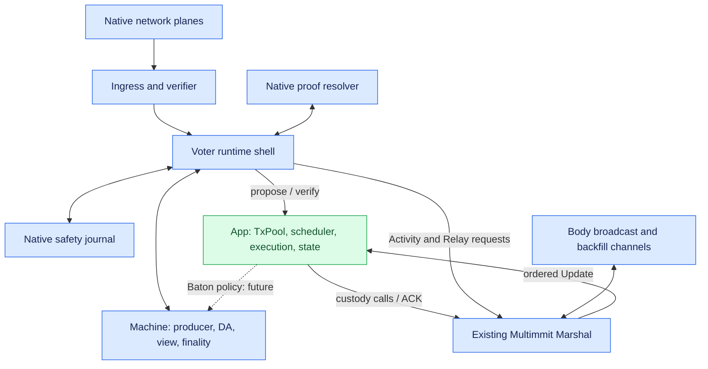

# Consensus: roles and native structure

**Connect one App to the existing Multimmit Engine and Multimmit Marshal.** Engine owns producer lanes, DA, voting and finality. Marshal owns complete block custody, history/body backfill, canonical ordering and delivery. App owns its TxPool, PreCut or Baton scheduler, transaction execution and application state.

This page follows the current parent checkout at [6233438985d8249d2b2bc1204191d5d405652288](https://github.com/0xEyrie/monorepo/tree/6233438985d8249d2b2bc1204191d5d405652288). The earlier `534af0...` research pin predates this Marshal implementation. See [source status](../reference/sources.md).

## Roles and responsibilities

| Existing boundary | Caller → implementation | App work |
|---|---|---|
| `Automaton::propose(Context)` | Engine → App ingress | Select transactions, build/stage a complete block, return its **body digest** |
| `Automaton::verify(Context, body_digest)` | Engine → App ingress | Obtain exact durable custody, validate payload, record eligible speculative work, resolve the verdict without waiting for execution |
| `Relay::broadcast(header_digest, ())` | Engine → existing Marshal Relay | Reuse the supplied Relay to broadcast the staged complete block |
| `Reporter<Activity>` | Engine → Marshal and optional App observer | Marshal consumes native observations; App may use them for candidate provenance/telemetry |
| `Reporter<Update<Block>>` | Marshal → App output ingress | Accept canonical index/block, reconcile execution, durably apply, acknowledge |

These are shared Commonware traits. Pass Marshal's mailbox directly as Engine's reporter. If App also consumes native Activity, use a separate typed handle from its finalized Update reporter: `Reporter` has one associated Activity type, even when both handles reach the same App owner. The existing [example assembly](https://github.com/0xEyrie/monorepo/blob/6233438985d8249d2b2bc1204191d5d405652288/examples/log-multimmit/src/node.rs#L260) shows the optional fanout. No additional public BlockService, Executor or Orderer trait is required.

Multimmit uses `n ≥ 5f+1`; Baton comparisons use `n=5f+1`. Keep native tip extraction, extension, signing and recovery. App transaction execution is separate from the private native `AppExecutor`, which dispatches local `propose`/`verify` jobs and returns completions to the machine. [Application contract and fault model](https://github.com/0xEyrie/monorepo/blob/6233438985d8249d2b2bc1204191d5d405652288/consensus/src/multimmit/mod.rs#L50), [callback executor](https://github.com/0xEyrie/monorepo/blob/6233438985d8249d2b2bc1204191d5d405652288/consensus/src/multimmit/actors/voter/actor/app.rs#L64).

## Native actors and source layout

[Open full-size diagram](../assets/diagrams/diagram-16.svg)

| Current source | Responsibility |
|---|---|
| `examples/log-multimmit/src/node.rs` | Register four native planes and two Marshal channels; construct/start App, Marshal and Engine |
| `consensus/src/multimmit/engine/mod.rs` | Validate config, recover stores and build actors in `open`; spawn them in `start` |
| `actors/ingress`, `actors/verifier` | Decode hostile native traffic and perform native cryptographic work |
| `actors/resolver` | Fetch native view proofs |
| `actors/voter/actor` | Execute machine capabilities; correlate async completions, publication and persistence |
| `actors/voter/chain_plane.rs` | Select ready producer validation jobs and call App `verify` |
| `machine` | Deterministic protocol state and transitions |
| `marshal` | Custody, native history/order reconstruction, backfill and acknowledged output delivery |

`Engine::open` can call `verify` while restoring retained payloads. Start App custody handlers and Marshal before opening Engine; waiting for `Running::ready` before servicing those callbacks deadlocks recovery. Readiness is separate from App execution progress. [Open/start](https://github.com/0xEyrie/monorepo/blob/6233438985d8249d2b2bc1204191d5d405652288/consensus/src/multimmit/engine/mod.rs#L446), [recovered verification](https://github.com/0xEyrie/monorepo/blob/6233438985d8249d2b2bc1204191d5d405652288/consensus/src/multimmit/storage/recovery.rs#L466).

Native producer `propose` builds one lane's payload. Leader blocks and certificates do not pass through Automaton. Baton policy needs the explicit [native proposal integration](decisions.md#todo-bind-baton-prefix-and-policy-to-cut-proposals); adding an App scheduler does not authenticate a new ordering policy.

## Commonware primitives in the consensus layer

Use current `multimmit::marshal::{open, Mailbox, Relay, Update}` with buffered broadcast, the supplied resolver bridge and `SchemeVerifier`. Marshal already composes its catalog, synchronizer, delivery and retention mechanisms. App implements body codec/digest and transaction validity. [Marshal module](https://github.com/0xEyrie/monorepo/blob/6233438985d8249d2b2bc1204191d5d405652288/consensus/src/multimmit/marshal/mod.rs), [concrete assembly](https://github.com/0xEyrie/monorepo/blob/6233438985d8249d2b2bc1204191d5d405652288/examples/log-multimmit/src/marshal.rs#L126).

`Activity` is best-effort and idempotent. Always give native activities to Marshal as the example does. Use [Marshal Update](ordered-input.md) for canonical application input and [verify](../baton/interfaces.md) for opportunistic early work. `CertificateRecorded` has a special retention release contract already consumed by Marshal. [Activity semantics](https://github.com/0xEyrie/monorepo/blob/6233438985d8249d2b2bc1204191d5d405652288/consensus/src/multimmit/types/activity.rs#L58).

For signed candidate provenance, correlate the retained candidate's exact header identity with `TransactionProposed.block` or `ProtocolAccepted` containing `Artifact::TransactionBlock`; neither supplies App execution or body custody. This meaning is artifact-specific: native DA shares are structurally prechecked before aggregate recovery. [Producer-header authentication](https://github.com/0xEyrie/monorepo/blob/6233438985d8249d2b2bc1204191d5d405652288/consensus/src/multimmit/scheme/bls12381_threshold/claims.rs#L234), [DA share admission](https://github.com/0xEyrie/monorepo/blob/6233438985d8249d2b2bc1204191d5d405652288/consensus/src/multimmit/actors/verifier/verify.rs#L92).

When adding App observation, put it beside the supplied Marshal mailbox in `Reporters`, without an intervening lossy App queue. Marshal routes releases to a per-chain coalescing catalog lane and retains/coalesces L-QC synchronization inputs under queue pressure. Header/history/direct-finality hints may be dropped; later proof-driven backfill can recover needed material, not replay every observation. Engine ignores Reporter feedback, so `Backoff` requests no retry and `Closed` requires node lifecycle handling. [Marshal ingress policy](https://github.com/0xEyrie/monorepo/blob/6233438985d8249d2b2bc1204191d5d405652288/consensus/src/multimmit/marshal/mailbox.rs#L99), [synchronizer policy](https://github.com/0xEyrie/monorepo/blob/6233438985d8249d2b2bc1204191d5d405652288/consensus/src/multimmit/marshal/actors/synchronizer/mailbox.rs#L152).
