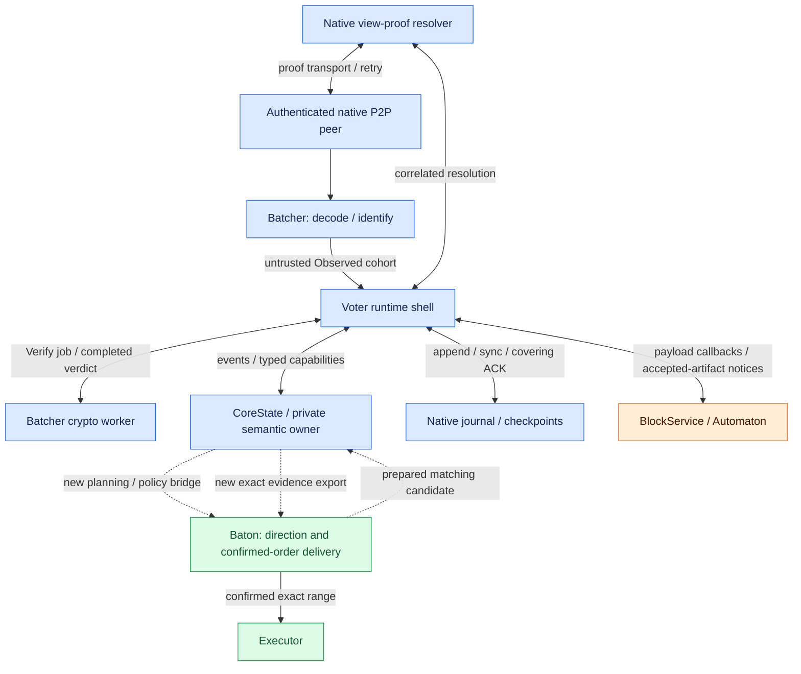

# Consensus: roles and native structure

**Multimmit agrees on native ordering facts; the application attachment supplies bodies and execution inputs.** Reuse its producer lanes, availability checks, voting, finality, and recovery. BlockService provides real transaction bodies, and Baton turns authenticated history into finalized input for Executor.

## Roles and responsibilities

The foundation is `commonware_consensus::multimmit`. `n` counts identities in the validator committee; `f` is the assumed maximum number of Byzantine identities. This design uses `n=5f+1`; the general native condition is `n≥5f+1`. [Native fault model](https://github.com/commonwarexyz/monorepo/blob/534af0ede48affd35b2111522527547b4cc9bf72/consensus/src/multimmit/mod.rs#L58).

Reuse native producer lanes, header signing, DA, view votes, finality, tip extraction, extensions, and recovery wherever possible. Transaction selection and body construction belong to **the application adapter called by the engine**, rather than a mempool built into the engine.

Pinned `log-multimmit` is a body-free and delivery-free example. `Application::propose` produces a deterministic commitment, `verify` returns true, and Relay is a no-op. Extend this attachment to supply real transactions, bodies, and continuous ordered delivery. [Example README](https://github.com/commonwarexyz/monorepo/blob/534af0ede48affd35b2111522527547b4cc9bf72/examples/log-multimmit/README.md), [Application](https://github.com/commonwarexyz/monorepo/blob/534af0ede48affd35b2111522527547b4cc9bf72/examples/log-multimmit/src/application/actor.rs).

Start with the [actor and owner map](README.md#native-actors-and-source-layout). The application and Baton interfaces attach to this existing native flow.

## Native actors and source layout

[Open full-size diagram](../assets/diagrams/diagram-16.svg)

The two Batcher boxes show ingress and verification paths of the same actor. Native runtime has three actors: Batcher, Resolver, and Voter. The native Core color marks reuse of ownership structure and base algorithms. Dashed bridges require actual fork hooks, schema, validity, and recovery changes. Producer work uses state and capabilities inside Core, without a separate native Producer actor. [Owner / capability model](https://github.com/commonwarexyz/monorepo/blob/534af0ede48affd35b2111522527547b4cc9bf72/consensus/src/multimmit/machine/mod.rs).

| Source location / component | Receives | Owns | Emits |
|---|---|---|---|
| `examples/log-multimmit/src/main.rs` | Node arguments, committee, runtime / network config | Network registration, application / Engine assembly and startup | Native planes, running handle |
| `consensus/src/multimmit/engine.rs` | Config, plane senders/receivers, retained journal | Store replay, recovered-payload custody fence, actor supervision | Running handle, inspector, retained proof serving |
| `actors/batcher` | Hostile native bytes and peer attribution | Bounded decoding / artifact identity; crypto jobs issued by the owner | Untrusted observations and separate verification completions |
| `actors/resolver` | Missing native view-proof references | Decoding, requested-view classification, transport retries; Core owns verdicts | Correlated completions for owner resolve/reject decisions |
| `actors/voter` | Observations, verification completions, runtime jobs, journal ACKs | Deliver events to semantic owner; execute typed capabilities | App callbacks, network publications, journal append / sync |
| `machine/controller.rs: CoreState`, `machine/reducer.rs: Input / Capability / transition` | Correlated events and durable acknowledgements | Producer, DA, view, finality, signing, retention semantic state | Bounded typed capabilities and verified native facts |
| `machine/view.rs` | Actual V-QC parent and chain proposal inputs | Leader proposal / view-vote validity and recovery | Transaction-free leader block and view transitions |
| `machine/chain.rs` | Producer headers, DA facts, anchors | Producer ancestry, payload positions, extension inputs | Native chain proposals and position evidence |
| `machine/finality.rs` | Exact attributed vote pool and source evidence | Final tips, settledness, evidence identity | Normalized FinalityFact, not a full application archive |

Voter's `handle_runtime_event` forwards observations, crypto/application completions, and journal acknowledgements to the owner. `CoreState::next_action` returns `CoreTurn::Input / Work / Idle / YieldRequired`; `drive_core_cycle` dispatches transitions or work.

The executor performs owner-issued Capability work. Async completion returns as an event with the original job correlation. A producer build digest completion is separate from header signing, DA, and leader finality. [Runtime events](https://github.com/commonwarexyz/monorepo/blob/534af0ede48affd35b2111522527547b4cc9bf72/consensus/src/multimmit/actors/voter/actor.rs#L1436), [Core cycle](https://github.com/commonwarexyz/monorepo/blob/534af0ede48affd35b2111522527547b4cc9bf72/consensus/src/multimmit/actors/voter/actor.rs#L1580), [Owner next action](https://github.com/commonwarexyz/monorepo/blob/534af0ede48affd35b2111522527547b4cc9bf72/consensus/src/multimmit/machine/controller.rs#L666), [Capability executor](https://github.com/commonwarexyz/monorepo/blob/534af0ede48affd35b2111522527547b4cc9bf72/consensus/src/multimmit/actors/voter/executor.rs#L74).

Batcher Observed is a cohort before artifact signature verification. The verdict for an owner-issued Verify job returns separately. Observation admission cannot be merged with authentication. [Observation flush](https://github.com/commonwarexyz/monorepo/blob/534af0ede48affd35b2111522527547b4cc9bf72/consensus/src/multimmit/actors/batcher/actor.rs#L761).

The native data plane includes DA certificates. Channel 2 carries nullification, V-QC, and L-QC; do not move DA certificates there based only on the plane name. Resolver decoding and requested-view classification also do not authenticate proofs. The consensus owner decides cryptographic validity, admission, and rejection of correlated responses. [Wire enum](https://github.com/commonwarexyz/monorepo/blob/534af0ede48affd35b2111522527547b4cc9bf72/consensus/src/multimmit/actors/wire.rs#L125), [Resolver contract](https://github.com/commonwarexyz/monorepo/blob/534af0ede48affd35b2111522527547b4cc9bf72/consensus/src/multimmit/actors/resolver/mod.rs#L1).

Keep producer `Automaton::propose` separate from the leader proposal that combines lanes. Leader planning/policy is not an existing callback on public Automaton; it requires a bridge into private Core actual-context handling. Do not create external actor mirrors that duplicate and drive these native components. [Native ownership](https://github.com/commonwarexyz/monorepo/blob/534af0ede48affd35b2111522527547b4cc9bf72/consensus/src/multimmit/machine/mod.rs), [Producer Context](https://github.com/commonwarexyz/monorepo/blob/534af0ede48affd35b2111522527547b4cc9bf72/consensus/src/multimmit/types/block.rs#L47).

Private native signing computation may overlap durability work. The safety boundary is a durable acknowledgement covering the signing reservation / domain change before a fresh local signature is externally published. The build/sign sequence does not require signature computation itself to start after every fsync. Baton prepared completion grants no signing authority and cannot bypass the native durability/publication gate.

Direct proposal validation and V-QC rescue / view recovery do not simply repeat the same callback. Checking Baton policy only on the direct proposal hook does not establish authenticated inheritance. Predicates before direct voting and the authenticated policy/evidence inherited by rescue and ordered delivery require separate integration. [View recovery](https://github.com/commonwarexyz/monorepo/blob/534af0ede48affd35b2111522527547b4cc9bf72/consensus/src/multimmit/machine/view.rs#L1380).

## Commonware primitives in the consensus layer

**Reuse the native consensus engine and generic body services; develop the adapters that connect them to application bodies and exact ordered input.** BlockService is the logical attachment over upstream callbacks. Baton owns the new exact-order interpretation/delivery integration internally; it is not a ready-made upstream primitive. Native evidence export remains an application bridge.

| Primitive | Where it connects | Application responsibility |
|---|---|---|
| Pinned `commonware_consensus::multimmit::Engine`; `Automaton`, `Relay`, `Reporter` | Native producer proposal/verification, payload relay and authenticated observations | Body/pool callbacks, custody readiness and evidence export; preserve native consensus authority |
| `commonware_broadcast::buffered::{Engine, Mailbox}` | Broadcast bodies and serve recent buffered messages | Bind a body to its digest and persist it before claiming durable custody; the bounded buffer can evict data |
| `commonware_storage::{archive, journal, metadata}` | Body/proof retention and durable recovery metadata | Key schema, retention obligations, delivery cursor and recovery fencing |
| `commonware_resolver::p2p::{Engine, Producer}` plus `Consumer`, `Resolver` | Fetch missing bodies, policy material and history from peers with retry | Validate returned data against the exact requested digest/context; decide which retained evidence is sufficient |
| `commonware_p2p::authenticated` and `commonware_codec` | Existing network channels and bounded body/evidence messages | Channel budgets, wire schema and context binding |

Native tip extraction remains the source of ordering facts. Continuous exact-order delivery, frozen Baton policy interpretation and recovery of missing history still need adapters and proofs. Existing Simplex Marshal/Deferred wiring is a useful assembly reference, not a verified unchanged Multimmit adapter.

See [body custody boundaries](block-body.md#body-dissemination-lookup-and-custody) and [versioned primitive evidence](../reference/integration.md#primitive-reuse-catalog).
