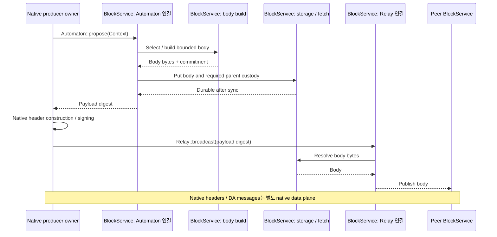
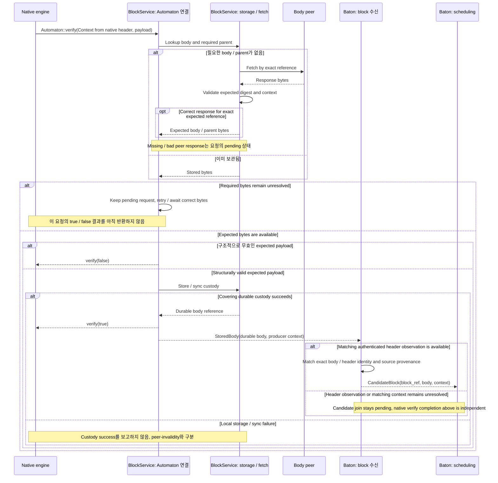

# Block body 송수신

Producer가 tx 본문을 만들어 전파하고, 수신 노드가 누락된 본문을 조회·검증·보관하는 과정을 설명한다.

## Block lifecycle: mempool → propose → body 전파

[그림 크게 보기](../assets/diagrams/diagram-04.svg)

Native core가 producer header의 signing authority를 소유한다. Builder는 body를 만들고 digest를 돌려준다. Application이 native header signer를 대신 호출하지 않는다.

## Block body 송수신: 조회·검증·누락 처리

[그림 크게 보기](../assets/diagrams/diagram-05.svg)

Bad peer가 다른 digest의 bytes를 보내는 것과 expected payload 자체의 permanent invalidity는 구분한다. 임시 미가용·본문 fetch 지연을 invalid 판정이나 empty slot 판정으로 바꾸지 않는다. Native DA 검증은 speculative execution 완료를 기다리는 계약으로 만들지 않는다. `StoredBody`는 application validity / custody 사건이다. Baton의 block 수신 부분은 Reporter의 accepted-artifact 알림에서 인증된 header를 찾는다. 보관한 body와 producer context가 이 header에 정확히 대응하면 `CandidateBlock` 후보를 만든다. 이 그림은 body 준비 흐름만 보여주며, Reporter 알림은 StoredBody보다 먼저 또는 나중에 올 수 있다. 둘 다 ordering inclusion / finality 증거는 아니다.
