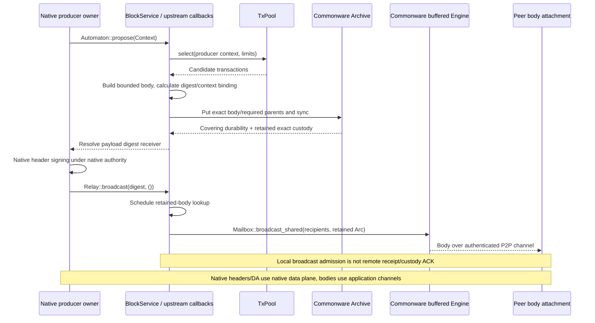
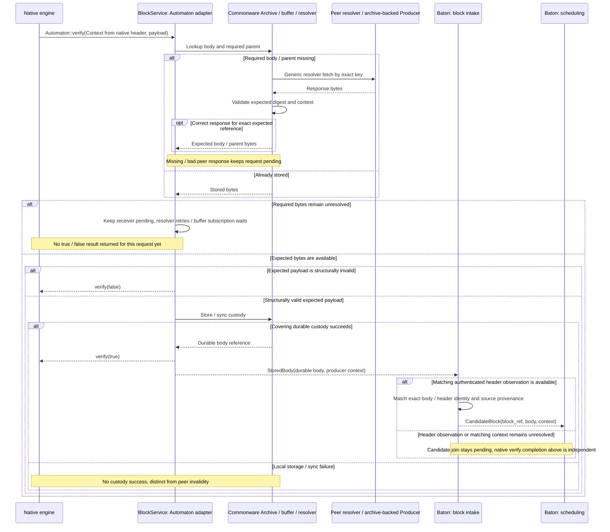

# Block body send, fetch, and receive

**BlockService makes block contents available and keeps them recoverable.** A producer builds and distributes the body; receiving nodes fetch missing bytes, verify the expected content, and establish durable custody. Native consensus handles the header and ordering separately.

## Block lifecycle: mempool → propose → body dissemination

[Open full-size diagram](../assets/diagrams/diagram-04.svg)

Native Core owns producer-header signing authority. The builder creates a body and returns its digest. Application code does not call the native header signer in Core's place.

TxPool selection retains candidates, so local proposal cancellation needs no public pool callback or generic reinsertion step. A destructively selecting backend requires internal retention/reselection integration to meet this contract. Cancellation does not undo retained native custody or establish canonical deletion.

Canonical lifecycle is a later, independent path: **durable Executor outcomes → internal pool maintenance → selected backend refresh/reconciliation**. It includes applicable certified imports and uses actual transaction outcomes/next canonical nonces. Body publication, accepted-header observation and native ordering alone cannot substitute for those results. A backend's lossy notification is not processed completion and adds no native cut/direction gate. [Backend completion contract](../tx/interfaces.md#connect-the-trait-to-one-existing-backend).

## Body lookup, verification, and missing-content handling

[Open full-size diagram](../assets/diagrams/diagram-05.svg)

A peer sending bytes with the wrong digest differs from permanent invalidity of the expected payload itself. Temporary unavailability or a delayed fetch cannot become an invalidity or empty-slot verdict. Native DA verification must not wait for completed speculative execution. StoredBody is an application validity/custody event. Baton intake obtains authenticated headers from Reporter accepted-artifact notices and joins a body and producer context to the exact matching header to form CandidateBlock. Reporter notices may arrive before or after StoredBody. Neither body availability nor candidate formation proves ordering inclusion or finality.
