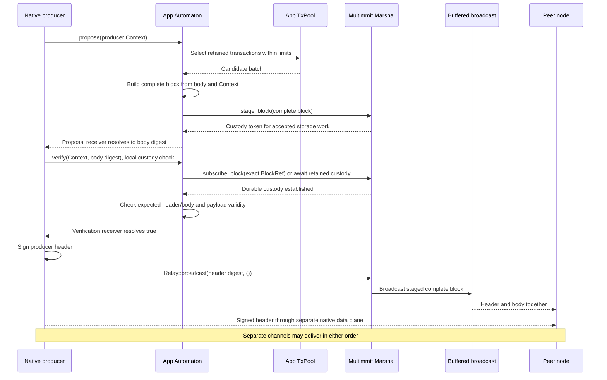
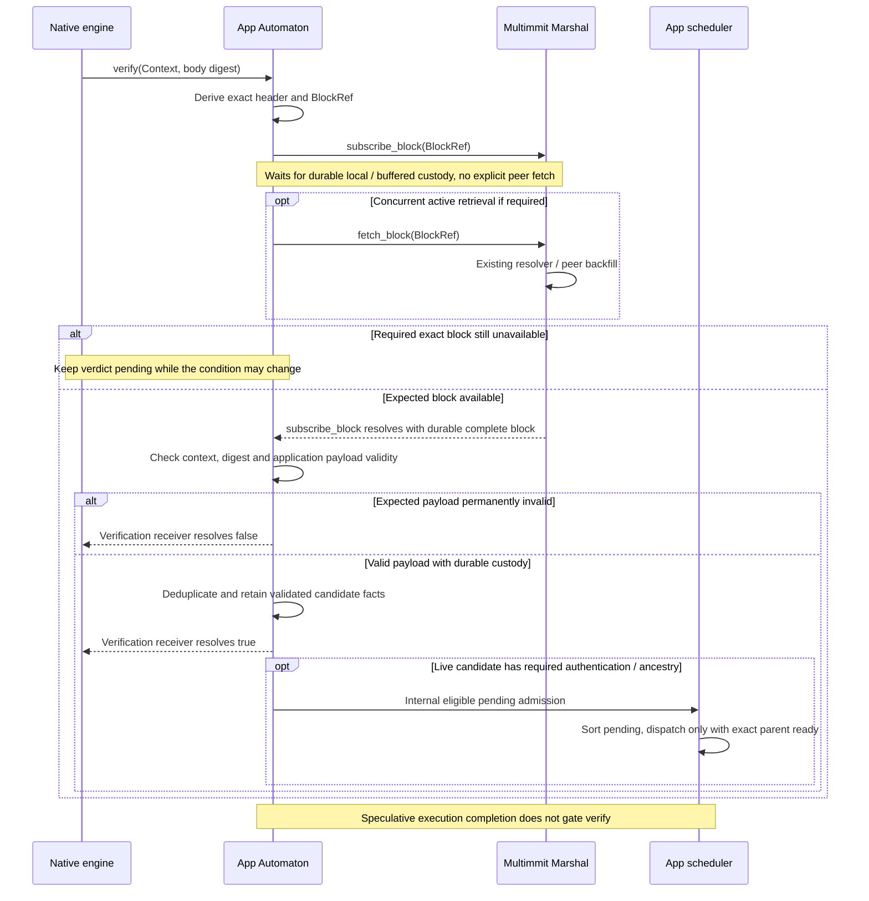

# Block body send, fetch, and receive

**Use the existing Multimmit Marshal for complete-block custody and exchange.** The App defines the transaction body codec, digest and validity checks. Native Multimmit handles signed producer headers, DA and ordering; the body travels through Marshal's buffered broadcast and backfill services.

## Block lifecycle: mempool → propose → body dissemination

[Open full-size diagram](../assets/diagrams/diagram-04.svg)

`stage_block().await` returns a `Custody` token after admission of storage work. Awaiting `Custody::wait()` establishes durable recovery; `put_block()` combines staging and that wait. Dropping the token does not cancel accepted storage work. The local native custody verify provides the required gate before header signing. An App may wait earlier in propose, but need not add a second durability path. [Marshal mailbox](https://github.com/0xEyrie/monorepo/blob/6233438985d8249d2b2bc1204191d5d405652288/consensus/src/multimmit/marshal/mailbox.rs#L327)

The body digest commits to the payload. The header digest identifies the native producer block, including its producer Context and body digest. `propose` returns the body digest; native `Relay::broadcast` requests propagation using the header digest. The existing Marshal Relay resolves that digest to the staged complete block. Its local Feedback does not prove remote receipt or custody, and even `Ok` can mean no matching staged block was found. [Relay completion](../overview/networking.md)

## Body lookup, verification, and missing-content handling

[Open full-size diagram](../assets/diagrams/diagram-05.svg)

`subscribe_block` waits for local storage or buffered ingress to establish custody. It does not initiate peer fetch; DA evidence may independently cause Marshal backfill. `fetch_block` is the explicit network retrieval API and can return buffered bytes before storage sync; a fetch response alone does not establish custody. A wrong peer response is not proof that the expected payload itself is permanently invalid. Local storage failure is also distinct from invalid peer content.

The diagram shows one eligible live validation request. `verify` also runs locally before signing and during recovery; qualify role/lane, lifecycle and exact identity before treating success as a new peer candidate. Nonproducing validators have no own-lane exclusion, while Observers normally enter through Update. [Role and origin rules](../baton/README.md#when-speculative-execution-begins).

Admission uses the App owner's current state after custody completes. Required producer ancestry and authentication still apply, and the scheduler waits for the exact execution checkpoint before dispatch. Already-applied or retired speculative work can still require an honest native custody response. Follow the [candidate/dispatch handler](../baton/interfaces.md#automatonverify-validity-custody-and-scheduling) for deferred-capacity, duplicate and stale-request handling.

Transactions retire through durable canonical outcomes, not body publication, `verify(true)`, or selection. See [TxPool](../tx/interfaces.md) for internal backend reconciliation and [canonical delivery](canonical.md) for the later Update path.
