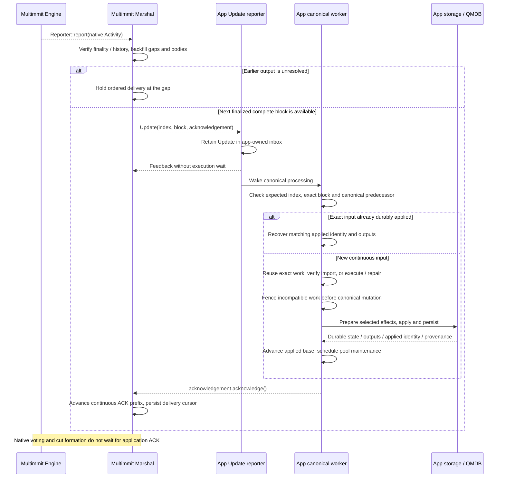
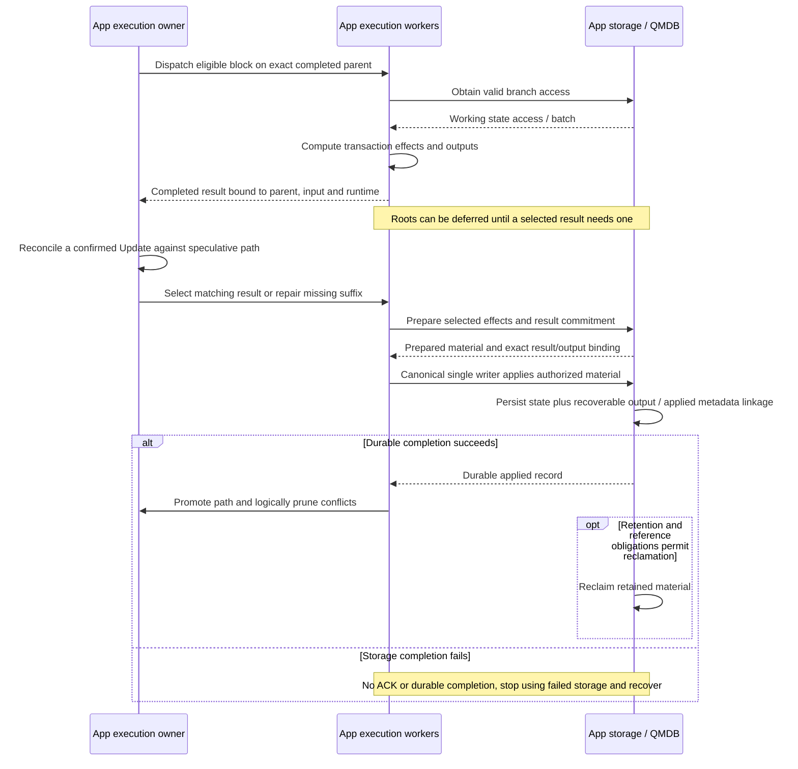

# Finalized order and canonical state application

**Marshal delivers exact ordered blocks; the App reconciles execution and applies them durably.** The App's synchronous `Reporter<Update>::report` retains the Update and wakes its canonical worker. The callback returns without executing transactions or waiting for storage.

## Native finality → ordered delivery → durable App application

[Open full-size diagram](../assets/diagrams/diagram-08.svg)

`Update` contains `index`, the complete `Arc<TransactionBlock>`, and `Exact` acknowledgement. The App must preserve the indexed sequence; pending speculative priority must not reorder it. Marshal already owns ordinary native history interpretation, missing-block backfill, finalized output retention and delivery. Baton does not duplicate those mechanisms. [Update contract](https://github.com/0xEyrie/monorepo/blob/6233438985d8249d2b2bc1204191d5d405652288/consensus/src/multimmit/marshal/types.rs#L128)

An Update may be App's first encounter with a block, as for an Observer or skipped speculation. Canonical reconciliation needs no earlier verify or candidate entry: execute with the required application checks, reuse exact validated work, or use verified applicable imported material. State-dependent transaction outcomes do not change native order.

The App owns the effect-to-state contract. A repeated index is safe to ACK only after checking that the exact block and durable applied record match. A conflicting identity, gap or mismatched canonical predecessor stops application advancement; it cannot become a successful ACK. Recovery may redeliver after application persistence but before Marshal's cursor persistence.

## What the ACK waits for

The ACK is an in-memory completion signal issued **after the App has durably applied this block**. It is not a network consensus vote and does not perform I/O itself. If speculation already produced the right result, only selection and remaining persistence may be necessary. If not, missing execution or verified import must finish before the App can meet that same durable-application contract.

The example node supplies assembly wiring, not this durable transaction consumer. Its `OutputReporter` acknowledges immediately in headless mode; with a terminal sink, it forwards the Update there. A transaction App replaces that consumer with the retained canonical-worker path above; copying the example's immediate ACK would skip application durability. [Example output reporter](https://github.com/0xEyrie/monorepo/blob/6233438985d8249d2b2bc1204191d5d405652288/examples/log-multimmit/src/application/reporter.rs#L33)

Within one active delivery window, Marshal can report multiple Updates while earlier ACKs are pending, up to `max_pending_acks`. Once the window is full, further application delivery waits; native Multimmit continues independently. Completed ACKs free the contiguous window prefix, and Marshal separately syncs its durable cursor. The window slot does not wait for that cursor's own I/O. [Delivery actor](https://github.com/0xEyrie/monorepo/blob/6233438985d8249d2b2bc1204191d5d405652288/consensus/src/multimmit/marshal/actors/delivery/actor.rs#L303), [ACK window](https://github.com/0xEyrie/monorepo/blob/6233438985d8249d2b2bc1204191d5d405652288/consensus/src/multimmit/marshal/actors/delivery/acks.rs#L107)

`report` is a synchronous retained handoff: preserve every accepted Update and its Exact token in App state, using coalesced wakeups if needed. `Backoff` does not request redelivery, and an unacknowledged dropped Exact clone cancels completion. The [canonical callback contract](../baton/interfaces.md#marshal-reportupdate-canonical-input-and-ack) defines active-window sizing, clone obligations, crash replay and App-owned floor/import coordination; floor resets do not clear App's retained Updates.

## Execution lifecycle: QMDB branches and canonical promotion

[Open full-size diagram](../assets/diagrams/diagram-09.svg)

Scheduler, execution workers and storage are internal App responsibilities. Separate execution effects from root preparation, preserve exact parent/context reuse, and use one canonical writer for direct execution and peer import. They do not require separate public `Executor` and `Storage` traits or another delivery actor. QMDB APIs and the remaining root-deferred branching work are described in [QMDB](../execution/qmdb.md). No unconditional atomicity across independently stored state, outputs and applied metadata is implied.
