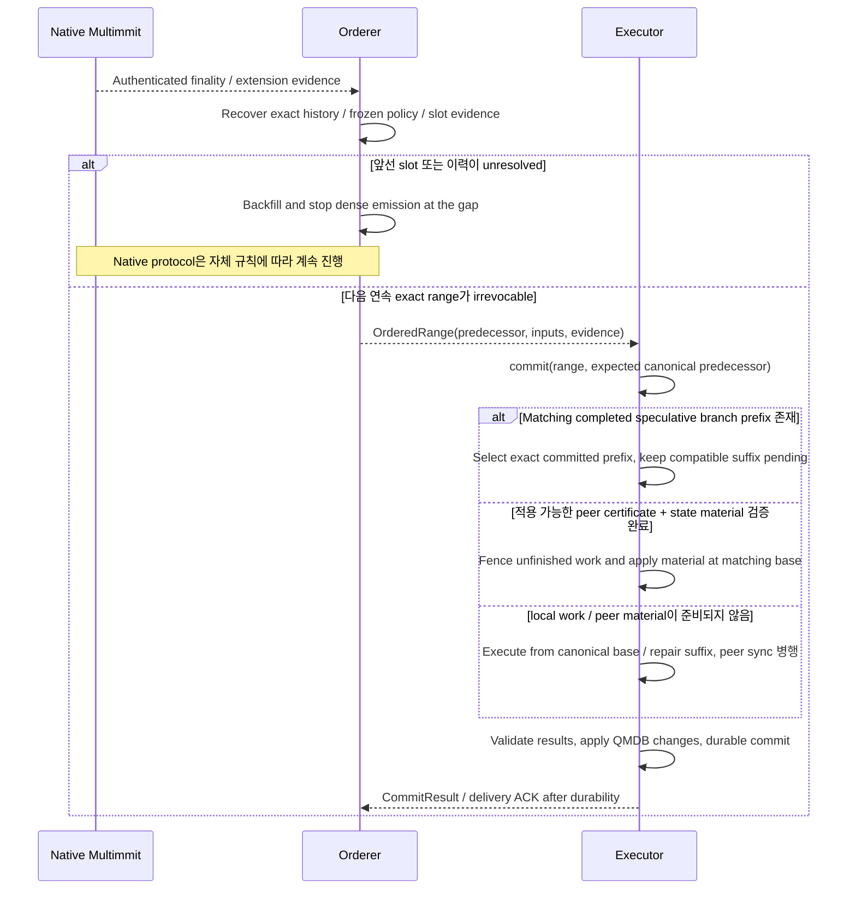
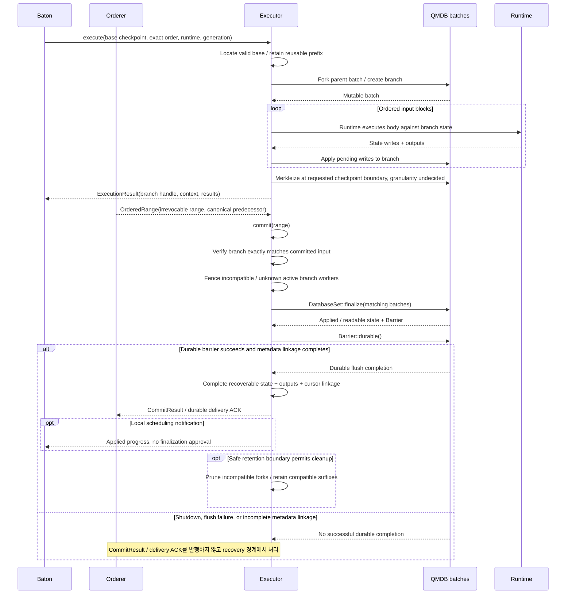

# 확정 순서와 canonical 상태 적용

Orderer가 Executor에 직접 확정 입력을 전달한다. Executor는 맞는 실행 결과를 준비하고 QMDB 적용·durable 저장·delivery ACK를 완료한다.

## Cut commit → ordered range → 실행 commit

[그림 크게 보기](../assets/diagrams/diagram-08.svg)

첫 native leader-finality 알림을 곧바로 모든 body의 확정 순서로 해석하지 않는다. Native extensions와 history를 포함해 **실행할 exact range**를 먼저 확인한다. Included slot은 emit, 인증된 irrevocably-empty slot은 skip, unresolved slot은 stop이다. 본문 누락은 empty가 아니다. 순서가 irrevocable이어도 필요한 body / predecessor state가 없으면 해당 execution commit은 fetch·recovery를 기다린다. 이 local input 대기는 native cut을 direction 회신으로 막는 새로운 round와 다르다.

## Execution lifecycle: QMDB 분기 생성과 canonical 승격

[그림 크게 보기](../assets/diagrams/diagram-09.svg)

이 그림은 completed branch가 exact canonical range와 일치하는 경로다. Work가 없거나 다르면 [cut commit 흐름](canonical.md#cut-commit--ordered-range--실행-commit)의 canonical 실행/repair를 따른다. Branch 생성·pruning은 제안하는 owner 동작이고 cleanup은 optional이며 구체 GC scheduling은 미결정이다. `DatabaseSet::finalize`와 `Barrier::durable`은 upstream API지만 applied/readable 상태는 durable 완료가 아니다. State/output/cursor linkage와 실패 처리·ACK 경계는 [canonical apply](../execution/qmdb.md#commit-요청을-받으면-branch를-canonical로-만들기)에서 설명한다. [Durability barrier](https://github.com/commonwarexyz/monorepo/blob/534af0ede48affd35b2111522527547b4cc9bf72/glue/src/stateful/db/mod.rs#L469).
