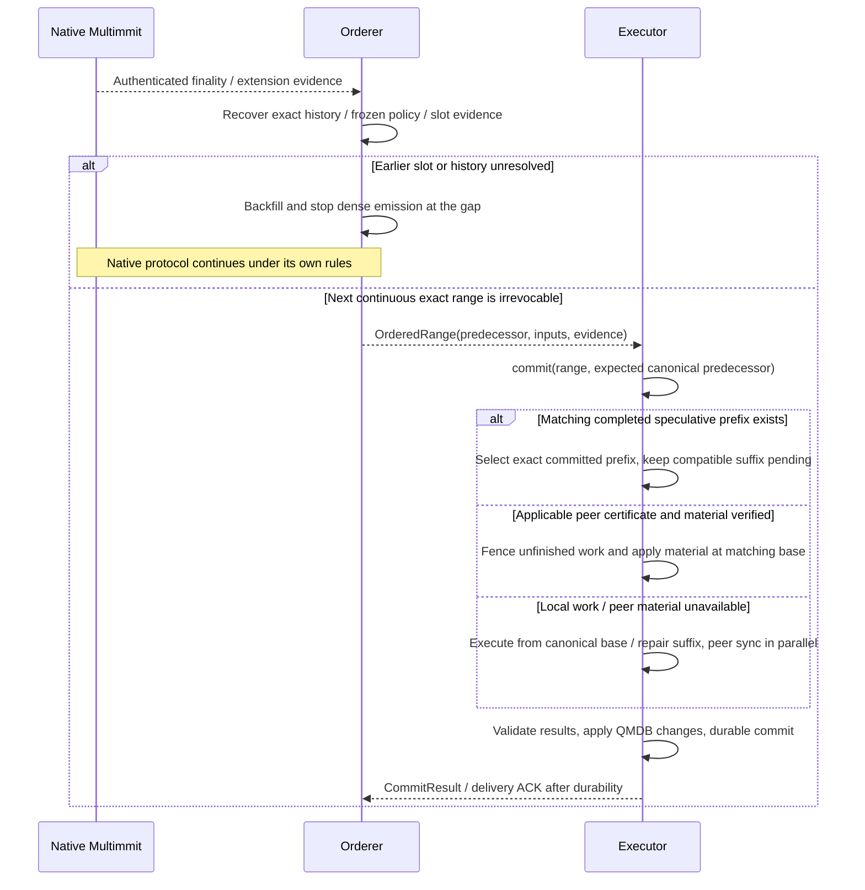

# Finalized order and canonical state application

**Orderer delivers the agreed inputs; Executor makes their effects durable.** Executor selects matching completed work, executes missing work, or verifies usable peer material. It acknowledges delivery only after canonical application is recoverably durable.

## Cut commit → ordered range → execution commit

[Open full-size diagram](../assets/diagrams/diagram-08.svg)

The first native leader-finality notice does not immediately establish the complete body order. First identify the **exact execution range**, including native extensions and history. Emit included slots, skip authenticated irrevocably-empty slots, and stop at unresolved slots. Missing bodies are not empty slots. Even an irreversible range may need body fetch or predecessor-state recovery before execution commit. This local input wait is distinct from adding a native round for direction replies.

## Execution lifecycle: QMDB branches and canonical promotion

[Open full-size diagram](../assets/diagrams/diagram-09.svg)

This sequence assumes completed branch work exactly matches the canonical range. If it is missing or different, follow [canonical execution / repair](canonical.md#cut-commit--ordered-range--execution-commit). Branch construction and pruning are proposed Executor behavior; cleanup is optional and concrete GC scheduling is open. `DatabaseSet::finalize` and `Barrier::durable` are upstream APIs, but applied/readable state is not durable completion. See [canonical application](../execution/qmdb.md#commit-a-branch-to-canonical-state) for state/output/cursor linkage, failures, and acknowledgement boundaries, and the [durability barrier](https://github.com/commonwarexyz/monorepo/blob/534af0ede48affd35b2111522527547b4cc9bf72/glue/src/stateful/db/mod.rs#L469).
