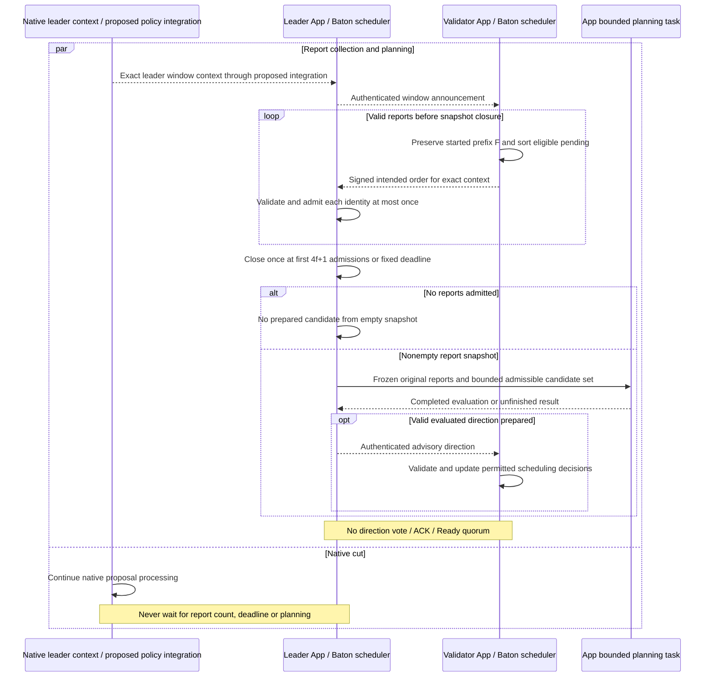
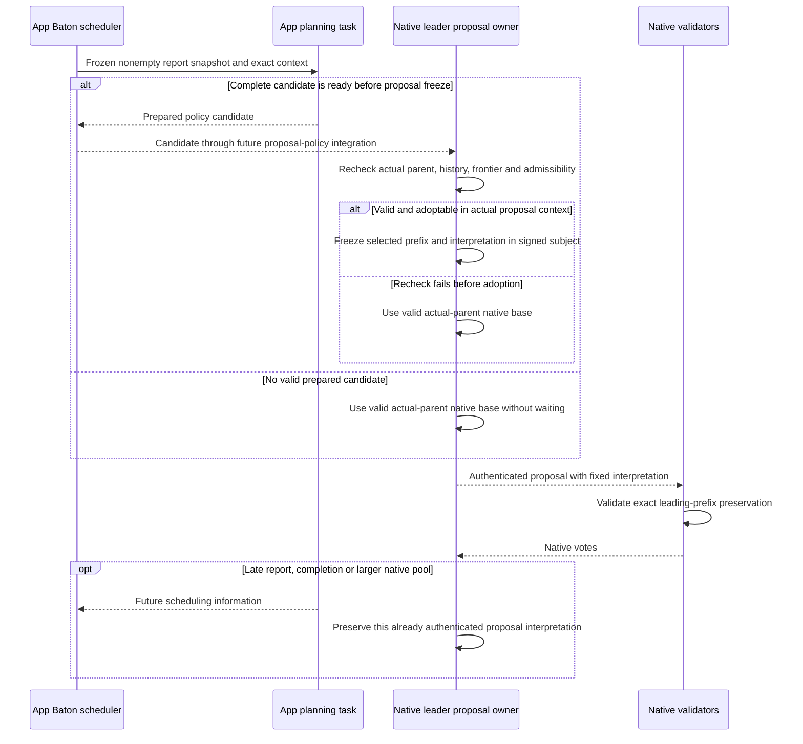

# Leader reports, direction, and proposal races

**Baton is one scheduler mode inside the App.** It gathers signed intended orders and prepares advisory direction while native consensus proceeds. Its report handling, bounded planning and worker dispatch are internal App operations; no public Baton or Executor trait is required.

## Leader lifecycle: collect reports and disseminate direction

The report protocol below remains application work. Native leader-window context and authenticated proposal-policy adoption additionally require the [unfinished native extension](../consensus/decisions.md). Producer `Automaton::propose` and `verify` are not leader-cut callbacks.

[Open full-size diagram](../assets/diagrams/diagram-06.svg)

A report is the fixed completed/current local prefix `F` followed by `sort_G(S_pending)`. It is an intention, not an execution proof. Equal context, `F`, rule and pending set produce equal intended order; equal total known inputs alone do not. Later arrivals do not change an already signed report or a closed snapshot.

The leader counts at most `4f+1` distinct valid original reports. It closes on the first threshold/deadline event processed, without extending the deadline. With a nonempty snapshot and fully evaluated bounded admissible candidate set, select the longest nonempty entire prefix with at least `2f+1` original same-context supporters; if no such prefix exists, use raw sum-LCP. Before protected adoption, no reports or no prepared valid choice means the actual-parent valid native base path. Incomplete search does not establish a longest-prefix result.

## Planning completion versus proposal freeze

This is the **required future integration flow**, not an API present in current Multimmit:

[Open full-size diagram](../assets/diagrams/diagram-12.svg)

Current `LeaderBlock` has no Baton policy field, and current Marshal uses the native order interpretation. Adding scheduling in `Automaton::verify` does not implement policy adoption, validator policy checks, exact leading-prefix preservation, continuation or recovery. The App cannot implement this by reordering finalized Updates after delivery.

Before adoption, no reports or no prepared candidate permits the valid native base path. After authenticated adoption, the protected prefix cannot silently disappear or be reinterpreted as fallback. Context binding, availability/adoption, native sufficiency, cross-lane continuation and view recovery remain open proof and implementation obligations. The local report window closing is distinct from that still-unspecified protected-adoption point.
