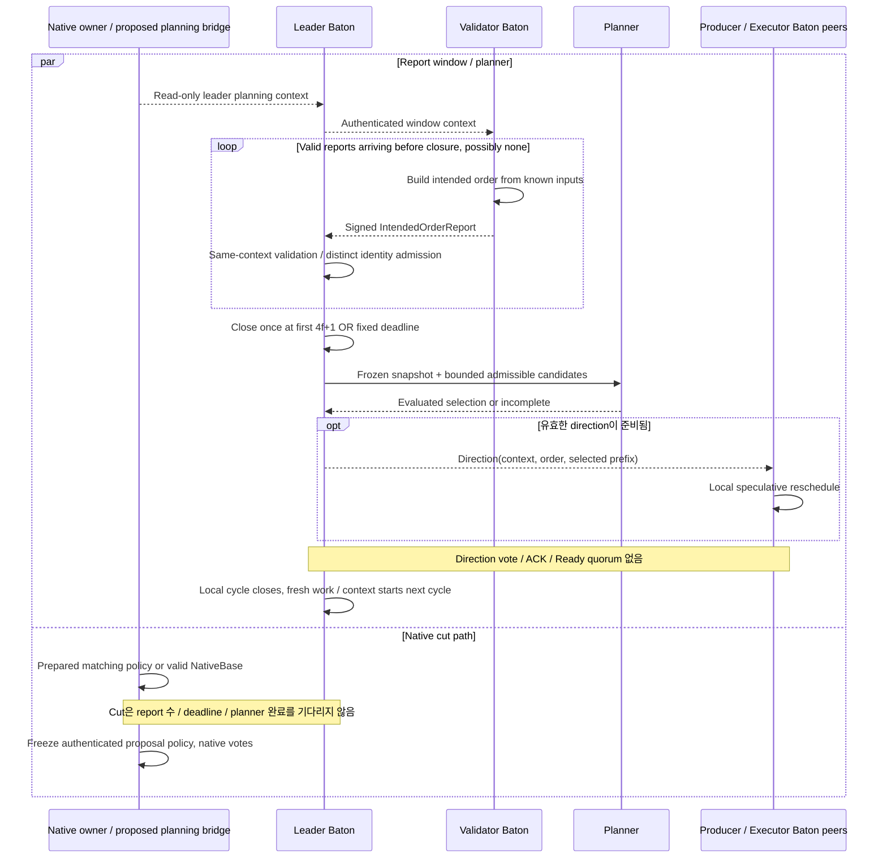
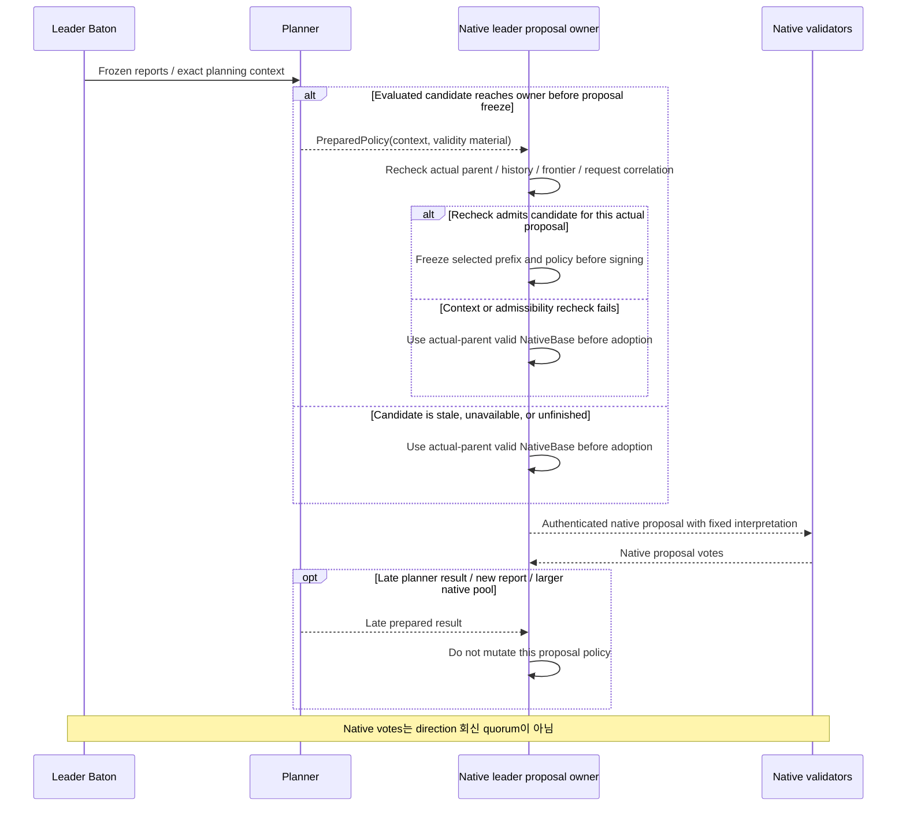

# Leader report·direction과 proposal 경합

Report window 종료와 direction 선택·전파를 설명한다. Planner 완료와 native proposal freeze가 경합해도 cut은 기다리지 않는다.

## Baton lifecycle: leader report 수집과 direction 전파

[그림 크게 보기](../assets/diagrams/diagram-06.svg)

Window 안내와 prepared policy를 실제 proposal에 결속하는 hook은 구현할 adapter다. 그림이 그 API가 이미 존재하거나 prefix-adoption 증명이 완료되었음을 뜻하지 않는다. Local cycle 종료는 모든 노드의 실행 완료나 native cut branch 종료를 기다리는 barrier가 아니다.

## Planner completion과 proposal freeze의 경합

[그림 크게 보기](../assets/diagrams/diagram-12.svg)

Planner job 자체가 없는 경우에도 native proposal은 유효한 actual-parent base 경로로 진행한다. 이 그림은 job이 시작된 경우의 completion 경합을 설명한다.

Prepared result를 채택할 availability와 exact-prefix 보존 조건은 아직 닫히지 않았다. 이 그림은 구현할 freeze 경계를 설명하며 특정 ready-only policy variant를 채택하지 않는다. View가 바뀌면 old reports·advisory work는 새 context에 넣지 않고, 이미 인증·방출·적용된 history는 원래 해석을 보존한다.
