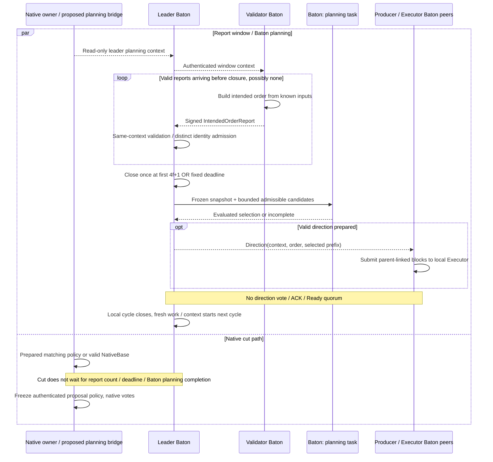
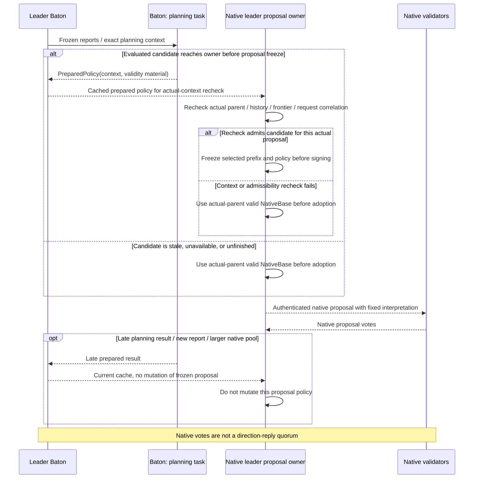

# Leader reports, direction, and proposal races

**Leader Baton prepares an execution suggestion while native consensus keeps moving.** It closes a report window, asks Executor to choose a valid direction, and disseminates the result. Native Core may freeze a proposal before Baton planning finishes.

## Leader lifecycle: collect reports and disseminate direction

[Open full-size diagram](../assets/diagrams/diagram-06.svg)

Window announcement and binding prepared policy to an actual proposal require integration adapters. The diagram does not imply those APIs already exist or prefix adoption has been proved. Closing a local cycle does not wait for all nodes' execution or the native cut branch to finish.

## Planning completion versus proposal freeze

[Open full-size diagram](../assets/diagrams/diagram-12.svg)

Native proposal can use the valid actual-parent base path even when no planning job exists. The diagram describes the completion race when a job has been started.

Availability for adopting a prepared result and exact-prefix preservation remain unresolved. This diagram identifies the required freeze boundary without adopting a particular ready-only policy variant. On view change, old reports and advisory work cannot enter the new context. Already authenticated, emitted, or applied history keeps its original interpretation.
