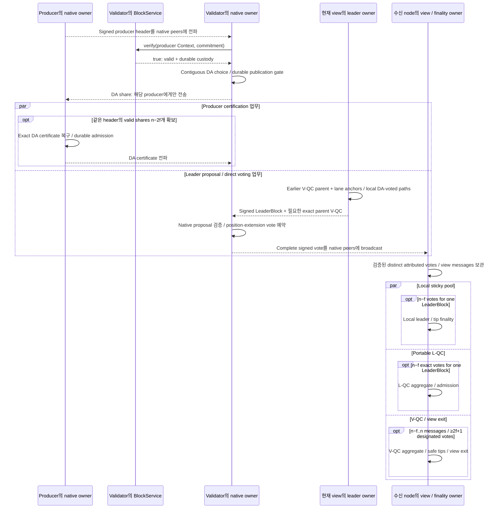

# 블록 제안·DA·cut 확정

Producer의 본문 준비에서 native header·DA·leader proposal·vote·finality까지 연결한다. Native finality 뒤의 exact 실행 순서 해석은 다음 canonical 케이스에서 읽는다.

## Native 합의 정상 경로: producer DA → leader proposal → finality

앞선 body lifecycle을 native 합의와 이어 읽는 정상 경로다. Producer lane 하나를 대표로 나타내며, 다른 lane의 진행은 독립적이다. Lifeline은 node 역할과 같은 Core 내부 기능을 나눠 보여준다.

[그림 크게 보기](../assets/diagrams/diagram-15.svg)

DA certificate를 얻는 업무와 leader proposal은 서로의 완료 barrier가 아니다. Leader는 native 조건을 만족하는 uncertified DA-voted suffix도 제안할 수 있다. Complete vote는 native peers에 broadcast하며 수신 node마다 local pool을 관리한다. Local finality는 L-QC 생성이나 V-QC 완료를 기다리지 않는다. `par`는 독립적인 업무를 보여주며 새 합류 대기를 뜻하지 않는다. [DA / proposal / direct vote](https://github.com/commonwarexyz/monorepo/blob/534af0ede48affd35b2111522527547b4cc9bf72/consensus/src/multimmit/docs/STATE_MACHINE.md#L290), [DA share와 vote의 전송 대상](https://github.com/commonwarexyz/monorepo/blob/534af0ede48affd35b2111522527547b4cc9bf72/consensus/src/multimmit/machine/durability.rs#L616), [Certificate와 local finality](https://github.com/commonwarexyz/monorepo/blob/534af0ede48affd35b2111522527547b4cc9bf72/consensus/src/multimmit/mod.rs#L149).

그림의 finality는 sparse native facts다. Exact ordered range를 만들려면 [§2.7의 delivery/history 연결](canonical.md#cut-commit--ordered-range--실행-commit)이 필요하다. Timeout·rescue·view recovery는 [§4.6](../consensus/README.md#실제-native-actor와-파일-구조), V-QC / L-QC의 서로 다른 조건은 [§4.5](../consensus/ordered-input.md#합의와-baton-연결)에서 읽는다. 이 그림은 기존 native 동작의 설명이며 실행 trace나 Baton policy 통합 완료를 뜻하지 않는다.
