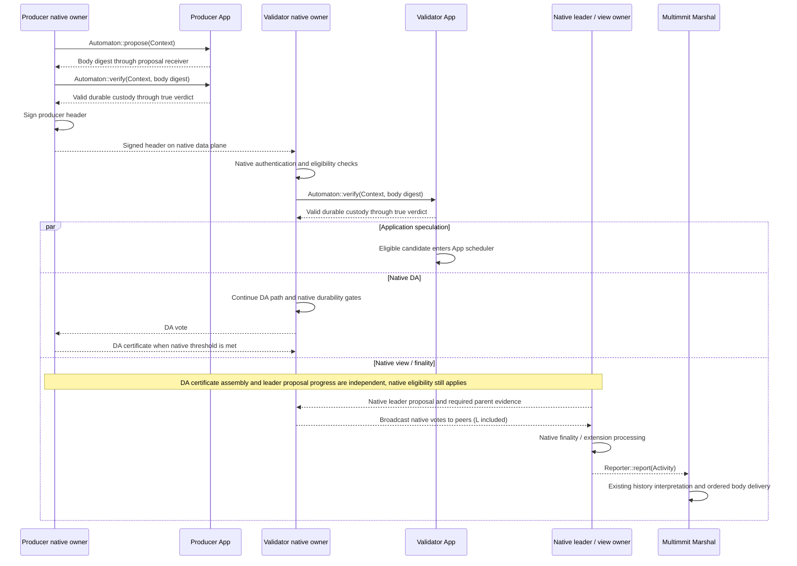

# Block proposal, DA, and cut finality

**Multimmit owns native signing, voting and finality.** The App provides payloads and validity/custody verdicts. Marshal consumes native activity to retain and deliver the ordinary finalized total order.

## Native producer, DA and view/finality paths

This diagram highlights the App connections. Native protocol details remain in the [consensus source map](../consensus/README.md).

[Open full-size diagram](../assets/diagrams/diagram-15.svg)

The App's speculative execution is independent of the native DA path after successful validity/custody verification. Neither speculative worker completion nor application delivery ACK is a native vote/cut prerequisite. Native availability, ancestry and durability gates still apply; the body validity callback is not permission to bypass them.

Native view work can already be running during producer validation. The leader/view-owner lifeline represents one native owner; each view owner processes finality locally.

The native data message carries the signed producer header. Marshal separately broadcasts the full `TransactionBlock` containing header and body. A receiver can therefore have a header while still waiting for its body. Verification begins when native eligibility chooses the request, not for every packet arrival. [Body flow](block-body.md)

Native activity is also useful for App observations through a composed `Reporters` value. It is distinct from Marshal `Update`: the former reports native activity, while the latter supplies an indexed finalized complete block and application ACK token. The [current assembly](https://github.com/0xEyrie/monorepo/blob/6233438985d8249d2b2bc1204191d5d405652288/examples/log-multimmit/src/node.rs#L306) passes native activities to Marshal and an App handle.

For Baton to change the agreed execution order, a separate native proposal-policy extension must preserve selected leading prefixes through validation, extension and recovery. Current App scheduling callbacks alone do not implement that extension. [Open native decisions](../consensus/decisions.md)
