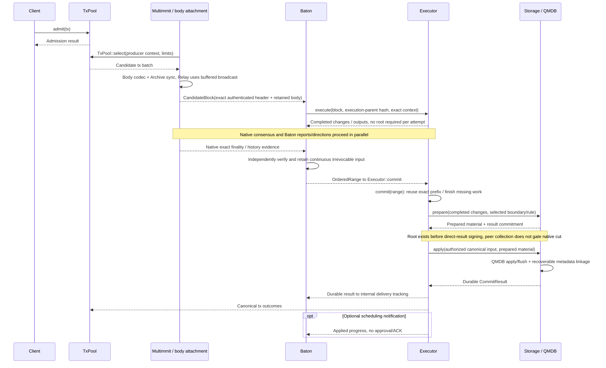
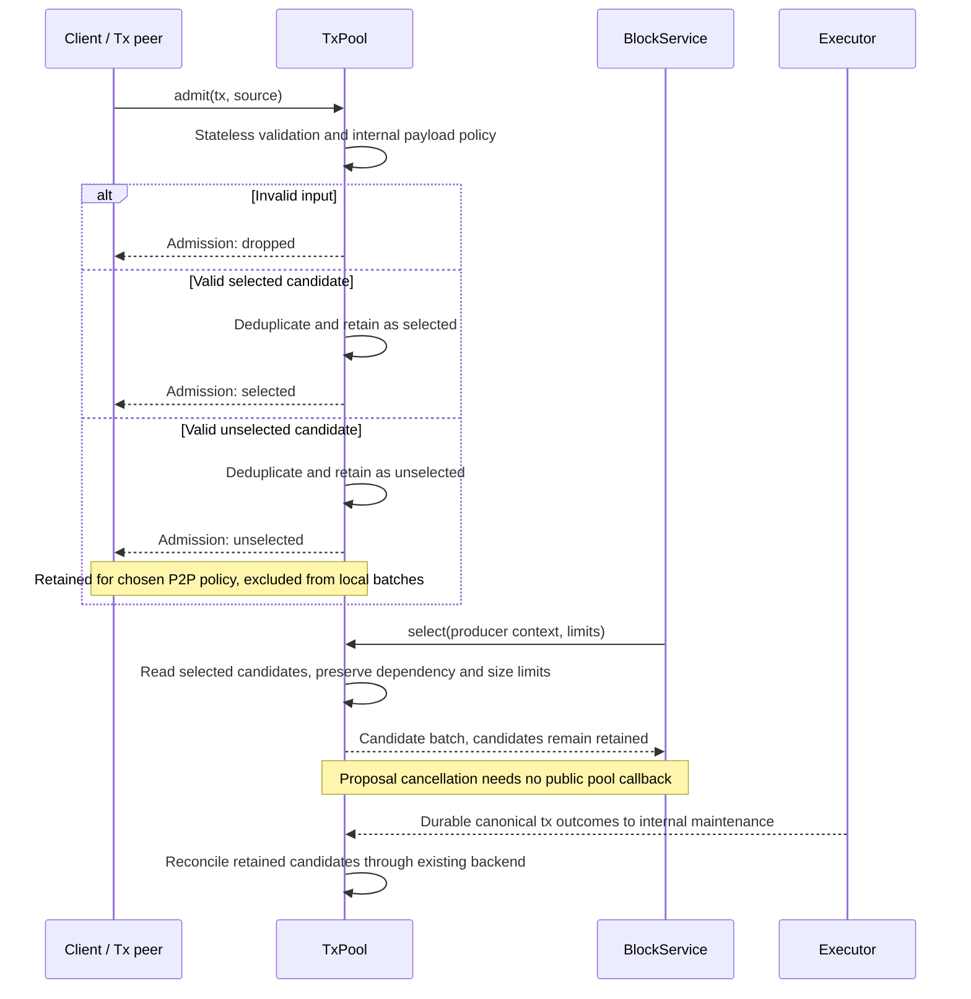

# Normal flow: transaction to applied state

**A transaction moves from a candidate to a block, then to an ordered input and durable state.** TxPool admits it, BlockService packages it through existing body primitives, consensus fixes the order, Executor computes the changes, and Storage applies and persists them. The sequences below show the normal path and transaction-admission cases.

## Full E2E: transaction input to canonical state

[Open full-size diagram](../assets/diagrams/diagram-02.svg)

This diagram shows one arrival order where speculative work finishes first. If cut or OrderedRange arrives first, use [canonical execution / repair](canonical.md#cut-commit--ordered-range--execution-commit). Admission does not establish block inclusion or transaction success. Local durable commit and f+1 result certification are separate events. Certification does not become a prerequisite for the next native cut or speculative execution.

## Tx lifecycle: new, duplicate, and invalid transactions

[Open full-size diagram](../assets/diagrams/diagram-03.svg)

RPC and peer transactions enter through the same `admit` contract. Static analysis and classification are internal. Selected/unselected are logical candidate classes in one reused pool; their physical representation and the chosen policy remain open. Duplicate admission preserves the retained candidate identity rather than creating a second entry. Invalid input differs from a valid unselected candidate.

Several producers may include the same transaction in their bodies. Local pool duplicate detection and canonical duplicate execution semantics are separate contracts; admission deduplication does not establish global exactly-once behavior. Do not permanently delete a transaction merely because it entered an unagreed body. Concrete semantics and cleanup remain open in the Tx decisions.
