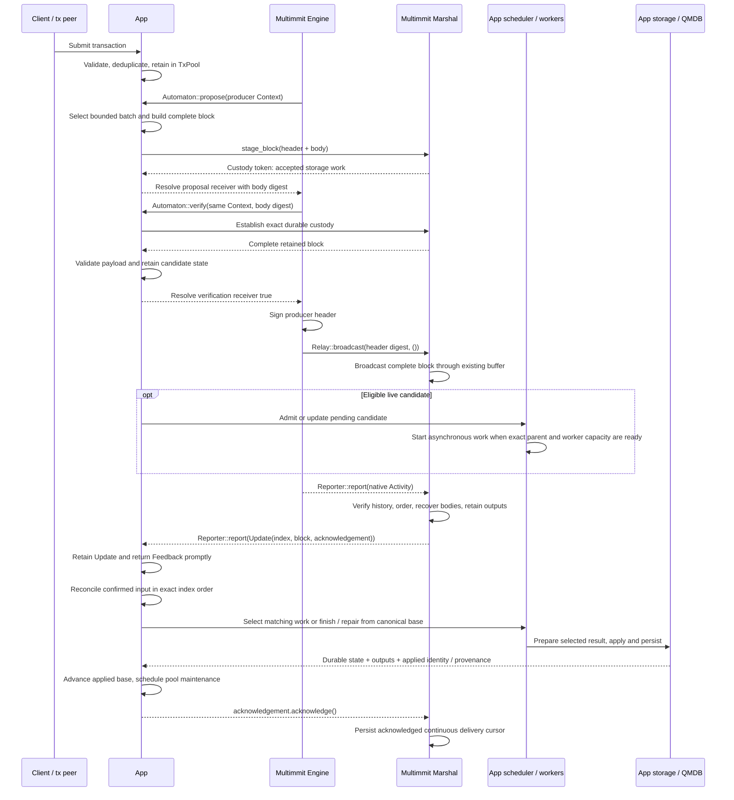
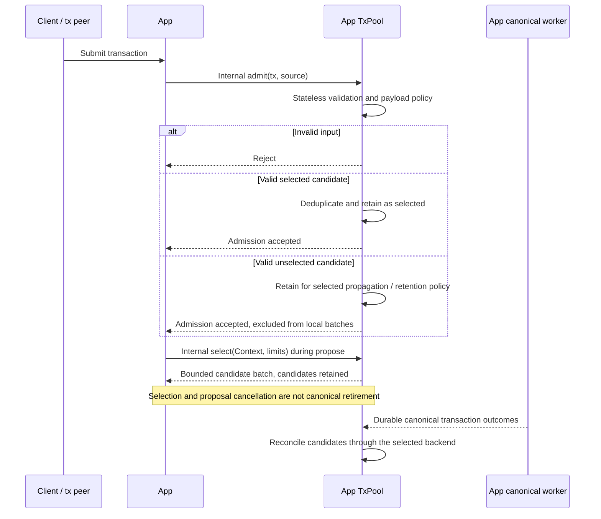

# Normal flow: transaction to applied state

**One App owns the transaction pool, scheduler and transaction execution.** Multimmit calls the App through `Automaton`; Marshal stores and broadcasts complete blocks and delivers their finalized order through `Reporter<Update>`. App storage applies the matching execution result durably.

## Full E2E: transaction input to canonical state

[Open full-size diagram](../assets/diagrams/diagram-02.svg)

Speculative execution may finish before or after `Update` arrives. `verify(true)` establishes payload validity and custody; it does not wait for that execution. For local blocks, candidate admission must respect the fact that this verify occurs before native header signing. The [callback contract](../baton/interfaces.md) covers peer, local and recovery requests.

Marshal already delivers the ordinary native total order. The App reconciles retained work against these Updates and its canonical worker applies their exact sequence. It does not sort Updates again or require an earlier speculative candidate. In Baton mode, reports and direction operate alongside this path; native proposal-policy integration remains [open](../consensus/decisions.md).

Local durable application and f+1 result certification are separate milestones. Neither creates a wait in native cut formation. If the matching speculative result already exists, confirmation can consist of selecting it and completing storage work. Otherwise the App still needs the missing execution or verified peer material before durable application and ACK.

## Tx lifecycle: new, duplicate, and invalid transactions

[Open full-size diagram](../assets/diagrams/diagram-03.svg)

`admit` and `select` name App-internal pool operations, not a new public consensus trait. Selected/unselected are logical classes; their physical representation and policy remain open. RPC and peer input use the same validation and admission policy. Duplicate suppression in one pool does not establish global exactly-once execution when multiple producers include the same transaction.

See [transaction admission and selection](../tx/interfaces.md) for the App pool contract, the [backend survey](../tx/README.md) for reuse options, and [canonical application](canonical.md) for durable outcome handling. The node assembly is grounded in the current [log-multimmit example](https://github.com/0xEyrie/monorepo/blob/6233438985d8249d2b2bc1204191d5d405652288/examples/log-multimmit/src/node.rs#L242); its synthetic payload generator does not implement this transaction application.
