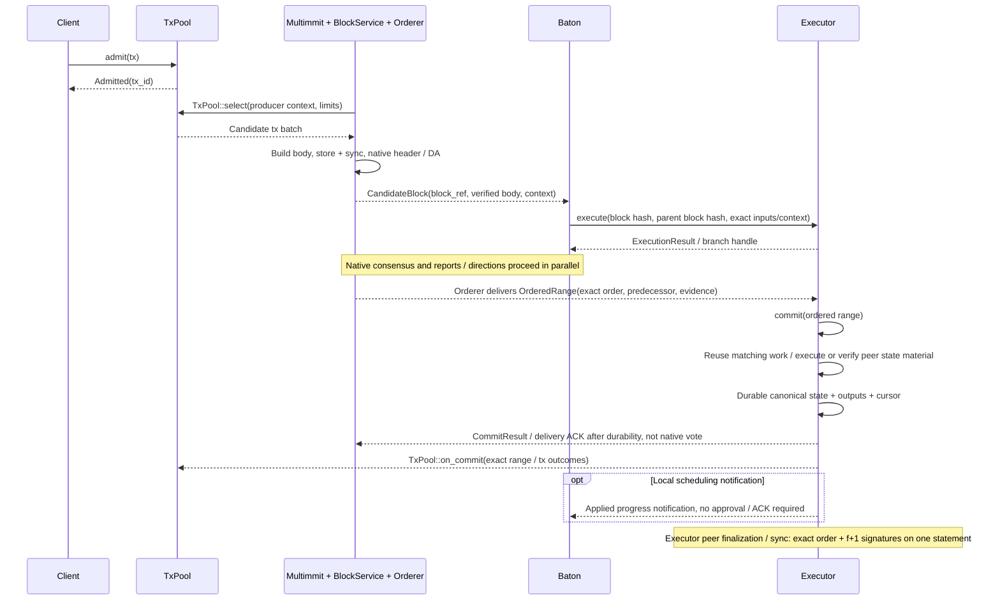
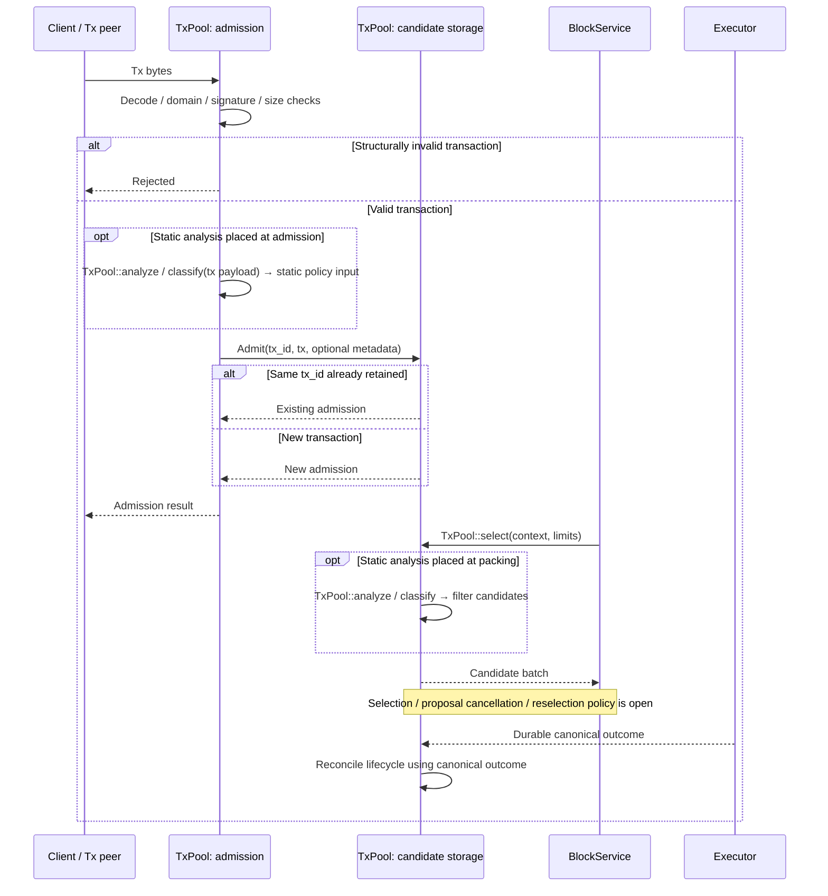

# Normal flow: transaction to applied state

**A transaction moves from a candidate to a block, then to an ordered input and durable state.** TxPool admits it, BlockService packages it, consensus fixes the order, and Executor applies the result. The sequences below show the normal path and transaction-admission cases.

## Full E2E: transaction input to canonical state

[Open full-size diagram](../assets/diagrams/diagram-02.svg)

This diagram shows one arrival order where speculative work finishes first. If cut or OrderedRange arrives first, use [canonical execution / repair](canonical.md#cut-commit--ordered-range--execution-commit). Admission does not establish block inclusion or transaction success. Local durable commit and f+1 result certification are separate events. Certification does not become a prerequisite for the next native cut or speculative execution.

## Tx lifecycle: new, duplicate, and invalid transactions

[Open full-size diagram](../assets/diagrams/diagram-03.svg)

The two optional branches show alternative static-analysis placements. They do not require analysis at both admission and packing. A separate router versus an inclusion adapter above the pool remains undecided.

Several producers may include the same transaction in their bodies. Local pool duplicate detection and canonical duplicate execution semantics are separate contracts; admission deduplication does not establish global exactly-once behavior. Do not permanently delete a transaction merely because it entered an unagreed body. Concrete semantics and cleanup remain open in the Tx decisions.
