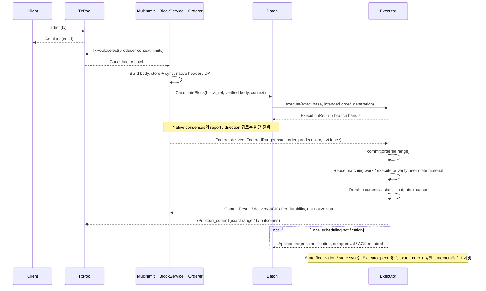
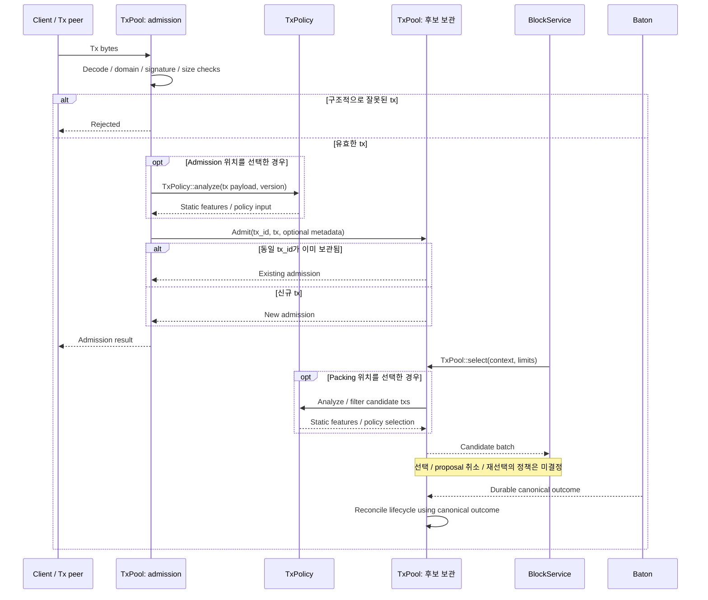

# 정상 흐름: tx 접수부터 상태 적용까지

새 tx의 접수·중복 처리·블록 포함·합의·실행·로컬 상태 적용을 순서대로 따라간다.

## 전체 E2E: tx 입력부터 canonical state까지

[그림 크게 보기](../assets/diagrams/diagram-02.svg)

이 그림은 speculative work가 먼저 완료된 도착 순서의 한 예다. Cut/OrderedRange가 먼저 도착하면 [canonical 실행/repair 경로](canonical.md#cut-commit--ordered-range--실행-commit)를 따른다. Tx admission은 block 포함이나 성공을 뜻하지 않는다. Local durable commit과 `f+1` 결과 인증도 서로 다른 사건이다. 결과 인증의 완료를 다음 native cut이나 speculative execution의 선행조건으로 추가하지 않는다.

## Tx lifecycle: 신규·중복·잘못된 tx

[그림 크게 보기](../assets/diagrams/diagram-03.svg)

그림의 두 `opt`는 미결정인 분석 위치의 선택지를 표시한다. Admission과 packing 양쪽에서 반드시 분석하라는 계약이 아니다. 정적 분석 기반 정책을 별도 router에 둘지 pool 위 inclusion adapter에 둘지도 아직 선택하지 않았다.

여러 producer의 body에 같은 tx가 들어갈 수 있다. Pool의 local 중복 인지와 canonical 실행의 중복 처리는 별개의 계약이며, admission dedup만으로 전역 exactly-once를 주장하지 않는다. 미합의 body에 넣었다는 이유만으로 tx를 영구 삭제하지 않는다. 구체 tx 의미와 cleanup 정책은 §3의 빈칸에서 정한다.
