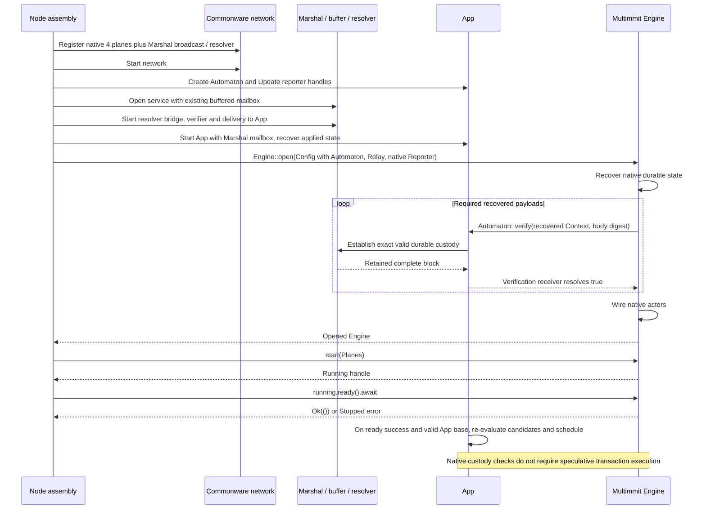
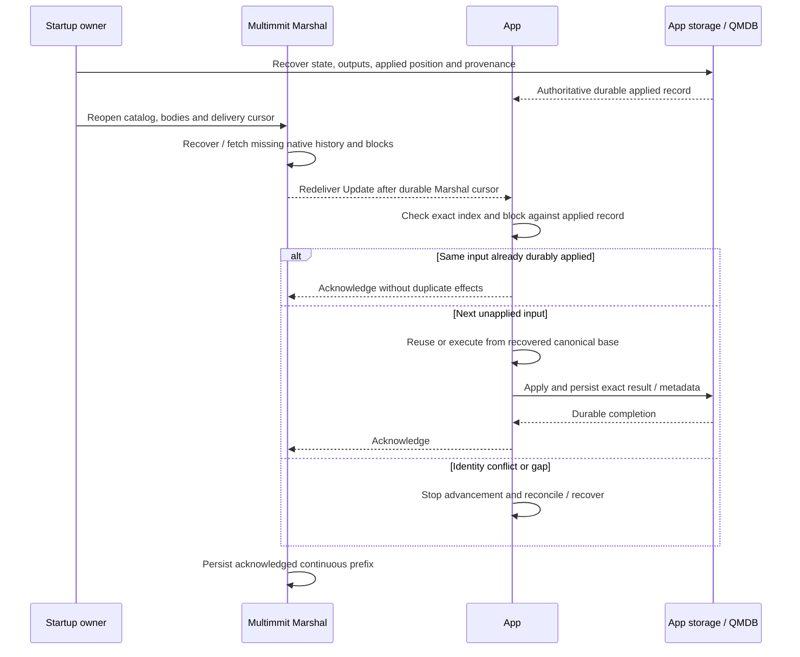

# Startup, restart, and history recovery

**Start body custody and the App callback path before opening native Multimmit.** Native recovery can call `Automaton::verify` from `Engine::open`. Marshal separately restores its finalized output and delivery cursor, while the App restores its durable state and applied identity.

## Startup: prepare custody before native recovery

For a fresh deployment, initialize the configured deterministic App genesis state/runtime and its initial applied-prefix binding. Marshal output index zero represents stream genesis and is never delivered; the first ordinary Update is index one. Do not wait for an index-zero Update or use a producer genesis-header digest as the App state checkpoint. On restart recover the binding; checkpoint startup must authenticate the corresponding floor-to-state relation. The actual App genesis contents remain an application choice. [Output index contract](https://github.com/0xEyrie/monorepo/blob/6233438985d8249d2b2bc1204191d5d405652288/consensus/src/multimmit/marshal/types.rs#L55)

[Open full-size diagram](../assets/diagrams/diagram-13.svg)

Follow the current [node assembly](https://github.com/0xEyrie/monorepo/blob/6233438985d8249d2b2bc1204191d5d405652288/examples/log-multimmit/src/node.rs#L242) and [Marshal assembly](https://github.com/0xEyrie/monorepo/blob/6233438985d8249d2b2bc1204191d5d405652288/examples/log-multimmit/src/marshal.rs#L126). They create buffered broadcast, `Service`, the generic resolver with `BackfillBridge`, the existing Relay and `SchemeVerifier`. Start the App with Marshal access before `Engine::open(...).await`; waiting for native readiness before making body lookup usable would create a recovery dependency cycle.

`Engine::open` derives the profile, recovers safety state and verifies required recovered payloads, then wires actors. `start(Planes)` spawns them. `Running::ready().await` returns `Result<(), Stopped>` after the native startup milestone; it does not certify App state readiness or remain a live health check. A false or closed recovered verification causes open failure, which is distinct from a stopped running engine. [Engine lifecycle](https://github.com/0xEyrie/monorepo/blob/6233438985d8249d2b2bc1204191d5d405652288/consensus/src/multimmit/engine/mod.rs#L446)

Recovered verify is a custody recheck, not a new peer arrival. Keep an App lifecycle phase or equivalent internal request context so scheduling deduplicates recovered input and skips already applied blocks. The existing `verify(Context, digest)` signature has no caller-origin field; the App must not pretend it can infer every source solely from the arguments. App state-dependent dispatch waits for a valid recovered canonical base; body validity/custody handling can remain available independently where application semantics permit. When the App enters live scheduling, re-evaluate its retained candidate facts against the current applied identity and eligibility instead of waiting for another successful verification callback. The same state-based wakeup handles newly available worker capacity; candidates deliberately discarded under the speculation budget may remain unexecuted until canonical Update.

## Own service lifetimes and durable shutdown

Use Commonware runtime task ownership for network, Marshal and App workers. Stop consumers before their dependencies, preserve pending durable work and release references after workers are fenced. The [example teardown](https://github.com/0xEyrie/monorepo/blob/6233438985d8249d2b2bc1204191d5d405652288/examples/log-multimmit/src/node.rs#L343) aborts and joins Engine and App before stopping Marshal and network; a transaction App must also implement its storage completion and recovery contract.

A task handle, native ready milestone, or cancelled worker does not establish storage durability. Native signing authority, body retention, application writer lifetime and scheduler task lifetime have different obligations. Do not place the canonical writer under an advisory report-window task or use a direction change to revoke recovery material.

## Restart and backfill

[Open full-size diagram](../assets/diagrams/diagram-10.svg)

| Progress coordinate | Owner and meaning |
|---|---|
| Native safety journal | Engine safety and signing recovery; does not describe applied transaction state |
| Marshal finalized output/catalog progress | Durable ordinary native ordered blocks and retained recovery evidence |
| Marshal acknowledged cursor | Its durable record of the continuous application-ACK prefix |
| App applied position and identity | Durable application state/output/provenance linkage for exactly applied Updates |

The App may be ahead of Marshal's acknowledged cursor after a crash between apply and cursor sync. Replaying those Updates must verify identity and produce no duplicate effects. A state-root comparison alone is insufficient; output identity and applied position must also be recoverable.

Use Marshal's existing `floor_at`, `install_floor`, `prune` and `progress` operations for its retained history. An installed Marshal floor does not by itself install App execution state; state-sync must bind the imported state to the same output prefix before claiming local readiness. The App owns a serialized floor/import lifecycle that fences old work and reconciles retained old Updates before processing beyond the imported prefix. Marshal can reset its pending window on a floor change while those old Updates remain in App memory; the per-window ACK bound does not bound that overlap. The Update carries no generation field, so the App must use its own transition ownership and exact index/block/applied-state checks. Marshal protects unacknowledged outputs from pruning, but App query, result-serving and worker references may require additional retention. These remain App/storage responsibilities, not a new shared cursor service. [Marshal retention API](https://github.com/0xEyrie/monorepo/blob/6233438985d8249d2b2bc1204191d5d405652288/consensus/src/multimmit/marshal/mailbox.rs#L452)

Baton report windows and advisory work can be rebuilt after recovery. Any future authenticated Baton proposal policy must preserve its original interpretation through native and Marshal recovery; this protocol extension remains [unimplemented](../consensus/decisions.md).
