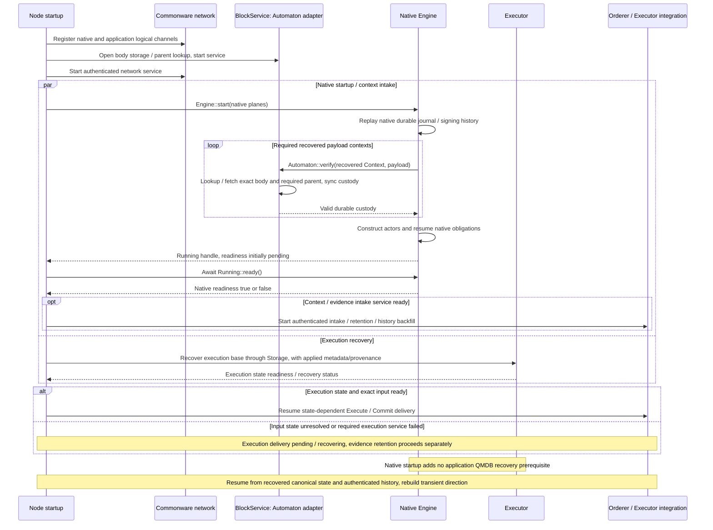
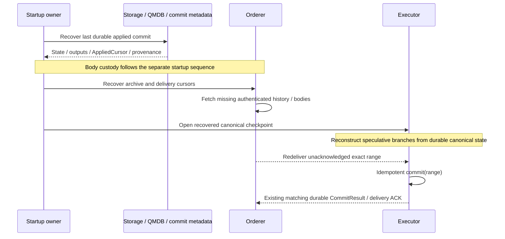

# Startup, restart, and history recovery

**Recovery reconnects stored bodies, authenticated history, and durable application state.** Startup prepares custody and native readiness. Restart restores state and cursors and redelivers exact ranges whose acknowledgements were lost.

## Startup: prepare custody before native recovery

[Open full-size diagram](../assets/diagrams/diagram-13.svg)

This sequence assumes recovered-payload verification succeeds. A false verification result or closed receiver makes `Engine::start` fail with `OpenError::RecoveredPayloadUnverified`. That differs from `ready=false` after a Running handle exists. [Pre-running custody fence](https://github.com/commonwarexyz/monorepo/blob/534af0ede48affd35b2111522527547b4cc9bf72/consensus/src/multimmit/engine.rs#L272).

`Engine::start` returns a Running handle with readiness initially pending. `Running::ready().await` returns true after native startup/recovery durability work and initial producer-wake submission; engine failure before readiness returns false. [Running readiness](https://github.com/commonwarexyz/monorepo/blob/534af0ede48affd35b2111522527547b4cc9bf72/consensus/src/multimmit/engine.rs#L549).

A Running handle does not prove every service is ready. Body-service, native-engine, ordered-delivery, and execution-state readiness are separate. Native startup cannot be reported successful before required recovered-payload verification resolves true. Startup dependencies do not add a report or direction approval round.

## Restart and backfill

[Open full-size diagram](../assets/diagrams/diagram-10.svg)

| Progress coordinate | Owner and advancement condition | Relationship to the next stage |
|---|---|---|
| Native journal cursor | Native owner receives a durable domain-event prefix acknowledgement | Does not establish application evidence retention or state application |
| Proposed ArchiveCursor | Orderer recoverably stores exact source witnesses and interpretation | Evidence, policy, and history for emitted ranges must remain recoverable |
| Proposed OrderedCursor | Orderer appends exact continuous input from terminal slots | Range identity, predecessor, and interpretation bind to applied commit |
| Proposed AppliedCursor | Storage proves durable state/output/cursor/provenance linkage; Executor delivers its receipt | Lost acknowledgement for the same range can be recovered idempotently |

These coordinates cannot be compared by numeric magnitude. Witness coverage and exact identity connect archive, ordered input, and applied commit. Delivery acknowledgement alone does not justify deleting source material or guarantee permanent serving availability. Retention handoff, export lag, and bounded-buffering policy remain open. No separate archive quorum is added to native cut waits.

Recovered state, outputs, and cursor follow the chosen application recovery-adapter contract; QMDB alone does not guarantee automatic atomicity across them. The sequence handles lost acknowledgements and unacknowledged ranges using recovered execution state and history. Native custody and readiness follow the [separate startup sequence](recovery.md#startup-prepare-custody-before-native-recovery). Idempotence verifies exact commit identity and recoverable outputs/cursor, not merely equality of state roots.
