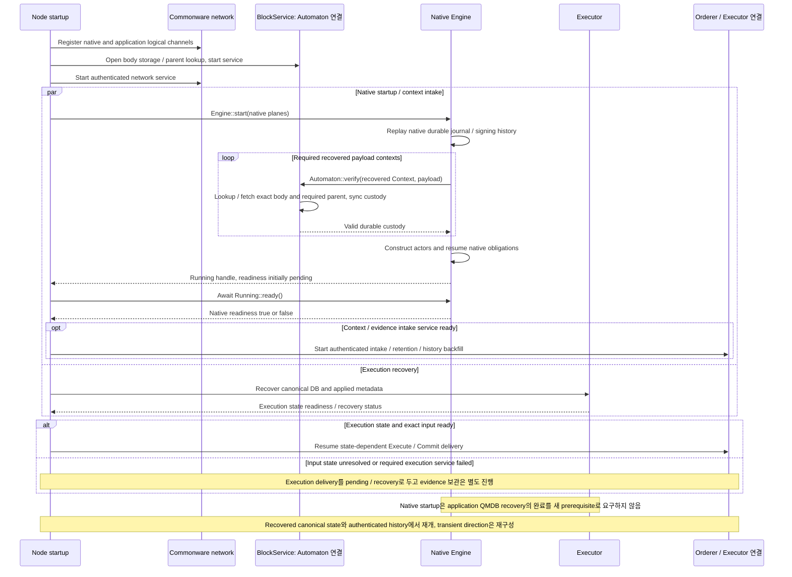
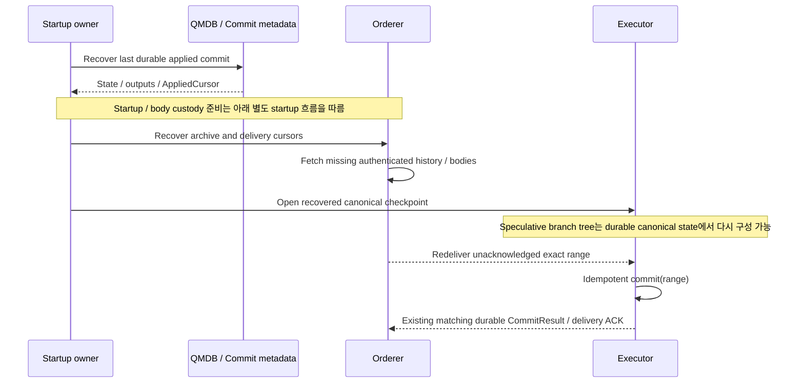

# 시작·재시작과 이력 복구

Body custody와 native readiness를 준비하고, 재시작 뒤 durable 상태·이력·미확인 delivery를 복구한다.

## Startup: custody를 준비한 뒤 native recovery

[그림 크게 보기](../assets/diagrams/diagram-13.svg)

이 그림은 recovered payload verify가 성공한 startup 경로다. Verify가 false이거나 receiver가 닫히면 `Engine::start` 자체가 `OpenError::RecoveredPayloadUnverified`로 실패하며 Running 생성 이후의 `ready=false`와 구분한다. [Pre-running custody fence](https://github.com/commonwarexyz/monorepo/blob/534af0ede48affd35b2111522527547b4cc9bf72/consensus/src/multimmit/engine.rs#L272).

`Engine::start`는 readiness가 pending인 `Running` handle을 반환한다. `Running::ready().await`의 `true`는 startup / recovery의 durable 처리와 initial producer wake 제출을 확인한 native 경계이며, readiness 전에 engine이 실패하면 `false`다. [Running readiness](https://github.com/commonwarexyz/monorepo/blob/534af0ede48affd35b2111522527547b4cc9bf72/consensus/src/multimmit/engine.rs#L549).

Engine이 반환하는 running handle 자체를 모든 서비스의 readiness 증명으로 쓰지 않는다. Body service readiness, native engine readiness, ordered delivery readiness, execution state readiness를 하나의 ready flag로 합치지 않는다. Recovery에 필요한 verify가 true로 해소되기 전 native 시작을 성공으로 보고하지 않는다. Startup dependency 때문에 새 report나 direction 승인 round를 기다리는 구조를 만들지 않는다.

## 재시작과 backfill

[그림 크게 보기](../assets/diagrams/diagram-10.svg)

| 진행 좌표 | 소유자와 진행 근거 | 다음 단계와의 연결 |
|---|---|---|
| Native journal cursor | Native owner가 durable domain-event prefix ACK로 진행 | Application evidence 보관이나 state 적용 완료를 뜻하지 않음 |
| ArchiveCursor 후보 | Orderer가 exact source witness와 interpretation을 recoverable하게 보관 | 방출할 range의 evidence·policy/history를 복구할 수 있어야 함 |
| OrderedCursor 후보 | Orderer가 terminal slots에서 exact 연속 입력을 append | Range identity·predecessor·interpretation을 applied commit과 연결 |
| AppliedCursor 후보 | Executor가 state·outputs·commit metadata의 durable 적용으로 진행 | 동일 range의 lost ACK를 idempotent하게 복구 |

이들은 서로 다른 좌표계이므로 숫자 크기로 비교하지 않는다. Witness coverage와 exact identity로 archive → ordered input → applied commit을 연결한다. Delivery ACK만으로 source 삭제나 영구 serve availability가 정당화되지 않는다. Retention handoff·export lag·bounded buffering의 구체 정책은 미결정이며, 별도 archive quorum을 native cut의 대기 조건으로 추가하지 않는다.

이 그림의 recovered state·outputs·cursor는 선택할 application recovery adapter의 계약이며 QMDB 단독의 자동 atomicity 보장이 아니다. Recovered execution state와 history에서 lost ACK / unacknowledged range를 다시 처리하는 흐름이다. Native startup 자체의 body custody·readiness fence는 [별도 startup 그림](recovery.md#startup-custody를-준비한-뒤-native-recovery)을 따른다. Idempotent 처리도 단순히 state root가 같다는 검사 대신 exact commit identity와 recoverable outputs/cursor를 확인한다.
