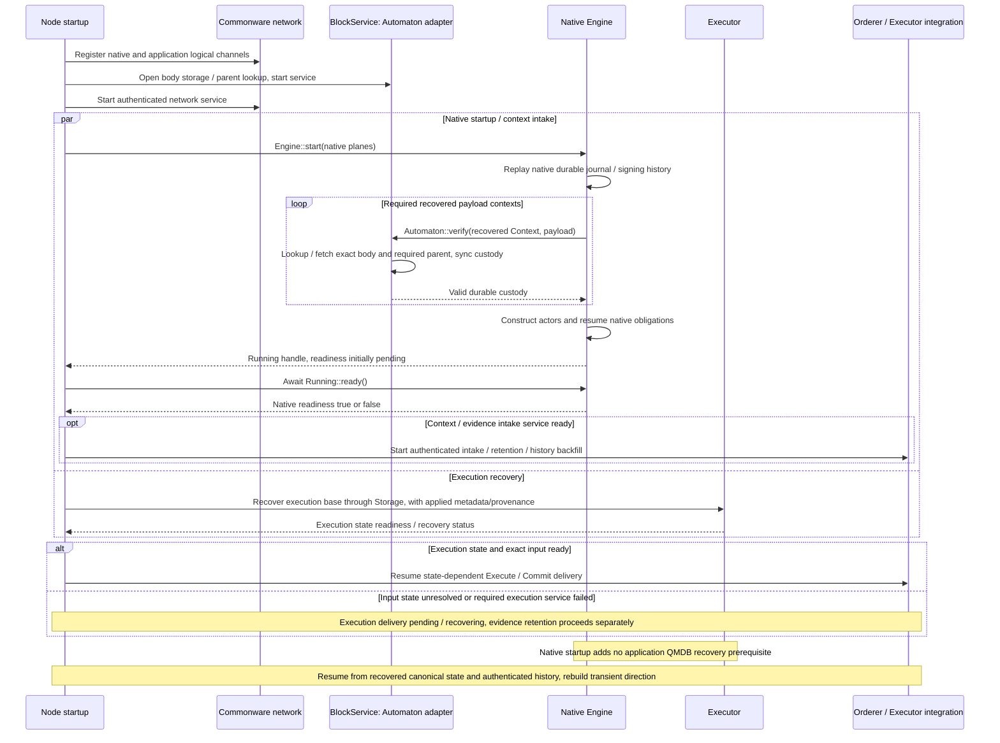
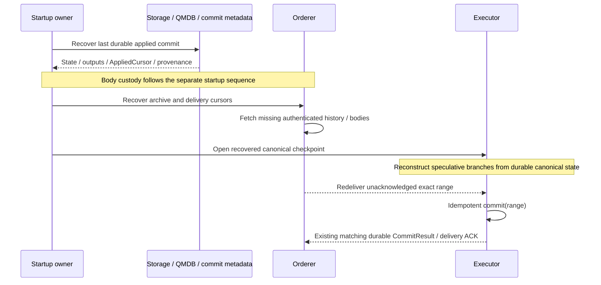

# Startup, restart, and history recovery

**Recovery reconnects stored bodies, authenticated history, and durable application state.** Startup prepares custody and native readiness. Restart restores state and cursors and redelivers exact ranges whose acknowledgements were lost.

## Startup: prepare custody before native recovery

[Open full-size diagram](../assets/diagrams/diagram-13.svg)

**Prepare local custody first; make peer fetch usable before native recovery requests it.** The diagram's early body-service start may construct/open the attachment and idle intake. Network binding must precede its first actual outbound publication/fetch: pre-bind network submissions can return accepted feedback while discarding bytes. Start the separate public body buffer/resolver without waiting for Native Running or native readiness. `Engine::start` may already be waiting for recovered body verification, so a body resolver that depends on that returned handle would create an initialization cycle. This is a local dependency order, with no peer Ready/ACK round. [Network binding](https://github.com/commonwarexyz/monorepo/blob/534af0ede48affd35b2111522527547b4cc9bf72/p2p/src/authenticated/discovery/network.rs#L192), [pre-bind send](https://github.com/commonwarexyz/monorepo/blob/534af0ede48affd35b2111522527547b4cc9bf72/p2p/src/authenticated/router/ingress.rs#L204), [pre-running verification](https://github.com/commonwarexyz/monorepo/blob/534af0ede48affd35b2111522527547b4cc9bf72/consensus/src/multimmit/engine.rs#L700).

This sequence assumes recovered-payload verification succeeds. A false verification result or closed receiver makes `Engine::start` fail with `OpenError::RecoveredPayloadUnverified`. That differs from `ready=false` after a Running handle exists. [Pre-running custody fence](https://github.com/commonwarexyz/monorepo/blob/534af0ede48affd35b2111522527547b4cc9bf72/consensus/src/multimmit/engine.rs#L272).

`Engine::start` returns a Running handle with readiness initially pending. `Running::ready().await` returns true after native startup/recovery durability work and initial producer-wake submission; engine failure before readiness returns false. [Running readiness](https://github.com/commonwarexyz/monorepo/blob/534af0ede48affd35b2111522527547b4cc9bf72/consensus/src/multimmit/engine.rs#L549).

A Running handle does not prove every service is ready. Body-service, native-engine, ordered-delivery, and execution-state readiness are separate. Native startup cannot be reported successful before required recovered-payload verification resolves true. Startup dependencies do not add a report or direction approval round.

Reuse existing Archive initialization to reopen its committed checkpoint, then existing covering sync completion for newly admitted body custody. An opened archive or returned task handle alone does not establish that those writes are durable. In-memory body caches start empty; retained archives and actual requests reconstruct required availability. Native journal recovery remains tied to its safety partition and epoch-key provenance: the native fresh-start path is restricted to a never-active epoch key and a new partition prefix. [Archive initialization](https://github.com/commonwarexyz/monorepo/blob/534af0ede48affd35b2111522527547b4cc9bf72/storage/src/archive/immutable/storage.rs#L110), [archive sync](https://github.com/commonwarexyz/monorepo/blob/534af0ede48affd35b2111522527547b4cc9bf72/storage/src/archive/mod.rs#L137), [native recovery identity](https://github.com/commonwarexyz/monorepo/blob/534af0ede48affd35b2111522527547b4cc9bf72/consensus/src/multimmit/engine.rs#L306).

## Own service lifetimes and durable shutdown

**Use existing runtime task ownership; keep storage completion explicit.** `Supervisor`/`Spawner` provide descendant ownership, and `Handle::select` can group services that should terminate together. Do not place the canonical writer beneath a short-lived advisory task. Cancellation and durability have separate completion conditions.

| Existing handle | Establishes | Application connection |
|---|---|---|
| `Running::ready` | Remembered native startup milestone; once true it remains true | Retain lifecycle ownership separately; this is not an ongoing service health check |
| `Handle::select` | First selected task exit or selection drop aborts the owned group | Choose the shared teardown boundary; no automatic restart or archive/QMDB flush |
| `Spawner::stopped/stop` | Cooperative global shutdown and held-signal release | Keep required cleanup ownership through real storage completion |
| Native `Running::abort/join` | Upstream documented engine lifecycle API | Body, Orderer and Storage shutdown/flush still have independent ownership |
| Archive sync / selected Storage barrier | Covering storage completion under its specific contract | Check exact custody or state/output/cursor/provenance linkage before publishing completion |

Tempo starts its network before the consensus service and retains mandatory services in `Handle::select`. Alto starts body handling before consensus to avoid restart queues blocking, but its `try_join_all` waits for all successful exits and returns early on error. Copy the intended ownership pattern with its actual API semantics. [Tempo startup](https://github.com/tempoxyz/tempo/blob/61c979a524f9af5de9c540a0088c429a44741e4c/crates/consensus/src/lib.rs#L148), [Tempo task selection](https://github.com/tempoxyz/tempo/blob/61c979a524f9af5de9c540a0088c429a44741e4c/crates/consensus/src/consensus/engine.rs#L524), [Alto startup/wait](https://github.com/commonwarexyz/alto/blob/1d87569348b5560699465a72d691d90f18affb9c/chain/src/engine.rs#L465), [runtime supervision](https://github.com/commonwarexyz/monorepo/blob/534af0ede48affd35b2111522527547b4cc9bf72/runtime/src/lib.rs#L281), [owned selection](https://github.com/commonwarexyz/monorepo/blob/534af0ede48affd35b2111522527547b4cc9bf72/runtime/src/utils/handle.rs#L189).

The native join documentation promises all engine children have stopped, while its implementation awaits the root task and runtime completion requests descendant abort. This source inspection does not prove the stricter child/signing-material quiescence needed for authority transfer, and observes no executed race. Retain the documented lifecycle recipe without treating root completion as a proven signing-authority handoff or storage durability barrier. That integration postcondition remains unverified. [Native join](https://github.com/commonwarexyz/monorepo/blob/534af0ede48affd35b2111522527547b4cc9bf72/consensus/src/multimmit/engine.rs#L588), [runtime completion](https://github.com/commonwarexyz/monorepo/blob/534af0ede48affd35b2111522527547b4cc9bf72/runtime/src/utils/handle.rs#L125).

## Restart and backfill

[Open full-size diagram](../assets/diagrams/diagram-10.svg)

| Progress coordinate | Owner and advancement condition | Relationship to the next stage |
|---|---|---|
| Native journal cursor | Native owner receives a durable domain-event prefix acknowledgement | Does not establish application evidence retention or state application |
| Proposed ArchiveCursor | Orderer recoverably stores exact source witnesses and interpretation | Evidence, policy, and history for emitted ranges must remain recoverable |
| Proposed OrderedCursor | Orderer appends exact continuous input from terminal slots | Range identity, predecessor, and interpretation bind to applied commit |
| Proposed AppliedCursor | Storage proves durable state/output/cursor/provenance linkage; Executor delivers its receipt | Lost acknowledgement for the same range can be recovered idempotently |

These coordinates cannot be compared by numeric magnitude. Witness coverage and exact identity connect archive, ordered input, and applied commit. Delivery acknowledgement alone does not justify deleting source material or guarantee permanent serving availability. Retention handoff, export lag, and bounded-buffering policy remain open. No separate archive quorum is added to native cut waits.

Recovered state, outputs, and cursor follow the chosen application recovery-adapter contract; QMDB alone does not guarantee automatic atomicity across them. The sequence handles lost acknowledgements and unacknowledged ranges using recovered execution state and history. Native custody and readiness follow the [separate startup sequence](recovery.md#startup-prepare-custody-before-native-recovery). Idempotence verifies exact commit identity and recoverable outputs/cursor, not merely equality of state roots.
