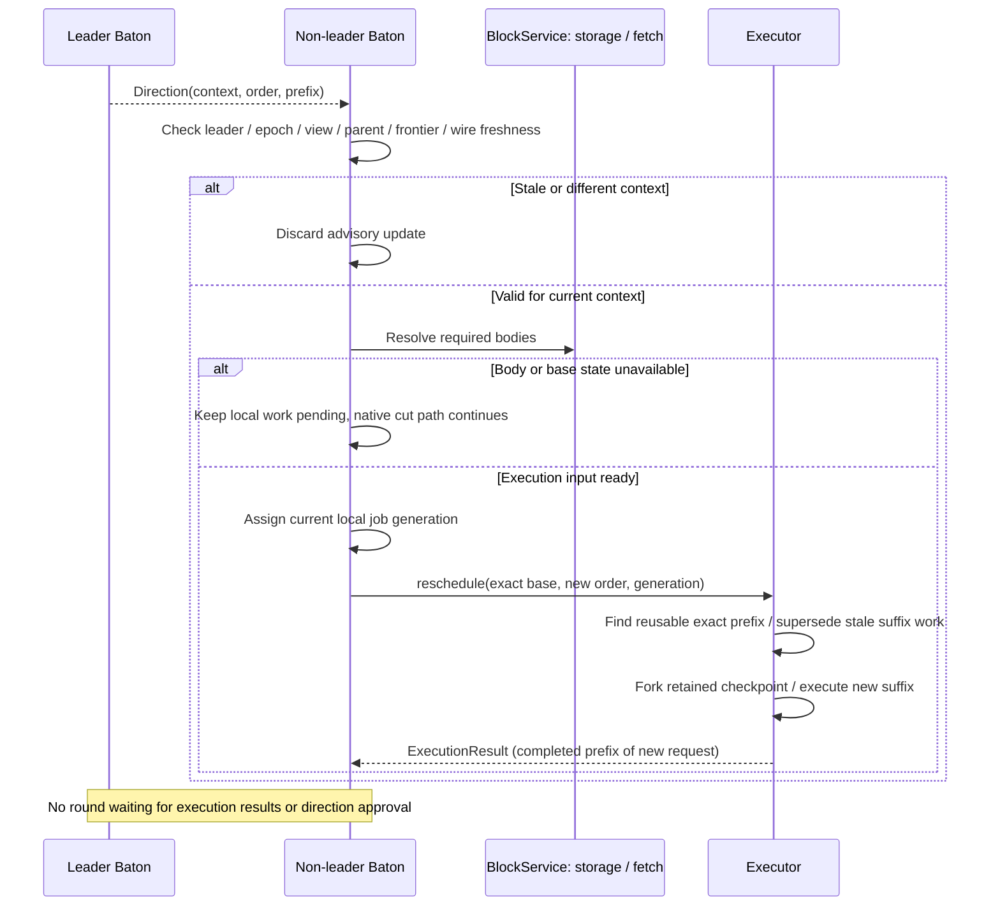

# Receiving direction and reexecuting

**Non-leader Baton requests a new schedule; Executor reuses valid completed work.** Baton verifies the leader and context, resolves required inputs, and sends a reschedule request. Only a completed prefix with the same execution context is reusable.

## Non-leader lifecycle: direction and rescheduling

[Open full-size diagram](../assets/diagrams/diagram-07.svg)

A direction change does not require reexecuting every block. Executor reuses only a checkpoint for an exact prefix already completed in the same order from the same input state and runtime. Advisory requests cannot roll back canonically applied state.
