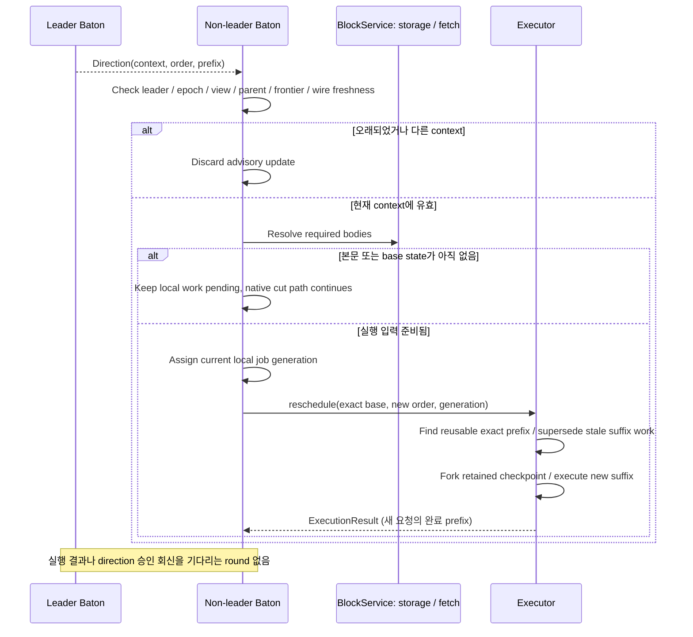

# Direction 수신과 재실행

Non-leader가 direction을 검증하고 Executor에 새 실행 요청을 보낸다. 완료한 같은-context prefix만 재사용한다.

## Baton lifecycle: non-leader의 direction·재실행 요청

[그림 크게 보기](../assets/diagrams/diagram-07.svg)

Direction이 바뀌었다고 모든 block을 재실행하지 않는다. Executor는 같은 입력 state와 runtime에서 같은 순서로 실행을 끝낸 prefix checkpoint만 재사용한다. 이미 canonical에 적용한 state는 advisory 요청으로 되돌리지 않는다.
