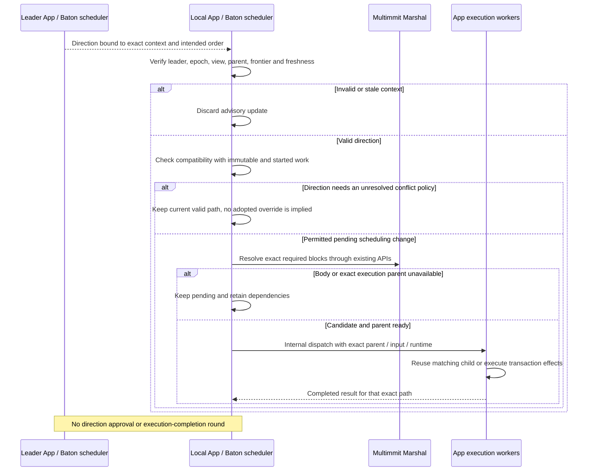

# Receiving direction and executing branches

**The App scheduler decides pending work; App execution code runs it from an exact parent.** Pre-cut and Baton modes share those execution and storage mechanisms. Baton additionally receives authenticated advisory direction. Public `execute` or `reschedule` traits are unnecessary for this internal connection.

## Local execution: A executing, C then B arrive

For a shared global rule A → B → C, preserve A while it executes. When eligible C and then B arrive before C starts, sort only the pending queue to B → C. Dispatch B on A's completed checkpoint, then C on AB. Admission while A runs changes pending order but does not start dependent work from an incomplete state.

If C already started on A, late eligible B does not move it: the local path remains AC, followed by B if ancestry permits. Do not wait for unknown B or reexecute C merely to restore a fresh global sort. The common rule is `F ++ sort_G(S_pending)`, with the started/completed valid prefix `F` held fixed. Reports use the same intention, and already signed reports remain immutable.

A later continuous finalized Update may require another order. The App then finds the matching canonical prefix and repairs only the required suffix. Local started order does not establish finality. [Scheduling contract](../baton/direction.md)

## Non-leader lifecycle: direction and branch execution

[Open full-size diagram](../assets/diagrams/diagram-07.svg)

The precedence of a conflicting advisory direction over an already started local path remains undecided. A valid signature alone does not authorize rolling back canonical state or changing a frozen native proposal policy. Preserve that open decision rather than implementing a hidden rescheduling default in the diagram.

Execution reuse requires identical canonical base, ordered input prefix and runtime, with a completed valid checkpoint. A producer header parent is only the previous block in its own lane; it is not this cross-lane execution parent. [Exact execution and storage responsibilities](../execution/README.md)

The App owner accepts a completion only once for the still-current execution attempt and its exact context/valid ancestry. Duplicate or retired/canceled attempts cannot advance the path. Dropping a waiter does not prove CPU or storage work stopped; fence affected live database access before canonical mutation and retain references until safe to release.
