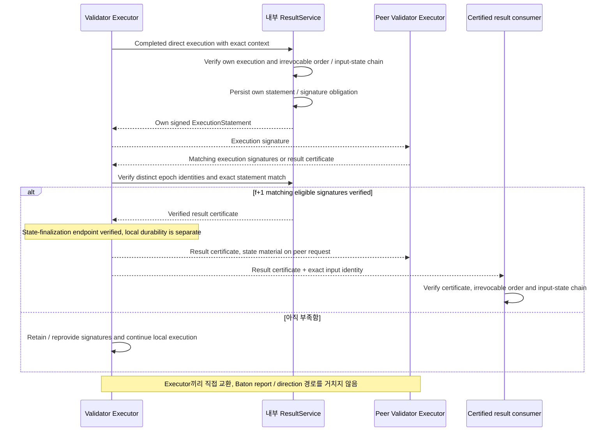

# Executor 간 결과 인증과 조회

Executor끼리 실행 서명을 직접 교환해 같은 전체 결과의 f+1 인증서를 확인한다. 인증된 결과와 로컬 저장 완료는 별도다.

## 결과 endpoint: direct execution과 f+1 인증

ResultService의 signing / collection은 **Executor 내부 역할**이다. 아래 sequence는 validator Executor끼리 직접 서명을 교환·수집하는 경로다. 인증서와 change set의 송수신도 같은 execution peer 경계이며 Baton이 중계하지 않는다. Proposed trait는 [§6.8](../execution/interfaces.md#결과-인증-trait)에 모았다.

[그림 크게 보기](../assets/diagrams/diagram-11.svg)

State root 값 하나만 같은 서명을 합치지 않는다. Exact input range·canonical predecessor·runtime·전체 결과가 같은 statement여야 한다. Imported certificate / state sync 결과를 자신이 직접 실행한 signature로 바꾸지 않는다. Common signing boundary와 wire schema는 미결정이다. [§6.3의 root kind/version·operation/batch-boundary 계약](../execution/qmdb.md#qmdb-state-관리와-재사용-경계)과 같은 결과 해석에 결속된 full statement를 비교한다.

서명·검증 계산은 Commonware cryptography primitive를 재사용하는 방향으로 연결한다. 공통 단일 서명 API의 진입점은 [`Signer::sign(namespace, msg)`](https://github.com/commonwarexyz/monorepo/blob/534af0ede48affd35b2111522527547b4cc9bf72/cryptography/src/lib.rs#L93)와 [`Verifier::verify(namespace, msg, sig)`](https://github.com/commonwarexyz/monorepo/blob/534af0ede48affd35b2111522527547b4cc9bf72/cryptography/src/lib.rs#L130)다.

`ExecutionStatement` 구성과 실행에 참여할 수 있는 epoch identity 확인, 서로 다른 identity가 같은 전체 statement에 서명했는지 확인하는 책임은 Executor 내부 `ResultService`에 둔다. Native scheme의 [message signing](https://github.com/commonwarexyz/monorepo/blob/534af0ede48affd35b2111522527547b4cc9bf72/consensus/src/multimmit/scheme/bls12381_threshold.rs#L1143)과 [verification](https://github.com/commonwarexyz/monorepo/blob/534af0ede48affd35b2111522527547b4cc9bf72/consensus/src/multimmit/scheme/bls12381_threshold.rs#L1189)은 primitive 호출의 참고 예다. 결과 서명의 scheme·key·domain·codec·aggregation 선택은 미결정이며, 이 예의 BLS scheme을 기본값으로 채택하지 않는다.
