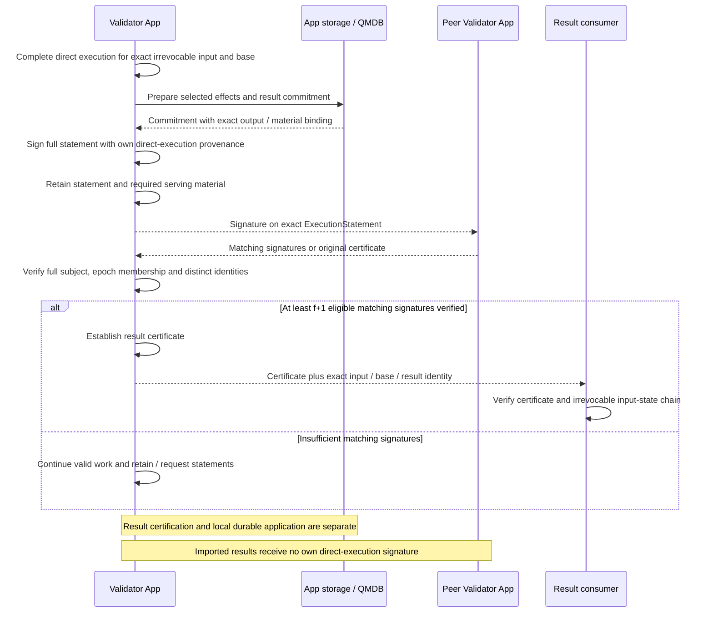

# App result certification and queries

**The App certifies results through direct execution-peer messages.** Its internal execution code constructs the statement and checks eligible signers. A verified f+1 certificate establishes the adopted result endpoint; local durable application remains a separate milestone.

## Result endpoint: direct execution and f+1 certification

The App prepares the selected result commitment before signing. Each speculative attempt need not calculate a root. Result exchange uses Commonware transport and cryptographic primitives, with application-specific exact-context checks; the Baton scheduler does not relay or approve it.

[Open full-size diagram](../assets/diagrams/diagram-11.svg)

The full subject binds the exact input/range, canonical predecessor state, runtime and result. Equal state roots alone do not make two subjects equal. Each identity counts once under the relevant epoch membership. Honest signers directly execute and validate the subject; relaying an imported certificate cannot create local direct-execution provenance.

The f+1 result threshold is separate from native Multimmit quorums and the 2f+1 intention-prefix support rule. Reports are not result proofs. Result certification does not wait for Baton approval or gate native cut formation. Common signing boundaries, wire encoding, result transport limits and cryptographic scheme remain undecided. [Certification responsibilities](../execution/interfaces.md)

A certified result consumer still distinguishes certificate verification, local readable state and durable applied state. Queries must identify the selected state and result contract. Required outputs and intermediate boundaries must remain available under an explicit retention policy; a root by itself cannot reprovide them. [QMDB and retention](../execution/qmdb.md)
