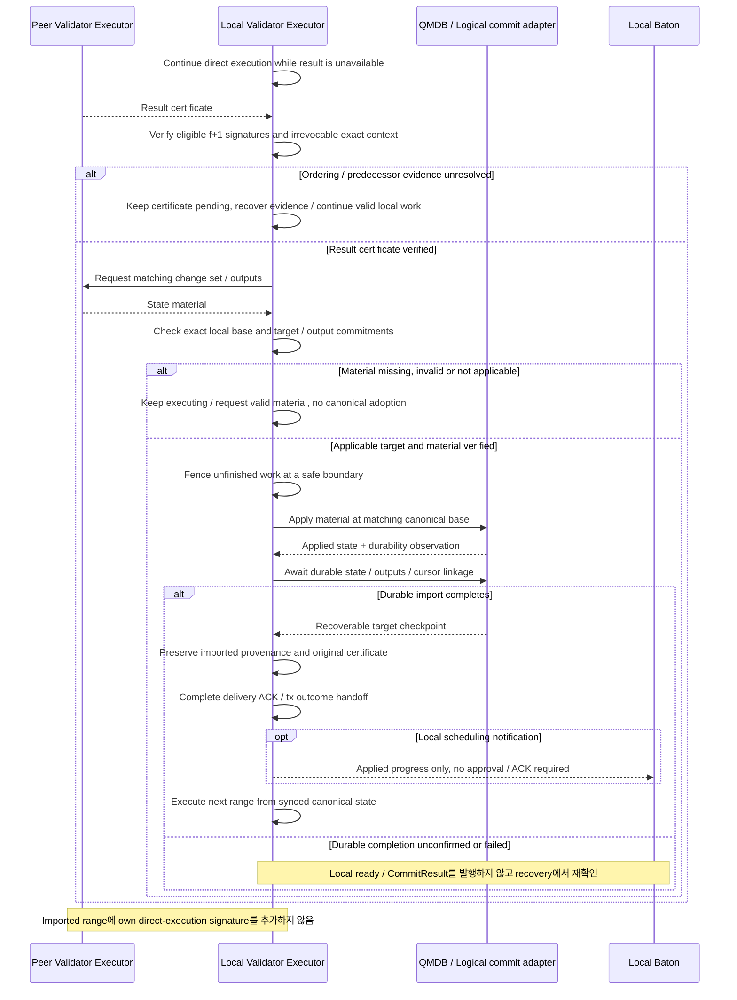

# State sync: 인증된 실행 결과로 상태 동기

실행 중인 validator가 peer의 인증서와 적용 가능한 상태 자료를 검증한 뒤 남은 계산을 멈추고 상태를 동기화한다.

## State sync: 인증된 실행 결과로 상태 동기

이 그림은 §6.7의 **validator 정상 경로로 정한 state sync**를 설명한다. Peer Executor가 보낸 인증 결과와 state material을 수신 Executor가 검증·적용한다. Baton 간 통신이나 별도 catch-up coordinator를 추가하지 않는다. [Canonical apply](../execution/qmdb.md#commit-요청을-받으면-branch를-canonical로-만들기)의 single writer·access fence·durability 계약을 공유한다. 책임과 경로는 정했지만 wire format·전환·저장 계약은 아직 구현·검증되지 않았다.

[그림 크게 보기](../assets/diagrams/diagram-14.svg)

원래 certificate의 전달·state finalization 확인과 local state의 durable readiness는 다른 사건이다. 남은 실행은 인증서만 도착했다고 중단하지 않는다. 검증·적용 가능한 material이 확보되어야 하며, 부분 실행 state에 canonical-base delta를 덧붙이지 않는다. 구체 material format·checkpoint 전환·root 검증·import commit 방식은 미결정이고, 올바른 canonical base에서 다음 range를 직접 실행하는 경로는 기존 execution interface를 사용한다.
