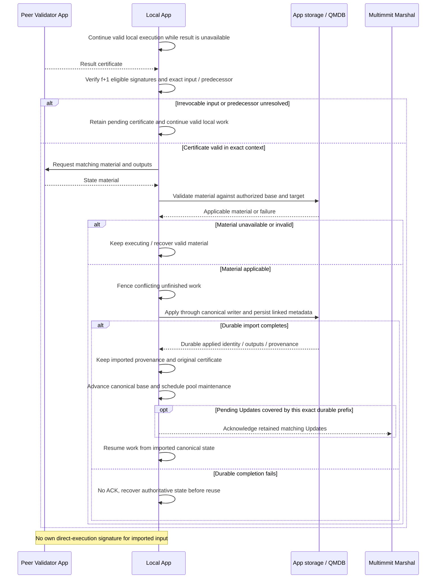

# State sync from certified execution results

**An App may import verified peer material during normal execution.** It verifies the result certificate and exact input context, checks applicable material, then fences conflicting work and applies through the same canonical writer used for direct execution.

## State sync from certified execution results

State sync belongs to App execution/storage code. Peer result messages do not pass through either scheduler mode for approval. The path shares the single writer, access fencing and durability contract of [canonical application](canonical.md).

[Open full-size diagram](../assets/diagrams/diagram-14.svg)

A certificate alone does not justify stopping unfinished execution; applicable material must also be verified. Do not apply a canonical-base delta to arbitrary partial speculative state. A verified import can satisfy an outstanding Update only when its exact input and durable applied identity cover that Update in order. Do not synthesize ACK tokens or skip unrelated outstanding delivery.

For checkpoint catch-up, coordinate Marshal's authenticated floor and output identity with App state installation. `install_floor` restores Marshal's input prefix, not the application database. Serialize this App-owned transition with canonical intake and fence old workers; reconcile already retained Updates against the exact durable imported prefix before resuming. A Marshal floor reset may open a new delivery window while App still holds old Updates, so either prevent that overlap through the transition lifecycle or bound it explicitly. `Update` has no generation tag; local import ownership and exact identity checks must supply the fence. Wire/material formats, checkpoint switching, result verification and atomic recovery linkage remain implementation work. [State-sync responsibilities](../execution/state-sync.md)
