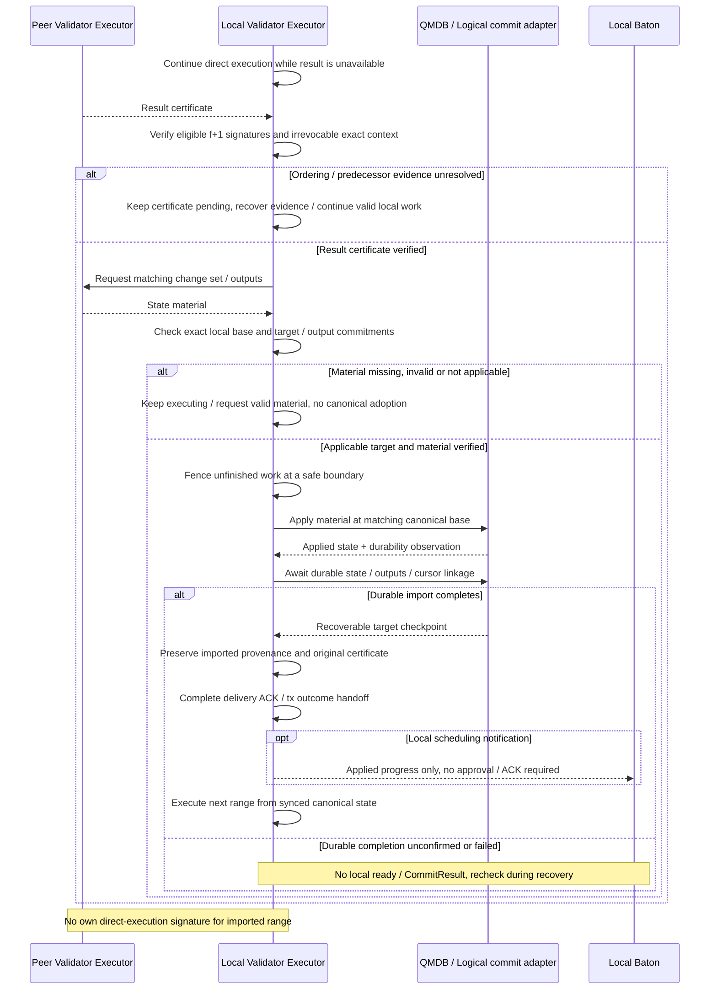

# State sync from certified execution results

**A validator can import a verified peer result while still executing.** Its Executor checks the certificate and applicable state material, fences unfinished work, and applies the result at the correct canonical base.

## State sync from certified execution results

This sequence illustrates state sync as an option on the **normal validator path**. The receiving Executor verifies and applies certified results and material from a peer Executor. No Baton-to-Baton exchange or separate catch-up coordinator is added. It shares the single writer, access fencing, and durability contract of [canonical application](../execution/qmdb.md#commit-a-branch-to-canonical-state). Responsibility and path are adopted, while wire format, switching, storage, and validation remain unimplemented.

[Open full-size diagram](../assets/diagrams/diagram-14.svg)

Relaying the original certificate, establishing state finalization, and achieving durable local readiness are different events. A certificate alone does not stop remaining execution; verified applicable material must also be available. Do not append a canonical-base delta to partially executed state. Material format, checkpoint switching, root verification, and import commit remain undecided. The next range can use the existing execution interface for direct execution from the correct canonical base.
