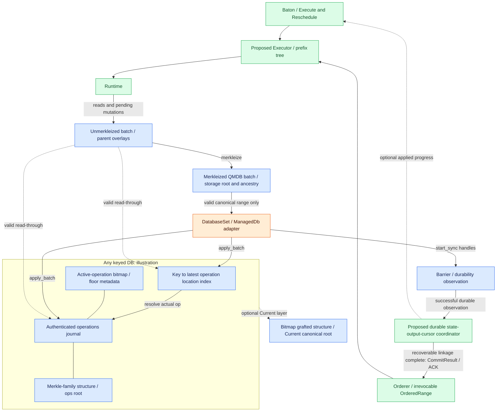
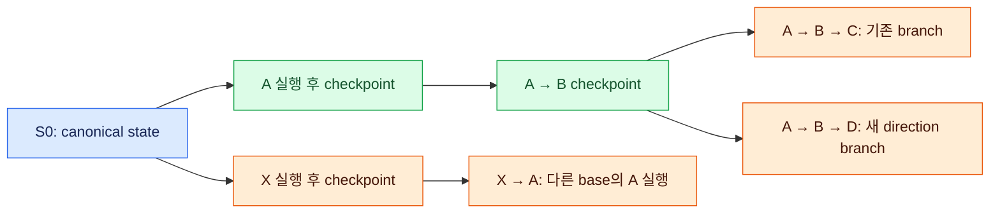

# QMDB 분기·재사용·상태 적용

실행 분기와 checkpoint를 재사용하고, 확정 입력과 맞는 결과만 canonical 상태에 적용한다. Readable 상태와 durable 완료를 구분한다.

## QMDB state 관리와 재사용 경계

**이 문서의 QMDB는 Commonware `storage::qmdb`에 구현된 authenticated database 계열이다.** Database state는 state-changing operations의 append-only log에서 도출한다. Runtime이 tx/body를 해석해 필요한 state reads와 mutations를 만든다. QMDB는 그 mutations를 batch에 모으고 storage operations와 root를 계산하며, Executor가 넘긴 valid batch를 DB에 적용·저장한다. QMDB가 tx execution engine이나 native consensus engine 자체는 아니다. [QMDB terminology/lifecycle](https://github.com/commonwarexyz/monorepo/blob/534af0ede48affd35b2111522527547b4cc9bf72/storage/src/qmdb/mod.rs#L1).

Mutable keyed `Any`를 예로 보면 **operations journal**, **key→latest operation location index**, **active-operation bitmap**, **operations root**가 DB 내부에 있다. 읽기는 index에서 후보 locations를 찾아 journal의 실제 operation과 key를 확인한 뒤 value를 반환한다. `snapshot`이라는 field 이름은 이 current-key index를 뜻하며 Baton의 immutable historical state snapshot을 뜻하지 않는다. [Any DB fields](https://github.com/commonwarexyz/monorepo/blob/534af0ede48affd35b2111522527547b4cc9bf72/storage/src/qmdb/any/db.rs#L57), [Actual lookup](https://github.com/commonwarexyz/monorepo/blob/534af0ede48affd35b2111522527547b4cc9bf72/storage/src/qmdb/any/db.rs#L203).

Operations journal은 contiguous item journal과 Merkle-family structure를 함께 관리한다. Journal의 operation location은 같은 location의 Merkle leaf에 대응하여 해당 operation의 inclusion proof를 만들 수 있다. 이것은 body archive나 consensus vote journal을 대체하는 로그가 아니다. Runtime outputs·receipts가 여기에 저장되는지는 application state encoding/commit adapter가 결정할 사항이다. [Authenticated journal](https://github.com/commonwarexyz/monorepo/blob/534af0ede48affd35b2111522527547b4cc9bf72/storage/src/journal/authenticated.rs#L1).

`Current`는 Any의 operation history 위에 operation이 아직 active인지 인증하는 bitmap/grafted Merkle layer를 더한다. Current canonical root는 해당 storage view의 commitment이고 ops-only root와 구분된다. 이 root가 과거 operations를 잊고 오직 logical state map만 인증하는 별도 application root라고 가정하지 않는다. Runtime output certificate가 어떤 root를 사용할지는 정해야 한다. [Current structure](https://github.com/commonwarexyz/monorepo/blob/534af0ede48affd35b2111522527547b4cc9bf72/storage/src/qmdb/current/mod.rs#L32), [Current DB fields](https://github.com/commonwarexyz/monorepo/blob/534af0ede48affd35b2111522527547b4cc9bf72/storage/src/qmdb/current/db.rs#L122), [Current DB wrapper](https://github.com/commonwarexyz/monorepo/blob/534af0ede48affd35b2111522527547b4cc9bf72/glue/src/stateful/db/current.rs).

Unmerkleized batch는 적용 전 pending writes와 parent branch를 보관한다. Runtime 실행 뒤 merkleize하면 resolved operations·computed root·ancestor metadata를 가진 sealed QMDB batch가 된다. Merkleization 자체는 canonical DB의 commit이 아니다. Child batches의 prefix tree와 branch access 유효성은 [§6.4](qmdb.md#실행-요청을-받으면-분기-tree-정리)에서 설명한다.

`glue::stateful::db`는 concrete QMDB types를 `Unmerkleized`, `Merkleized`, `ManagedDb`, `DatabaseSet`의 lifecycle로 묶는다. `DatabaseSet`은 하나 이상의 DB를 lifecycle API로 묶고, `finalize` 결과의 DB별 flush handles를 `Barrier`에 모은다. 여러 DB를 묶는 것과 state/output/cursor의 crash-atomic commit은 별개이며, durable 완료 연결은 [§6.5](qmdb.md#commit-요청을-받으면-branch를-canonical로-만들기)에서 다룬다.

[그림 크게 보기](../assets/diagrams/diagram-17.svg)

Merkleized QMDB batch가 제공하는 것은 sealed storage work와 root/ancestry다. Exact runtime·input prefix·completed execution·outputs를 연결한 application checkpoint는 Executor가 만든다.

주황 `DatabaseSet / ManagedDb adapter`는 기존 APIs를 proposed Executor에 연결하는 경계다. 기존 traits 자체를 반드시 수정한다는 뜻은 아니다. 그림의 QMDB 내부는 Any/Current 설명 예이며 variant 채택이 아니다. Keyless·Immutable·compact에서는 state access와 보관 구조가 다르므로 variant별 concrete API를 확인해 재사용 범위를 정한다. 어느 variant를 사용할지는 아직 선택하지 않았다. `Runtime`과 `Executor`는 새 application/Baton 책임이고 QMDB index·journal·Merkle 알고리즘은 existing Commonware 책임이다.

QMDB database, unmerkleized/merkleized batches와 commit lifecycle을 활용한다. `commonware_glue::stateful`은 parent state fork, pending-tip 보관, finalization 적용·pruning·lazy replay의 참고 구현이다. 다만 기존 block-DAG / marshal 계약이 Multimmit의 cross-producer dense execution order와 같지는 않다. **Batch/storage 계층을 우선 재사용하고, Stateful actor 전체의 호환 여부는 별도 연결 과제**로 남긴다. [Stateful source](https://github.com/commonwarexyz/monorepo/blob/534af0ede48affd35b2111522527547b4cc9bf72/glue/src/stateful/mod.rs).

| 실행의 논리적 동작 | 실제 upstream API | Executor adapter가 추가로 확인할 것 |
|---|---|---|
| Canonical base에서 batch 만들기 | `DatabaseSet::new_batches` | Exact base / runtime / cursor와 해당 DB의 현재 identity |
| Pending parent에서 분기 | `DatabaseSet::fork_batches`, `Merkleized::new_batch` | 실제 valid ancestor batch와 exact execution prefix |
| 실행 후 checkpoint 계산 | `Unmerkleized::merkleize`, `Merkleized::root` | 완료된 work, deterministic root construction, root kind/version |
| Canonical DB에 적용 | `DatabaseSet::finalize`, concrete `ManagedDb::finalize` | Proof-validated exact range만 single writer가 적용 |
| Disk durability 관찰 | `Barrier::durable` | Flush 실패 확인과 state/output/cursor recoverable linkage |
| Readable state hook | `Application::finalized`, `DatabaseSet::readers` | Readable notification은 durable ACK가 아님 |
| QMDB operations 정리 / DB recovery alignment | `DatabaseSet::prune`, `rewind_to_targets` | Active branch refs, query / sync / replay retention과 chosen recovery 계약 |

각 DB의 batch를 `merkleize`하고 root를 계산한다. `DatabaseSet`이 단일 `root()` / `merkleize()`를 제공하는 것은 아니며, 복수 DB roots와 outputs를 어떻게 result에 결속할지는 adapter의 미결정 계약이다. [Database lifecycle traits](https://github.com/commonwarexyz/monorepo/blob/534af0ede48affd35b2111522527547b4cc9bf72/glue/src/stateful/db/mod.rs#L508)의 이름을 사용했으며, generic execution command와 upstream method를 구분한다.

Generic `Unmerkleized` trait가 모든 variant에 동일한 state `get/write/delete` API를 제공하는 것은 아니다. Runtime의 state access는 선택할 database의 concrete methods에 맞춘 adapter를 거쳐야 한다. `Executor::read(query)` 역시 제안한 query 계약이며 `DatabaseSet::readers`가 임의 과거 cursor의 immutable snapshot을 제공한다는 뜻은 아니다. 실제 retained checkpoint/version에서 읽을 수 있는 범위를 query와 pruning 계약으로 정한다.

같은 tx order와 최종 logical values라도 checkpoint batching이나 repeated-key write normalization이 달라지면 operations history/root가 같다고 자동으로 보장할 수 없다.

예를 들어 Any의 한 batch 안에서 `k=1` 다음 `k=2`를 write하면 마지막 mutation만 남지만, 두 writes 사이에 batch를 seal하면 각 seal이 CommitFloor를 추가하므로 storage operation sequence가 달라진다. 최종 값이 모두 `k=2`여도 actual ancestor commitment 일치를 보장하지 못하며, [§6.5의 새 AB와 old ABC 재사용](qmdb.md#commit-요청을-받으면-branch를-canonical로-만들기)은 최종 값 대신 실제 ancestry/context를 확인한다. 이는 storage 계약을 설명하는 예시이며 root를 계산한 실행 결과가 아니다. [Write normalization](https://github.com/commonwarexyz/monorepo/blob/534af0ede48affd35b2111522527547b4cc9bf72/storage/src/qmdb/any/batch.rs#L1306), [Commit boundary operation](https://github.com/commonwarexyz/monorepo/blob/534af0ede48affd35b2111522527547b4cc9bf72/storage/src/qmdb/any/batch.rs#L1228).

Canonical operations / batch boundary를 결정적으로 유도할지, logical root와 storage root를 분리할지는 미결정이다. 이 경계를 해결하지 않고 node별 speculative batching의 storage root를 그대로 `f+1` matching result로 사용하지 않는다.

## 실행 요청을 받으면 분기 tree 정리

Execution branch tree는 **실행 순서의 prefix tree**다. Producer lane의 header ancestry DAG와 별도로 관리한다. 아래 예시는 모두 같은 canonical state `S0`에서 시작한다.

[그림 크게 보기](../assets/diagrams/diagram-18.svg)

`A→B→C`에서 `A→B→D`로 바뀌면 같은 `S0`·runtime에서 완료된 `A→B` checkpoint를 유지하고 `D` suffix를 실행한다. `X→A`의 `A` 결과는 input state가 다르므로 `A`라는 block 이름만으로 재사용하지 않는다.

Executor가 base/context를 확인하고 reusable prefix를 찾는다. Stale jobs의 generation을 무효화하며, 새 branch에 필요한 parent/checkpoint를 보존한다. Reusable checkpoint는 현재 canonical frontier와 compatible해야 한다. 이미 `AB`가 canonical이면 direction으로 `A→D`에 되돌아갈 수 없다. Pruning은 작업자가 참조 중인 state와 향후 commit·recovery에 필요한 checkpoint를 지우지 않는 규칙으로 연결한다. Budget·GC의 수치는 빈칸이다.

Any/Current mutable keyed batch의 read-through는 독립적인 immutable snapshot이 아니라 **ancestor overlay와 applied DB를 함께 읽는 branch-scoped view**다. Compact처럼 keyed `get`을 제공하지 않는 variant에 이 access 설명을 적용하지 않는다.

Canonical DB가 그 batch의 실제 ancestor commitment로 전진하는 경우는 유효할 수 있지만 다른 sibling으로 전진하면 기존 branch의 read·child 생성·apply를 계속할 수 없다. Canonical apply 전에 incompatible 또는 ancestry가 확인되지 않은 작업의 invalid state 접근을 quiesce/fence해야 한다. [Batch applicability](https://github.com/commonwarexyz/monorepo/blob/534af0ede48affd35b2111522527547b4cc9bf72/storage/src/qmdb/batch_chain.rs#L188), [Stateful quiescence](https://github.com/commonwarexyz/monorepo/blob/534af0ede48affd35b2111522527547b4cc9bf72/glue/src/stateful/actor/core/verifications.rs#L158).

Generation을 무효화하면 **결과 채택 권한**을 취소한다. Worker access를 fence하면 **유효하지 않은 부모 state의 read / fork / apply 권한**을 차단한다. Owner가 base를 확인한 뒤 DB 접근 권한을 기다리는 사이 canonical 적용이 DB를 바꿀 수 있다. 따라서 실제 DB 접근 권한을 확보한 상태에서 검사와 사용을 이어가야 한다. 구체 protocol은 [§6.6의 미결정 항목](README.md#미결정-사항)이다.

이미 immutable Merkle snapshot만 갖고 수행하는 CPU hashing은 caller future 취소 뒤에도 끝까지 실행되고 결과가 버려질 수 있다. Canonical apply의 safety fence를 모든 background CPU 작업이 반드시 종료될 때까지 기다리는 조건과 동일시하지 않는다. Invalid live-DB access와 stale result admission을 막는 경계, snapshot reference·resource lifetime을 관리하는 경계를 나눈다. [Snapshot hashing cancellation](https://github.com/commonwarexyz/monorepo/blob/534af0ede48affd35b2111522527547b4cc9bf72/storage/src/journal/authenticated.rs#L325).

## Commit 요청을 받으면 branch를 canonical로 만들기

| 순서 | 처리 | 유지할 경계 |
|---|---|---|
| 1 | Ordered range의 evidence·predecessor·runtime 확인 | Local advisory order를 canonical 근거로 쓰지 않음 |
| 2 | Exact range와 일치하는 completed branch prefix 찾기 | Branch 전체가 더 길어도 확정된 prefix만 대상으로 삼음 |
| 3 | 없는 work / mismatch suffix를 canonical base에서 실행하거나 검증된 peer material 준비 | State root가 우연히 같다는 이유로 다른 input을 대체하지 않음 |
| 4 | Incompatible / unknown active workers를 fence한 뒤 해당 batch 적용 | Single canonical writer, branch-scoped read validity |
| 5 | Durable CommitResult 발급 | State / output / cursor가 함께 복구 가능할 때 완료 |
| 6 | Incompatible forks 정리, compatible suffix 보존 / 재연결 | 확정 canonical 입력/해석은 되돌리지 않음; physical recovery alignment는 선택한 계약을 따름 |

예를 들어 `A→B→C`를 사전 실행했고 canonical range가 `A→B`이면 `A→B`만 QMDB canonical에 적용한다. `C`는 다음 pending 입력이며 기존 C work의 보존은 actual ancestry/context 조건부다. 아직 `AB`가 speculative인 같은 base에서 canonical range가 `A→D`라면 `A` 뒤의 `B→C` 결과는 해당 commit에 사용할 수 없다.

“Canonical로 만든다”는 branch pointer만 바꾸는 동작이 아니다. QMDB에 writes를 적용·sync하고 outputs·commit metadata·AppliedCursor를 crash 후에도 일관되게 복구할 수 있어야 한다. Branch cleanup의 GC scheduling은 미결정이며 state/output/cursor의 durable 완료와 별도로 정한다. Active access fencing과 required retention은 항상 유지해야 한다.

`ABC`만 하나의 sealed batch로 있고 `AB` checkpoint가 없다면 `ABC`를 apply한 뒤 `C`를 숨기는 방식으로 partial-prefix commit을 처리할 수 없다. Executor는 요청의 정확한 predecessor와 일치하는 유효한 base에서 `AB` 끝의 별도 batch 경계를 만들거나, `AB`까지 재실행해 그 경계를 준비해야 한다. `new_batches`는 현재 applied DB에서 시작하며 이미 전진한 DB의 과거 prefix를 자동 복원하지 않는다. [Actual base capture](https://github.com/commonwarexyz/monorepo/blob/534af0ede48affd35b2111522527547b4cc9bf72/storage/src/qmdb/any/batch.rs#L2704).

새 `AB`의 실제 commitment가 old `ABC` ancestry와 다르면 old sealed `ABC` batch를 자동 재사용할 수 없다. 기존 `ABC` batch의 실제 조상에 `AB`가 있다면, owner는 현재 canonical DB의 operation 수와 authenticated ops root가 그 조상의 commitment와 일치하는지 확인한다. Batch가 유효하고 정확한 입력·runtime·완료 결과의 context도 맞을 때만 기존 `ABC` batch를 계속 사용할 수 있다. Storage applicability는 floors도 검사하며 application input/runtime/outputs binding은 owner가 확인한다. [Storage bounds validation](https://github.com/commonwarexyz/monorepo/blob/534af0ede48affd35b2111522527547b4cc9bf72/storage/src/qmdb/batch_chain.rs#L98).

같은 logical state처럼 보이는 sibling batch는 이 조건을 대신하지 않는다. Descendant access는 [§6.4의 branch validity](qmdb.md#실행-요청을-받으면-분기-tree-정리)를 따르며, durable 완료는 아래 finalized/barrier 경계와 구분한다.

Existing `Application::finalized` hook은 DB readable 시점에 호출될 수 있고 flush는 진행 중일 수 있다. [Finalized callback contract](https://github.com/commonwarexyz/monorepo/blob/534af0ede48affd35b2111522527547b4cc9bf72/glue/src/stateful/mod.rs#L308). 이를 durable 완료 callback처럼 직접 연결하지 않는다. `DatabaseSet::finalize`가 반환한 `Barrier::durable` 결과를 확인하고 선택한 state/output/cursor commit 계약을 만족한 뒤 완료를 발급한다. [DatabaseSet / Barrier](https://github.com/commonwarexyz/monorepo/blob/534af0ede48affd35b2111522527547b4cc9bf72/glue/src/stateful/db/mod.rs#L558), [Stateful delivery ACK](https://github.com/commonwarexyz/monorepo/blob/534af0ede48affd35b2111522527547b4cc9bf72/glue/src/stateful/actor/core/processing.rs#L307).

| 실행 / 저장 단계 | 취소·실패의 의미 | Adapter가 유지할 경계 |
|---|---|---|
| Branch work / Shared lock 대기 | 아직 canonical DB를 by-value로 꺼낸 mutation은 아님 | Stale 결과를 버리고 invalid state 접근을 정리 |
| `Shared::write`의 DB take→`WriteSlot::put` 사이 | Future drop / 실패 시 DB를 cell에 돌려주지 못할 수 있음 | Canonical mutation lifecycle을 advisory generation 취소와 분리, lost handle을 ordinary retry로 재사용하지 않음 |
| Applied DB + flush pending | 읽을 수 있지만 durable completion은 미확인 | Barrier와 state/output/cursor linkage가 끝나기 전 ACK 미발급 |
| Barrier handle `Closed` / `Aborted` | Upstream은 shutdown 경계로 문서화한 handle 종료에 `false` | Completion 증거 없음, 실제 disk writes가 0이라고 가정하지 않고 recovery에서 재검증 |
| 다른 deferred flush error | 이미 applied DB가 전진한 뒤 fatal / panic 경계 | 실패를 성공 ACK로 바꾸거나 DB set 전체의 자동 rollback을 주장하지 않음 |

`Shared`는 writer를 우선하는 lock이다. Outer read guard를 잡은 채 같은 Shared cell을 다시 acquire하는 `batch.get` 등을 await하면 queued writer와 deadlock할 수 있다. Multi-DB member의 lock 순서도 `DatabaseSet`의 기존 ownership discipline에 맞춰 연결한다. 이 lock safety와 state/output/cursor의 crash atomicity는 다른 요구다. [Shared ownership / locks](https://github.com/commonwarexyz/monorepo/blob/534af0ede48affd35b2111522527547b4cc9bf72/glue/src/stateful/db/mod.rs#L139).

Flush completion handle의 abort가 underlying disk work를 전부 취소한다는 뜻은 아니다. Task handle과 completion handle의 중단 의미를 구분하며, completion을 잃었다면 authoritative durable state와 cursor를 복구 때 다시 확인한다. [Runtime handle kinds](https://github.com/commonwarexyz/monorepo/blob/534af0ede48affd35b2111522527547b4cc9bf72/runtime/src/utils/handle.rs#L26).
