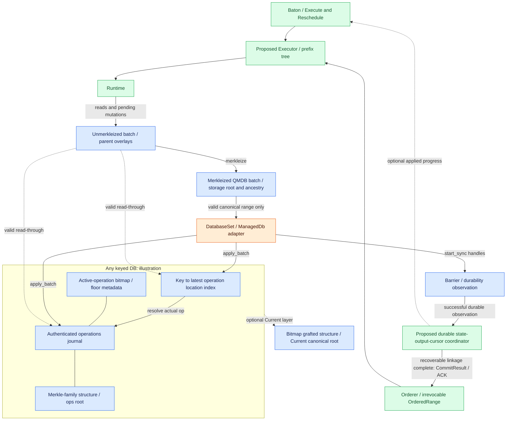
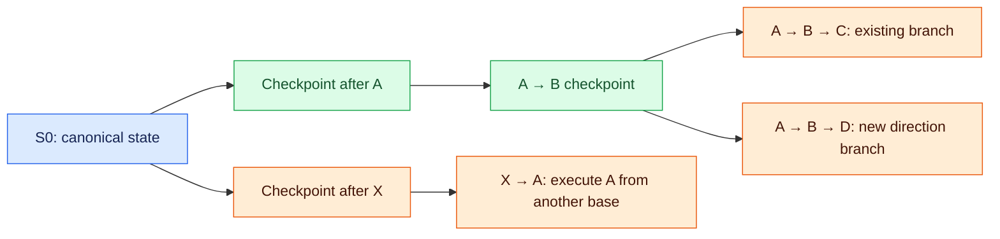

# QMDB branches, reuse, and state application

**Executor keeps speculative work in branches and applies only the exact agreed result to the canonical database.** A checkpoint marks reusable completed work. QMDB supplies authenticated storage and batch operations. Readable state and durable completion are separate milestones.

## QMDB state and reuse boundaries

QMDB here is the authenticated database family implemented in Commonware `storage::qmdb`. Database state is derived from an append-only log of state-changing operations. Runtime interprets transactions/bodies and produces state reads and mutations. QMDB gathers mutations in batches, computes storage operations and roots, and applies/persists valid batches supplied by Executor. QMDB itself is neither a transaction execution engine nor native consensus. [Terminology and lifecycle](https://github.com/commonwarexyz/monorepo/blob/534af0ede48affd35b2111522527547b4cc9bf72/storage/src/qmdb/mod.rs#L1).

For mutable keyed Any, internal structures include an **operations journal**, **key-to-latest-operation index**, **active-operation bitmap**, and **operations root**. Reads find candidate locations through the index, check the journal operation and key, and return the value. Its snapshot field names the current-key index, not an immutable historical Baton state snapshot. [Any fields](https://github.com/commonwarexyz/monorepo/blob/534af0ede48affd35b2111522527547b4cc9bf72/storage/src/qmdb/any/db.rs#L57), [Lookup](https://github.com/commonwarexyz/monorepo/blob/534af0ede48affd35b2111522527547b4cc9bf72/storage/src/qmdb/any/db.rs#L203).

The operations journal combines a contiguous item journal and a Merkle-family structure. An operation location maps to the Merkle leaf at that location and supports inclusion proofs. This does not replace body archives or consensus vote journals. Storing runtime outputs or receipts there is an application encoding/commit-adapter choice. [Authenticated journal](https://github.com/commonwarexyz/monorepo/blob/534af0ede48affd35b2111522527547b4cc9bf72/storage/src/journal/authenticated.rs#L1).

Current adds a bitmap/grafted Merkle layer authenticating which operations remain active over Any history. Its canonical root commits to that storage view and differs from an ops-only root. Do not assume it forgets historical operations and authenticates only a separate logical application-state map. The root used in execution certificates remains a decision. [Current structure](https://github.com/commonwarexyz/monorepo/blob/534af0ede48affd35b2111522527547b4cc9bf72/storage/src/qmdb/current/mod.rs#L32), [Fields](https://github.com/commonwarexyz/monorepo/blob/534af0ede48affd35b2111522527547b4cc9bf72/storage/src/qmdb/current/db.rs#L122), [Wrapper](https://github.com/commonwarexyz/monorepo/blob/534af0ede48affd35b2111522527547b4cc9bf72/glue/src/stateful/db/current.rs).

An unmerkleized batch retains pending writes and its parent branch before application. Merkleization produces a sealed batch with resolved operations, computed root, and ancestor metadata. Merkleization itself does not commit the canonical database. [Branch management](qmdb.md#manage-the-branch-tree-for-execution-requests) explains child prefix trees and access validity.

`glue::stateful::db` wraps concrete QMDB types in Unmerkleized, Merkleized, ManagedDb, and DatabaseSet lifecycles. DatabaseSet coordinates one or more databases and collects their finalize flush handles in a Barrier. Coordinating databases does not itself establish crash-atomic state/output/cursor commit. See [canonical durability](qmdb.md#commit-a-branch-to-canonical-state).

[Open full-size diagram](../assets/diagrams/diagram-17.svg)

A merkleized QMDB batch supplies sealed storage work, roots, and ancestry. Executor creates the application checkpoint that additionally binds exact runtime, input prefix, completed execution, and outputs.

The orange DatabaseSet / ManagedDb adapter connects existing APIs to proposed Executor responsibilities; it does not require changing those upstream traits. The internal Any/Current diagram is illustrative, not a variant selection. Keyless, Immutable, and compact have different access and retention structures. Review concrete APIs before choosing reuse scope; no variant is adopted yet. Runtime and Executor are new application responsibilities, while QMDB indexing, journals, and Merkle algorithms remain Commonware responsibilities.

Reuse QMDB databases, unmerkleized/merkleized batches, and commit lifecycle. `commonware_glue::stateful` is a reference for parent forks, pending tips, finalization, pruning, and lazy replay. Its block-DAG/marshal contract differs from Multimmit merged producer execution order. **Reuse batch/storage first; assess the full Stateful actor separately.** [Stateful source](https://github.com/commonwarexyz/monorepo/blob/534af0ede48affd35b2111522527547b4cc9bf72/glue/src/stateful/mod.rs).

| Logical execution action | Actual upstream API | Executor adapter must additionally verify |
|---|---|---|
| Create batch at canonical base | `DatabaseSet::new_batches` | Exact base, runtime, cursor, and current database identity |
| Fork pending parent | `DatabaseSet::fork_batches`, `Merkleized::new_batch` | Valid actual ancestor batch and exact execution prefix |
| Compute checkpoint after execution | `Unmerkleized::merkleize`, `Merkleized::root` | Completed work, deterministic root construction, root kind/version |
| Apply to canonical database | `DatabaseSet::finalize`, concrete `ManagedDb::finalize` | Proof-validated exact range applied by a single writer |
| Observe disk durability | `Barrier::durable` | Flush failures and recoverable state/output/cursor linkage |
| Readable-state hook | `Application::finalized`, `DatabaseSet::readers` | Readable notification is not a durable ACK |
| Prune operations / align database recovery | `DatabaseSet::prune`, `rewind_to_targets` | Active branch references, query/sync/replay retention, chosen recovery contract |

Merkleize each database's batch and compute its root. DatabaseSet has no single root/merkleize operation. Binding multiple database roots and outputs into one result is an open adapter contract. The names above refer to [database lifecycle traits](https://github.com/commonwarexyz/monorepo/blob/534af0ede48affd35b2111522527547b4cc9bf72/glue/src/stateful/db/mod.rs#L508); distinguish generic execution commands from upstream methods.

Generic Unmerkleized does not expose identical get/write/delete APIs across every variant. Runtime state access needs an adapter for the selected database's concrete methods. Executor::read is a proposed query contract; DatabaseSet::readers does not promise arbitrary historical cursor snapshots. Query and pruning policy must define which retained checkpoints/versions are readable.

Identical transaction order and final logical values do not automatically imply identical operations history or roots when checkpoint batching or repeated-key normalization differs.

For example, writing `k=1` then `k=2` in one Any batch retains only the final mutation. Sealing between the writes adds a CommitFloor at each seal and changes the storage operation sequence. Both end with `k=2`, yet actual ancestor commitments need not match. [Reusing old ABC after new AB](qmdb.md#commit-a-branch-to-canonical-state) therefore checks actual ancestry and context, not only values. This illustrates a storage contract without claiming computed root results. [Write normalization](https://github.com/commonwarexyz/monorepo/blob/534af0ede48affd35b2111522527547b4cc9bf72/storage/src/qmdb/any/batch.rs#L1306), [Commit-boundary operation](https://github.com/commonwarexyz/monorepo/blob/534af0ede48affd35b2111522527547b4cc9bf72/storage/src/qmdb/any/batch.rs#L1228).

Deterministic derivation of canonical operations/batch boundaries versus separation of logical and storage roots remains open. Until resolved, do not directly use node-specific speculative-batching storage roots as f+1 matching execution results.

## Manage the branch tree for execution requests

The execution branch tree is a **prefix tree of execution orders**, separate from producer-header ancestry. All branches in this example start from the same canonical state S0.

[Open full-size diagram](../assets/diagrams/diagram-18.svg)

Changing `A→B→C` to `A→B→D` can preserve completed `A→B` at the same S0 and runtime and execute only D. The A in `X→A` has a different input state and cannot be reused just because the block has the same name.

Executor validates base/context and finds reusable prefixes. It invalidates stale generations and retains parent checkpoints required by new branches. A reused checkpoint must remain compatible with the current canonical frontier. Once AB is canonical, advisory direction cannot return to A→D. Pruning must preserve worker-referenced state and checkpoints needed for commit/recovery. Numerical budgets and GC policies remain open.

Mutable keyed Any/Current batch read-through is a **branch-scoped view combining ancestor overlays with the applied database**, not an independent immutable snapshot. This description does not apply to variants such as compact that lack keyed get.

Advancing canonical DB to an actual ancestor commitment of a batch can remain valid. Advancing to a sibling invalidates continued branch reads, child creation, and apply. Before canonical application, quiesce or fence incompatible workers and those with unknown ancestry. [Batch applicability](https://github.com/commonwarexyz/monorepo/blob/534af0ede48affd35b2111522527547b4cc9bf72/storage/src/qmdb/batch_chain.rs#L188), [Stateful quiescence](https://github.com/commonwarexyz/monorepo/blob/534af0ede48affd35b2111522527547b4cc9bf72/glue/src/stateful/actor/core/verifications.rs#L158).

Invalidating a generation revokes **result adoption**. Fencing worker access blocks **reads, forks, and application against an invalid parent state**. Canonical DB may change after an owner checks the base but before it obtains access. Keep validation and use within acquired database-access authority. The concrete [fencing protocol remains open](README.md#open-decisions).

CPU hashing over an immutable Merkle snapshot may finish after caller cancellation, with its result discarded. Canonical safety fencing need not wait for every background CPU task to terminate. Separate prevention of invalid live-DB access and stale-result admission from snapshot-reference/resource lifetime management. [Hashing cancellation](https://github.com/commonwarexyz/monorepo/blob/534af0ede48affd35b2111522527547b4cc9bf72/storage/src/journal/authenticated.rs#L325).

## Commit a branch to canonical state

| Step | Action | Required boundary |
|---|---|---|
| 1 | Verify ordered-range evidence, predecessor, runtime | Advisory local order is not canonical evidence |
| 2 | Find the completed branch prefix matching the exact range | Commit only the finalized prefix even if the branch is longer |
| 3 | Execute missing/mismatching suffix from canonical base or prepare verified peer material | Equal roots alone cannot substitute different inputs |
| 4 | Fence incompatible/unknown active workers; apply matching batches | Single canonical writer and valid branch-scoped reads |
| 5 | Produce durable CommitResult | State, outputs, and cursor must be recoverable together |
| 6 | Clean incompatible forks; retain/reconnect compatible suffixes | Never reverse finalized input/interpretation; physical recovery alignment follows the selected contract |

If A→B→C was executed speculatively but the canonical range is A→B, apply only AB. C remains pending; preserving its work depends on actual ancestry and context. If AB is still speculative at the same base and canonical range becomes A→D, the B→C results cannot serve that commit.

Canonical promotion is more than changing a branch pointer. Apply/sync QMDB writes and make outputs, metadata, and AppliedCursor consistently recoverable after a crash. GC scheduling remains open and separate from durable state/output/cursor completion. Active-access fencing and required retention always remain necessary.

If ABC is one sealed batch with no AB checkpoint, applying ABC and hiding C cannot commit only AB. Executor must create a separate boundary at AB from a valid exact predecessor or reexecute through AB to create it. new_batches starts at the currently applied database; it cannot automatically restore an earlier prefix after the database advances. [Actual base capture](https://github.com/commonwarexyz/monorepo/blob/534af0ede48affd35b2111522527547b4cc9bf72/storage/src/qmdb/any/batch.rs#L2704).

A new AB commitment differing from old ABC ancestry prevents automatic reuse of that sealed ABC batch. If AB is an actual ancestor, check that canonical DB operation count and authenticated ops root match its commitment. Continue old ABC only when storage applicability and exact input/runtime/completed-result context all hold. Storage checks floors; the owner checks application input, runtime, and output binding. [Storage bounds](https://github.com/commonwarexyz/monorepo/blob/534af0ede48affd35b2111522527547b4cc9bf72/storage/src/qmdb/batch_chain.rs#L98).

A sibling with apparently equal logical state cannot replace these conditions. Descendant access follows [branch validity](qmdb.md#manage-the-branch-tree-for-execution-requests). Durability remains separate from the finalized/barrier boundaries below.

Existing Application::finalized may run once the database is readable while flush is still pending. [Finalized callback](https://github.com/commonwarexyz/monorepo/blob/534af0ede48affd35b2111522527547b4cc9bf72/glue/src/stateful/mod.rs#L308). Do not connect it as a durable-completion callback. Check the Barrier::durable result from DatabaseSet::finalize and satisfy the selected state/output/cursor commit contract before reporting completion. [DatabaseSet / Barrier](https://github.com/commonwarexyz/monorepo/blob/534af0ede48affd35b2111522527547b4cc9bf72/glue/src/stateful/db/mod.rs#L558), [Stateful delivery ACK](https://github.com/commonwarexyz/monorepo/blob/534af0ede48affd35b2111522527547b4cc9bf72/glue/src/stateful/actor/core/processing.rs#L307).

| Execution / storage stage | Cancellation or failure means | Adapter must preserve |
|---|---|---|
| Branch work / waiting for Shared lock | No by-value canonical DB mutation yet | Discard stale results; stop invalid state access |
| Between Shared::write DB take and WriteSlot::put | Dropping/failing the future may leave DB outside the cell | Separate canonical mutation from advisory cancellation; a lost handle is not an ordinary retry |
| Applied database with flush pending | Readable, without confirmed durability | No ACK before barrier and state/output/cursor linkage complete |
| Barrier handle Closed / Aborted | Upstream returns false for handle closure documented at shutdown boundaries | No completion evidence; do not assume zero disk writes; recheck in recovery |
| Other deferred flush error | Fatal/panic boundary after applied DB advancement | No successful ACK and no claimed automatic rollback of the entire database set |

Shared is a writer-preferring lock. Holding an outer read guard while awaiting batch.get or another reacquisition of the same cell may deadlock behind a queued writer. Multi-DB lock order must follow DatabaseSet ownership discipline. Lock safety and crash atomicity of state/outputs/cursor are different requirements. [Shared ownership / locks](https://github.com/commonwarexyz/monorepo/blob/534af0ede48affd35b2111522527547b4cc9bf72/glue/src/stateful/db/mod.rs#L139).

Aborting a flush-completion handle does not imply canceling all underlying disk work. Distinguish task handles from completion handles. After lost completion, recover authoritative durable state and cursor and recheck. [Runtime handle kinds](https://github.com/commonwarexyz/monorepo/blob/534af0ede48affd35b2111522527547b4cc9bf72/runtime/src/utils/handle.rs#L26).
