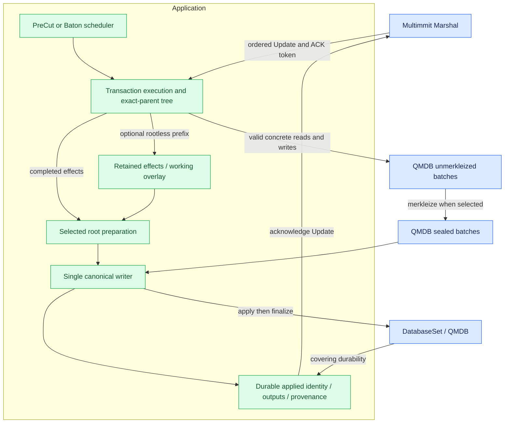
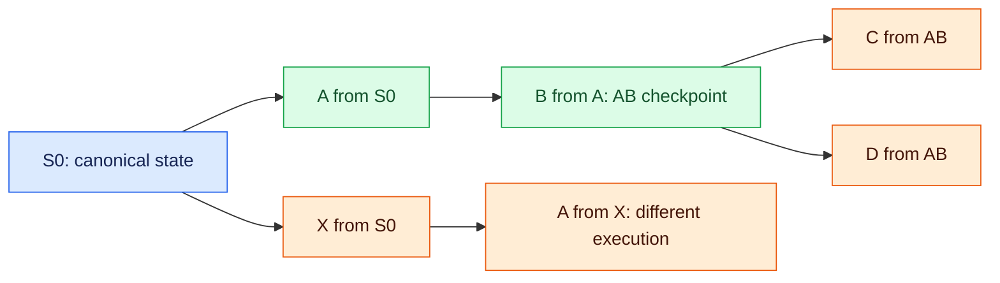

# QMDB branches, reuse, and state application

**Transaction execution and root preparation are internal app responsibilities.** Execution produces effects and outputs. The app uses existing QMDB batches to prepare selected commitments, then applies canonical material through one writer. A reusable execution checkpoint need not imply hashing every abandoned attempt. No public Storage or Executor trait is required.

The current recipe below was checked against Commonware `6233438985d8249d2b2bc1204191d5d405652288`. Earlier `534af0e…` and release comparisons remain [historical reuse evidence](../../assets/review/commonware-reuse-20261004/README.md); they are not the current `DatabaseSet` call sequence.

## QMDB state and reuse boundaries

QMDB supplies authenticated database, batch, journal and persistence algorithms, not transaction semantics. Mutable keyed Any maintains an operation journal and latest-key index. Current adds authentication of active operations; its canonical root differs from the operations root used by sync. Choose the result-root scheme explicitly. A storage root alone does not bind an execution range, runtime or completed direct work. [QMDB](https://github.com/0xEyrie/monorepo/blob/6233438985d8249d2b2bc1204191d5d405652288/storage/src/qmdb/mod.rs), [Current root/witness](https://github.com/0xEyrie/monorepo/blob/6233438985d8249d2b2bc1204191d5d405652288/storage/src/qmdb/current/db.rs#L274).

An unmerkleized batch retains pending mutations. Merkleization consumes the draft and produces a sealed batch with root and ancestry; it does not apply that batch canonically. The app associates each retained batch/effects checkpoint with exact base, runtime, ordered input prefix, outputs and direct/imported provenance. Local generations and retention bookkeeping are not shared signature fields.

[Open full-size diagram](../assets/diagrams/diagram-17.svg)

The subgraph is one application, not a required actor graph. Use concrete `glue::stateful::db` utilities if they fit; do not require `commonware_glue::stateful::Application` or the full Stateful actor. Its merkleized execution lifecycle is not necessary for deferred-root speculation over merged Multimmit input.

## Current QMDB APIs

| Need | Existing current API | App obligation |
|---|---|---|
| Draft at applied base | `DatabaseSet::new_batches()` | Match actual canonical base/runtime/input position |
| Child of pending sealed parent | `DatabaseSet::fork_batches(&parent)` / `Merkleized::new_batch()` | Retain required ancestors and exact execution identity |
| Selected root | Concrete `Unmerkleized::merkleize()` / sealed `root()` | Deterministic boundary, completed effects and full output/material binding |
| Apply batch | `DatabaseSet::apply(sealed).await` | Single writer, valid ancestry and authorized exact input |
| Start persistence | `DatabaseSet::finalize().await` | Await prior barrier before finalizing again |
| Observe durability | Returned `Barrier::durable().await` | Require `true` and app state/output/applied-index linkage before ACK |
| Query applied state | `DatabaseSet::readers()` / `Reader::read()` | Guard current DB access; bind checkpoint/readiness separately |
| Prune | `DatabaseSet::prune(targets)` | Targets already durable, no pending barrier, retention obligations satisfied |

`apply` and `finalize` are separate current calls. A barrier covers checkpoints applied before that finalize call, not later applies. Do not overlap mutation method bodies or prune while durability is pending. Multi-database application does not automatically establish crash-atomic linkage with an app output journal or Marshal's separate ACK cursor. [Current DatabaseSet](https://github.com/0xEyrie/monorepo/blob/6233438985d8249d2b2bc1204191d5d405652288/glue/src/stateful/db/mod.rs#L498), [ManagedDb ownership](https://github.com/0xEyrie/monorepo/blob/6233438985d8249d2b2bc1204191d5d405652288/glue/src/stateful/db/mod.rs#L327).

DatabaseSet has no tuple-wide `merkleize` or single root. Seal concrete component batches and bind the chosen roots/outputs under the app's deterministic result rule. Keyless, compact, Any and Current differ; no variant is adopted by this design.

## Give App execution concrete branch access

Pass existing concrete batch handles directly to App execution code. Generic `Unmerkleized` exposes merkleization; keyed `get`/`write` belong to selected concrete wrappers. Canonical query readers do not supply a speculative pending-parent view. [Any wrapper](https://github.com/0xEyrie/monorepo/blob/6233438985d8249d2b2bc1204191d5d405652288/glue/src/stateful/db/any.rs#L95).

Batch reads can fall through to the shared DB's **current applied state**, not an immutable snapshot from creation. Preserve valid ancestry during reads, child creation, materialization and hashing that accesses live state. Advancing the DB along an actual ancestor can remain valid; applying a sibling can invalidate the branch. Validate and use under the same access authority, including all shared/cloned handles. Draft creation and queries must not observe a partially applied database set. Generation checks alone reject stale results but do not prevent invalid reads.

`Shared` is writer-preferring. Do not implement that fence by holding its read guard across `batch.get()` or another operation that reacquires the same cell: a queued writer can deadlock the nested read. [Existing lock contract](https://github.com/0xEyrie/monorepo/blob/6233438985d8249d2b2bc1204191d5d405652288/glue/src/stateful/db/mod.rs#L148).

Keep every still-needed unapplied ancestor alive. A child draft retains its immediate parent strongly, while retained sealed ancestor links can be weak. Keeping only a leaf is insufficient for further branch reads, proofs or child merkleization. Use existing handles, not duplicated QMDB ancestor machinery. Concrete `validate_batch` can reject invalid ancestry before consuming a DB, but does not verify application semantics or prevent later I/O failure. [Ancestor retention](https://github.com/0xEyrie/monorepo/blob/6233438985d8249d2b2bc1204191d5d405652288/storage/src/qmdb/any/batch.rs#L2855), [Current preflight/apply](https://github.com/0xEyrie/monorepo/blob/6233438985d8249d2b2bc1204191d5d405652288/storage/src/qmdb/current/db.rs#L665).

## Defer roots without inventing an unsealed-parent fork

| Path | Existing support | Remaining app work |
|---|---|---|
| Continue one draft | Concrete unsealed reads/writes | Exact effects/outputs and execution context |
| Fork a sealed prefix | Existing child batches | Choose useful sealing boundaries and retain ancestors |
| Branch from an unsealed completed prefix | Independent drafts at a valid applied/sealed anchor | Replay retained exact effects or use an application overlay; an unsealed-parent fork is not supplied |

For rootless AB with children C and D, one conditional recipe is to retain exact base-bound keyed AB effects, make two drafts at the same valid anchor, replay AB into each, and execute C/D through those concrete drafts. This materializes an existing prefix; it does not clone private mutation maps or grant access to an unavailable old base. If effects/anchor are absent, reexecute from a valid checkpoint.

Unsealed/staged wrappers can be single-owner values consumed by merkleization. Retain needed effects before consuming the only draft. Staged read locations do not imply computed values are already visible in future reads; preserve read-your-writes semantics in the chosen path. Rootless replay/overlay remains a choice, not an adopted extra generic read-view service.

Prepare a deterministic selected prefix under the chosen operation/batch rule. Identical transaction order and final key values do not automatically yield identical operation histories or roots when nodes choose different speculative sealing boundaries. Writing one key twice in one batch versus sealing between writes can produce different operation histories. Do not sign arbitrary local speculative-batching roots as matching results. Root scheme, normalization and canonical boundaries remain open.

## Manage the branch tree for execution requests

The app's tree tracks exact execution prefixes. One producer block after different prior inputs has different execution identity, even when its header/body digest is unchanged. The execution parent is not `Context.parent`. A child may run only after its actual predecessor checkpoint is valid.

[Open full-size diagram](../assets/diagrams/diagram-18.svg)

A valid requested path A→B→D can reuse completed AB from the same S0/runtime and run D. A after X cannot reuse A from S0 merely by block identity. Ordinary late arrivals preserve started order; precedence for a conflicting advisory direction remains open. Canonical Updates determine which exact path must be reconciled.

After AB becomes canonical, retain compatible C/D descendants when actual QMDB ancestry permits. After ABD becomes canonical, revoke adoption of the competing C and X branches. Release their memory/disk only when worker, query, recovery, certificate/material serving and sync retention permit. Canceling an awaiting future may leave CPU work running; fence live-DB access separately from eventual resource release.

## Commit a branch to canonical state

| Step on Marshal Update | Required condition |
|---|---|
| Admit ordered index/block/ACK | Preserve Marshal order; do not substitute a local scheduler order |
| Reconcile from preceding canonical state | Exact input, runtime and execution ancestry match |
| Reuse/complete/repair or import | Completed valid direct effects, or fully verified applicable imported material |
| Prepare selected boundary | Full exact-prefix/root/output identity; no slicing an unrelated sealed batch |
| Apply and persist through one writer | App state, outputs, applied index/block and provenance recover consistently |
| ACK Update | Matching durable application established; Marshal syncs its cursor independently |
| Maintain pool and branch retention | Reconcile durable outcomes; retain still-required references |

Applying a sealed leaf also applies its unapplied ancestors, so authorize the entire exact prefix it carries. If ABC was speculatively executed but only AB is canonical, apply exactly AB. If only a sealed ABC batch exists, applying it and hiding C is invalid; prepare AB from retained exact effects or reexecute. A newly prepared AB commitment may differ from ABC's original parent commitment, so old C reuse requires actual ancestry checks as well as logical input checks.

One canonical writer serves both direct and imported results. Advisory cancellation cannot interrupt a by-value DB mutation and turn the lost handle into an ordinary retry. Mutable storage failure is fatal for that instance; recover authoritative durable state rather than continue using it. A readable applied DB with pending flush is not durable completion. A closed/failed barrier is not success or proof of zero disk writes.

Reuse existing QMDB, Journal and Metadata mechanisms for app recovery linkage. An atomic Metadata update covers its own store; it does not atomically commit QMDB and another journal. Record enough exact identity to recover state/output/applied-position/provenance consistently before ACK. Marshal separately owns its durable delivery cursor; a crash between those stores can redeliver an already applied block, which the app validates and ACKs idempotently. No second generic cursor engine or public CommitResult type is required.

An applied checkpoint may survive a crash before durability was observed. Existing `ManagedDb::init(expected)` and `DatabaseSet::init(..., Some(targets))` reopen selected checkpoints and durably discard later state. App must select matching database targets, outputs and provenance under its recovery rule; opening each DB's latest checkpoint or reading Marshal's cursor alone does not choose a consistent App checkpoint. That multi-store selection/linkage remains implementation work. [Existing recovery contract](https://github.com/0xEyrie/monorepo/blob/6233438985d8249d2b2bc1204191d5d405652288/glue/src/stateful/db/mod.rs#L334).

`readers()` returns handles to the live databases, not pinned historical versions. A held `Reader::read()` guard stabilizes that DB during a query; separate calls or tuple-component guards do not by themselves establish one atomic App checkpoint. Bind value, proof, root and applied identity under the same valid access authority. [Reader implementation](https://github.com/0xEyrie/monorepo/blob/6233438985d8249d2b2bc1204191d5d405652288/glue/src/stateful/db/mod.rs#L210).

Current value/absence proofs can serve guarded app queries, but an operation-inclusion proof does not prove current absence. These proofs do not supply the full execution certificate or establish durability. Query scope and historical retention remain open.

For active imports, use the same writer/fences and verify both certificate and material before stopping direct work. [Certified state sync](state-sync.md) explains why a progress notification or Marshal floor alone cannot establish application-state readiness.
