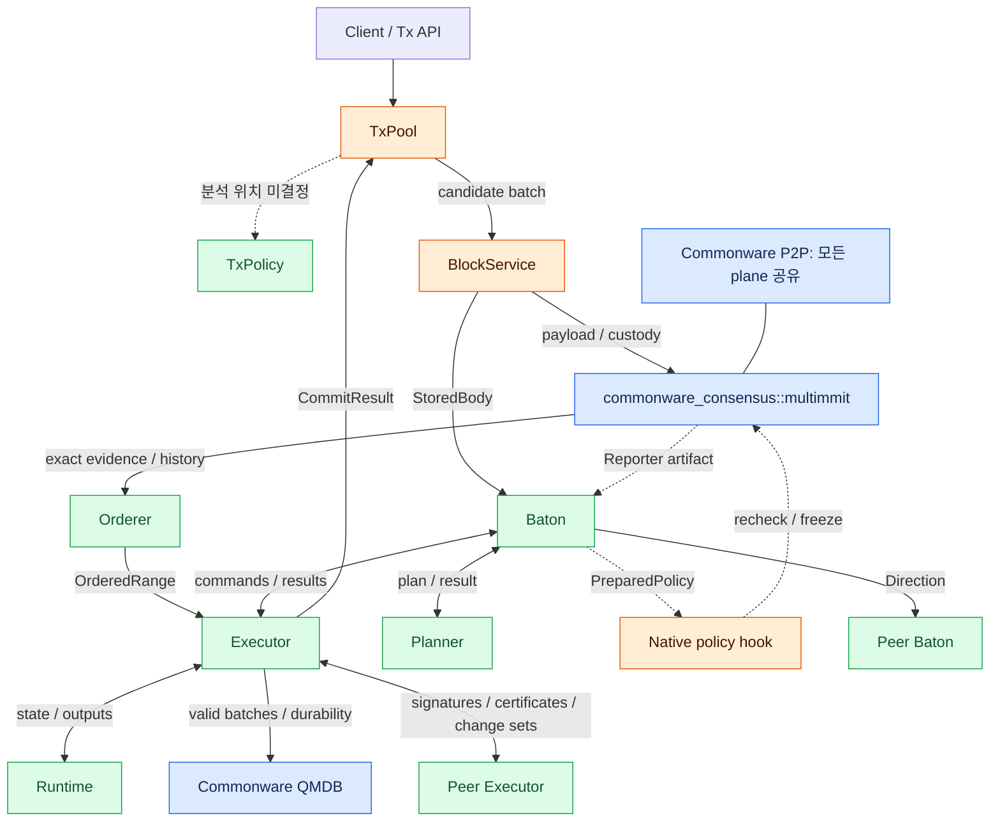

# 전체 아키텍처

네 레이어가 연결되는 방법과 각 모듈의 책임을 먼저 읽는다. 확정 순서는 Orderer → Executor로, 실행 결과 인증과 state sync는 Executor ↔ Executor로 흐른다.

## 네 레이어

Tx 레이어는 실행할 후보를 모으고, consensus는 producer별 payload commitment와 순서에 관한 native 증거를 만든다. Baton은 아직 확정되지 않은 block의 실행 순서를 예상해 사전 실행·재실행을 조율한다. 확정 이력에서 얻은 exact ordered range는 Orderer가 Executor에 직접 전달한다. 실행 레이어는 application runtime으로 state를 계산하고 QMDB에 저장한다. 따라서 body를 가지고 있다는 사실, 실행 방향을 받았다는 사실, 순서가 확정되었다는 사실, local state가 durable하다는 사실을 각각 구분한다.

이 문서에서 custody는 요청된 producer context의 본문과 필요한 부모 자료를 재시작 뒤에도 복원할 수 있게 영속 보관하는 책임이다. 구체 저장·조회·복구 연결은 [§4.4](../consensus/block-body.md#블록-전파조회custody)에 설명한다.

[그림 크게 보기](../assets/diagrams/diagram-01.svg)

파랑은 Commonware 기반을 그대로 활용하는 부분, 주황은 기존 구성요소를 가져와 연결·변경할 부분, 초록은 Baton/application 의미를 새로 구현할 부분이다. QMDB도 batch·commit·root 인터페이스를 연결해야 하며, 파랑이 전체 레이어를 무수정으로 붙일 수 있다는 뜻은 아니다. `Mempool`의 재사용 구현체는 아직 선택하지 않았다. 정적 분석을 별도 router에 둘지 packing 시점 adapter에 둘지도 비어 있다.

Baton의 block 수신 부분은 StoredBody와 authenticated native header reference를 대조한 뒤 CandidateBlock을 만든다. Candidate header notice에는 기존 Reporter의 accepted artifact를 활용할 수 있다. Body/notice를 join하는 adapter는 개발하되, native header export hook을 무조건 새로 만들 필요가 있다고 가정하지 않는다.

Ordered delivery와 history recovery는 consensus attachment의 내부 역할이다. Orderer의 이력 보관을 별도 서버로 배치할 필요는 없다. 본문 저장소와 검증된 증거 저장 역할은 기존 Commonware storage/resolver를 공유하도록 설계한다.

## 레이어 사이의 입력과 출력

| 레이어 | 어디서 무엇을 받는가 | 내부에서 처리하는 것 | 다음 레이어에 무엇을 주는가 |
|---|---|---|---|
| Tx: TxPool | Client 또는 tx P2P의 tx bytes | 구조 검증·admission·후보 보관, 선택한 위치의 정적 분석 | BlockService에 bounded tx batch |
| Consensus: BlockService + Multimmit + Orderer | TxPool의 후보 tx, peer의 body/header/proof | 본문 구성·custody, native DA·합의, 검증된 이력에서 dense order 복구 | Baton에 CandidateBlock; Executor에 OrderedRange |
| Baton | 후보 block, ordering context, peer reports, leader direction | Intended order, report 수집·선택, 사전 실행 예약·재예약 | Executor의 execute / reschedule 호출 |
| Execution: Executor + Runtime | Baton의 실행 요청, Orderer의 확정 입력, peer Executor의 인증 결과·state material | 직접 실행·결과 인증·state sync·canonical 적용 | Peer 결과 교환; Orderer / TxPool에 durable 완료; Baton에는 실행 결과·선택적 적용 알림 |

## Data path, control path, canonical path

| 경로 | 흐름 | 각 단계에서 만들어지는 사실 |
|---|---|---|
| Tx / body data path | Tx API → pool → builder → body store / P2P → peer custody | Admission, body bytes와 digest, local durable custody |
| Native consensus path | Authenticated native network → batcher → voter / Core owner → signed protocol artifacts | Producer ancestry·DA·view votes·native finality·extension evidence |
| Baton control path | Known input / intended order → reports → leader snapshot / planner → direction → local reschedule | Advisory execution order와 completed prepared candidate |
| Canonical input path | Exact native evidence / policy history → Orderer → Executor::commit | 뒤집히지 않는 연속 exact ordered input |
| Execution result path | Executor ↔ Executor: 직접 실행 서명 → f+1 결과 인증서 검증 | Irrevocable exact order와 canonical input state에 결속된 state finalization |
| State application path | Executor의 직접 실행 결과 또는 검증한 peer change set → QMDB apply → durability → output / cursor | Local durable canonical state와 recoverable commit identity |

Body를 이미 받은 것, 높은 report support를 가진 것, native ordering에 인증된 것, state에 적용한 것은 서로 다른 상태다. 한 경로의 완료를 다른 경로의 증거로 바꾸지 않는다.

## 작업자와 authority

| 모듈 / 기존 owner | 변경할 수 있는 상태 | 다음 처리 |
|---|---|---|
| Native Core | Native signing reservations, producer/DA/view/finality state | Voter의 typed capability executor / native publication |
| BlockService | Body 저장·fetch·구조 검증·custody 결과 | Automaton 요청자와 Baton의 block 수신 |
| Orderer | 검증·보관한 증거, terminal slots, emitted / acknowledged cursors | Executor에 OrderedRange, gap에는 history fetch |
| Baton + Planner | Window reports, completed candidate, intended order, local job generation | Direction 전파·prepared policy 전달·Executor 호출 |
| Executor | Speculative checkpoints / worker refs, 실행 결과 서명·인증서·sync 자료, canonical QMDB state | Peer Executor와 직접 결과 인증 / state sync; 로컬 Baton에 ExecutionResult 또는 durable CommitResult |
| Runtime | 전달받은 유효 branch state의 tx 계산 | Executor에 writes / outputs |

Planner·Runtime worker는 결과를 계산한다. 현재 native context에 policy를 채택할 권한은 Native Core에, 현재 branch 결과를 채택하거나 canonical state를 적용할 권한은 Executor에 있다. Executor의 branch 관리와 canonical single writer는 같은 모듈 안에서도 다른 권한이다. Wire direction의 freshness와 local cancellation generation도 다른 식별 규칙이다.

**State finalization과 state sync의 책임·통신 주체는 Executor다.** Baton은 사전 실행·재실행을 요청하고 로컬 실행 결과를 받는다. 확정 입력은 Orderer → Executor로 직접 전달하고 durable 완료는 Executor → Orderer / TxPool로 전달한다. Baton의 수신·승인·회신을 finalization / state sync / canonical 적용 조건으로 두지 않는다. 실행 결과 서명·인증서·change set의 peer 교환은 Baton 간 report / direction 경로를 거치지 않는다. State sync는 validator의 정상 실행 경로에서 사용할 수 있는 선택지이며, 구체 검증·전환·저장 계약은 [§6.1](../execution/README.md#역할과-책임)과 [§6.7](../execution/state-sync.md#state-sync-인증된-실행-결과로-상태-동기)에 모았다.
