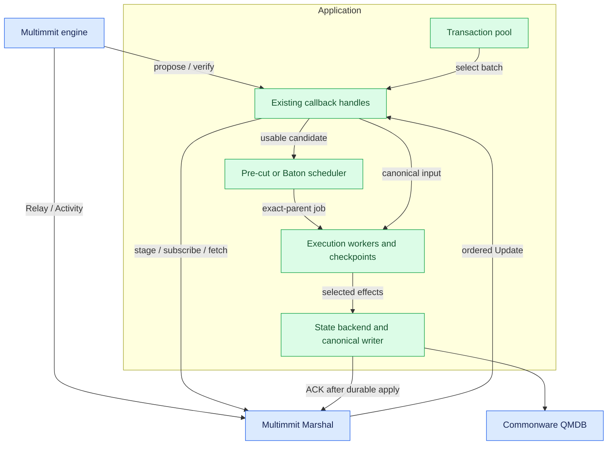

# Architecture

**Multimmit orders blocks, Marshal stores and delivers them, and one App owns transactions and execution.** Inside App, select either the Pre-cut scheduler or the Baton scheduler. Existing Commonware callbacks connect these components; no additional public layer traits are required.

## Application composition

[Open full-size diagram](../assets/diagrams/diagram-01.svg)

Blue boxes are existing components. Green boxes are application responsibilities and can be ordinary modules sharing one owner and concrete handles. The diagram does not prescribe one actor per box. Workers keep slow execution and I/O off short callback handlers. Commonware runtime and authenticated P2P supply task and transport mechanisms.

## Responsibilities and existing entry points

| Owner | Implement or reuse | Boundary |
|---|---|---|
| Multimmit | Reuse engine, deterministic machine, actors and native verifier/resolver | Producer/DA/view/finality authority |
| Multimmit Marshal | Reuse service, relay, mailbox, catalog, backfill and delivery | Durable full blocks, native exact ordered stream, delivery cursor |
| App pool | Implement admission and bounded selected-candidate packing; adapt a fitting existing pool where useful | Client/peer ingress and `Automaton::propose` |
| App scheduler | Implement Pre-cut and Baton scheduling using shared execution state | Usable candidates, worker completions and canonical Updates |
| App execution | Implement transaction semantics, exact-parent reuse/repair, certification and peer sync | Commonware workers, crypto and P2P |
| App state backend | Integrate QMDB branch/material operations and a recoverable canonical writer | Effects → selected root → apply/durability |

The current source is [Commonware checkout 6233438](https://github.com/0xEyrie/monorepo/tree/6233438985d8249d2b2bc1204191d5d405652288). Current Multimmit Marshal replaces the older proposed application body service and ordinary Baton-owned order-delivery machinery. Historical research pinned to `534af0e` remains useful for its stated questions, but does not describe this new assembly.

## Inputs and outputs between components

`Automaton` connects App's pool and payload validation to Multimmit; Marshal connects block custody and canonical delivery to App. The [callback contracts and pseudocode](../baton/interfaces.md) define staging, all `verify` origins, scheduler admission, asynchronous application and ACK handling.

## Data, control, and canonical paths

| Path | Flow | Established fact |
|---|---|---|
| Payload | Pool → propose → Marshal custody and relay | Exact block bytes retained and disseminated |
| Native consensus | Header/DA/view/certificate planes → native machine | Authenticated lane and ordering facts |
| Speculation | Usable candidate → App scheduler → exact-parent execution | Completed local effects for a particular path |
| Baton control | Intended-order report → bounded selection → advisory direction | Execution intention; no finality or result proof |
| Canonical delivery | Native history → Marshal → indexed Update → App | Continuous native ordered input |
| Application durability | Matching/repaired/certified material → canonical writer → ACK | Locally recoverable applied state and input position |
| Result certification | Peer Apps exchange signatures over the exact statement | `f+1` matching distinct signatures plus irrevocable order/base establish the research result endpoint |

Body custody, speculation, native finality, result certification and local durable application are separate facts. Body/header ancestry does not supply the cross-lane execution state parent. Only matching exact input/base/runtime permits reuse.

## Workers and decision authority

Use short App handlers to admit work and update metadata; run transaction computation, report-candidate evaluation and storage operations through appropriate Commonware tasks. Bound queues and retained bytes. Canonical deliveries need a non-dropping inbox matched to Marshal's ordinary delivery window, with old/new window overlap explicitly handled during floor/import transitions; best-effort speculation may defer or forgo work when its own budget is exhausted.

The scheduler selects pending jobs, while shared execution state owns checkpoints and stale-worker fences. The canonical writer serializes state mutation, including certified imports. Reports and advisory direction cannot gate canonical delivery, result certification, state sync or ACK. Physical pruning waits for reference/retention obligations even after logical conflicting-branch removal.

Root preparation remains separate from transaction computation. Reuse QMDB directly instead of requiring every speculative attempt to return a Merkleized result through the full glue actor. Root-deferred branching still needs a concrete application integration; existing sealed-parent fork APIs do not solve it automatically.

## Pre-cut and full Baton

Pre-cut is an independent scheduler configuration with no Baton reports/direction or policy hook. Both modes preserve started local work and sort only eligible pending candidates; both reconcile against the same authoritative Marshal Update stream.

Baton additionally needs actual leader context and authenticated native policy adoption to preserve a chosen prefix in canonical order. Existing Automaton methods are producer-payload callbacks, and current Marshal interprets the native fixed order. An app-only scheduler can guide speculation; full Baton requires specific native/Marshal changes and proofs. Do not reorder already delivered Updates to simulate that missing integration. [Direction and the native gap](../baton/direction.md#existing-callbacks-versus-the-native-policy-gap) states the outstanding contract.
