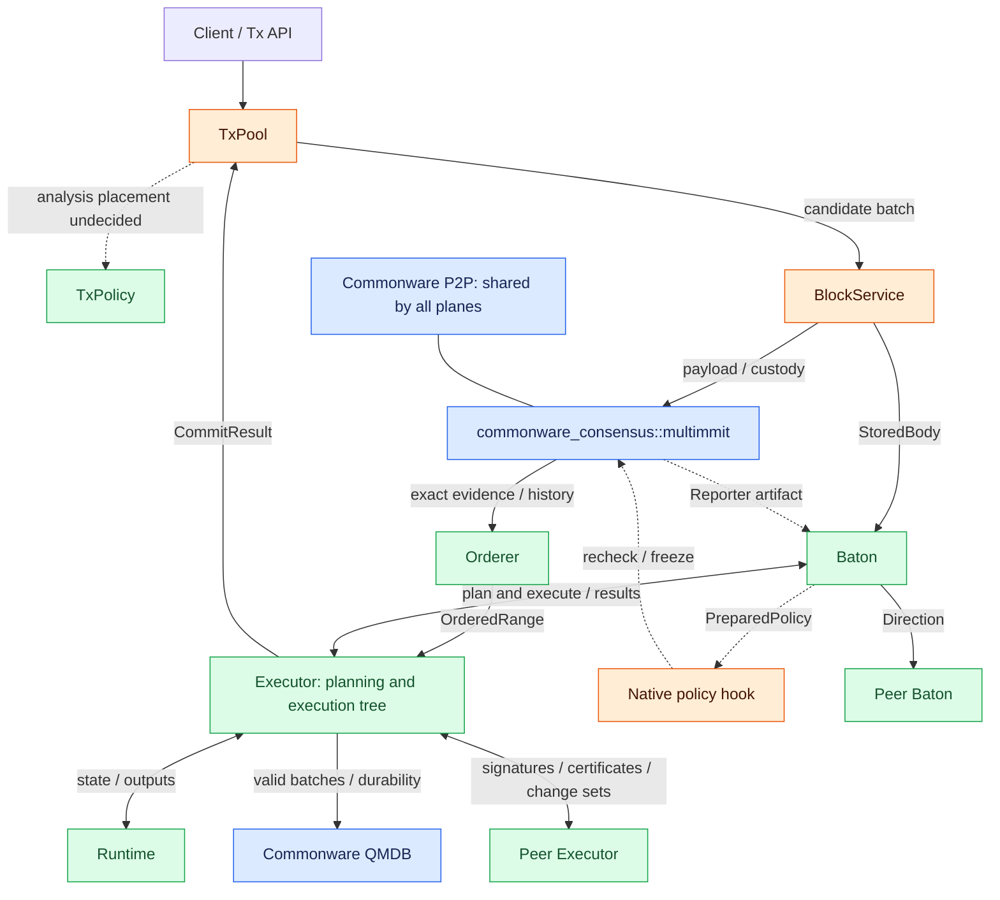

# Architecture

**The system collects transactions, agrees on their order, and applies their results to state.** Four layers share this work. TxPool prepares candidates, consensus fixes the order, Baton schedules work ahead of consensus, and Executor turns agreed inputs into durable state. Read the responsibilities first, then follow the interfaces below.

## Four layers

The Tx layer collects candidate transactions. Consensus produces commitments to each producer's payload and evidence about ordering. Baton collects reports and shares direction for blocks that are still undecided. Executor performs candidate planning and owns the parent-linked execution tree. Orderer reads finalized history and delivers the exact ordered range directly to Executor. Executor uses Runtime to compute application state and QMDB to store it. These are distinct milestones: receiving a body, receiving a direction, fixing the order, and durably applying local state.

Here, **custody** means durably retaining the body and required parent material for the requested producer context so they can be recovered after a restart. [Block storage and custody](../consensus/block-body.md#body-dissemination-lookup-and-custody) describes the storage, fetch, and recovery connections.

[Open full-size diagram](../assets/diagrams/diagram-01.svg)

Blue marks Commonware foundations to reuse. Orange marks existing components that need adapters or changes. Green marks new Baton or application behavior. QMDB still needs batch, commit, and root integration; blue does not mean the entire layer can be connected without changes. The mempool implementation remains undecided, as does placing static analysis in a router or at block packing time.

Baton joins a StoredBody with its authenticated native header reference to produce a CandidateBlock. Existing Reporter notices for accepted artifacts can supply the header reference. The body/notice join adapter needs implementation; a new native header export hook is not automatically required.

Ordered delivery and history recovery belong inside the consensus attachment. Orderer does not require a separate archive server. Its verified evidence store and the body store should reuse Commonware storage and resolver components where their contracts fit.

## Inputs and outputs between layers

| Layer | Receives | Owns | Delivers |
|---|---|---|---|
| Tx: TxPool | Transaction bytes from clients or tx peers | Structural checks, admission, candidate retention, static analysis at the chosen integration point | A bounded candidate batch to BlockService |
| Consensus: BlockService + Multimmit + Orderer | Candidate transactions and peer bodies, headers, and proofs | Body construction and custody, native DA and consensus, reconstruction of continuous order from verified history | CandidateBlock to Baton; OrderedRange to Executor |
| Baton | Candidate blocks, ordering context, peer reports, leader direction | Intended-order reports, report-window admission, direction validation and dissemination | Planning snapshot and parent-linked execute blocks to Executor |
| Execution: Executor + Runtime | Baton execution requests, Orderer finalized input, peer result certificates and state material | Candidate planning, execution-tree links and pruning, direct execution, result certification, state sync, canonical application | Peer result exchange; durable completion to Orderer and TxPool; execution results and optional applied notifications to Baton |

## Data, control, and canonical paths

| Path | Flow | What completion establishes |
|---|---|---|
| Tx / body data | Tx API → pool → builder → body store / P2P → peer custody | Admission, body bytes and digest, local durable custody |
| Native consensus | Authenticated native network → batcher → voter / Core owner → signed artifacts | Producer ancestry, DA, view votes, native finality, extension evidence |
| Baton control | Known input / intended order → reports → leader snapshot → Executor planning → direction → execute parent-linked branches | Advisory execution order and a completed prepared candidate |
| Canonical input | Exact native evidence / policy history → Orderer → Executor::commit | A continuous, irreversible sequence of exact execution inputs |
| Execution result | Executor ↔ Executor: direct-execution signatures → f+1 result certificate verification | State finalization bound to irrevocable exact order and canonical input state |
| State application | Executor's direct result or verified peer change set → QMDB apply → durability → output / cursor | Durable local canonical state and a recoverable commit identity |

Receiving a body, collecting report support, authenticating an ordering decision, and applying state establish different facts. Completion on one path cannot stand in for evidence required by another.

## Workers and decision authority

| Module / native owner | State it may change | Next action |
|---|---|---|
| Native Core | Signing reservations, producer, DA, view, and finality state | Voter executes typed capabilities and publishes native artifacts |
| BlockService | Stored bodies, fetch jobs, structural checks, custody results | Completes Automaton requests and provides bodies to Baton |
| Orderer | Verified retained evidence, terminal slots, emitted and acknowledged cursors | Delivers OrderedRange to Executor; fetches history across gaps |
| Baton | Window reports, prepared-policy cache, intended order, authenticated direction context | Broadcasts direction, passes prepared policy, calls Executor |
| Executor | Planning snapshots/results, parent-linked execution tree, checkpoints and worker references, signatures, certificates, sync material, canonical QMDB state | Exchanges results and sync material with peer Executors; returns ExecutionResult or an optional durable CommitResult notification to local Baton |
| Runtime | Transaction computation on the supplied valid branch state | Returns writes and outputs to Executor |

Executor's planning workers and Runtime compute results. Native Core decides whether a policy can be adopted in the actual native context. Executor decides whether branch results can be adopted and canonical state can be changed. Branch management and the canonical single writer are separate authorities within Executor. Wire-direction freshness and local cancellation generations also use different identity rules.

**Executor owns state finalization and state sync, including peer communication.** Baton requests planning and parent-linked speculative execution and receives local results. Executor handles branch changes through execute(block), then canonical promotion and conflicting-branch pruning through commit(range). Orderer sends finalized input directly to Executor; Executor reports durable completion to Orderer and TxPool. Receiving, approving, or acknowledging a Baton message is not a condition for finalization, sync, or canonical application. Signatures, certificates, and change sets travel directly between Executors. State sync is an option on the normal validator execution path. See [Execution responsibilities](../execution/README.md#roles-and-responsibilities) and [State sync](../execution/state-sync.md#state-sync-from-certified-execution-results) for verification, switching, and storage requirements.
